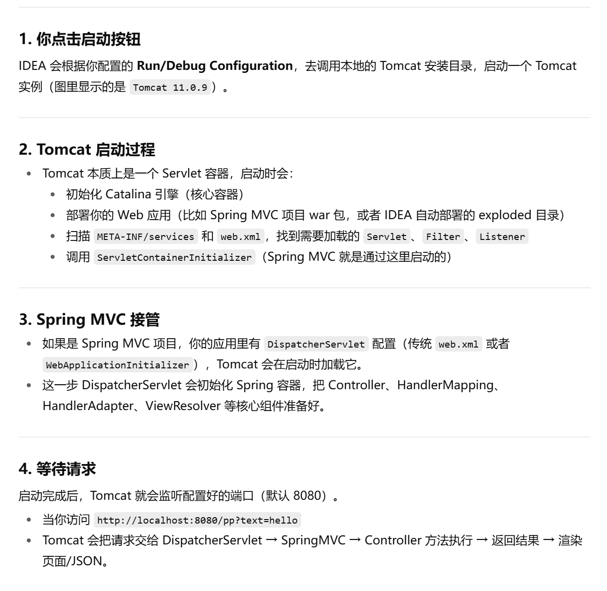
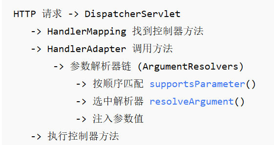
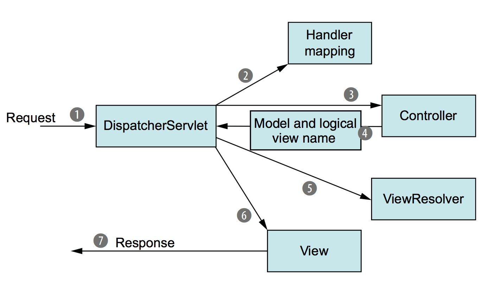

## Controller控制器1





有了SpringMVC之后，我们不必再像之前那样一个请求地址创建一个Servlet了

SpringMVC 使用 `DispatcherServlet` 替代Tomcat为我们提供的默认的静态资源Servlet，也就是说，现在所有的请求（除了jsp，因为Tomcat还提供了一个jsp的Servlet）都会经过`DispatcherServlet`进行处理。

那么`DispatcherServlet`会帮助我们做什么呢？



我们的请求到达Tomcat服务器之后，会交给当前的Web应用程序进行处理，而SpringMVC使用`DispatcherServlet`来处理所有的请求

也就是说它被作为一个统一的访问点，**所有的请求全部由它来进行调度**。

当一个请求经过`DispatcherServlet`之后，会先走`HandlerMapping`，它会将请求映射为`HandlerExecutionChain`, 依次经过`HandlerInterceptor`有点类似于之前我们所学的过滤器，不过在SpringMVC中我们使用的是拦截器，然后再交给`HandlerAdapter`

**根据请求的路径选择合适的控制器**进行处理，控制器处理完成之后，会返回一个`ModelAndView`对象，包括数据模型和视图，通俗的讲就是页面中数据和页面本身（只包含视图名称即可）。

返回`ModelAndView`之后，会交给`ViewResolver`（视图解析器）进行处理，视图解析器会对整个视图页面进行解析

SpringMVC自带了一些视图解析器，但是只适用于JSP页面，我们也可以像之前一样使用Thymeleaf作为视图解析器，这样我们就可以根据给定的视图名称，直接读取HTML编写的页面，解析为一个真正的View。

解析完成后，就需要**将页面中的数据全部渲染到View中**

最后返回给`DispatcherServlet`一个**包含所有数据的成形页面**，再响应给浏览器，完成整个过程。

因此，实际上整个过程

我们首先需要编写对应请求路径的`Controller` (方便可以根据对应的请求路径找到对应的`Controller`来进行处理)

之后要配置好我们需要的`ViewResolver`即可 (来解析生成最终页面)，之后还可以继续补充添加拦截器，而其他的流程已经由SpringMVC帮助我们完成了。

### 配置视图解析器和控制器

首先我们需要实现最基本的页面解析并返回

第一步就是配置视图解析器，这里我们使用`Thymeleaf`为我们提供的视图解析器，导入需要的依赖：

```xml
<dependency>
    <groupId>org.thymeleaf</groupId>
    <artifactId>thymeleaf-spring6</artifactId>
    <version>3.1.1.RELEASE</version>
</dependency>
```

#### 编写配置项

配置视图解析器非常简单，我们只需要将对应的`ViewResolver`注册为Bean即可

因为 `ThymeleafViewResolver` 实现了 SpringMVC 的`ViewResolver`接口，所以：

- Spring MVC 启动时，`DispatcherServlet` 去容器里找所有 `ViewResolver` 类型的 `Bean`。

- 发现 `thymeleafViewResolver`，加入解析链。

- 请求返回时，如果 Controller 返回 String "index"，Spring MVC 会调用这些 ViewResolver，直到有一个能把 "index" 解析成一个真正的 View 对象（Thymeleaf 模板）。

- 最终渲染视图 → 输出到浏览器。

这里我们直接在配置类中编写：

```java
@Configuration
@EnableWebMvc
@ComponentScan("com.example.controller")
public class WebConfiguration {
    //我们需要使用ThymeleafViewResolver作为视图解析器，并解析我们的HTML页面
    @Bean
    public ThymeleafViewResolver thymeleafViewResolver(SpringTemplateEngine springTemplateEngine){
        ThymeleafViewResolver resolver = new ThymeleafViewResolver();
        resolver.setOrder(1);   
        //可以存在多个视图解析器，并且可以为他们设定解析顺序
        resolver.setCharacterEncoding("UTF-8");   
        //编码格式是重中之重
        resolver.setTemplateEngine(springTemplateEngine);   
        //和之前JavaWeb阶段一样，需要使用模板引擎进行解析，所以这里也需要设定一下模板引擎
        return resolver;
    }

    //配置模板解析器
    @Bean
    public SpringResourceTemplateResolver templateResolver(){
        SpringResourceTemplateResolver resolver = new SpringResourceTemplateResolver();
        resolver.setSuffix(".html");   
        //需要解析的后缀名称
        resolver.setPrefix("/");   
        //需要解析的HTML页面文件存放的位置，默认是webapp目录下，如果是类路径下需要添加classpath:前缀
        resolver.setCharacterEncoding("UTF-8");
        return resolver;
    }

    //配置模板引擎Bean
    @Bean
    public SpringTemplateEngine springTemplateEngine(ITemplateResolver resolver){
        SpringTemplateEngine engine = new SpringTemplateEngine();
        engine.setTemplateResolver(resolver);   
        //模板解析器，默认即可
        return engine;
    }
}
```

现在我们就完成了视图解析器的配置

#### 创建对应`Controller`

接着来创建一个`Controller`，创建Controller也非常简单

只需在一个类上添加一个`@Controller`注解即可，它会被Spring扫描并自动注册为`Controller`类型的Bean

然后我们只需要在类中编写方法用于处理对应地址的请求即可：

```java
@Controller   //直接添加注解即可
public class HelloController {

    @RequestMapping("/")   
    //直接填写访问路径
    public ModelAndView index(){
        return new ModelAndView("index");  
        //返回ModelAndView对象，这里填入了视图的名称
        //返回后会经过视图解析器进行处理
    }
}
```

#### 创建对应页面文件

接着我们在类路径根目录下创建一个简单html文件：

```html
<!DOCTYPE html>
<html lang="en">
<head>
    <meta charset="UTF-8">
    <title>测试</title>
</head>
<body>
    <p>Penguin</p>
</body>
</html>
```

#### 前后端数据交互

我们在之前，使用Thymeleaf解析后端的一些数据时，需要通过Context进行传递，而使用SpringMvc后

数据我们可以直接向Model模型层进行提供：

```java
@RequestMapping(value = "/")
public ModelAndView index(){
    ModelAndView modelAndView = new ModelAndView("index");
    modelAndView.getModel().put("name", "啊这");   //将name传递给Model
    return modelAndView;
}
```

这样Thymeleaf就能收到我们传递的数据进行解析：

```html
<!DOCTYPE html>
<html lang="en" xmlns:th="http://www.thymeleaf.org">
<head>
    <meta charset="UTF-8">
    <title>Title</title>
    <script src="static/test.js"></script>
</head>
<body>
    HelloWorld！
    <div th:text="${name}"></div>
</body>
</html>
```

当然，为了简便，我们可以直接返回View名称，SpringMVC会将其**自动包装**为`ModelAndView`对象：

```java
@RequestMapping(value = "/")
public String index(){
    return "index";
}
```

我们还可以单独添加一个Model作为形参进行设置，SpringMVC通过**依赖注入会自动帮助我们传递**实例对象：

```java
@RequestMapping(value = "/")
public String index(Model model){  //这里不仅仅可以是Model，还可以是Map、ModelMap
    model.addAttribute("name", "yyds");
    return "index";
}
```

#### 配置静态资源

我们的页面中可能还会包含一些静态资源，比如js、css，因此这里我们还需要配置一下，让静态资源通过Tomcat提供的默认Servlet进行解析

我们需要让配置类实现一下`WebMvcConfigurer`接口，这样在Web应用程序启动时，会根据我们重写方法里面的内容进行进一步的配置：

```java
@Override
public void configureDefaultServletHandling(DefaultServletHandlerConfigurer configurer) {
    configurer.enable();   
    //开启默认的Servlet
}

@Override
public void addResourceHandlers(ResourceHandlerRegistry registry) {
    registry.addResourceHandler("/static/**").addResourceLocations("/static/");
    //配置静态资源的访问路径
}
```

我们编写一下前端内容：

```html
<!DOCTYPE html>
<html lang="en" xmlns:th="http://www.thymeleaf.org">
<head>
    <meta charset="UTF-8">
    <title>测试</title>
    <!-- 引用静态资源，这里使用Thymeleaf的网址链接表达式，Thymeleaf会自动添加web应用程序的名称到链接前面 -->
    <script th:src="@{/static/test.js}"></script>
</head>
<body>
    <p>Penguin！</p>
</body>
</html>
```

创建`test.js`并编写如下内容：

```javascript
window.alert("PPP")
```

最后访问页面，页面在加载时就会显示一个弹窗，这样我们就完成了最基本的页面配置。

相比之前的方式，这样就简单很多了，直接避免了编写大量的Servlet来处理请求。
