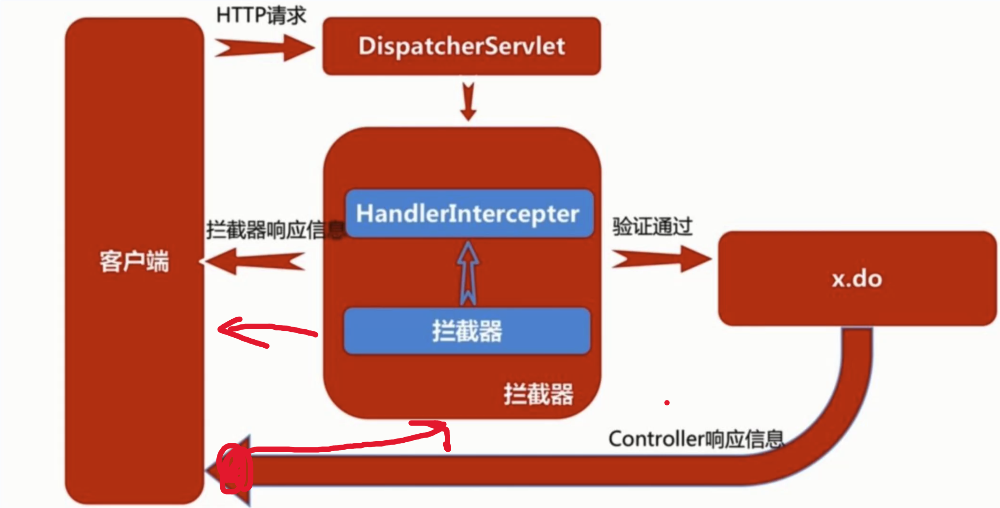

## Interceptor拦截器

拦截器是整个SpringMVC的一个重要内容，拦截器与过滤器类似，都是用于拦截一些非法请求

但是我们之前讲解的过滤器是作用于Servlet之前，**只有经过层层的过滤器才可以成功到达Servlet**

而拦截器并不是在Servlet之前，它在Servlet与RequestMapping之间，相当于DispatcherServlet在将请求交给对应Controller中的**方法之前进行拦截处理**

它只会拦截所有Controller中定义的请求映射对应的请求（不会拦截静态资源），这里一定要区分两者的不同。



### 创建拦截器

#### `HandlerInterceptor`接口

创建一个拦截器我们需要实现一个`HandlerInterceptor`接口：

```java
public class MainInterceptor implements HandlerInterceptor {
    @Override
    public boolean preHandle(HttpServletRequest request, HttpServletResponse response, Object handler) throws Exception {
        System.out.println("我是处理之前！");
        return true;   //只有返回true才会继续，否则直接结束
    }

    @Override
    public void postHandle(HttpServletRequest request, HttpServletResponse response, Object handler, ModelAndView modelAndView) throws Exception {
        System.out.println("我是处理之后！");
    }

    @Override
    public void afterCompletion(HttpServletRequest request, HttpServletResponse response, Object handler, Exception ex) throws Exception {
      	//在DispatcherServlet完全处理完请求后被调用
        System.out.println("我是完成之后！");
    }
}
```

#### 配置类注册

接着我们需要在配置类中进行注册：

```java
@Override
public void addInterceptors(InterceptorRegistry registry) {
    registry.addInterceptor(new MainInterceptor())
      .addPathPatterns("/**")    //添加拦截器的匹配路径，只要匹配一律拦截
      .excludePathPatterns("/home");   //拦截器不进行拦截的路径
}
```

现在我们在浏览器中访问index页面，拦截器已经生效。

#### 执行结果

得到整理拦截器的执行顺序：

```
我是处理之前！
我是处理！
我是处理之后！
我是完成之后！
```

也就是说，处理前和处理后，包含了真正的请求映射的处理，在整个流程结束后还执行了一次`afterCompletion`方法

其实整个过程与我们之前所认识的Filter类似，不过在处理前，我们只需要返回true或是false表示是否被拦截即可，而不是再去使用FilterChain进行向下传递。

##### 返回 `false` 情况

那么我们就来看看，如果处理前返回false，会怎么样：

```
我是处理之前！
```

通过结果发现一旦返回false，之后的所有流程全部取消

##### 发生异常情况

那么如果是在处理中发生异常了呢？

```java
@RequestMapping("/index")
public String index(){
    System.out.println("我是处理！");
    if(true) throw new RuntimeException("");
    return "index";
}
```

结果为：

```
我是处理之前！
我是处理！
我是完成之后！
```

我们发现如果处理过程中抛出异常，那么不会执行处理后`postHandle`方法

但是会执行`afterCompletion`方法，我们可以在此方法中获取到抛出的异常。

### 多级拦截器

前面介绍了仅仅只有一个拦截器的情况，我们接着来看如果存在多个拦截器会如何执行，我们以同样的方式创建二号拦截器：

```java
public class SubInterceptor implements HandlerInterceptor {
    @Override
    public boolean preHandle(HttpServletRequest request, HttpServletResponse response, Object handler) throws Exception {
        System.out.println("二号拦截器：我是处理之前！");
        return true;
    }

    @Override
    public void postHandle(HttpServletRequest request, HttpServletResponse response, Object handler, ModelAndView modelAndView) throws Exception {
        System.out.println("二号拦截器：我是处理之后！");
    }

    @Override
    public void afterCompletion(HttpServletRequest request, HttpServletResponse response, Object handler, Exception ex) throws Exception {
        System.out.println("二号拦截器：我是完成之后！");
    }
}
```

注册二号拦截器：

```java
@Override
public void addInterceptors(InterceptorRegistry registry) {
    //一号拦截器
    registry.addInterceptor(new MainInterceptor()).addPathPatterns("/**").excludePathPatterns("/home");
    //二号拦截器
    registry.addInterceptor(new SubInterceptor()).addPathPatterns("/**");
}
```

注意拦截顺序就是注册的顺序，因此拦截器**会根据注册顺序依次执行**，我们可以打开浏览器运行一次：

```
一号拦截器：我是处理之前！
二号拦截器：我是处理之前！
我是处理！
二号拦截器：我是处理之后！
一号拦截器：我是处理之后！
二号拦截器：我是完成之后！
一号拦截器：我是完成之后！
```

和多级Filter相同，在处理之前，是按照顺序**从前向后**进行拦截的，但是处理完成之后，就按照**倒序执行**处理后方法

而完成后是在所有的`postHandle`执行之后再同样的以倒序方式执行。

那么如果这时一号拦截器在处理前就返回了false呢？

```java
@Override
public boolean preHandle(HttpServletRequest request, HttpServletResponse response, Object handler) throws Exception {
    System.out.println("一号拦截器：我是处理之前！");
    return false;
}
```

得到结果如下：

```
一号拦截器：我是处理之前！
```

我们发现，与单个拦截器的情况一样，一旦拦截器返回false，那么之后无论有无拦截器，都不再继续。

#### `order`

我们可以添加 `order` 来规定拦截器的顺序，order越小，先拦截

```java
@Override
public void addInterceptors(InterceptorRegistry registry) {
    registry.addInterceptor(new FirstInterceptor()).addPathPatterns("/**").order(2);
    //二号拦截器
    registry.addInterceptor(new SecondInterceptor()).addPathPatterns("/**").order(1);
}
```

结果为

```
二号拦截器：我是处理之前！
一号拦截器：我是处理之前！
我是处理！
一号拦截器：我是处理之后！
二号拦截器：我是处理之后！
一号拦截器：我是完成之后！
二号拦截器：我是完成之后！
```

## 异常处理

当我们的请求映射方法中出现异常时，会直接展示在前端页面，这是因为SpringMVC为我们提供了**默认的异常处理页面**

当出现异常时，我们的请求会被直接转交给专门用于异常处理的控制器进行处理。

`@ControllerAdvice`，是Spring3.2提供的新注解，它是一个Controller增强器，可对controller进行增强处理。

- 配合`@ExceptionHandler`注解，进行全局异常处理。

- 配合`@InitBinder`注解，用来设置WebDataBinder，用于自动绑定前台请求参数到Model中，全局数据预处理，多用于表单提交数据或者url传参。

- 配合`@ModelAttribute`注解，让Controller类中所有的方法都可以获取到通过@ModelAttribute注解设置的值，进行全局数据绑定。

### `@ControllerAdvice`

作用：这是 Spring MVC 提供的“全局控制器增强”注解。

特点：

可以用来定义全局的异常处理（Exception Handling）、全局数据绑定（Data Binding）、全局数据预处理（Model Attribute）等。

一旦在类上加了 `@ControllerAdvice`，该类就能拦截所有带有 `@Controller` 或 `@RestController` 的控制器请求，做统一处理。

常见用法就是集中定义全局异常处理逻辑。

### `@ExceptionHandler(Exception.class)`

作用：这是 Spring MVC 提供的异常处理注解。

特点：

标注在方法上，表示该方法用来捕获并处理指定类型的异常。

上例中 `@ExceptionHandler(Exception.class)` 表示 捕获所有 `Exception` 及其子类异常。

当控制器方法抛出异常时，会优先匹配合适的 @ExceptionHandler 方法进行处理。

方法返回值可以是一个视图名（如 "500"），也可以是一个 JSON 对象（常与 `@ResponseBody` 或 `@RestControllerAdvice` 配合使用）。

### 应用

我们可以自定义一个异常处理控制器，一旦出现指定异常，就会转接到此控制器执行：

```java
@ControllerAdvice
public class ErrorController {
    @ExceptionHandler(Exception.class)
    public String error(Exception e, Model model){  
        //可以直接添加形参来获取异常
        e.printStackTrace();
        model.addAttribute("e", e);
        return "500";
    }
}
```

接着我们编写一个专门显示异常的页面：

```java
<!DOCTYPE html>
<html lang="en">
<head>
    <meta charset="UTF-8">
    <title>Title</title>
</head>
<body>
  500 - 服务器出现了一个内部错误QAQ
  <div th:text="${e}"></div>
</body>
</html>
```

接着给一个报错：

```java
@RequestMapping("/index")
public String index(){
    System.out.println("我是处理！");
    if(true) throw new RuntimeException("您的氪金力度不足，无法访问！");
    return "index";
}
```

访问后，我们发现控制台会输出异常信息，同时页面也是我们自定义的一个页面。
