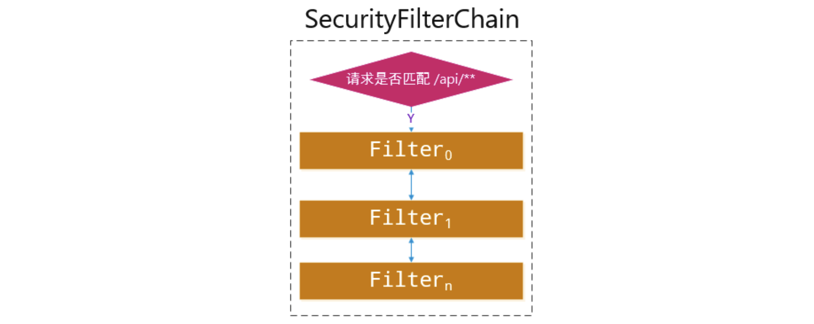
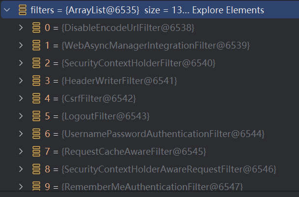

## 内部机制探究

### 授权校验流程

SpringSecurity的实现原理本质上是依靠N个Filter实现的，也就是一个完整的过滤链（注意这里是过滤器，不是拦截器）

> 主要关注各类对应的 `init`, `doFilter`

#### `AbstractSecurityWebApplicationInitializer`

先从`AbstractSecurityWebApplicationInitializer`开始下手，也就是在 `init` 文件夹里的 `SecurityInitializer` 的父类

我们来看看它配置了什么：

```java
//此方法会在启动时被调用
public final void onStartup(ServletContext servletContext) {
    this.beforeSpringSecurityFilterChain(servletContext);
    if (this.configurationClasses != null) {
        AnnotationConfigWebApplicationContext rootAppContext = new AnnotationConfigWebApplicationContext();
        rootAppContext.register(this.configurationClasses);
        servletContext.addListener(new ContextLoaderListener(rootAppContext));
    }

    if (this.enableHttpSessionEventPublisher()) {
        servletContext.addListener("org.springframework.security.web.session.HttpSessionEventPublisher");
    }

    servletContext.setSessionTrackingModes(this.getSessionTrackingModes());
    //重点在这里，这里插入了关键的FilterChain
    this.insertSpringSecurityFilterChain(servletContext);
    this.afterSpringSecurityFilterChain(servletContext);
}
```

然后转到 `insertSpringSecurityFilterChain` 实现

```java
private void insertSpringSecurityFilterChain(ServletContext servletContext) {
    String filterName = "springSecurityFilterChain";
    //创建了一个DelegatingFilterProxy对象，它本质上也是一个Filter，但是是多个Filter的集合
    DelegatingFilterProxy springSecurityFilterChain = new DelegatingFilterProxy(filterName);
    String contextAttribute = this.getWebApplicationContextAttribute();
    if (contextAttribute != null) {
        springSecurityFilterChain.setContextAttribute(contextAttribute);
    }
    //通过ServletContext注册DelegatingFilterProxy这个Filter
    this.registerFilter(servletContext, true, filterName, springSecurityFilterChain);
}
```

主要目的就是注册了一个 `DelegatingFilterProxy`, 它本质上也是一个Filter，但是是多个Filter的集合

#### `DelegatingFilterProxy`

我们接着来看看，`DelegatingFilterProxy`在做什么：

```java
// 这个是初始化方法，它由GenericFilterBean（父类）定义，在afterPropertiesSet方法中被调用
protected void initFilterBean() throws ServletException {
    synchronized(this.delegateMonitor) {
        if (this.delegate == null) {
            if (this.targetBeanName == null) {
                this.targetBeanName = this.getFilterName();
            }

            WebApplicationContext wac = this.findWebApplicationContext();
            if (wac != null) {
                //耐心点，套娃很正常
                this.delegate = this.initDelegate(wac);
            }
        }

    }
}
```

```java
protected Filter initDelegate(WebApplicationContext wac) throws ServletException {
    String targetBeanName = this.getTargetBeanName();
    Assert.state(targetBeanName != null, "No target bean name set");
    //这里通过WebApplicationContext获取了一个Bean
    Filter delegate = (Filter)wac.getBean(targetBeanName, Filter.class);
    if (this.isTargetFilterLifecycle()) {
        delegate.init(this.getFilterConfig());
    }

    //返回Filter
    return delegate;
}
```

这里我们需要添加一个断点来查看到底获取到了什么Bean。

通过断点调试，我们发现这里放回的对象是一个`FilterChainProxy`类型的，并且调用了它的初始化方法。

我们倒回去看，当Filter返回之后，`DelegatingFilterProxy`的一个成员变量`delegate`被赋值为得到的Filter，也就是FilterChainProxy对象

```java
this.delegate = this.initDelegate(wac);
```

##### `doFilter` 操作

接着我们来看看，`DelegatingFilterProxy`是如何执行doFilter方法的。

```java
public void doFilter(ServletRequest request, ServletResponse response, FilterChain filterChain) throws ServletException, IOException {
    Filter delegateToUse = this.delegate;
    if (delegateToUse == null) {
        //非正常情况，这里省略...
    }
    //这里才是真正的调用，别忘了delegateToUse就是初始化的FilterChainProxy对象
    this.invokeDelegate(delegateToUse, request, response, filterChain);
}
```

```java
protected void invokeDelegate(Filter delegate, ServletRequest request, ServletResponse response, FilterChain filterChain) throws ServletException, IOException {
  //最后实际上调用的是FilterChainProxy的doFilter方法
    delegate.doFilter(request, response, filterChain);
}
```

实际上就相当于 `DelegatingFilterProxy` 的 `doFilter` 自己不实现功能，只是一个代理，真正是让 `FilterChainProxy` 类中的 `doFilter` 实现

#### `FilterChainProxy`



所以我们接着来看，`FilterChainProxy`的`doFilter`方法又在干什么：

```java
public void doFilter(ServletRequest request, ServletResponse response, FilterChain chain) throws IOException, ServletException {
    boolean clearContext = request.getAttribute(FILTER_APPLIED) == null;
    if (!clearContext) {
        //真正的过滤在这里执行
        this.doFilterInternal(request, response, chain);
    } else {
        //...
    }
}
```

```java
private void doFilterInternal(ServletRequest request, ServletResponse response, FilterChain chain) throws IOException, ServletException {
    FirewalledRequest firewallRequest = this.firewall.getFirewalledRequest((HttpServletRequest)request);
    HttpServletResponse firewallResponse = this.firewall.getFirewalledResponse((HttpServletResponse)response);
    // 这里获取了一个Filter列表，实际上SpringSecurity就是由N个过滤器实现的，这里获取的都是SpringSecurity提供的过滤器
    // 但是请注意，经过我们之前的分析，实际上真正注册的Filter只有DelegatingFilterProxy
    // 而这里的Filter列表中的所有Filter并没有被注册，而是在这里进行内部调用
    List<Filter> filters = this.getFilters((HttpServletRequest)firewallRequest);
    // 只要Filter列表不是空，就依次执行内置的Filter
    if (filters != null && filters.size() != 0) {
        if (logger.isDebugEnabled()) {
            logger.debug(LogMessage.of(() -> {
                return "Securing " + requestLine(firewallRequest);
            }));
        }
        // 这里创建一个虚拟的过滤链，过滤流程是由SpringSecurity自己实现的 (内部的类)
        // 以前的是直接用 FilterChainProxy.VirtualFilterChain 创建
        // 现在绕了一下
        FilterChain reset = (req, res) -> {
            if (logger.isDebugEnabled()) {
                logger.debug(LogMessage.of(() -> "Secured " + requestLine(firewallRequest)));
            }

            firewallRequest.reset();
            chain.doFilter(req, res);
        };
        this.filterChainDecorator.decorate(reset, filters).doFilter(firewallRequest, firewallResponse);
    } else {
        if (logger.isTraceEnabled()) {
            logger.trace(LogMessage.of(() -> {
                return "No security for " + requestLine(firewallRequest);
            }));
        }

        firewallRequest.reset();
        chain.doFilter(firewallRequest, firewallResponse);
    }
}
```

这里的 `List<Filter> filters` 有很多, 实际上真正注册的Filter只有DelegatingFilterProxy，这里的Filter列表中的所有Filter并没有被注册，而是在这里进行内部调用：


以前的源码是直接创建虚拟队列，然后就进行 `doFilter` 操作

```java
FilterChainProxy.VirtualFilterChain virtualFilterChain = new FilterChainProxy.VirtualFilterChain(firewallRequest, chain, filters);
//调用虚拟过滤链的doFilter
virtualFilterChain.doFilter(firewallRequest, firewallResponse);
```

但现在改成这样：

```java
FilterChain reset = (req, res) -> {
    if (logger.isDebugEnabled()) {
        logger.debug(LogMessage.of(() -> "Secured " + requestLine(firewallRequest)));
    }

    firewallRequest.reset();
    chain.doFilter(req, res);
};
this.filterChainDecorator.decorate(reset, filters).doFilter(firewallRequest, firewallResponse);
```

这个 `FilterChain` 是一个接口，只需要提供实现对应的 `doFilter` 方法

```java
public interface FilterChain {
    void doFilter(ServletRequest var1, ServletResponse var2) throws IOException, ServletException;
}
```

先创建一个内联函数 `reset`，然后利用初始化时创建的 `this.filterChainDecorator` 来创建虚拟队列

##### `this.filterChainDecorator`

在 `FilterChainProxy` 初始化时：

```java
...
private FilterChainDecorator filterChainDecorator;

public FilterChainProxy() {
    this.securityContextHolderStrategy = SecurityContextHolder.getContextHolderStrategy();
    this.filterChainValidator = new NullFilterChainValidator();
    this.firewall = new StrictHttpFirewall();
    this.requestRejectedHandler = new HttpStatusRequestRejectedHandler();
    this.throwableAnalyzer = new ThrowableAnalyzer();
    this.filterChainDecorator = new VirtualFilterChainDecorator();
}
....
public static final class VirtualFilterChainDecorator implements FilterChainDecorator {
    public FilterChain decorate(FilterChain original) {
        return original;
    }

    public FilterChain decorate(FilterChain original, List<Filter> filters) {
        return new VirtualFilterChain(original, filters);
    }
}
```

这样创建了虚拟过滤器链 `FilterChainProxy.VirtualFilterChain`, 然后执行 `doFilter`

##### 虚拟过滤器链 `FilterChainProxy.VirtualFilterChain`

我们来看一下虚拟过滤链的doFilter是怎么处理的：

```java
// 看似没有任何循环，实际上就是一个循环，是一个递归调用
public void doFilter(ServletRequest request, ServletResponse response) throws IOException, ServletException {
    // 判断是否已经通过全部的内置过滤器，定位是否等于当前大小
    if (this.currentPosition == this.size) {
        if (FilterChainProxy.logger.isDebugEnabled()) {
            FilterChainProxy.logger.debug(LogMessage.of(() -> {
                return "Secured " + FilterChainProxy.requestLine(this.firewalledRequest);
            }));
        }

        this.firewalledRequest.reset();
        // 所有的内置过滤器已经完成，按照正常流程走DelegatingFilterProxy的下一个Filter
        // 也就是说这里之后就与DelegatingFilterProxy没有任何关系了，该走其他过滤器就走其他地方配置的过滤器，SpringSecurity的过滤操作已经结束
        this.originalChain.doFilter(request, response);
    } else {
        // 定位自增
        ++this.currentPosition;
        // 获取当前定位的Filter
        Filter nextFilter = (Filter)this.additionalFilters.get(this.currentPosition - 1);
        if (FilterChainProxy.logger.isTraceEnabled()) {
            FilterChainProxy.logger.trace(LogMessage.format("Invoking %s (%d/%d)", nextFilter.getClass().getSimpleName(), this.currentPosition, this.size));
        }
        // 执行内部过滤器的doFilter方法，传入当前对象本身作为Filter，执行如果成功，那么一定会再次调用当前对象的doFilter方法
        // 可能最不理解的就是这里，执行的难道不是内部其他Filter的doFilter方法吗，怎么会让当前对象的doFilter方法递归调用呢？
        // 没关系，下面我们接着了解了其中一个内部过滤器就明白了
        nextFilter.doFilter(request, response, this);
    }
}
```

因此，我们差不多已经了解了整个SpringSecurity的实现机制了，那么我们来随便看一个内部的过滤器在做什么。

#### 具体内部过滤器举例 `UsernamePasswordAuthenticationFilter`

比如用于处理登陆的过滤器`UsernamePasswordAuthenticationFilter`，它继承自`AbstractAuthenticationProcessingFilter`

我们来看看它是怎么进行过滤的：

```java
public void doFilter(ServletRequest request, ServletResponse response, FilterChain chain) throws IOException, ServletException {
    this.doFilter((HttpServletRequest)request, (HttpServletResponse)response, chain);
}

private void doFilter(HttpServletRequest request, HttpServletResponse response, FilterChain chain) throws IOException, ServletException {
    // 如果不是登陆请求，那么根本不会理这个请求
    if (!this.requiresAuthentication(request, response)) {
        // 直接调用传入的FilterChain的doFilter方法
        // 而这里传入的正好是VirtualFilterChain对象
        // 这下知道为什么上面说是递归了吧
        chain.doFilter(request, response);
    } else {
        // 如果是登陆请求，那么会执行登陆请求的相关逻辑，注意执行过程中出现任何问题都会抛出异常
        // 比如用户名和密码错误，我们之前也已经测试过了，会得到一个BadCredentialsException
        try {
            //进行认证
            Authentication authenticationResult = this.attemptAuthentication(request, response);
            if (authenticationResult == null) {
                return;
            }

            this.sessionStrategy.onAuthentication(authenticationResult, request, response);
            if (this.continueChainBeforeSuccessfulAuthentication) {
                chain.doFilter(request, response);
            }

            // 如果一路绿灯，没有报错，那么验证成功，执行successfulAuthentication
            this.successfulAuthentication(request, response, chain, authenticationResult);
        } catch (InternalAuthenticationServiceException var5) {
            this.logger.error("An internal error occurred while trying to authenticate the user.", var5);
            // 验证失败，会执行unsuccessfulAuthentication
            this.unsuccessfulAuthentication(request, response, var5);
        } catch (AuthenticationException var6) {
            this.unsuccessfulAuthentication(request, response, var6);
        }

    }
}
```

##### `successfulAuthentication和unsuccessfulAuthentication`

那么我们来看看`successfulAuthentication和unsuccessfulAuthentication`分别做了什么：

```java
protected void successfulAuthentication(HttpServletRequest request, HttpServletResponse response, FilterChain chain, Authentication authResult) throws IOException, ServletException {
    //向SecurityContextHolder添加认证信息，我们可以通过SecurityContextHolder对象获取当前登陆的用户
    SecurityContextHolder.getContext().setAuthentication(authResult);
    if (this.logger.isDebugEnabled()) {
        this.logger.debug(LogMessage.format("Set SecurityContextHolder to %s", authResult));
    }

    //记住我实现
    this.rememberMeServices.loginSuccess(request, response, authResult);
    if (this.eventPublisher != null) {
        this.eventPublisher.publishEvent(new InteractiveAuthenticationSuccessEvent(authResult, this.getClass()));
    }

    //调用默认的或是我们自己定义的AuthenticationSuccessHandler的onAuthenticationSuccess方法
    //这个根据我们配置文件决定
    //到这里其实页面就已经直接跳转了
    this.successHandler.onAuthenticationSuccess(request, response, authResult);
}
```

##### `unsuccessfulAuthentication`

```java
protected void unsuccessfulAuthentication(HttpServletRequest request, HttpServletResponse response, AuthenticationException failed) throws IOException, ServletException {
    //登陆失败会直接清理掉SecurityContextHolder中的认证信息
    SecurityContextHolder.clearContext();
    this.logger.trace("Failed to process authentication request", failed);
    this.logger.trace("Cleared SecurityContextHolder");
    this.logger.trace("Handling authentication failure");
    //登陆失败的记住我处理
    this.rememberMeServices.loginFail(request, response);
    //同上，调用默认或是我们自己定义的AuthenticationFailureHandler
    this.failureHandler.onAuthenticationFailure(request, response, failed);
}
```

#### 其他过滤器

了解了整个用户验证实现流程，其实其它的过滤器是如何实现的也就很容易联想到了，SpringSecurity的过滤器从某种意义上来说，更像是一个处理业务的Servlet，它做的事情不像是拦截，更像是完成自己对应的职责，只不过是使用了过滤器机制进行实现罢了，从而将所有的验证提前到进入Controller之前。

最后附上完整的过滤器清单，这里列出14个常见的内部过滤器：

| 过滤器名称                              | 职责                                                         |
| --------------------------------------- | ------------------------------------------------------------ |
| DisableEncodeUrlFilter                  | 禁止 HttpServletResponse 对 URL 进行编码，以防止在 URL 中包含 Session ID，此类 URL 不被视为 URL，因为会话 ID 可能会在 HTTP 访问日志等内容中泄露。 |
| WebAsyncManagerIntegrationFilter        | 实现了对SecurityContext与WebAsyncManager的集成，使 Controller 中能够线程安全地获取到用户上下文认证信息。 |
| SecurityContextHolderFilter             | 通过HttpSessionSecurityContextRepository接口从Session中读取SecurityContext或是直接创建新的，然后存入到SecurityContextHolder中，最后请求结束时会进行清理。 |
| HeaderWriterFilter                      | 给HTTP响应添加一些Header属性，如：X-Frame-Options、X-XSS-Protection、X-Content-Type-Options等。 |
| CsrfFilter                              | 针对Csrf相关校验。                                           |
| LogoutFilter                            | 对退出登录的请求进行处理，执行登出操作。                     |
| UsernamePasswordAuthenticationFilter    | 对登录的请求进行处理，执行登录操作。                         |
| ConcurrentSessionFilter                 | 检查SessionRegistry保存的Session信息是否过期。               |
| RequestCacheAwareFilter                 | 缓存Request请求，可以用于恢复因登录而打断的请求。            |
| SecurityContextHolderAwareRequestFilter | 对ServletRequest进行进一步包装，让Request具有更加丰富的内容。 |
| RememberMeAuthenticationFilter          | 针对于记住我Cookie进行校验。                                 |
| AnonymousAuthenticationFilter           | 未验证成功的情况下进行匿名登录操作。                         |
| SessionManagementFilter                 | Session管理相关。                                            |
| ExceptionTranslationFilter              | 异常转换处理，比如最常见的AccessDenied之类的。               |
