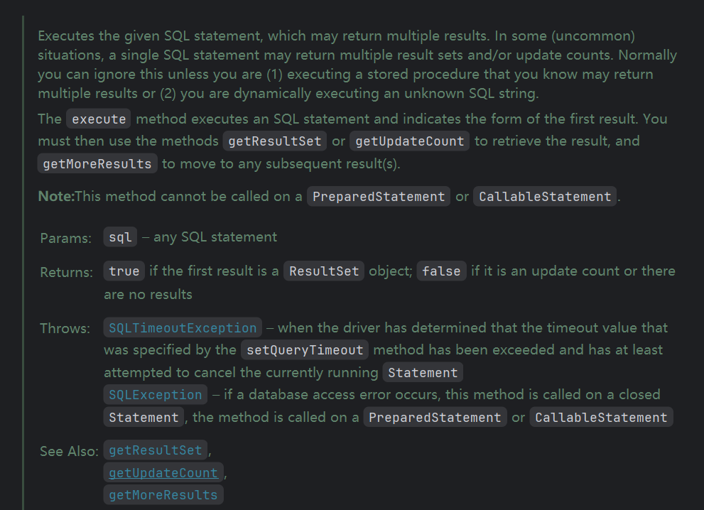

## 主要内容

通过Java如何去使用数据库来帮助我们存储数据

## JDBC

JDBC英文名为：Java Data Base Connectivity(Java数据库连接)，官方解释它是Java编程语言和广泛的数据库之间独立于数据库的连接标准的Java API，根本上说JDBC是一种规范，它提供的接口，一套完整的，允许便捷式访问底层数据库。可以用JAVA来写不同类型的可执行文件：JAVA应用程序、JAVA Applets、Java Servlet、JSP等，不同的可执行文件都能通过JDBC访问数据库，又兼备存储的优势。简单说它就是Java与数据库的连接的桥梁或者插件，用Java代码就能操作数据库的增删改查、存储过程、事务等。

我们可以发现，JDK自带了一个`java.sql`包，而这里面就定义了大量的接口，不同类型的数据库，都可以通过实现此接口，编写适用于自己数据库的实现类。而不同的数据库厂商实现的这套标准，我们称为`数据库驱动`。

### 使用JDBC连接数据库

```java
//注意前两步都放在try()中，因为在最后需要释放资源！
//1. 通过DriverManager来获得数据库连接
try (Connection connection = DriverManager.getConnection(
        "jdbc:mysql://localhost:3306/study","root","123456");
      //2. 创建一个用于执行SQL的Statement对象
      Statement statement = connection.createStatement()
){
    //3. 执行SQL语句，并得到结果集
    ResultSet set = statement.executeQuery("select * from student");
    //4. 查看结果
    while (set.next()){
        System.out.println(set.getString(1));
    }
}catch (SQLException e){
    e.printStackTrace();
}
//5. 释放资源，try-with-resource语法会自动帮助我们close
```

其中，连接的URL如果记不住格式，我们可以打开idea的数据库连接配置，复制一份即可。（其实idea本质也是使用的JDBC，整个idea程序都是由Java编写的，实际上idea就是一个Java程序）

**注意：** 6.0版本以上，不用手动加载驱动，我们直接使用即可！
即不需要使用 反射 来加载驱动类

```java
Class.forName("com.mysql.jdbc.Driver")
```

如果加载会提示

```
Loading class `com.mysql.jdbc.Driver'. This is deprecated. The new driver class is `com.mysql.cj.jdbc.Driver'. The driver is automatically registered via the SPI and manual loading of the driver class is generally unnecessary.
```

### DriverManager

DriverManager是管理我们的数据库驱动的, 来分析我们设定的驱动是否可以连接，如果成功就返回对应的 `connection`

```java
public static synchronized void registerDriver(java.sql.Driver driver,
        DriverAction da)
    throws SQLException {

    /* Register the driver if it has not already been added to our list */
    if(driver != null) {
        registeredDrivers.addIfAbsent(new DriverInfo(driver, da));    //在刚启动时，mysql实现的驱动会被加载，我们可以断点调试一下。
    } else {
        // This is for compatibility with the original DriverManager
        throw new NullPointerException();
    }

    println("registerDriver: " + driver);

}
```

```java
private static Connection getConnection(
        String url, java.util.Properties info, Class<?> caller) throws SQLException {
        /*
         * When callerCl is null, we should check the application's
         * (which is invoking this class indirectly)
         * classloader, so that the JDBC driver class outside rt.jar
         * can be loaded from here.
         */
        ClassLoader callerCL = caller != null ? caller.getClassLoader() : null;
        synchronized(DriverManager.class) {
            // synchronize loading of the correct classloader.
            if (callerCL == null) {
                callerCL = Thread.currentThread().getContextClassLoader();
            }
        }

        if(url == null) {
            throw new SQLException("The url cannot be null", "08001");
        }

        println("DriverManager.getConnection(\"" + url + "\")");

        // Walk through the loaded registeredDrivers attempting to make a connection.
        // Remember the first exception that gets raised so we can reraise it.
        SQLException reason = null;

        for(DriverInfo aDriver : registeredDrivers) {
            // If the caller does not have permission to load the driver then
            // skip it.
            if(isDriverAllowed(aDriver.driver, callerCL)) {
                try {
                    println("    trying " + aDriver.driver.getClass().getName());
                    Connection con = aDriver.driver.connect(url, info);
                    if (con != null) {
                        // Success!
                        println("getConnection returning " + aDriver.driver.getClass().getName());
                        return (con);
                    }
                } catch (SQLException ex) {
                    if (reason == null) {
                        reason = ex;
                    }
                }

            } else {
                println("    skipping: " + aDriver.getClass().getName());
            }

        }

        // if we got here nobody could connect.
        if (reason != null)    {
            println("getConnection failed: " + reason);
            throw reason;
        }

        println("getConnection: no suitable driver found for "+ url);
        throw new SQLException("No suitable driver found for "+ url, "08001");
    }
```

我们可以通过调用`getConnection()`来进行数据库的链接：

```java
@CallerSensitive
public static Connection getConnection(String url,
    String user, String password) throws SQLException {
    java.util.Properties info = new java.util.Properties();

    if (user != null) {
        info.put("user", user);
    }
    if (password != null) {
        info.put("password", password);
    }

    return (getConnection(url, info, Reflection.getCallerClass()));   //内部有实现
}
```

我们可以手动为驱动管理器添加一个日志打印：

```java
static {
    DriverManager.setLogWriter(new PrintWriter(System.out));   //这里直接设定为控制台输出
}
```

现在我们执行的数据库操作日志会在控制台实时打印。

### 了解Connection

`Connection`是数据库的连接对象，可以通过连接对象来创建一个`Statement`用于执行SQL语句：

```java
Statement createStatement() throws SQLException;
```

我们发现除了普通的`Statement`，还存在`PreparedStatement`：

```java
PreparedStatement prepareStatement(String sql)
    throws SQLException;
```

在后面我们会详细介绍P`reparedStatement`的使用，它能够有效地预防SQL注入式攻击。

它还支持事务的处理，也放到后面来详细进行讲解。

### 了解Statement

我们发现，我们之前使用了`executeQuery()`方法来执行`select`语句，此方法返回给我们一个`ResultSet`对象，查询得到的数据，就存放在`ResultSet`中！

Statement除了执行这样的DQL语句外，我们还可以使用`executeUpdate()`方法来执行一个DML或是DDL语句，它会返回一个int类型，表示执行后受影响的行数，可以通过它来判断DML语句是否执行成功。

也可以通过`excute()`来执行任意的SQL语句，它会返回一个`boolean`来表示执行结果是一个ResultSet还是一个int，我们可以通过使用`getResultSet()`或是`getUpdateCount()`来获取。

