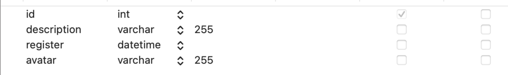
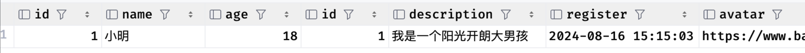
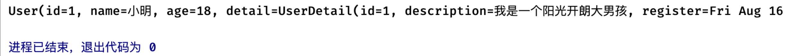
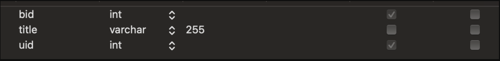
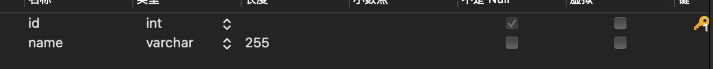

## Mybatis详解3

### 复杂查询

#### 一对一查询

首先来看最简单的一对一查询，假设我们每个用户都有一个自己的详细信息表：



这里的id与用户id一致，作为用户id的逻辑外键，表示对应用户的详细信息。对应的实体类为：

```java
@Data
public class UserDetail {
    int id;
    String description;
    Date register;
    String avatar;
}

@Data
public class User {
    int id;
    String name;
    int age;
    UserDetail detail;
}
```

现在我们希望查询`User`时，同时将**用户的详细信息包含在内**，像这种一对一查询该怎么实现呢？

我们现在同样需要使用`resultMap`来自定义映射规则

```xml
<select id="selectUserById" resultMap="test">
</select>
<resultMap id="test" type="com.test.entity.User">
</resultMap>
```

`MyBatis` 有两种不同的方式加载关联：

- **嵌套结果映射**：使用嵌套的结果映射来处理连接结果的重复子集。
- **嵌套 Select 查询**：通过执行另外一个 SQL 映射语句来加载期望的复杂类型。

##### 嵌套结果映射 `association`

我们先来看第一种方式，需要使用**关联查询**将用户的详细信息一并获取，然后配置关联查询相关信息，最后由`Mybatis`来对查询的结果进行处理即可.

首先是关联查询的`SQL`语句，这里我们直接使用**左连接**：

```sql
select * from user left join user_detail on user.id = user_detail.id where user.id = #{id}
```



接着我们需要在`resultMap`编写好对应关系，一对一查询我们可以使用`association`标签来进行指定，其中`property`就是需要进行一对一处理的对象

在此标签内部填写需要进行一对一映射的对象属性：

```xml
<resultMap id="test" type="User">
    <id property="id" column="id"/>
    <result property="name" column="name"/>
    <result property="age" column="age"/>
    <association property="detail" column="id" javaType="UserDetail">
        <id property="id" column="id"/>
        <result property="description" column="description"/>
        <result property="register" column="register"/>
        <result property="avatar" column="avatar"/>
    </association>
</resultMap>
```

这里的`column`和`javaType`可以不填，`Mybatis`一般情况下可以自动完成推断，配置完成后，我们在查询时`Mybatis`就可以自动把额外信息也封装好了：



##### 嵌套 Select 查询 `select + association`

们可以在查询`user`表的时候，同时查询`user_detail`表的对应信息，分别执行两个选择语句，最后再由`Mybatis`将其结果合并，效果和第一种方法是一样的：

```xml
<select id="selectUserById" resultMap="test">
    select * from user where id = #{id}
</select>

<select id="selectUserDetailById" resultType="com.test.entity.UserDetail">
    select * from user_detail where id = #{id}
</select>

<resultMap id="test" type="com.test.entity.User">
    <id property="id" column="id"/>
    <result property="name" column="name"/>
    <result property="age" column="age"/>
    <association property="detail" column="id" select="selectUserDetailById" javaType="com.test.entity.UserDetail"/>
</resultMap>
```

这里我们分别配置了两个`select`标签用于分别查询用户基本信息和详细信息，并使用`association`标签的`select`属性来指定关联查询操作，得到结果是一样的

##### Mybatis日志

我们可以开启`Mybatis`的日志来观察具体执行的操作，这里我们需要在`Mybatis`配置文件中添加：

```xml
<settings>
    <setting name="logImpl" value="STDOUT_LOGGING"/>
</settings>
```

这样Mybatis运行时就会打印日志到控制台了：

```
...
Opening JDBC Connection
Created connection 1962329560.
==>  Preparing: select * from user where id = ?
==> Parameters: 1(Integer)
<==    Columns: id, name, age
<==        Row: 1, 小明, 18
====>  Preparing: select * from user_detail where id = ?
====> Parameters: 1(Integer)
<====    Columns: id, description, register, avatar
<====        Row: 1, 我是一个阳光开朗大男孩, 2024-08-16 15:15:03, https://www.baidu.com
<====      Total: 1
<==      Total: 1
User(id=1, name=小明, age=18, detail=UserDetail(id=1, description=我是一个阳光开朗大男孩, register=Fri Aug 16 15:15:03 CST 2024, avatar=https://www.baidu.com))
Closing JDBC Connection [com.mysql.cj.jdbc.ConnectionImpl@74f6c5d8]
Returned connection 1962329560 to pool.
```

Mybatis日志中，`==>`向右的箭头就是发送给MySQL服务器的SQL语句以及其参数列表，`<==`向左的箭头就是得到的结果，可以看到这里一共执行了两次SQL语句，分别是user表和user_detail表的查询操作

#### 一对多查询 (查询一个 - 返回多个)

`collection` - 实体属性为列表

`association` - 实体属性为实体类

我们接着来看一对多查询，现在来一个新的表，用于存放用户借阅的图书，对应实体类如下：

```java
@Data
public class Book {
    int bid;
    String title;
}

@Data
public class User {
    int id;
    String name;
    int age;
    List<Book> books;   //直接得到用户所属的所有书籍信息
}
```

其中`book`表设计如下，其中uid作为用户id的逻辑外键，表示这本书是谁借的：



对于一对多查询，我们也可以进行**关联查询**来让`Mybatis`自动解析结果并封装为对象

首先还是关联查询的SQL语句，这里我们让user左连接到book表中：

```sql
select * from user left join book on user.id = book.uid where user.id = #{id}
```

此时由于出现了多行数据，我们需要配置一个`collection`标签来让其可以正确处理关联的集合结果，`Mybatis`会根据我们配置的属性自动将关联数据变为一个集合并存放在对象中：

```xml
<resultMap id="test" type="com.test.entity.User">
    <id column="id" property="id"/>
    <result column="name" property="name"/>
    <result column="age" property="age"/>
    <collection property="books" ofType="com.test.entity.Book">
        <id column="bid" property="bid"/>
        <result column="title" property="title"/>
    </collection>
</resultMap>
```

我们需要在`resultMap`中完整编写需要查询对象的属性对应关系以及在`collection`中编写关联查询的集合内类型相关属性对应关系，当然这个关系哪怕只写一个Mybatis也可以自动推断其他的，不过建议还是写完整一点

##### 嵌套查询

此外也可以用 `select` 嵌套查询来解决，操作是同样的

```java
<select id="selectStuById" resultMap="test" parameterType="_int">
    select * from student where sid = #{sid}
</select>

<select id="selectBookBySid" resultType="com.test.entity.Book">
    select * from book where uid = #{sid}
</select>

<resultMap id="test" type="Student">
    <id column="sid" property="sid"/>
    <result column="name" property="name"/>
    <result column="sex" property="sex"/>
    <collection property="books" select="selectBookBySid" column="sid" ofType="com.test.entity.Book"/>
</resultMap>
```

#### 多对一查询 (多 - 多)

了解了一对多，那么多对一又该如何查询

比如每个用户现在都有一个小组，但是他们目前都是在同一个小组中，此时我们查询所有用户信息的时候，需要自动携带他们的小组：



这里我们需要修改一下user表来记录每一个用户所属的小组id，这里使用gid作为分组id的逻辑外键

接着是实体类设计：

```java
@Data
public class Group {
    int id;
    String name;
}

@Data
public class User {
    int id;
    String name;
    int age;
    Group group;
}
```

接着就是编写SQL映射，实际上这里跟我们之前的一对一非常类似，我们只需要让查询出来的每一个用户都左连接分组信息即可，这样`Mybatis`就可以通过`association`来自动处理了：

```sql
select *, groups.name as gname from user left join `groups` on user.gid = groups.id
```

注意SQL语句中一些字段存在歧义，我们需要手动为其起个别名，接着就是XML编写了：

```xml
<select id="selectAllUser" resultMap="test2">
    select *, groups.name as gname from user left join `groups` on user.gid = groups.id
</select>
<resultMap id="test2" type="com.test.entity.User">
    <id column="id" property="id"/>
    <result column="name" property="name"/>
    <result column="age" property="age"/>
    <association property="group">
        <id column="gid" property="id"/>
        <result column="gname" property="name"/>
    </association>
</resultMap>
```

这样我们就可以成功实现多对一查询了，这与之前的一对一比较类似。

当然，也可以嵌套`select`

```xml
<select id="selectStudent" resultMap="test">
    select * from student
</select>

<resultMap id="test" type="Student">
    <id column="sid" property="sid"/>
    <result column="name" property="name"/>
    <result column="sex" property="sex"/>
    <association property="group" select="selectGroup" column="gid" javaType="com.test.entity.Group"/>
</resultMap>

<select id="selectGroup" resultType="com.test.entity.Group">
    select * from `group` where gid = #{gid}
</select>
```