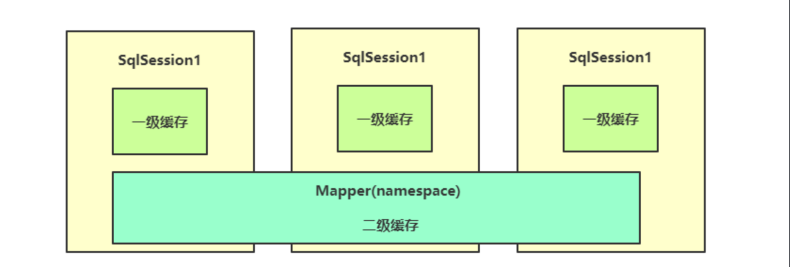
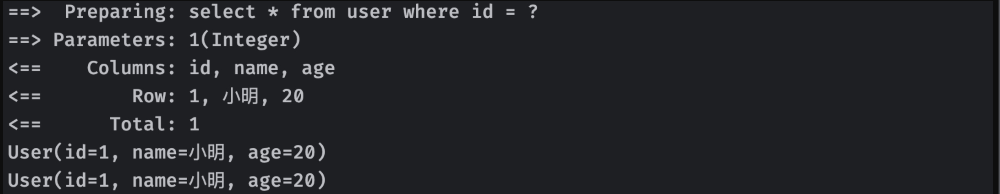
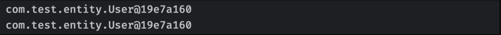
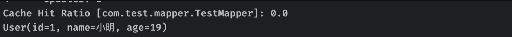
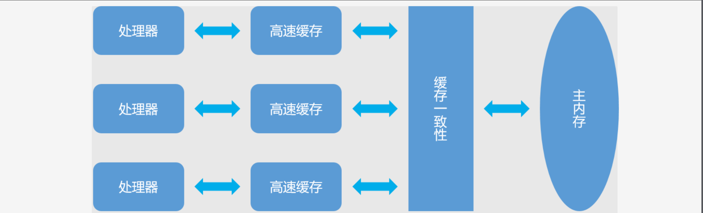

## Mybatis详解6

### 缓存机制

其实缓存机制我们在之前学习IO流的时候已经提及过了，我们可以提前将一部分内容放入缓存，下次需要获取数据时，就可以直接从缓存中读取，这样的话相当于直接从内存中获取而不是再去向数据库索要数据，效率会更高，缓存的概念在我们后续的学习中还会经常遇见，它也是现在提高数据获取效率的良好解决方案。

Mybatis为了查询效率，同样内置了一个缓存机制，我们在查询时，如果Mybatis缓存中存在数据，那么我们就可以直接从缓存中获取，而不是再去向数据库进行请求，节省性能开销。



`Mybatis`的缓存机制有些复杂，存在**一级缓存(本地缓存)**和**二级缓存**

#### 一级缓存 (作用在`SqlSession`)

我们首先来看一下一级缓存，默认情况下，只启用了本地的会话缓存，也就是一级缓存，**它仅仅对一个会话中的数据进行缓存**（一级缓存强制启用，无法关闭，只能做调整）

也就是每一个`SqlSession`都有有一个对应的缓存

我们来看看下面这段代码：

```java
TestMapper mapper = session.getMapper(TestMapper.class);
System.out.println(mapper.selectUserById(1));
System.out.println(mapper.selectUserById(1));  //再次获取
```

这里我们连续获取了两次ID为1的用户，我们会在日志中惊奇地发现，这里的查询操作实际上只进行了一次：



我们去掉类上的`@Data`注解，会发现得到的两个对象实际上就是同一个：



也就是说我们第二次查询不仅压根就**没执行SQL语句**，甚至直接没有**重新构造对象，而是直接获取之前创建好的**。

可见，`Mybatis`确实存在着缓存机制来进行性能优化。

那么如果我修改了数据库中的内容，缓存还会生效吗：

```java
System.out.println(mapper.selectUserById(1));
mapper.updateAgeById(1, 19);
System.out.println(mapper.selectUserById(1));
```

此时由于我们更新了数据库中的数据，那么之前缓存的内容也会跟着失效，第二次获取的时候会进行重新查询。

也就是说`Mybatis`知道我们对数据库里面的数据进行了修改，所以之前缓存的内容可能就不是当前数据库里面最新的内容了。

但是一定注意，一级缓存只针对于**单个会话**，**多个会话之间不相通**。

因此， 一个会话DML操作只会重置当前会话的缓存，不会重置其他会话的缓存，我们可以来试验一下：

```java
try(SqlSession s1 = MybatisUtils.openSession(true);
    SqlSession s2 = MybatisUtils.openSession(true)) {
    TestMapper m1 = s1.getMapper(TestMapper.class);
    TestMapper m2 = s2.getMapper(TestMapper.class);
    System.out.println(m1.selectUserById(1));
    m2.updateAgeById(1, 19);
    System.out.println(m1.selectUserById(1));
}
```

可以看到，会话1在重复查询数据时，即使会话2已经修改了数据，但是依然没有影响会话1之中的缓存。

这导致尽管会话2更新了数据，但是会话1中的数据是从缓存得到的，没有更新。

一级缓存给我们提供了很高速的访问效率，但是它的作用范围实在是有限，**如果一个会话结束，那么之前的缓存就全部失效了**，但是我们希望缓存能够扩展到所有会话都能使用，无论哪个会话对于数据的查询缓存都可以直接被所有会话使用。

#### 二级缓存 (作用在`Mapper`)

我们可以通过**二级缓存**来实现，二级缓存**默认是关闭状态**，要开启二级缓存，我们需要在映射器XML文件中添加：

```xml
<cache/>
```

二级缓存是`Mapper`级别的，**只要是使用这个`Mapper`的会话，都会关联到这个二级缓存**

无论哪个会话失效，它之前查询的缓存依然会存在于二级缓存中，依然可以被其他会话直接使用。

我们可以对`cache`标签进行一些配置：

```xml
<cache
  eviction="FIFO"
  flushInterval="60000"
  size="512"
  readOnly="true"/>
```

其中，`size`表示最大的缓存对象数量，当缓存达到上限时，会根据`eviction`配置的策略进行清理：

- `LRU` – 最近最少使用：移除最长时间不被使用的对象。
- `FIFO` – 先进先出：按对象进入缓存的顺序来移除它们。
- `SOFT` – 软引用：基于垃圾回收器状态和软引用规则移除对象。
- `WEAK` – 弱引用：更积极地基于垃圾收集器状态和弱引用规则移除对象。

`flushInterval`用于控制缓存刷新时间，当到达指定时间时会自动清理所有缓存，默认情况下如果不配置此项则不会进行定时清理。

`readOnly`（只读）属性可以被设置为 true 或 false，只读的缓存会给所有调用者返回**相同的缓存对象**，且**对象不能被修改**。这就提供了可观的性能提升。

而可读写的缓存会（通过序列化）返回**缓存对象的拷贝**。 速度上会慢一些，但是更安全，因此默认值是 false。

> **注意：** 二级缓存是**事务性**的，这意味着，当 SqlSession 结束并提交时，或是结束并回滚，而且没有执行 `flushCache=true` 的 `insert/delete/update` 语句时，**二级缓存才会被更新**。

即：

```java
try(SqlSession session = MybatisUtil.getSession(true);
    SqlSession session2 = MybatisUtil.getSession(true)
){
    TestMapper mapper = session.getMapper(TestMapper.class);
    System.out.println(mapper.selectStuById(1));
    session2.commit();

    TestMapper mapper2 = session2.getMapper(TestMapper.class);
    System.out.println(mapper2.selectStuById(1));
}
```

只有`commit`了，才会保存在二级缓存，这样用`mapper2`时，才不会重新读取，如果没有`commit`，就会重新读取，因为并没有保存在缓存中

开启二级缓存后，再次执行我们之前的操作，就可以直接在二级缓存中命中了：



##### 查找顺序

实际上，添加了二级缓存之后，Mybatis会**先从二级缓存中查找数据**，当二级缓存中没有时，**才会从一级缓存中获取**，当一级缓存中都还没有数据时，才**会请求数据库**。

##### 单独配置取消二级缓存 `useCache='false'`

当我们开启二级缓存后，默认情况下一个Mapper中所有的操作都会使用二级缓存

我们也可以单独配置其不使用二级缓存，只需要修改`useCache`属性即可：

```xml
<select id="selectUserById" useCache="false" resultType="com.test.User">
    select * from user where id = #{id}
</select>
```

##### 操作结束，清除所有缓存 `flushCache`

有些操作可能比较特殊，比如我们希望某个操作执行完成后，直接清除所有缓存，无论是一级缓存还是二级缓存，那么此时就可以开启`flushCache`属性：

```xml
<select id="selectUserById" flushCache="true" resultType="com.test.User">
    select * from user where id = #{id}
</select>
```

开启此选项后，调用此操作将直接导致一级和二级缓存被清除。

#### 缓存一致性问题

虽然缓存机制给我们提供了很大的性能提升，但是缓存存在一个问题，我们之前在`计算机组成原理`中可能学习过**缓存一致性问题**

当多个CPU在操作自己的缓存时，可能会出现各自的缓存内容不同步的问题。



而`Mybatis`也会这样，我们来看看这个例子：

```java
TestMapper mapper = session.getMapper(TestMapper.class);
while (true){
    Thread.sleep(3000);
    System.out.println(mapper.selectUserById(1));
}
```

我们现在循环地每三秒读取一次，而在这个过程中，我们使用其他软件手动修改数据库中的数据，将1号用户的ID改成100，那么理想情况下，下一次读取将直接无法获取到这行数据，因为ID已经发生变化了。

但是结果却是依然能够读取，并且sid并没有发生改变，这也证明了Mybatis的缓存在生效，因为我们是从外部进行修改，Mybatis不知道我们修改了数据，所以依然在使用缓存中的数据，但是这样很明显是不正确的

因此，如果存在多台服务器或者是多个程序都在使用`Mybatis`操作同一个数据库，并且都开启了**缓存**，需要解决这个问题

我们只能关闭所有二级缓存，并且在`Mybatis`每个操作都配置`flushCache`为true来保证刷新。

只不过这种操作实际上是治标不治本的，**实现多服务器缓存共用**才是最终解决方案，也就是让所有的Mybatis都使用**同一个缓存进行数据存取**

在后面，我们会继续学习Redis、Ehcache、Memcache等缓存框架，通过使用这些工具，就能够很好地解决缓存一致性问题。
