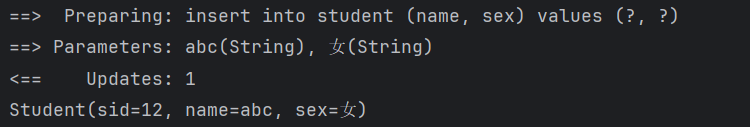

## Mybatis详解7

### 使用注解开发

在之前的学习中，我们已经体验到`Mybatis`为我们带来的便捷了

我们只需要编写对应的映射器，并将其绑定到一个接口上，即可直接通过该接口执行我们的SQL语句，极大的简化了我们之前JDBC那样的代码编写模式。

那么，能否**实现无需XML映射器配置**，而是直接使用注解在接口上进行配置呢？

我们可以直接删除掉所有的`Mapper.xml`文件了，只保留`Mapper`相关的接口。

现在，我们来尝试以全注解的形式重现编写咱们的SQL语句映射

#### 调整 `mybatis-config.xml`

还是以查询所有的用户为例，既然现在不需要配置`Mapper.xml`文件了，那么我们现在需要重写在Mybatis的配置文件中进行mapper的配置

因为现在只需要使用接口来进行配置

所以使用`package`标签来指定一个包，包下所有的接口都将直接作为`Mapper`配置接口：

```xml
<mappers>
    <package name="com.test.mapper"/>
</mappers>
```

或者还是`mapper`标签通过`class`属性来指定具体的接口：

```xml
<mappers>
  <mapper class="com.test.mapper.TestMapper"/>
</mappers>
```

#### 修改对应接口+注解

现在我们还是在`Mapper`中添加一个对应的方法用于执行：

```java
public interface TestMapper {
    List<User> selectAllUser();
}
```

之前我们需要像这样编写：

```xml
<select id="selectAllUser" resultType="com.test.User">
    select * from user
</select>
```

##### 举例

现在只需要一个注解即可，`Mybatis`为我们提供了丰富的注解用于表示不同SQL语句类型

这里的`@Select`代表的就是select标签，我们只需要直接在其中编写SQL语句即可，而返回类型`Mybatis`会自动根据方法的返回值进行判断：

```java
public interface TestMapper {
    @Select("select * from user")
    List<User> selectAllUser();
}
```


包括一些SQL语句参数的使用也是和之前完全一样，比如插入一个用户：

```java
@Insert("insert into user (name, age) values (#{name}, #{age})")
int insertUser(User user);
```

##### 配置这些额外的参数 `@Options`

虽然Mybatis为我们提供了之前XML配置中各种操作的对应注解，但是我们发现，这些注解并不能像之前XML那样直接修改一些属性

比如我们希望配置`useGeneratedKeys`来得到自动生成的主键，从而修改我们对应的实体类

需要配置这些额外的参数，我们可以使用`@Options`注解：

```java
@Options(useGeneratedKeys = true, keyColumn = "id", keyProperty = "id")
@Insert("insert into user (name, age) values (#{name}, #{age})")
int insertUser(User user);
```

```xml
<insert id="insertUser" parameterType="com.test.entity.User" useGeneratedKeys="true" keyProperty="id" keyColumn="id">
    insert into user (name, age) values (#{name}, #{age})
</insert>
```

这两种写法效果是完全一样的，`Mybatis`在插入后，会将我们当前的实体类对象的`id`修改为得到的`id`

```java
Student student = new Student().setName("abc").setSex("女");
mapper.insertStudent(student);
System.out.println(student);
```



所以我们通过`Mybatis`为我们设计的这一系列注解就可以很轻松地取代掉之前的配置。

##### 实体类字段名称与数据库不同 `@Results`

假如现在我们的实体类字段名称与数据库不同，此时该如何像之前一样配置`resultMap`呢？

```java
public class User {
    int uid;
    String username;
    int age;
}
```

```xml
<resultMap id="test" type="User">
    <id property="id" column="uid"/>
    <result column="name" property="username"/>
</resultMap>
```

我们可以使用`@Results`注解来实现这种操作，它的使用方式与resultMap几乎没什么区别：

```java
@Results({
        @Result(id = true, column = "id", property = "uid"), 
        @Result(column = "name", property = "username")
})
@Select("select * from user")
List<User> selectAllUser();
```

##### 结合`xml`配置

当然，如果你还是觉得这种方式配置起来不如之前方便，那么你也可以单独在XML中配置一个`resultMap`

然后直接通过注解的形式引用：

```java
@ResultMap("test")
@Select("select * from user")
List<User> selectAllUser();
```

##### 指定构造方法 `@ConstructorArgs`

那么现在如果我们需要指定使用的构造方法怎么办呢？就像我们之前在使用`constrator`标签一样

Mybatis为我们提供了`@ConstructorArgs`注解，配置方式和之前几乎一致：

```java
public class User {
    int id;
    String name;
    int age;

    public User(int id, String name, int age) {
        this.id = id;
        this.name = name;
        this.age = age + 20;
    }
}
```

```java
@ConstructorArgs({
        @Arg(id = true, column = "id", javaType = int.class),
        @Arg(column = "name", javaType = String.class),
        @Arg(column = "age", javaType = int.class)
})
@Select("select * from user")
List<User> selectAllUser();
```

这与我们之前的XML配置完全一致：

```xml
<constructor>
    <idArg column="id" javaType="_int"/>
    <arg column="name" javaType="String"/>
    <arg column="age" javaType="_int"/>
</constructor>
```

##### 关联查询 (注解只支持嵌套查询)

我们再来看看之前在`resultMap`中配置的关联查询该如何编写，Mybatis也为我们提供了丰富的注解用于处理这类问题，我们首先来看看**一对一查询**：

```java
@Results({
        @Result(id = true, column = "id", property = "id"),
        @Result(column = "id", property = "detail", one = @One(select = "selectDetailById"))
})
@Select("select * from user where id = #{id};")
User selectUserById(int id);

@Select("select * from user_detail where id = #{id}")
UserDetail selectDetailById(int id);
```

我们在配置`@Result`注解时，只需要将`one`或是`many`参数进行填写即可，它们分别代表一对一关联和一对多关联

使用`@One`和`@Many`注解来指定其他查询语句进行**嵌套查询**，就像是我们之前使用`association`和`collection`那样。

不过很遗憾的是，我们无法完全通过注解来实现**之前的联合查询解析**（这是因为 Java 注解不允许循环引用）

只能使用这种嵌套查询来完成复杂查询操作，因此，如果对这种复杂查询有着一定需求的话，**建议使用之前的`XML`方式进行配置**。

##### 动态`SQL`配置 (`SelectProvider`注解)

我们还可以使用注解进行动态SQL的配置

比如现在我们想要实现之前的这个奇葩需求：

```xml
<select id="selectUserById" resultType="User">
    select * from user where id = #{id}
    <if test="id > 3">
        and age > 18
    </if>
</select>
```

`Mybatis`针对于所有的`SQL`操作都提供了对应的Provider注解，用于配置动态SQL

我们需要先创建一个类编写我们的动态SQL操作：

```java
public class TestSqlBuilder {
    public static String buildGetUserById(int id) {
        return new SQL(){{   
          //SQL类中提供了常见的SELECT、FORM、WHERE等操作
            SELECT("*");
            FROM("user");
            WHERE("id = #{id}");
            if (id > 3) {
                WHERE("age > 18");
            }
        }}.toString();
    }
}
```

详细的SQL语句构建器语法文档：<https://mybatis.org/mybatis-3/zh_CN/statement-builders.html>

构建完成后，接着我们就可以使用`@SelectProvider`来引用这边编写好的动态SQL操作：

```java
@SelectProvider(type = TestSqlBuilder.class, method = "buildGetUserById")
User selectUserById(int id);
```

效果和之前我们编写XML形式的动态SQL一致

当然，如果遇到了多个参数的情况，我们同样需要使用`@Param`来指定参数名称，包括`TestSqlBuilder`中编写的方法也需要添加，否则必须保证形参列表与这边接口一致。

虽然这样可以实现和之前差不多的效果，但是这实在是太过复杂了，我们还需要单独编写一个类来做这种事情

实际上我们也可以直接在`@Select`中编写一个XML配置动态SQL，`Mybatis`同样可以正常解析：

```java
@Select("""
         <script>
            select * from user where id = #{id}
            <if test="id > 3">
                 and age > 18
            </if>
         </script>
         """)
User selectUserById(int id);
```

这里只需要包括一个`script`标签我们就能像之前XML那样编写动态SQL了，只不过由于IDEA不支持这种语法的识别，可能会出现一些莫名其妙的红标，但是是可以正常运行的。

##### 二级缓存配置 `@CacheNamespace`

最后我们来看一下二级缓存相关的配置，使用`@CacheNamespace`注解直接定义在接口上即可，然后我们可以通过使用`@Options`来控制单个操作的缓存启用：

```java
@CacheNamespace(size = 512, readWrite = false)
public interface TestMapper {}
```

我们如果需要控制单个方法的缓存，同样可以使用`@Option`来进行配置：

```java
@Options(flushCache = Options.FlushCachePolicy.TRUE, useCache = false)
@Select("select * from user where id = #{id}")
User selectUserById(int id);
```

### `Configuration`

这里我们不如再做的更加极致一点，咱们把配置文件也给变成代码配置，彻底抛弃XML配置

实际上我们的XML配置中所有配置项都可以以`Configuration`对象的形式进行配置，最后在构造`SqlSessionFactory`时也可以通过此对象进行创建：

```java
sqlSessionFactory = new SqlSessionFactoryBuilder().build(initConfiguration());

private static Configuration initConfiguration() {
    Configuration configuration = new Configuration();
    PooledDataSource dataSource = new PooledDataSource(
            "com.mysql.cj.jdbc.Driver",
            "jdbc:mysql://localhost:3306/web_study",
            "test",
            "123456");
    Environment environment = new Environment("development", new JdbcTransactionFactory(), dataSource);
    configuration.setEnvironment(environment);
    configuration.getTypeAliasRegistry().registerAliases("com.test.entity");
    configuration.setLogImpl(StdOutImpl.class);
    configuration.addMappers("com.test.mapper");
    return configuration;
}
```

有关Mybatis的基本使用，我们就暂时介绍到这里。
