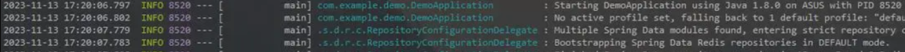

## JUL日志系统5

### 自定义日志格式

新建一个类，来继承`Formatter`，通过修改对应的`format`函数来实现自定义

每一个`Handler`都可以配置一个对应的`Formatter`来决定日志打印的格式，除了官方为我们提供的两种默认格式外，我们也可以自定义我们想要的日志打印格式。

我们只需要继承`Formatter`类，就可以创建一个自定义的日志格式处理逻辑了：

```java
public class MyFormatter extends Formatter {
    @Override
    public String format(LogRecord record) {
        return "我是自定义日志格式";
    }
}
```

其中参数为`LogRecord`，它提供了当前日志记录的相关信息，比如：

```java
@Override
public String format(LogRecord record) {
    System.out.println("所在类: " + record.getSourceClassName());
    System.out.println("方法名称: " + record.getSourceMethodName());
    System.out.println("日志级别: " + record.getLevel().getLocalizedName());
    return "我是自定义日志格式";
}
```

#### 修改对应`Formatter`

##### 手动修改 `setFormatter`

```java
Logger logger = Logger.getLogger("com.test");
logger.getParent().getHandlers()[0].setFormatter(new MyFormatter());
```

##### 配置文件修改

直接把`ConsoleHandler`的默认`Formatter`配置为我们自己的类：

```properties
java.util.logging.ConsoleHandler.formatter=com.test.MyFormatter
```

#### 自定义例子

因此，我们也可以利用这些属性来编写一个类似于的`SimpleFormatter`的日志格式，比如这里包含类名、时间等，类似于下面图中的日志格式：



我们来尝试编写一下：

```java
public String format(LogRecord record) {
    StringBuilder builder = new StringBuilder();
    //日期
    Date date = new Date(record.getMillis());
    SimpleDateFormat dateFormat = new SimpleDateFormat("yyyy-MM-dd HH:mm:ss.SSS");
    builder.append(dateFormat.format(date));
    //级别
    builder.append("  ").append(record.getLevel());
    builder.append(" --- ");
    //线程名称
    builder.append('[').append(Thread.currentThread().getName()).append(']');
    //类名称
    builder.append(" ").append(String.format("%-15s", record.getSourceClassName()));
    //消息内容
    builder.append(" : ").append(record.getMessage());

    return builder.toString();
}
```

### 第三方框架兼容性

我们发现，如果我们现在需要全面使用日志系统，而不是传统的直接打印，那么就需要在每个类都去编写获取Logger的代码，这样显然是很冗余的，能否简化一下这个流程呢？

前面我们学习了Lombok，我们也体会到Lombok给我们带来的便捷，我们可以通过一个注解快速生成构造方法、Getter和Setter

#### `Lombok`日志注解

同样的，Logger也是可以使用Lombok快速生成的。

```java
@Log
public class Main {
    public static void main(String[] args) {
        System.out.println("自动生成的Logger名称："+log.getName());
        log.info("我是日志信息");
    }
}
```

只需要添加一个`@Log`注解即可，添加后，我们可以直接使用一个静态变量log，而它就是自动生成的Logger。

我们也可以手动指定名称：

```java
@Log(topic = "打工是不可能打工的")
public class Main {
    public static void main(String[] args) {
        System.out.println("自动生成的Logger名称："+log.getName());
        log.info("我是日志信息");
    }
}
```

#### `Mybatis`日志

我们接着来看Mybatis，经过前面的学习，我们知道，Mybatis也有日志系统，它详细记录了所有的数据库操作等，要开启日志系统，我们需要进行配置：

```xml
<setting name="logImpl" value="STDOUT_LOGGING" />
```

`logImpl`包括很多种配置项
包括 SLF4J | LOG4J | LOG4J2 | JDK_LOGGING | COMMONS_LOGGING | STDOUT_LOGGING | NO_LOGGING

而默认情况下是未配置，也就是说不打印。

将其设定为`STDOUT_LOGGING`表示直接使用标准输出将日志信息打印到控制台

现在我们也可以将其设置为JDK提供的日志框架：

```xml
<setting name="logImpl" value="JDK_LOGGING" />
```

将其配置为`JDK_LOGGING`表示使用JUL进行日志打印，因为`Mybatis`的日志级别都比较低

因此我们需要设置一下`logging.properties`默认的日志级别：

```properties
# RootLogger 的默认处理器为
handlers=java.util.logging.ConsoleHandler
# RootLogger 的默认的日志级别
.level=ALL

# 配置ConsoleHandler的默认level
java.util.logging.ConsoleHandler.level=ALL
```

这样，Mybatis就可以正确使用JDK的日志框架进行日志打印了，只不过格式稍微有点炸裂，可能还是得我们自己编写一个自定义的Formatter才行。
