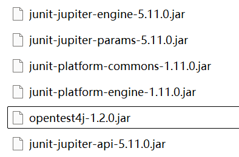
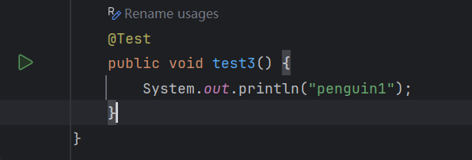
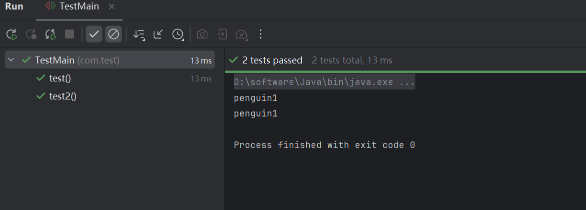
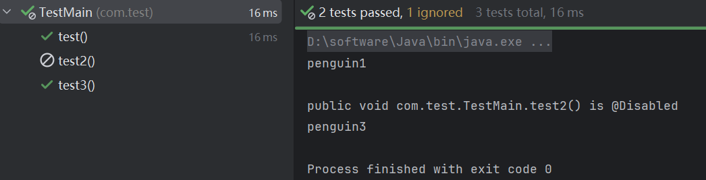
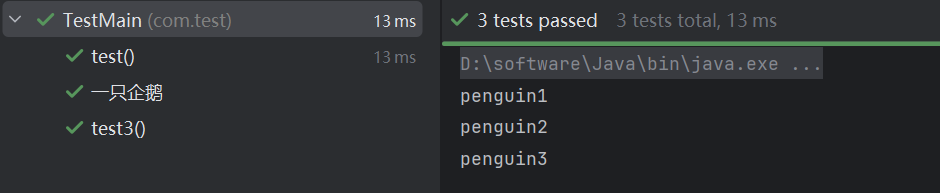
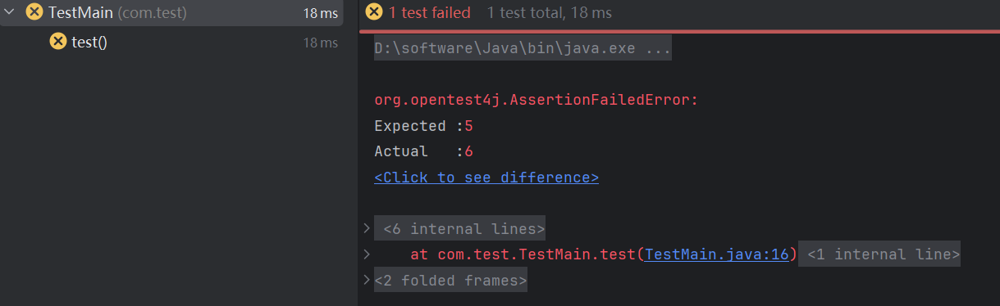

## JUnit单元测试1

### 单元测试

在很多情况下，我们的项目可能会很庞大，不可能每次都去完整地启动一个项目来测试某一个功能，这样显然会降低我们的开发效率，因此，我们需要使用单元测试来帮助我们针对于某个功能或是某个模块单独运行代码进行测试，而不是启动整个项目，比如：

```java
public class Main {
    public static void main(String[] args) {
        System.out.println("Hello World");
        func1();
        func2();
        func3();
    }
    
    private static void func1() {
        System.out.println("我是第一个功能");
    }

    private static void func2() {
        System.out.println("我是第二个功能");
    }

    private static void func3() {
        System.out.println("我是第三个功能");
    }
}
```

如果现在我们想单独测试某一个功能的对应方法，而不是让整个项目完全跑起来，这就非常麻烦了。

而单元测试则可以针对某一个方法直接进行测试执行，无需完整启动项目。


同时，在我们项目的维护过程中，难免会涉及到一些原有代码的修改，很有可能出现改了代码导致之前的功能出现问题（牵一发而动全身），而我们又不一定能立即察觉到，因此，我们可以提前保存一些测试用例，每次完成代码后都可以跑一遍测试用例，来确保之前的功能没有因为后续的修改而出现问题。

我们还可以利用单元测试来评估某个模块或是功能的耗时和性能，快速排查导致程序运行缓慢的问题，这些都可以通过单元测试来完成，可见单元测试对于开发的重要性。

### JUnit使用

#### 导入依赖

现在用的是JUnit5, 感觉没学到maven，找jar包花了点时间



同时IDEA需要安装JUnit插件（终极版默认是已经捆绑安装的，因此无需多余配置），安装好之后，我们就可以直接上手使用了

#### 使用- 注解`@Test`

使用方式很简单，只需添加一个`@Test`注解即可快速创建新的测试用例，这里我们尝试新建一个类用于单元测试：

```java
public class MainTest {
    
}
```

接着就可以编写我们的测试用例了，现在我们需要创建一个`public`的无参无返回值方法（不能是静态方法）并在方法内编写我们的需要进行测试的代码：

```java
public void test1(){
    Main.func1();
}
```

最后在方法上添加`@Test`注解，此时IDEA会提示我们可以运行，旁边出现运行按钮：



接着点击运行，就可以直接执行我们的测试方法了，然后可以在控制台看到当前的测试用例耗时以及状态：



一个测试类中可以同时有多个测试案例：

```java
public class MainTest {

    @Test
    public void test1(){
        Main.func1();
    }

    @Test
    public void test2(){
        Main.func2();
    }

    @Test
    public void test3(){
        Main.func3();
    }
}
```

我们只需要点击类旁边的运行按钮，就可以直接执行当前类中所有的测试案例

#### 跳过某个测试 - `@Disable`

有些时候，可能我们并不想开启其中某个测试用例，我们也可以使用`@Disable`来关闭某一个测试用例：

```java
@Test
@Disabled
public void test2(){

}
```

此时再次全部运行，将忽略二号测试案例进行测试



#### 测试自定义名称 - `@DisplayName`

我们还可以为测试案例添加一个自定义的名称，不然测试案例一多我们就分不清楚到底哪个案例是干嘛的

我们需要使用`@DisplayName`注解来为其命名：

```java
@Test
@DisplayName("一只企鹅")
public void test1(){}
```

这样我们的控制台也可以看到对应的名称：



#### 预设的名称生成器 - `@DisplayNameGeneration`

Junit还提供了一些预设的名称生成器，按照一定规则进行名称处理，可以通过`@DisplayNameGeneration`注解来配置使用，列表如下：

| 显示名称生成器        | 行为                                       |
| :-------------------- | :----------------------------------------- |
| `Standard`            | 方法名称作为测试名称。                     |
| `Simple`              | 同上，但是会删除无参数方法的尾随括号。     |
| `ReplaceUnderscores`  | 同上，但是会用空格替换方法名称中的下划线。 |
| `IndicativeSentences` | 包含类名和方法名称连接之后的名称。         |

#### 判断测试是否成功 — 断言 `Assertions`

当然，对于一个测试案例来说，我们肯定希望测试的结果是我们所期望的一个值，因此，如果测试的结果并不是我们所期望的结果，那么这个测试就应该没有成功通过，我们可以通过断言工具类`Assertions`来对结果进行判定：

```java
@Test
public void test1(){
    Random random = new Random();
    int value = random.nextInt() % 2;   //生成一个随机数，进行对2取余操作
    Assertions.assertEquals(1, value);   //如果是单数则匹配成功，如果不是则匹配失败
}
```

当测试案例失败时，控制台会出现应该`AssertionFailedError`错误，同时IDEA也会提示我们测试失败

