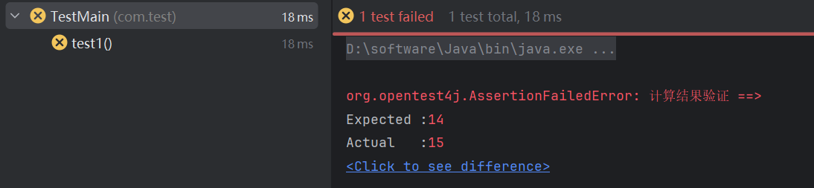
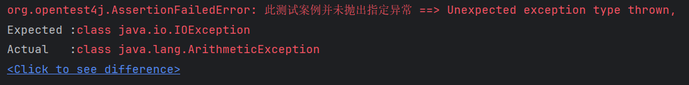
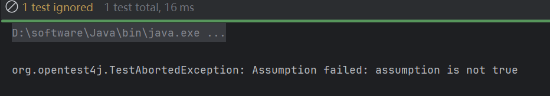
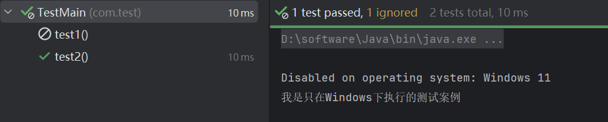

## JUnit单元测试2

### 断言工具 `Assertions`

JUnit提供了非常多的断言操作，相比JUnit 4，它们都被封装在一个新的`Assertions`类中

这些断言操作基本上都是用于判断某个测试结果是否符合我们的预期情况

#### 值判断 `Assertions.assertEquals`

其中最简单的就是判断结果是否等于某个值 

`Assertions.assertEquals(expected, actual, message)`

```java
@Test
public void test1(){
    int a = 10, b = 5;
    int c = a + b;
    //判断结果是否相等，前面的是预期结果，后面的就是实际结果
    Assertions.assertEquals(15, c);
}
```

当断言操作发现实际结果与预期不符时，会直接抛出异常告诉我们这个测试案例没有通过，并最终以失败状态结束。我们也可以为本次断言添加一个`message`来助于我们快速了解是什么类型的测试结果出现问题：

```java
Assertions.assertEquals(14, c, "计算结果验证");
```

此时控制台就会得到：



#### 真假判断 `Assertions.assertTure/False`

`Assertions.assertTure(condition, message)`

除了使用值进行比较外，我们也可以直接对某个`boolean`类型的结果快速进行判断，使用`assertTrue`方法：

```java
Assertions.assertTrue(14 == c, "计算结果验证");
```

#### 对象判断 `Assertions.assertSame()`

与其相似的还有两个相同对象的判断：

```java
Assertions.assertSame(999, 999);  //判断两个值是否为同一个对象
```

#### 复杂判断

如果判断流程比较复杂，我们也可以使用Java8的Lambda来编写结果判断逻辑，提供一个BooleanSupplier对象：

```java
Assertions.assertTrue(() -> {
    if(c < 10) return true;
    if(c > 20) return false;
    return c == 15;
}, "计算结果验证");
```

对于更加复杂的组合结果判断，我们还可以使用`assertAll`来包含多个判断操作：

```java
Assertions.assertAll("整体测试",
        () -> Assertions.assertTrue(c == 14),
        () -> Assertions.assertTrue(c > 10),
        () -> Assertions.assertTrue(c < 20)
);
```

进行整体测试时，所有的测试结果将合并到一起输出。

#### 异常判断 `Assertions.assertThrows`

除了我们上面提到的真假判断外，还有很多不同类型的结果判断，比如异常判断，我们希望这个案例抛出指定的异常：

```java
Assertions.assertThrows(IOException.class, () -> {
    System.out.println(1/0);
}, "此测试案例并未抛出指定异常");
```

由于此时抛出的是一个`ArithmeticException`并不是我们需要的`IOException`或是**其子类**，所以说断言失败：



除了上述例子中出现的断言方法之外，JUnit还提供了上百种断言方法供大家使用，这里就不挨个介绍了。

### 假设工具 `Assumptions`

除了断言工具外，对于一些不影响结果的测试

我们可以使用“假设”工具来实现对结果的判断但不作为测试结果的判断依据，它通常在执行给定测试没有意义时使用。

```java
public void test1(){
    Assumptions.assumeTrue(1 == 3);
}
```

测试结果中会将其显示为已忽略，而不是失败：



### 条件测试和执行

有些时候我们可能需要配置各种条件来执行某些测试案例

比如某些测试案例必须在指定JDK版本执行，或是某些案例只需要在某个特定操作系统执行

Junit支持我们就为测试案例设置条件来实现这些功能。

#### 指定操作系统 - `@EnabledOnOs`

比如，我们要限制某个测试案例只在指定操作系统下进行，那么就可以使用`@EnabledOnOs`来指定：

```java
@Test
@EnabledOnOs(OS.MAC)
public void test1(){
    System.out.println("我是只在Mac下执行的测试案例");
}

@Test
@EnabledOnOs(OS.WINDOWS)
//@DisabledOnOs(OS.MAC)  或是使用相反注解来为指定操作系统关闭此用例
public void test2(){
    System.out.println("我是只在Windows下执行的测试案例");
}
```

这样，当我们在指定操作系统下执行时，此测试案例才会启动，否则会直接忽略：



#### 指定JDK版本 `@EnableOnJre`

同样的，如果我们要指定在某个JDK版本执行测试案例，也可以使用`@EnabledOnJre`来进行指定：

```java
@Test
@EnabledOnJre(JRE.JAVA_8)
//@DisabledOnJre(JRE.JAVA_8) 或是使用相反的注解来为指定JDK关闭
public void test1(){
    System.out.println("我是只在Java8下执行的测试案例");
}

@Test
@EnabledOnJre(JRE.JAVA_17)
public void test2(){
    System.out.println("我是只在Java17下执行的测试案例");
}
```

#### 指定JDK版本范围 `@EnableOnJreRange(min=xxx, max=xxx)`

或是一个指定的JDK版本范围：

```java
@Test
@EnabledForJreRange(min = JRE.JAVA_8, max = JRE.JAVA_17)
public void test1(){
    System.out.println("我是只在Java8-17下执行的测试案例");
}
```

除了这种简单判断外，我们还可以直接从系统属性中获取我们需要的参数来进行判断。

> 使用`System.getProperties()`来获取所有的系统属性，包括系统的架构、版本、名称等信息。下面注解主要就是利用这个函数来进行判断

#### 系统属性判断 `@EnabledIfSystemProperty`

使用`@EnabledIfSystemProperty`来对系统属性进行判断：

```java
@Test
@EnabledIfSystemProperty(named = "os.arch", matches = "aarch64")
//其中matches参数支持正则表达式
public void test1(){
    System.out.println("我是只在arm64架构下做的测试");
}
```

当然，有时候为了方便，我们也可以直接读取环境变量：

```java
@Test
@EnabledIfEnvironmentVariable(named = "TEST_STR", matches = "666")
public void test1(){
    System.out.println("我是只在环境变量: TEST_STR = 666");
}
```

#### 自定义方法 `@EnabledIf(xxx)`

如果你认为这还不够灵活，你还可以直接声明一个自定义方法来进行判断：

```java
@Test
@EnabledIf("testCondition")
public void test1(){
    System.out.println("我是自定义的测试条件");
}

public boolean testCondition() {
    return 1 > 0;
}
```

> 条件方法可以位于测试类之外。在这种情况下，它必须用其*完全限定的名称*来引用
>
> ```java
> @EnabledIf("example.ExternalCondition#customCondition")
> ```
>
> ```java
> class ExternalCondition {
>       /**
>      * 在几种情况下，条件方法需要static：
>      * 当@EnabledIf或@DisabledIf在类上使用时
>      * 当@EnabledIf或@DisabledIf用于@ParameterizedTest或@TestTemplate方法时
>      * 当条件方法位于外部类中时
>      */
>     static boolean customCondition() {
>         return true;
>     }
> }
> ```
