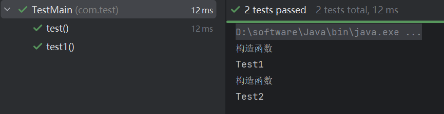
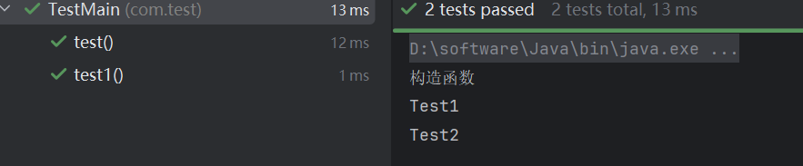
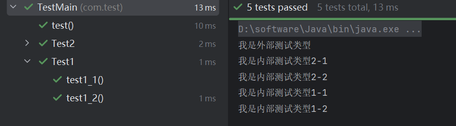

## JUnit单元测试3

### 生命周期

`@BeforeAll` `@AferAll` `@BeforeEach` `@AfterEach`

其中 `@BeforeAll` 必须是`static`方法

我们可以自由设定某些操作在测试开始之前或之后执行，比如测试前的准备工作或是测试后的收尾工作：

```java
@Test
public void test1() {
    System.out.println("我是测试方法1");
}

@BeforeAll  //使用BeforeAll必须为static方法
public static void start() {
    System.out.println("我是测试前必须要执行的准备工作");
}
```

其中，`@BeforeAll`表示此准备工作在所有测试用例执行之前执行，这样，当测试开始前，会优先进行指定的准备工作，防止准备不足导致的测试失败。

相反的，`@AfterAll`则会在所有测试用例完成之后执行。

除了在所有方法执行前后插入准备工作，我们也可以为所有的方法单个插入准备工作：

```java
@BeforeEach  //使用BeforeEach不能为static方法
public void start() {
    System.out.println("我是测试前必须要执行的准备工作");
}
```

这样，在每个测试用例执行之前，都会执行一次这里的准备工作

#### 测试类的生命周期

我们接着来了解一下测试类的生命周期。

默认情况下，执行测试实际上也会对类进行实例化，并通过**实例化对象来调用其中的测试方法**，并且，**每一个测试用例执行之前，都会创建一个新的对象**，而不是直接执行：

```java
public class TestMain {
    public TestMain() {
        System.out.println("构造函数");
    }

    @Test
    public void test() {
        System.out.println("Test1");
    }

    @Test
    public void test1() {
        System.out.println("Test2");
    }
}

```

像这样，我们可以得到这样的输出结果：



每次执行测试用例都会创建一个新的对象来执行，这在某些场景下可能会显得不太方便，比如初始化类需要花费大量时间或是执行非常费时的IO操作时，这会导致我们要花费大量时间来等待每次测试用例的初始化操作。

我们也可以手动修改测试类的初始化行为，默认情况下为`PER_METHOD`模式：

```java
@TestInstance(TestInstance.Lifecycle.PER_CLASS)
public class MainTest {}
```

将其修改为`PER_CLASS`模式后，初始化操作只会执行一次，因为现在是以类为单位：



当然，如果依然对测试用例执行前后有其他准备工作需求，也可以使用之前的`@BeforeEach`和`@AfterEach`来实现灵活控制。

### 测试顺序控制 `@TestMethodOrder(xxx.class)`

有些时候我们可能需要控制某些测试案例的顺序

默认情况下，所有的测试案例都是按照**方法的名称顺序**来进行的，比如：

```java
@Test
public void test3() {  
    //按照名称顺序，虽然这里是第一个定义的，但是它是第三个
    System.out.println("我是测试用例3");
}

@Test
public void test1() {
    System.out.println("我是测试用例1");
}

@Test
public void test2() {
    System.out.println("我是测试用例2");
}
```

除了默认的名称顺序之外，JUnit提供了以下顺序：

- `MethodOrderer.DisplayName`：根据显示名称对测试方法进行*字母数字*排序（请参阅[显示名称生成优先级规则](https://junit.org/junit5/docs/current/user-guide/#writing-tests-display-name-generator-precedence-rules)）
  
- `MethodOrderer.MethodName`：根据测试方法的名称和形式参数列表，*以字母数字*排序
  
- `MethodOrderer.OrderAnnotation`：根据通过`@Order`注释指定的值对测试方法*进行数值*排序
  
- `MethodOrderer.Random`：*伪随机*排序测试方法，并支持自定义*种子*的配置

其中，注解顺序可以由我们自己通过注解来手动定义执行顺序：

```java
@Test
@Order(1)
void nullValues() {
    // perform assertions against null values
}
```

### 嵌套测试 - `@Nested`

有些时候我们可能需要对测试用例进行进一步的分层，比如用户相关的测试全部归为一个组，而管理相关的测试全部归为一个组

此时我们可以使用嵌套测试，通过**在类中定义多个内部类**来完成：

```java
public class MainTest {

    @Test
    public void test() {
        System.out.println("我是外部测试类型");
    }

    @Nested
    class Test1 {

        @Test
        public void test1_1() {
            System.out.println("我是内部测试类型1-1");
        }

        @Test
        public void test1_2() {
            System.out.println("我是内部测试类型1-2");
        }
    }

    @Nested
    class Test2 {
        @Test
        public void test2_1() {
            System.out.println("我是内部测试类型2-1");
        }

        @Test
        public void test2_2() {
            System.out.println("我是内部测试类型2-2");
        }
    }
}
```

此时测试的结果展示也是嵌套的样式：



注意，当我们在嵌套测试中使用诸如`@BeforeEach`、`@BeforeAll`这种注解时(就是写到里面)，它仅会**作用于所属内部类中的所有测试用例**，而不是包含外部类中和其他内部类中的全部测试用例，写到外面还是全部

嵌套类的执行同样可以通过`@TestClassOrder`来控制嵌套类的执行顺序。

### 重复和参数化测试

对于某些存在随机性的测试案例，我们可能需要多次执行才能确定其是否存在某些问题

#### 重复测试 `@RepeatedTest(x)`

比如某个案例存在一个BUG，导致其10次里面会有1次出现错误，现在我们想要保证其**10次都不会出现问题才算通过**，此时我们就可以使用重复测试案例来使其多次执行：

```java
@RepeatedTest(10)
public void test1() {
    Random random = new Random();
    if (random.nextInt(10) == 0) {
        throw new IllegalStateException();
    }
}
```

此时会重复执行10次此案例，并且当每一次执行都没有出现问题时，才会正常通过.

#### 参数化测试 `@ParameterizedTest` + `@ValueSource()`

某些测试可能并不是固定单个输入参数，有时我们可能也需要对多个输入参数进行测试，来做到全方面的问题排查。

它**与重复测试比较类似**，但是参数可以由我们自己决定，并且每个参数都会进行一次测试：

```java
@ParameterizedTest
//使用此注解来表示此测试是一个参数化测试
@ValueSource(strings = { "aa", "bb", "ccc" })
//指定参数列表
public void test1(String str) {
    //需要添加一个参数
    if (str.length() == 3) {
        throw new IllegalStateException();
    }
}
```

这里我们使用`@ValueSource`来进行参数来源设定，也就是需要进行测试的参数列表

接着下面会根据参数挨个执行此测试用例，保证每一种情况都正常执行

这里的`@ValueSource`是最简单的一种参数设定，我们可以直接设置一系列值，支持以下类型：

`short`、`byte`、`int`、`long`、`float`、`double`、`char`、`boolean`、`java.lang.String`、`java.lang.Class`

##### 空值 `@NullSource`

除了直接设置指定类型常量值，我们也可以传入空值或是一些为空的字符串、数组等：

```java
@ParameterizedTest
@NullSource  //将值设置为null进行测试
public void test1(String str) {}
```

```java
@ParameterizedTest
@EmptySource  //将值设置为空进行测试，如空字符串、空数组、空集合等
public void test1(int[] arr) {}
```

> `@NullAndEmptySource`：结合了`@NullSource`和`@EmptySource`两个注解的功能。

##### 枚举值 `@EnumSource(xx.class)`

我们也可以使用枚举值来进行测试，比如我们希望测试某个枚举类型下所有的枚举作为参数进行测试：

```java
enum Type {
    SMALL, MEDIUM, LARGE
}

@ParameterizedTest
@EnumSource(Type.class)  //这将依次测试枚举类中的所有枚举
public void test1(Type type) {
    System.out.println(type);
}
```

或是指定某些枚举常量：

```java
@ParameterizedTest
//模式默认为INCLUDE，即使用指定的枚举常量进行测试
@EnumSource(mode = EnumSource.Mode.INCLUDE, names = { "SMALL", "LARGE" })
public void test1(Type type) {
    System.out.println(type);
}
```

##### 特定的方法来生成参数

除了以上方式获取参数，我们也可以使用特定的方法来生成我们需要的测试参数，只需要添加`@MethodSource`注解即可指定方法：

```java
@ParameterizedTest
@MethodSource("stringProvider")
public void test1(String str) {
    System.out.println(str);
}

static List<String> stringProvider() {
    return List.of("apple", "banana");
}
```

方法的返回值可以是**任何可迭代（Iterable）内容**，如数组、集合类、Stream等。同样的，对于其他类中的方法，需要和之前一样使用*完全限定的方法名称*来引用。

##### 字段

和方法一样，字段同样可以作为参数的来源，但它必须是静态的：

```java
static List<String> list = List.of("AAA", "BBB");

@ParameterizedTest
@FieldSource("list")
public void test1(String str) {
    System.out.println(str);
}
```

不仅仅是一个普通的集合或是数组可以作为字段参数来源，如Supplier这种懒加载的数据，也可以作为参数来源：

```java
static Supplier<List<String>> list = () -> List.of("AAA", "BBB");

@ParameterizedTest
@FieldSource("list")
public void test1(String str) {
    System.out.println(str);
}
```

当然，JUnit还支持从CSV表格中导入或自定义参数提供器等，这里就不做详细介绍了

官方文档：<https://junit.org/junit5/docs/current/user-guide/#writing-tests-parameterized-tests-sources-ArgumentsSource>
