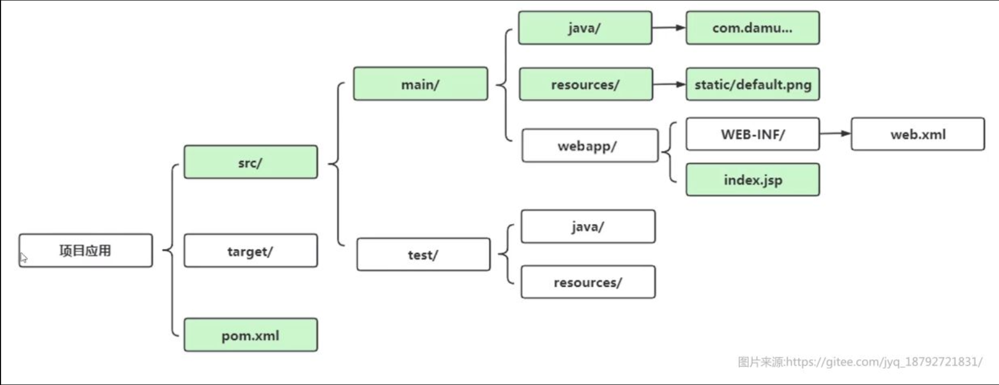

## Maven1

### 简介

Maven 翻译为"专家"、"内行"，是 Apache 下的一个纯 Java 开发的开源项目。基于项目对象模型（缩写：POM）概念，Maven利用一个中央信息片断能管理一个项目的构建、报告和文档等步骤。

Maven 是一个项目管理工具，可以对 Java 项目进行构建、依赖管理。Maven 也可被用于构建和管理各种项目，例如 C#，Ruby，Scala 和其他语言编写的项目。

Maven 曾是 Jakarta 项目的子项目，现为由 Apache 软件基金会主持的独立 Apache 项目。

通过Maven，可以帮助我们做：

- 项目的自动构建，包括代码的编译、测试、打包、安装、部署等操作。
- 依赖管理，项目使用到哪些依赖，可以快速完成导入，不需要手动导入jar包。

Maven也需要安装环境，但是IDEA已经自带了Maven环境，因此我们不需要再去进行额外的环境安装。

### Maven项目结构

Maven就很好地解决了这个问题，我们可以先来看一下，一个Maven项目和我们普通的项目有什么区别：



其中src目录下存放我们的源代码和测试代码，分别位于main和test目录下

而test和main目录下又具有java、resources目录，它们分别用于存放Java源代码、静态资源（如配置文件、图片等），测试代码不会打包到项目里面，只仅用于测试。

很多JavaWeb项目可能还会用到webapp目录。

#### 核心配置 `pom.xml`

而下面的`pom.xml`则是Maven的核心配置，也是整个项目的所有依赖、插件、以及各种配置的集合，它也是使用XML格式编写的，一个标准的pom配置长这样：

```xml
<?xml version="1.0" encoding="UTF-8"?>
<project xmlns="http://maven.apache.org/POM/4.0.0"
         xmlns:xsi="http://www.w3.org/2001/XMLSchema-instance"
         xsi:schemaLocation="http://maven.apache.org/POM/4.0.0 http://maven.apache.org/xsd/maven-4.0.0.xsd">
    <modelVersion>4.0.0</modelVersion>

    <groupId>com.test</groupId>
    <artifactId>HelloWorld</artifactId>
    <version>1.0-SNAPSHOT</version>

    <properties>
        <maven.compiler.source>17</maven.compiler.source>
        <maven.compiler.target>17</maven.compiler.target>
        <project.build.sourceEncoding>UTF-8</project.build.sourceEncoding>
    </properties>

</project>
```

我们可以看到，Maven的配置文件是以`project`为根节点，而`modelVersion`定义了当前模型的版本，一般是4.0.0，我们不用去修改。

##### 项目标识

`groupId`、`artifactId`、`version`这三个元素合在一起，用于唯一区别每个项目

别人如果需要将我们编写的代码作为依赖，那么就必须通过这三个元素来定位我们的项目，我们称为一个项目的基本坐标

所有的项目一般都有自己的Maven坐标

**因此我们通过Maven导入其他的依赖只需要填写这三个基本元素就可以了，无需再下载Jar文件，而是Maven自动帮助我们下载**依赖并导入：

- `groupId` 一般用于指定组名称，命名规则一般和包名一致，比如我们这里使用的是`org.example`，一个组下面可以有很多个项目。

- `artifactId` 一般用于指定项目在当前组中的唯一名称，也就是说在组中用于区分于其他项目的标记。

- `version` 代表项目版本，随着我们项目的开发和改进，版本号也会不断更新，就像LOL一样，每次赛季更新都会有一个大版本更新，我们的Maven项目也是这样，我们可以手动指定当前项目的版本号，其他人使用我们的项目作为依赖时，也可以根本版本号进行选择（这里的SNAPSHOT代表快照，一般表示这是一个处于开发中的项目，正式发布项目一般只带版本号）

`properties`中一般都是一些变量和选项的配置，我们这里指定了JDK的源代码和编译版本为17，同时下面的源代码编码格式为UTF-8，无需进行修改。
