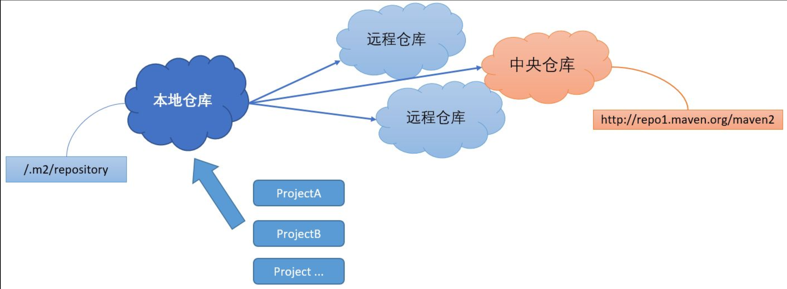

## Maven2

### Maven依赖导入

我们尝试使用Maven来帮助我们快速导入依赖，我们需要导入之前的JDBC驱动依赖、JUnit依赖、Mybatis依赖、Lombok依赖，那么如何使用Maven来管理依赖呢？

我们可以创建一个`dependencies`节点：

```xml
<dependencies>
    //里面填写的就是所有的依赖
</dependencies>
```

那么现在就可以向节点中填写依赖了，那么我们如何知道每个依赖的坐标呢？

我们可以在：<https://central.sonatype.com> 进行查询

直接搜索Lombok即可，打开后可以看到已经给我们写出了依赖的坐标：

```xml
<dependency>
    <groupId>org.projectlombok</groupId>
    <artifactId>lombok</artifactId>
    <version>1.18.36</version>
</dependency>
```

我们直接将其添加到`dependencies`节点中即可

现在我们来编写一个测试用例看看依赖导入成功了没有：

```java
public class Main {
    public static void main(String[] args) {
        Student student = new Student("小明", 18);
        System.out.println(student);
    }
}
```

```java
@Data
@AllArgsConstructor
public class Student {
    String name;
    int age;
}
```

项目运行成功，表示成功导入了依赖。

### Maven依赖管理原理

那么，Maven是如何进行依赖管理呢，以致于如此便捷的导入依赖，我们来看看Maven项目的依赖管理流程：



通过流程图我们得知，一个项目依赖一般是存储在中央仓库中，也有可能存储在一些其他的远程仓库（可以自行搭建私服）

几乎所有的依赖都被放到了中央仓库中，因此，Maven可以直接从中央仓库中下载大部分的依赖（因此Maven**第一次导入依赖是需要联网**的，否则无法下载）

远程仓库中下载之后 ，会暂时存储在本地仓库，我们会发现我们本地存在一个`.m2`文件夹，这就是Maven本地仓库文件夹，**默认建立在C盘**，如果你C盘空间不足，会出现问题。

在下次导入依赖时，如果Maven发现**本地仓库中就已经存在某个依赖，那么就不会再去远程仓库下载了**。

#### 修改国内镜像源

**注意：** 因为中心仓库服务器位于国外，下载速度缓慢，可能在导入依赖时会出现卡顿等问题，我们需要使用国内的镜像仓库服务器来加速访问（镜像仓库与中心仓库自动同步所有依赖，访问速度更快）有两种方式配置：

1. 可以配置IDEA自带的Maven插件远程仓库镜像地址，我们打开IDEA的安装目录，找到`安装根目录/plugins/maven/lib/maven3/conf`文件夹，找到`settings.xml`文件，打开编辑，找到mirros标签，添加以下内容：

   ```xml
   <mirror>
     <id>aliyunmaven</id>
     <mirrorOf>central</mirrorOf>
     <name>阿里云公共仓库</name>
     <url>https://maven.aliyun.com/repository/public</url>
   </mirror>
   ```

2. 自行前往Maven官网并下载最新版的Maven安装，然后将IDEA的Maven配置为我们自行安装的位置（好处是IDEA更新后不需要重新配置）可以一直使用，镜像配置方式同第1步。

这样，我们就将默认的远程仓库地址（国外），配置为国内的阿里云仓库地址了（依赖的下载速度就会快起来了）
