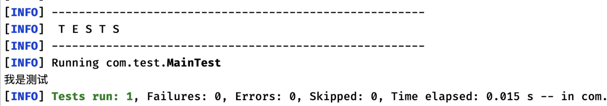
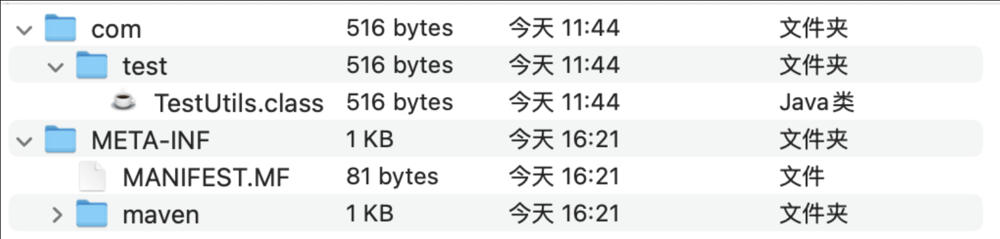

## Maven5 - 继承、多模块 + 测试和打包

### Maven继承和多模块

#### 继承

**一个Maven项目可以继承自另一个Maven项目**

比如多个子项目都需要父项目的依赖，我们就可以使用继承关系来快速配置。

在我们学习到SpringBoot或是SpringCloud开发时，很多项目往往都会采用这种**多模块子项目**的形式的去编写，来更加合理地对项目中代码进行职责划分。

(在一个项目内部在创建一个项目就行)
要创建一个子项目非常简单，我们只需右键左侧栏，新建模块，来创建一个子项目：

```xml
<?xml version="1.0" encoding="UTF-8"?>
<project xmlns="http://maven.apache.org/POM/4.0.0"
         xmlns:xsi="http://www.w3.org/2001/XMLSchema-instance"
         xsi:schemaLocation="http://maven.apache.org/POM/4.0.0 http://maven.apache.org/xsd/maven-4.0.0.xsd">
    <parent>
        <artifactId>MavenTest</artifactId>
        <groupId>org.example</groupId>
        <version>1.0-SNAPSHOT</version>
    </parent>
    <modelVersion>4.0.0</modelVersion>

    <artifactId>ChildModel</artifactId>

    <properties>
        <maven.compiler.source>17</maven.compiler.source>
        <maven.compiler.target>17</maven.compiler.target>
    </properties>

</project>
```

我们可以看到，IDEA默认给我们添加了一个`parent`节点，表示此Maven项目是父Maven项目的子项目

子项目直接继承父项目的`groupId`，子项目会继承父项目的所有依赖，我们来编写一个测试用例尝试一下:

```java
import lombok.extern.java.Log;

@Log
public class Main {
    public static void main(String[] args) {
        log.info("我是日志信息");
    }
}
```

可以看到，子项目也成功继承了Lombok依赖。

#### 多模块 `dependencyManagement`

我们还可以让父Maven项目**统一管理所有的依赖，包括版本号等**，子项目可以选取需要的作为依赖，而版本全由父项目管理

我们可以将`dependencies`全部放入`dependencyManagement`节点，这样父项目就完全作为依赖统一管理。

```xml
<dependencyManagement>
    <dependencies>
        <dependency>
            <groupId>org.projectlombok</groupId>
            <artifactId>lombok</artifactId>
            <version>1.18.22</version>
            <scope>provided</scope>
        </dependency>
        <dependency>
            <groupId>org.junit.jupiter</groupId>
            <artifactId>junit-jupiter</artifactId>
            <version>5.8.1</version>
            <scope>test</scope>
        </dependency>
        <dependency>
            <groupId>mysql</groupId>
            <artifactId>mysql-connector-java</artifactId>
            <version>8.0.27</version>
        </dependency>
        <dependency>
            <groupId>org.mybatis</groupId>
            <artifactId>mybatis</artifactId>
            <version>3.5.7</version>
        </dependency>
    </dependencies>
</dependencyManagement>
```

我们发现，子项目的依赖失效了，因为现在父项目没有依赖，而是将所有的依赖进行集中管理，**子项目需要什么再拿什么即可**，同时子项目无需指定版本，**所有的版本全部由父项目决定**，子项目只需要使用即可：

```xml
<dependencies>
    <dependency>
        <groupId>org.projectlombok</groupId>
        <artifactId>lombok</artifactId>
        <scope>provided</scope>
    </dependency>
</dependencies>
```

当然，**父项目如果还存在dependencies节点的话，里面的内依赖依然是直接继承**：

```xml
<dependencies>
    <dependency>
        <groupId>org.junit.jupiter</groupId>
        <artifactId>junit-jupiter</artifactId>
        <version>5.8.1</version>
        <scope>test</scope>
    </dependency>
</dependencies>

<dependencyManagement>
    <dependencies>
      ...
```

### Maven测试和打包

我们可以看到在IDEA右上角Maven板块中，每个Maven项目都有一个**生命周期**

实际上这些是Maven的一些插件，每个插件都有各自的功能，比如：

- `clean`命令，执行后会清理整个`target`文件夹，在之后编写Springboot项目时可以解决一些缓存没更新的问题。
  
- `validate`命令可以验证项目的可用性。

- `compile`命令可以将项目编译为.class文件。

- `install`命令可以将当前项目安装到本地仓库，以供其他项目导入作为依赖使用

- `verify`命令可以按顺序执行每个默认生命周期阶段（`validate`，`compile`，`package`等）

所有的命令在执行完成之后都会显示BUILD SUCCESS，否则就是在执行过程中出现了什么错误。

#### `test` 命令

除了上述介绍的几种命令外，我们还可以通过使用`test`命令，一键测试所有位于test目录下的测试案例，但是请注意默认的`test`命令有以下要求：

- 测试类的名称必须是以`Test`结尾，比如`MainTest`
- 测试方法上必须标注`@Test`注解或是其他标记JUnit测试案例的注解

```java
public class MainTest {

    @Test
    public void test() {
        System.out.println("我是测试");
    }
}
```



#### `package` 命令

我们接着来看`package`命令，它用于**将我们的项目打包为jar文件**，以供其他项目作为依赖引入，或是作为一个可执行的Java应用程序运行。

我们可以直接点击`package`来进行打包操作。

注意，在使用`package`命令打包之前也会自动执行一次`test`命令，来保证项目能够正常运行，当测试出现问题时，打包将无法完成，我们也可以手动跳过

选择`执行Maven目标`来手动执行Maven命令，输入`mvn package -Dmaven.test.skip=true`来以跳过测试的方式进行打包。

接着在target目录下会出现我们打包完成的jar包，在JavaSE中我们就给大家介绍过

一个jar包实际上就是**对我们生成的字节码文件进行的压缩打包**，因此，我们也可以使用常见的压缩工具打开jar包查看其内部文件。



此时jar包中已经包含了我们项目中编写的类了，可以直接被其他项目导入使用。

#### 打包成可执行文件 `maven-assembly-plugin`

当然，以上方式存在一定的问题，比如这里并没有包含项目中用到的一些其他依赖，如果我们需要打包一个可执行文件，那么我不仅需要将自己编写的类打包到Jar中，同时还需要将依赖也一并打包到Jar中，因为我们使用了别人为我们提供的框架，自然也需要运行别人的代码，我们需要使用另一个插件来实现一起打包：

```xml
<build>
    <plugins>
        <plugin>
            <artifactId>maven-assembly-plugin</artifactId>
            <version>3.1.0</version>
            <configuration>
                <descriptorRefs>
                    <descriptorRef>jar-with-dependencies</descriptorRef>
                </descriptorRefs>
                <archive>
                    <manifest>
                        <addClasspath>true</addClasspath>
                        <mainClass>com.test.Main</mainClass>
                    </manifest>
                </archive>
            </configuration>
            <executions>
                <execution>
                    <id>make-assembly</id>
                    <phase>package</phase>
                    <goals>
                        <goal>single</goal>
                    </goals>
                </execution>
            </executions>
        </plugin>
    </plugins>
</build>
```

导入插件后，我们可以重新进行一次打包任务，等待打包完成即可得到我们的Jar文件，此时会出现两个文件

其中一个是之前的正常打包得到的jar文件，还有一个就是包含了所有依赖以及配置了主类的jar文件。

我们只需要执行`java -jar`命令即可运行打包好的Java程序

#### 多模块测试打包

对父项目执行的任何操作除了作用于本身，还会作用于他的所有子项目。

多模块下父项目存在一个`packing`打包类型标签，所有的父级项目的`packing`都为`pom` (此时父项目不会打包成 `jar`)

```xml
<packaging>pom</packaging>
```

`packing`默认是`jar`类型，如果不作配置，maven会将该项目打成jar包：

作为父级项目，还有一个重要的属性，那就是modules，通过modules标签将项目的所有子项目引用进来，在`build`父级项目时，会根据子模块的相互依赖关系整理一个`build`顺序，然后依次`build`直到所有任务都完成。
