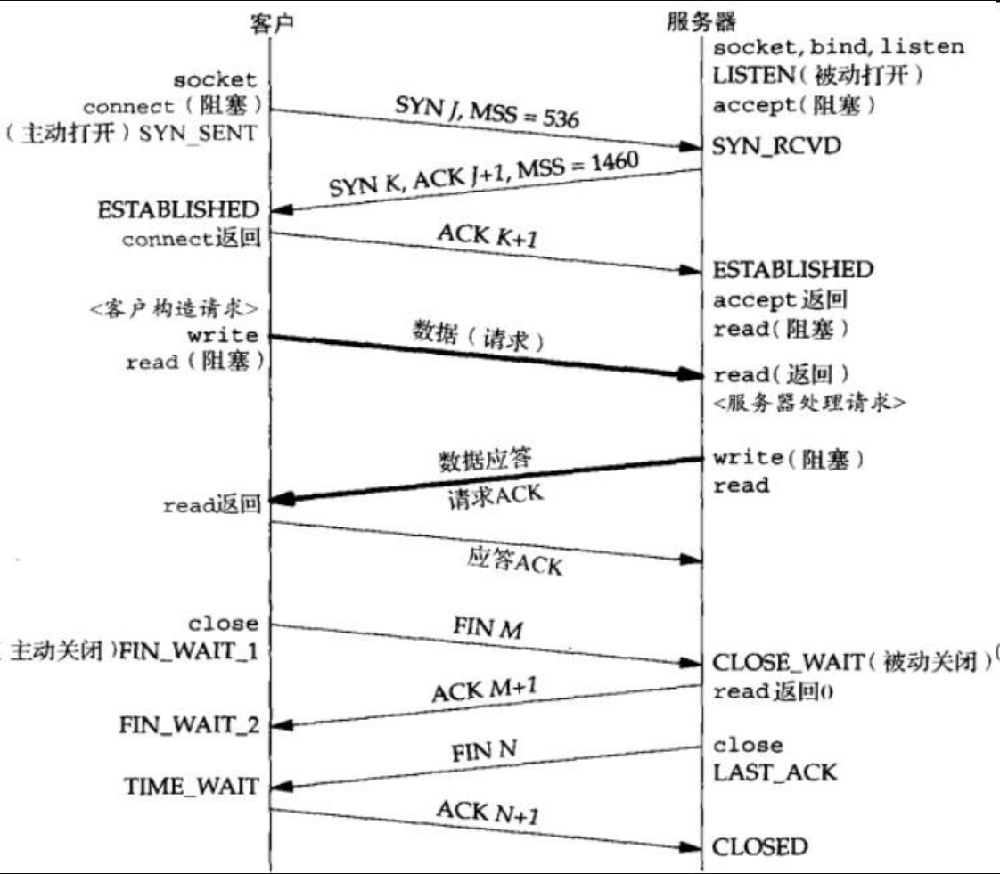
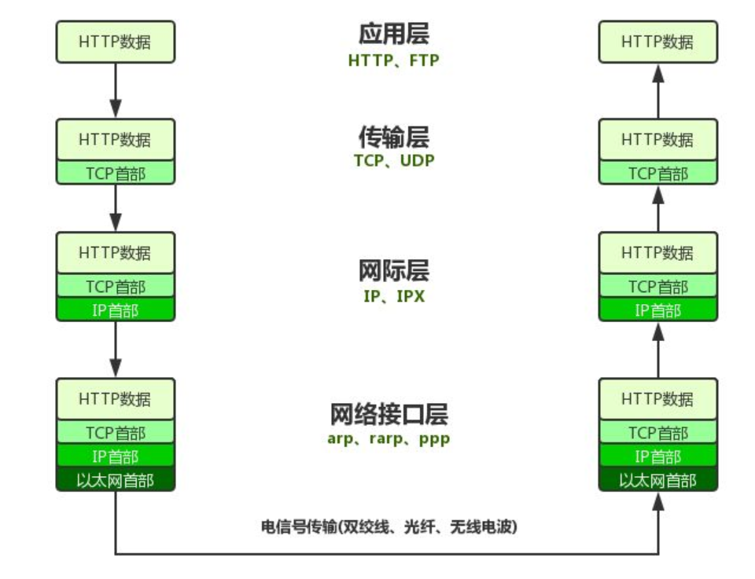
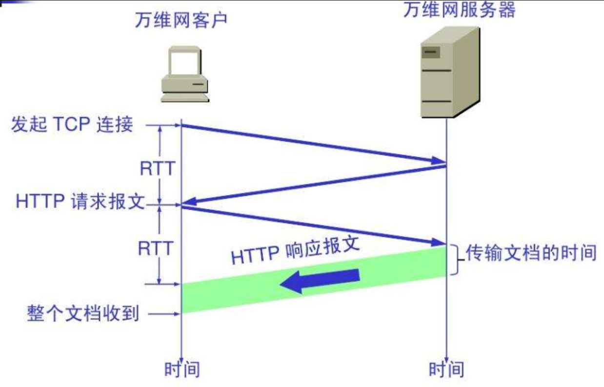
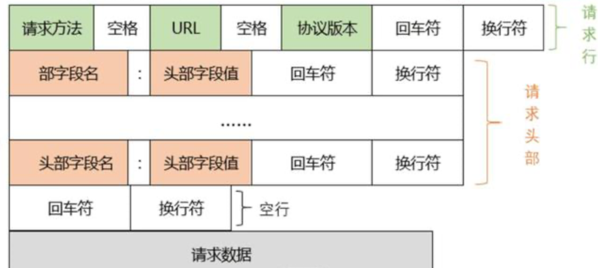

## 网络基础1

在计算机网络（谢希仁 第七版 第264页）中，是这样描述万维网的：

> 万维网（World Wide Web）并非是某种特殊的计算机网络，万维网是一个大规模的联机式信息储藏所，英文简称`Web`，万维网用**链接**的方法，能够非常方便地从互联网上的一个站点访问另一个站点，从而主动地按需求获取丰富的信息。
> 万维网以客户服务器的方式工作，浏览器就是安装在用户主机上的万维网客户程序，万维网文档所驻留的主机则运行服务器程序，因此这台主机也称为万维网服务器。**客户程序向服务器程序发出请求，服务器程序向客户程序送回客户所要的万维网文档**，在一个客户程序主窗口上显示出的万维网文档称为页面。

URL的格式为：

> <协议>://<主机>:<端口>/<路径>
>
> 协议是指采用什么协议来访问服务器，不同的协议决定了服务器返回信息的格式，我们一般使用HTTP协议。
>
> 主机可以是一个域名，也可以是一个IP地址（实际上域名最后会被解析为IP地址进行访问）
>
> 端口是当前服务器上Web应用程序开启的端口，我们前面学习TCP通信的时候已经介绍过了，HTTP协议默认使用80端口，因此有时候可以省略。
>
> 路径就是我们希望去访问此服务器上的某个文件，不同的路径代表访问不同的资源。

接着了解一下什么是HTTP协议：

> HTTP是面向事务的应用层协议，它是万维网上能够可靠交换文件的重要基础。HTTP不仅传送完成超文本跳转所需的必须信息，而且也传送任何可从互联网上得到的信息，如文本、超文本、声音和图像。

HTTP的传输原理：

> HTTP使用了面向连接的TCP作为运输层协议，保证了数据的可靠传输。HTTP不必考虑数据在传输过程中被丢弃后又怎样被重传。但是HTTP协议本身是无连接的。也就是说，HTTP虽然使用了TCP连接，但是通信的双方在交换HTTP报文之前不需要先建立HTTP连接。1997年以前使用的是HTTP/1.0协议，之后就是HTTP/1.1协议了。

HTTP是基于TCP进行通信的，我们首先来回顾一下TCP的通信原理：

TCP协议实际上是经历了三次握手再进行通信，也就是说保证整个通信是稳定的，才可以进行数据交换，并且在连接已经建立的过程中，双方随时可以互相发送数据，直到有一方主动关闭连接，这时在进行四次挥手，完成整个TCP通信。

而HTTP和TCP并不是一个层次的通信协议，TCP是传输层协议，而HTTP是应用层协议，因此，实际上HTTP的内容会作为TCP协议的报文被封装，并继续向下一层进行传递，而传输到客户端时，会依次进行解包，还原为最开始的HTTP数据。

HTTP使用TCP协议是为了使得数据传输更加可靠，既然它是依靠TCP协议进行数据传输，那么为什么说它本身是无连接的呢？

我们来看一下HTTP的传输过程：

> 用户在点击鼠标链接某个万维网文档时，HTTP协议首先要和服务器建立TCP连接。这需要使用三报文握手。
> 当建立TCP连接的三报文握手的前两部分完成后（即经过了一个RTT时间后），万维网客户就把**HTTP请求报文作为建立TCP连接的三报文握手中的第三个报文的数据，发送给万维网服务器**。
> 服务器收到HTTP请求报文后，就把所请求的文档作为响应报文返回给客户。

因此，我们的浏览器请求一个页面，需要两倍的往返时间。

最后，我们再来了解一下HTTP的报文结构：

由客户端向服务端发送是报文称为请求报文，而服务端返回给客户端的称为响应报文，实际上，整个报文全部是以文本形式发送的，通过使用空格和换行来完成分段。
