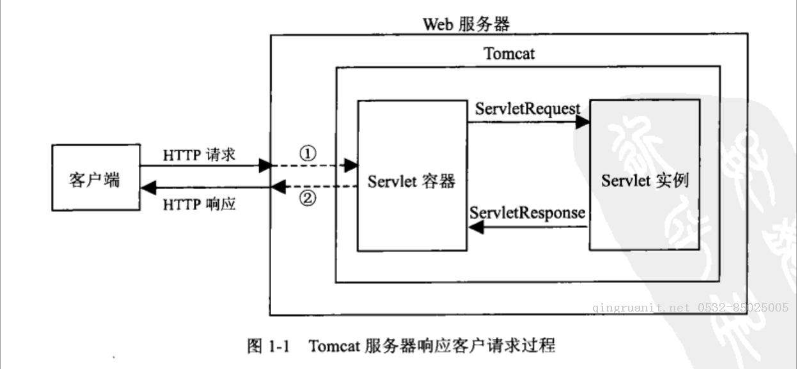

## 网络基础3

### Servlet

Servlet 是 Java EE的一个标准，大部分的Web服务器都支持此标准，包括Tomcat，就像之前的JDBC一样，由官方定义了一系列接口，而具体实现由我们来编写，最后交给Web服务器（如Tomcat）来运行我们编写的 Servlet。

我们可以通过实现 Servlet 来进行动态网页响应，使用Servlet，不再是直接由Tomcat 服务器发送我们编写好的静态网页内容（HTML文件），而是由我们通过Java 代码进行动态拼接的结果，它能够很好地实现动态网页的返回。

当然，Servlet并不是专用于HTTP协议通信，也可以用于其他的通信，但是一般都是用于 HTTP。

#### 创建Servlet

那么如何创建一个Servlet呢，非常简单，我们只需要实现`Servlet`类即可，并添加注解`@WebServlet`来进行注册。

```java
@WebServlet("/test")
public class TestServlet implements Servlet {
    @Override
    public void init(ServletConfig servletConfig) throws ServletException {
        
    }

    @Override
    public ServletConfig getServletConfig() {
        return null;
    }

    @Override
    public void service(ServletRequest servletRequest, ServletResponse servletResponse) throws ServletException, IOException {

    }

    @Override
    public String getServletInfo() {
        return "";
    }

    @Override
    public void destroy() {

    }
}
```

除了直接编写一个类，我们也可以在`web.xml`中进行注册，现将类上`@WebServlet`的注解去掉：

```xml
<servlet>
    <servlet-name>test</servlet-name>
    <servlet-class>com.example.webtest.TestServlet</servlet-class>
</servlet>
<servlet-mapping>
    <servlet-name>test</servlet-name>
    <url-pattern>/test</url-pattern>
</servlet-mapping>
```

这样的方式也能注册Servlet，但是显然直接使用注解更加方便，因此之后我们一律使用注解进行开发。只有比较新的版本才支持此注解，老的版本是不支持的哦。

实际上，Tomcat服务器会为我们提供一些默认的Servlet，也就是说在服务器启动后，即使我们什么都不编写，Tomcat也自带了几个默认的Servlet，他们编写在conf目录下的web.xml中：

```xml
<!-- The mapping for the default servlet -->
    <servlet-mapping>
        <servlet-name>default</servlet-name>
        <url-pattern>/</url-pattern>
    </servlet-mapping>

    <!-- The mappings for the JSP servlet -->
    <servlet-mapping>
        <servlet-name>jsp</servlet-name>
        <url-pattern>*.jsp</url-pattern>
        <url-pattern>*.jspx</url-pattern>
    </servlet-mapping>

```

我们发现，默认的Servlet实际上可以帮助我们去访问一些静态资源，这也是为什么我们启动Tomcat服务器之后，能够直接访问webapp目录下的静态页面。

我们可以将之前编写的页面放入到webapp目录下，来测试一下是否能直接访问。

### Servlet 的生命周期

我们可以多次尝试去访问此页面，但是init和构造方法只会执行一次，而每次访问都会执行的是`service`方法，因此，一个Servlet的生命周期为：

- 首先执行**构造方法**完成 Servlet 初始化
- Servlet 初始化后调用 **init ()** 方法。
- Servlet 调用 **service()** 方法来处理客户端的请求。
- Servlet 销毁前调用 **destroy()** 方法。
- 最后，Servlet 是由 JVM 的垃圾回收器进行垃圾回收的。

现在我们发现，实际上在Web应用程序运行时，每当浏览器向服务器发起一个请求时，都会创建一个线程执行一次`service`方法，来让我们处理用户的请求，并将结果响应给用户。

#### `service` 方法

每次访问对应的 url 时，都会单独创建一个线程来处理执行 `sevice` 函数。

在 `service` 方法 中，还有两个参数，`ServletRequest`和`ServletResponse`

实际上，用户发起的HTTP请求，就被Tomcat服务器封装为了一个`ServletRequest`对象，我们得到是其实是Tomcat服务器帮助我们创建的一个实现类，我们可以从 `ServletRequest` 获取所有的请求内容。

HTTP请求报文中的所有内容，都可以从`ServletRequest`对象中获取，同理，`ServletResponse`就是我们需要返回给浏览器的HTTP响应报文实体类封装。

##### `ServletRequest` 内容

对应用户发起的请求信息，我们可以获取请求的一些信息：

```java
@Override
public void service(ServletRequest servletRequest, ServletResponse servletResponse) throws ServletException, IOException {
    //首先将其转换为HttpServletRequest（继承自ServletRequest，一般是此接口实现）
        HttpServletRequest request = (HttpServletRequest) servletRequest;
        
        System.out.println(request.getProtocol());  
        //获取协议版本
        System.out.println(request.getRemoteAddr());  
        //获取访问者的IP地址
        System.out.println(request.getMethod());   
        //获取请求方法
        //获取头部信息
        Enumeration<String> enumeration = request.getHeaderNames();
        while (enumeration.hasMoreElements()){
            String name = enumeration.nextElement();
            System.out.println(name + ": " + request.getHeader(name));
        }
}
```

我们发现，整个HTTP请求报文中的所有内容，都可以通过`HttpServletRequest`对象来获取，当然，它的作用肯定不仅仅是获取头部信息，我们还可以使用它来完成更多操作，后面会一一讲解。

##### `ServletResponse` 内容

用来传回信息给用户

再来看看`ServletResponse`，这个是**服务端的响应内容**，我们可以在这里填写我们想要发送给浏览器显示的内容：

```java
//转换为HttpServletResponse（同上）
HttpServletResponse response = (HttpServletResponse) servletResponse;
//设定内容类型以及编码格式（普通HTML文本使用text/html，之后会讲解文件传输）
response.setHeader("Content-type", "text/html;charset=UTF-8");
//获取Writer直接写入内容
response.getWriter().write("我是响应内容！");
//所有内容写入完成之后，再发送给浏览器
```

现在我们在浏览器中打开此页面，就能够收到服务器发来的响应内容了。其中，响应头部分，是由Tomcat帮助我们生成的一个默认响应头。



首先 tomcat 里面有许多 servlet 容器，客户端会请求对应的容器中的某些资源或者实例，如果该容器找到了对应的需要的实例就会采用该服务然后返回

### `HttpServlet`

首先`Servlet`有一个直接实现抽象类`GenericServlet`

这个类完善了配置文件读取和Servlet信息相关的的操作，但是依然没有去实现`service`方法，因此此类仅仅是用于完善一个Servlet的基本操作

接着来看`HttpServlet`，它是遵循HTTP协议的一种Servlet，继承自`GenericServlet`，它根据HTTP协议的规则，完善了service方法。

对应的 `service` 方法，先看对应请求是否支持Http协议的实现，是的话进行转化 `HttpServletRequest` 以及 `HttpServletResponse`，然后去 `this.service` 来实现具体对应方法的请求，我们只需要重写这些具体方法就行

```java
public void service(ServletRequest req, ServletResponse res) throws ServletException, IOException {
    if (req instanceof HttpServletRequest && res instanceof HttpServletResponse) {
        HttpServletRequest request = (HttpServletRequest)req;
        HttpServletResponse response = (HttpServletResponse)res;
        this.service(request, response);
    } else {
        throw new ServletException("non-HTTP request or response");
    }
}

protected void service(HttpServletRequest req, HttpServletResponse resp) throws ServletException, IOException {
    String method = req.getMethod();
    if (method.equals("GET")) {
        long lastModified = this.getLastModified(req);
        if (lastModified == -1L) {
            this.doGet(req, resp);
        } else {
            long ifModifiedSince = req.getDateHeader("If-Modified-Since");
            if (ifModifiedSince < lastModified) {
                this.maybeSetLastModified(resp, lastModified);
                this.doGet(req, resp);
            } else {
                resp.setStatus(304);
            }
        }
    } else if (method.equals("HEAD")) {
        long lastModified = this.getLastModified(req);
        this.maybeSetLastModified(resp, lastModified);
        this.doHead(req, resp);
    } else if (method.equals("POST")) {
        this.doPost(req, resp);
    } else if (method.equals("PUT")) {
        this.doPut(req, resp);
    } else if (method.equals("DELETE")) {
        this.doDelete(req, resp);
    } else if (method.equals("OPTIONS")) {
        this.doOptions(req, resp);
    } else if (method.equals("TRACE")) {
        this.doTrace(req, resp);
    } else if (method.equals("PATCH")) {
        this.doPatch(req, resp);
    } else {
        String errMsg = lStrings.getString("http.method_not_implemented");
        Object[] errArgs = new Object[1];
        errArgs[0] = method;
        errMsg = MessageFormat.format(errMsg, errArgs);
        resp.sendError(501, errMsg);
    }
}
```

在阅读了HttpServlet源码之后，我们发现，其实我们只需要继承HttpServlet来编写我们的Servlet就可以了，并且它已经帮助我们提前实现了一些操作，这样就会给我们省去很多的时间。

在 `HttpServlet` 源码中已经配置好了对应的 `Get`, `Post`, `Put` 等操作函数和代码，只不过并没有写具体操作，如果直接调用是默认提示没有支持该方法的

以 `doGet` 为例

在 `HttpServlet` 源码中

```java
protected void doGet(HttpServletRequest req, HttpServletResponse resp) throws ServletException, IOException {
    String protocol = req.getProtocol();
    String msg = lStrings.getString("http.method_get_not_supported");
    resp.sendError(this.getMethodNotSupportedCode(protocol), msg);
}
```

显然表示此时不支持，现在，我们只需要在对应的 `Servlet` 中重写对应的请求方式，就可以快速完成Servlet的编写。

```java
@Log
@WebServlet("/test")
public class TestServlet extends HttpServlet {

    @Override
    protected void doGet(HttpServletRequest req, HttpServletResponse resp) throws ServletException, IOException {
        resp.setContentType("text/html;charset=UTF-8");
        resp.getWriter().write("<h1>恭喜你解锁了全新玩法</h1>");
    }
}
```

### @WebServlet注解详解

我们接着来看WebServlet注解，我们前面已经得知，可以直接使用此注解来快速注册一个Servlet，那么我们来想细看看此注解还有什么其他的玩法。

#### 不同路径配置

首先name属性就是Servlet名称，而urlPatterns和value实际上是同样功能，就是代表当前Servlet的访问路径，**它不仅仅可以是一个固定值，还可以进行通配符匹配**：

```java
@WebServlet("/test/*")
```

上面的路径表示，所有匹配`/test/随便什么`的路径名称，都可以访问此Servlet，我们可以在浏览器中尝试一下。

也可以进行某个扩展名称的匹配：

```java
@WebServlet("*.js")
```

这样的话，获取任何以js结尾的文件，都会由我们自己定义的Servlet处理。

#### 替换默认路径

那么如果我们的路径为`/`呢？

```java
@WebServlet("/")
```

此路径和Tomcat默认为我们提供的Servlet冲突，**会直接替换掉默认的**，而使用我们的

此路径的意思为，**如果没有找到匹配当前访问路径的Servlet，那么就会使用此Servlet进行处理**。

#### 配置多个访问路径

我们还可以为一个Servlet配置多个访问路径：

```java
@WebServlet({"/test1", "/test2"})
```

#### `loadOnStartup` 属性

我们接着来看loadOnStartup属性，此属性决定了是否在Tomcat启动时就加载此Servlet

默认情况下，Servlet只有在被访问时才会加载，它的默认值为-1，表示不在启动时加载，我们可以将其修改为大于等于0的数，来开启启动时加载。并且数字的大小决定了此Servlet的启动优先级。

```java
@Log
@WebServlet(value = "/test", loadOnStartup = 1)
public class TestServlet extends HttpServlet {

    @Override
    public void init() throws ServletException {
        super.init();
        log.info("我被初始化了！");
    }

    @Override
    protected void doGet(HttpServletRequest req, HttpServletResponse resp) throws ServletException, IOException {
        resp.setContentType("text/html;charset=UTF-8");
        resp.getWriter().write("<h1>恭喜你解锁了全新玩法</h1>");
    }
}
```
