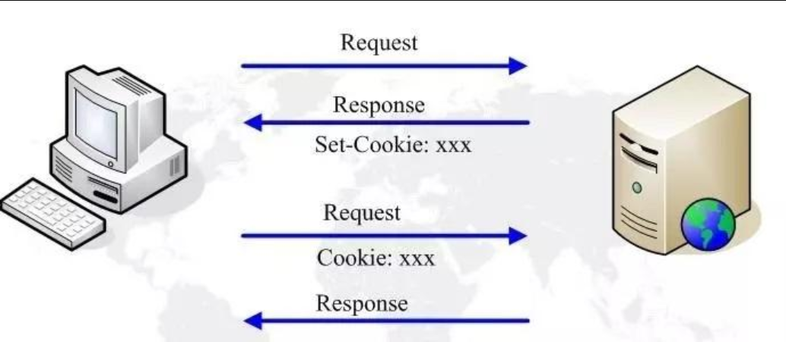
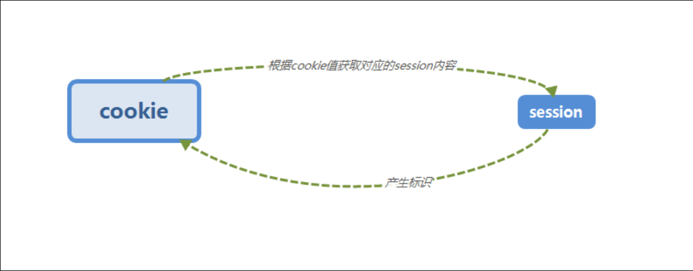

## Cookie

Cookie, 可以在浏览器中保存一些信息，并且在下次请求时，请求头中会携带这些信息。

### 简单使用

在服务器端发送 Cookie 的请求头

```java
Cookie cookie = new Cookie("test", "yyds");
resp.addCookie(cookie);
resp.sendRedirect("time");
```

对应的服务器响应头就会包含 `Set-Cookie`：

```
HTTP/1.1 302
Set-Cookie: test=123
Location: time
Content-Type: text/html;charset=UTF-8
Content-Length: 0
Date: Thu, 24 Jul 2025 07:09:50 GMT
Keep-Alive: timeout=20
Connection: keep-alive
```

之后网页收到服务器的响应请求后就会存储对应 `Cookie` 在本地, 当满足条件时，网页发送的请求就会携带所有的 `Cookie`, 服务器端可以进行获取

```java
for (Cookie cookie : req.getCookies()) {
    System.out.println(cookie.getName() + ": " + cookie.getValue());
}
```

对应的用户请求头就会包含 `Cookie`

```
GET /WebTest_war_exploded/time HTTP/1.1
Accept: text/html,application/xhtml+xml,application/xml;q=0.9,image/avif,image/webp,image/apng,*/*;q=0.8,application/signed-exchange;v=b3;q=0.7
Accept-Encoding: gzip, deflate, br, zstd
Accept-Language: zh-CN,zh;q=0.9,en;q=0.8,en-GB;q=0.7,en-US;q=0.6
Cache-Control: max-age=0
Connection: keep-alive
Cookie: test=123
Host: localhost:8081
Referer: http://localhost:8081/WebTest_war_exploded/
Sec-Fetch-Dest: document
Sec-Fetch-Mode: navigate
Sec-Fetch-Site: same-origin
Sec-Fetch-User: ?1
Upgrade-Insecure-Requests: 1
User-Agent: Mozilla/5.0 (Windows NT 10.0; Win64; x64) AppleWebKit/537.36 (KHTML, like Gecko) Chrome/138.0.0.0 Safari/537.36 Edg/138.0.0.0
```



### 属性

一个Cookie包含信息：

- name   -   Cookie的名称，Cookie一旦创建，名称便不可更改
- value  -   Cookie的值，如果值为Unicode字符，需要为字符编码。如果为二进制数据，则需要使用BASE64编码
- maxAge  -  Cookie失效的时间，单位秒。如果为正数，则该Cookie在maxAge秒后失效。如果为负数，该Cookie为临时Cookie，关闭浏览器即失效，浏览器也不会以任何形式保存该Cookie。如果为0，表示删除该Cookie。
- secure  -  该Cookie是否仅被使用安全协议传输。安全协议。安全协议有HTTPS，SSL等，在网络上传输数据之前先将数据加密。默认为false。
- path  -  Cookie的使用路径。如果设置为“/sessionWeb/”，则只有contextPath为“/sessionWeb”的程序可以访问该Cookie。如果设置为“/”，则本域名下contextPath都可以访问该Cookie。注意最后一个字符必须为“/”。
- domain  -  可以访问该Cookie的域名。如果设置为“.google.com”，则所有以“google.com”结尾的域名都可以访问该Cookie。注意第一个字符必须为“.”。
- comment  -  该Cookie的用处说明，浏览器显示Cookie信息的时候显示该说明。
- version  -  Cookie使用的版本号。0表示遵循Netscape的Cookie规范，1表示遵循W3C的RFC 2109规范

我们发现，最关键的其实是`name`、`value`、`maxAge`、`domain`属性。

尝试修改一下maxAge来看看失效时间：

```java
cookie.setMaxAge(20);
```

设定为20秒，我们可以直接看到，响应头为我们设定了20秒的过期时间。20秒内访问都会携带此Cookie，而超过20秒，Cookie消失。

### 应用

可以通过使用Cookie来实现记住我功能，我们可以将用户名和密码全部保存在Cookie中

如果访问我们的首页时携带了这些Cookie，那么我们就可以直接为用户进行登陆，如果登陆成功则直接跳转到首页，如果登陆失败，则清理浏览器中的Cookie。

那么首先，我们先在前端页面的表单中添加一个勾选框：

```html
<div>
    <label>
        <input type="checkbox" placeholder="记住我" name="remember-me">
        记住我
    </label>
</div>
```

接着，我们在登陆成功时进行判断，如果用户勾选了记住我，那么就讲Cookie存储到本地：

```java
if(map.containsKey("remember-me")){   //若勾选了勾选框，那么会此表单信息
    Cookie cookie_username = new Cookie("username", username);
    cookie_username.setMaxAge(30);
    Cookie cookie_password = new Cookie("password", password);
    cookie_password.setMaxAge(30);
    resp.addCookie(cookie_username);
    resp.addCookie(cookie_password);
}
```

然后，我们修改一下默认的请求地址，现在一律通过`http://localhost:8080/yyds/login`进行登陆，那么我们需要添加GET请求的相关处理：

```java
@Override
protected void doGet(HttpServletRequest req, HttpServletResponse resp) throws ServletException, IOException {
    Cookie[] cookies = req.getCookies();
    if(cookies != null){
        String username = null;
        String password = null;
        for (Cookie cookie : cookies) {
            if(cookie.getName().equals("username")) username = cookie.getValue();
            if(cookie.getName().equals("password")) password = cookie.getValue();
        }
        if(username != null && password != null){
            //登陆校验
            try (SqlSession sqlSession = factory.openSession(true)){
                UserMapper mapper = sqlSession.getMapper(UserMapper.class);
                User user = mapper.getUser(username, password);
                if(user != null){
                    resp.sendRedirect("time");
                    return;   //直接返回
                }
            }
        }
    }
    req.getRequestDispatcher("/").forward(req, resp);   //正常情况还是转发给默认的Servlet帮我们返回静态页面
}
```

现在，30秒内都不需要登陆，访问登陆页面后，会直接跳转到time页面。

现在已经离我们理想的页面越来越接近了，但是仍然有一个问题，就是我们的首页，无论是否登陆，所有人都可以访问，那么，如何才可以实现只有登陆之后才能访问呢？这就需要用到Session了。

## Session

`Session` 是基于 `Cookie` 设计的

由于HTTP是无连接的，所以无法辨别当前的请求是来自哪个用户发起，而 `Session` 就是用来处理这种问题的

每个用户的会话都会有一个自己的Session对象，来自同一个浏览器的所有请求，就属于同一个会话。

### 原理

Session实际上是基于Cookie实现的，它会给浏览器设定一个叫做`JSESSIONID`的Cookie，值是一个随机的排列组合，而此Cookie就对应了你属于哪一个对话，只要我们的浏览器携带此Cookie访问服务器，服务器就会通过Cookie的值进行辨别，得到对应的Session对象，因此，这样就可以追踪到底是哪一个浏览器在访问服务器。

具体内容是保存在服务器端的 `Session` 对象里，网页端只是保存了`JSESSIONID`来识别



### 应用 `session`

那么现在，我们在用户登录成功之后，将用户对象添加到Session中，只要是此用户发起的请求，我们都可以从`HttpSession`中读取到存储在会话中的数据：

在登录界面，服务端发出响应请求时，加入 `Session`:

```java
HttpSession session = req.getSession();
session.setAttribute("user", user);
```

对应用户会收到相应请求，`Set-Cookie`:

```
HTTP/1.1 302
Set-Cookie: JSESSIONID=84ABDD94FB965F266818B9DBB6172807; Path=/WebTest_war_exploded; HttpOnly
Location: time
Content-Type: text/html;charset=UTF-8
Content-Length: 0
Date: Thu, 24 Jul 2025 09:54:07 GMT
Keep-Alive: timeout=20
Connection: keep-alive
```

在主页界面(\time)，服务端处理请求时，根据 `Session` 来判断是否登录：

如果用户没有登录就去访问首页，那么我们将发送一个重定向请求，告诉用户，需要先进行登录才可以访问：

```java
HttpSession session = req.getSession();
User user = (User) session.getAttribute("user");
if(user == null) {
    resp.sendRedirect("login");
    return;
}
```

对应，用户的发送请求会携带对应的`Cookie`，包含 `JSESSIONID`

```
GET /WebTest_war_exploded/time HTTP/1.1
Accept: text/html,application/xhtml+xml,application/xml;q=0.9,image/avif,image/webp,image/apng,*/*;q=0.8,application/signed-exchange;v=b3;q=0.7
Accept-Encoding: gzip, deflate, br, zstd
Accept-Language: zh-CN,zh;q=0.9,en;q=0.8,en-GB;q=0.7,en-US;q=0.6
Cache-Control: max-age=0
Connection: keep-alive
Cookie: test=123; JSESSIONID=84ABDD94FB965F266818B9DBB6172807
Host: localhost:8081
Referer: http://localhost:8081/WebTest_war_exploded/login
Sec-Fetch-Dest: document
Sec-Fetch-Mode: navigate
Sec-Fetch-Site: same-origin
Sec-Fetch-User: ?1
Upgrade-Insecure-Requests: 1
User-Agent: Mozilla/5.0 (Windows NT 10.0; Win64; x64) AppleWebKit/537.36 (KHTML, like Gecko) Chrome/138.0.0.0 Safari/537.36 Edg/138.0.0.0
sec-ch-ua: "Not)A;Brand";v="8", "Chromium";v="138", "Microsoft Edge";v="138"
```

### `session` 配置

Session并不是永远都存在的，它有着自己的过期时间，默认时间为30分钟，若超过此时间，Session将丢失，我们可以在配置文件 `web.xml` 中修改过期时间：

```xml
<session-config>
    <session-timeout>1</session-timeout>
</session-config>
```

我们也可以在代码中使用`invalidate`方法来使Session立即失效：

```java
session.invalidate();
```

现在，通过Session，我们就可以更好地控制用户对于资源的访问，只有完成登陆的用户才有资格访问首页。
