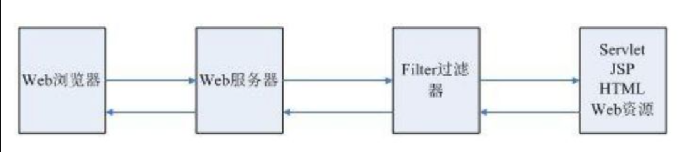
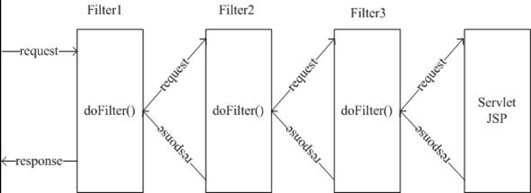
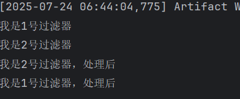
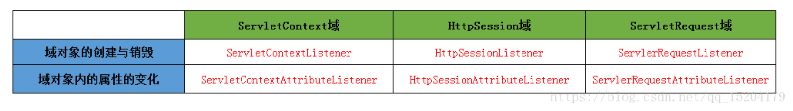

## Filter

有了Session之后，我们就可以很好地控制用户的登陆验证了，只有授权的用户，才可以访问一些页面，但是我们需要一个一个去进行配置，还是太过复杂，能否一次性地过滤掉没有登录验证的用户呢？

过滤器相当于在所有访问前加了一堵墙，来自浏览器的所有访问请求都会首先经过过滤器，只有过滤器允许通过的请求，才可以顺利地到达对应的`Servlet`

而过滤器不允许的通过的请求，我们可以自由地进行控制是否进行重定向或是请求转发。并且过滤器可以添加很多个，就相当于添加了很多堵墙，我们的请求只有穿过层层阻碍，才能与Servlet相拥，像极了爱情。



### 添加过滤器 `Filter`

添加一个过滤器非常简单，只需要实现Filter接口，并添加`@WebFilter`注解即可：

```java
@WebFilter("/*")   //路径的匹配规则和Servlet一致，这里表示匹配所有请求
public class TestFilter implements Filter {
    @Override
    public void doFilter(ServletRequest servletRequest, ServletResponse servletResponse, FilterChain filterChain) throws IOException, ServletException {
        
    }
}
```

这样我们就成功地添加了一个过滤器，那么添加一句打印语句看看，是否所有的请求都会经过此过滤器：

```java
HttpServletRequest request = (HttpServletRequest) servletRequest;
System.out.println(request.getRequestURL());
```

我们发现，现在我们发起的所有请求，一律需要经过此过滤器，并且所有的请求都没有任何的响应内容。

#### 允许请求通过 `filterChain.doFilter`

那么如何让请求可以顺利地到达对应的Servlet，也就是说怎么让这个请求顺利通过呢？我们只需要在最后添加一句：

```java
filterChain.doFilter(servletRequest, servletResponse);
```

由于我们整个应用程序可能存在多个过滤器，那么这行代码的意思实际上是将此请求继续传递给下一个过滤器，当没有下一个过滤器时，才会到达对应的Servlet进行处理，我们可以再来创建一个过滤器看看效果：

```java
@WebFilter("/*")
public class TestFilter2 implements Filter {
    @Override
    public void doFilter(ServletRequest servletRequest, ServletResponse servletResponse, FilterChain filterChain) throws IOException, ServletException {
        System.out.println("我是2号过滤器");
        filterChain.doFilter(servletRequest, servletResponse);
    }
}
```

由于过滤器的过滤顺序是按照**类名的自然排序**进行的，因此我们将第一个过滤器命名进行调整。

我们发现，在经过第一个过滤器之后，会继续前往第二个过滤器，只有两个过滤器全部经过之后，才会到达我们的Servlet中。



实际上，当`doFilter`方法调用时，就会一直向下直到Servlet，在Servlet处理完成之后，又依次返回到最前面的Filter，类似于递归的结构，我们添加几个输出语句来判断一下：

```java
@Override
public void doFilter(ServletRequest servletRequest, ServletResponse servletResponse, FilterChain filterChain) throws IOException, ServletException {
    System.out.println("我是2号过滤器");
    filterChain.doFilter(servletRequest, servletResponse);
    System.out.println("我是2号过滤器，处理后");
}
```

```java
@Override
public void doFilter(ServletRequest servletRequest, ServletResponse servletResponse, FilterChain filterChain) throws IOException, ServletException {
    System.out.println("我是1号过滤器");
    filterChain.doFilter(servletRequest, servletResponse);
    System.out.println("我是1号过滤器，处理后");
}
```

即，在 `filterChain.doFilter` 之后的语句需要等处理完，再倒回来处理



### `HttpFilter` 接口

同Servlet一样，Filter也有对应的`HttpFilter`专用类，它针对HTTP请求进行了专门处理，因此我们可以直接使用HttpFilter来编写：

```java
public abstract class HttpFilter extends GenericFilter {
    private static final long serialVersionUID = 7478463438252262094L;

    public HttpFilter() {
    }

    public void doFilter(ServletRequest req, ServletResponse res, FilterChain chain) throws IOException, ServletException {
        if (req instanceof HttpServletRequest && res instanceof HttpServletResponse) {
            this.doFilter((HttpServletRequest)req, (HttpServletResponse)res, chain);
        } else {
            throw new ServletException("non-HTTP request or response");
        }
    }

    protected void doFilter(HttpServletRequest req, HttpServletResponse res, FilterChain chain) throws IOException, ServletException {
        chain.doFilter(req, res);
    }
}
```

那么现在，我们就可以给我们的应用程序添加一个过滤器，用户在未登录情况下，只允许静态资源和登陆页面请求通过，登陆之后畅行无阻：

```java
@WebFilter("/*")
public class MainFilter extends HttpFilter {
    @Override
    protected void doFilter(HttpServletRequest req, HttpServletResponse res, FilterChain chain) throws IOException, ServletException {
        String url = req.getRequestURL().toString();
        //判断是否为静态资源
        if(!url.endsWith(".js") && !url.endsWith(".css") && !url.endsWith(".png")){
            HttpSession session = req.getSession();
            User user = (User) session.getAttribute("user");
            //判断是否未登陆
            if(user == null && !url.endsWith("login")){
                res.sendRedirect("login");
                return;
            }
        }
        //交给过滤链处理
        chain.doFilter(req, res);
    }
}
```

现在，我们的页面已经基本完善为我们想要的样子了。

## Listener

监听器并不是我们学习的重点内容，那么什么是监听器呢？

如果我们希望，在应用程序加载的时候，或是Session创建的时候，亦或是在Request对象创建的时候进行一些操作，那么这个时候，我们就可以使用监听器来实现。



默认为我们提供了很多类型的监听器，我们这里就演示一下监听Session的创建即可：

```java
@WebListener
public class TestListener implements HttpSessionListener {
    @Override
    public void sessionCreated(HttpSessionEvent se) {
        System.out.println("有一个Session被创建了");
    }
}
```
