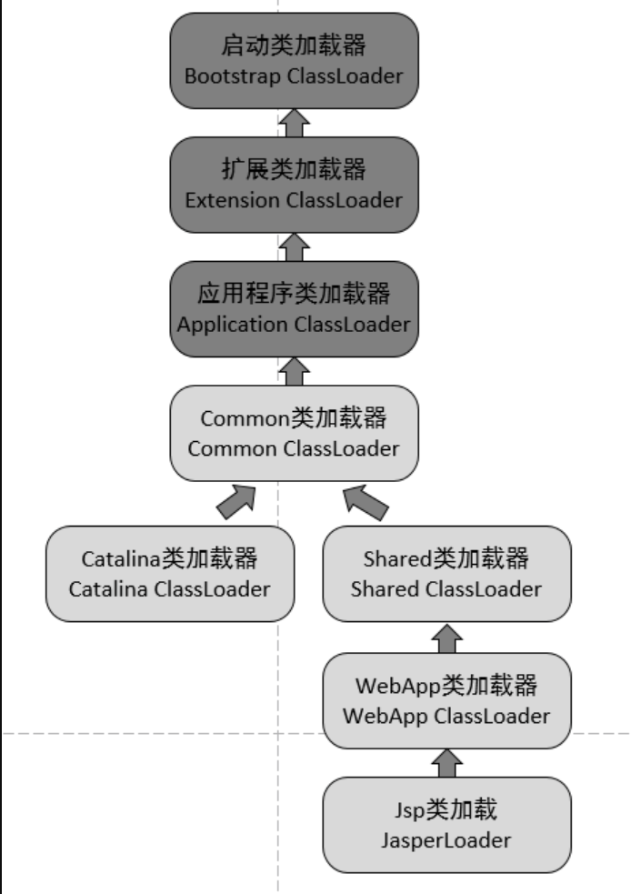
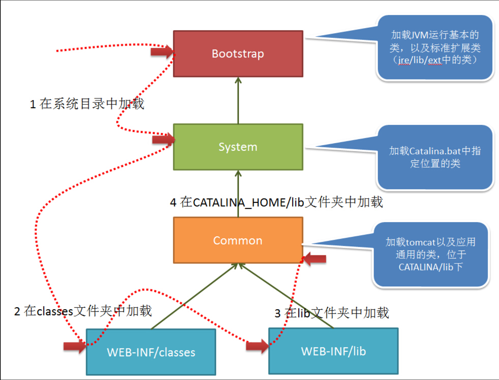

## Tomcat类加载机制

Tomcat到底是如何加载和运行我们的Web应用程序的。

Tomcat服务器既然要同时运行多个Web应用程序，那么就必须要实现不同应用程序之间的隔离

也就是说，Tomcat需要分别去加载不同应用程序的类以及依赖，还必须保证应用程序之间的类无法相互访问

而传统的类加载机制无法做到这一点，同时每个应用程序都有自己的依赖，如果两个应用程序使用了同一个版本的同一个依赖，那么还有必要去重新加载吗，带着诸多问题，Tomcat服务器编写了一套自己的类加载机制。

首先我们要知道，Tomcat本身也是一个Java程序，它要做的是去动态加载我们编写的Web应用程序中的类，而要解决以上提到的一些问题，就出现了几个新的类加载器，我们来看看各个加载器的不同之处：

- `Common ClassLoader`：Tomcat最基本的类加载器，该加载路径中的`class`可以被Tomcat容器本身以及各个Web应用程序访问。
  
- `Catalina ClassLoader`：Tomcat**容器私有的类加载器**，该加载路径中的class对于Web应用程序不可见。
  
- `Shared ClassLoader`：各个Web应用程序**共享的类加载器**，该加载路径中的class对于所有Web应用程序可见，但是对于Tomcat容器不可见。
  
- `Webapp ClassLoader`：各个Web应用程序私有的类加载器，该加载路径中的class只对**当前Web应用程序可见**，每个Web应用程序都有一个自己的类加载器，此加载器可能存在多个实例。
  
- `JasperLoader`：JSP类加载器，每个JSP文件都有一个自己的类加载器，也就是说，此加载器可能会存在多个实例。

通过这样进行划分，就很好地解决了我们上面所提到的问题，但是我们发现，这样的类加载机制，破坏了JDK的`双亲委派机制`（即每当一个类加载器接收到加载请求时，它会先将请求转发给父类加载器。在父类加载器没有找到所请求的类的情况下，该类加载器才会尝试去加载。）

比如`Webapp ClassLoader`，它只加载自己的class文件，它没有将类交给父类加载器进行加载，也就是说，我们可以随意创建和JDK同包同名的类，岂不是就出问题了？

难道Tomcat的开发团队没有考虑到这个问题吗？

实际上，WebAppClassLoader的加载机制是这样的：

`WebAppClassLoader` 加载类的时候，绕开了 `AppClassLoader`，直接先使用 `ExtClassLoader` 来加载类。

这样的话，如果定义了同包同名的类，就不会被加载，而如果是自己定义 的类，由于该类并不是JDK内部或是扩展类，所有不会被加载，而是再次回到`WebAppClassLoader`进行加载，如果还失败，再使用`AppClassloader`进行加载。
