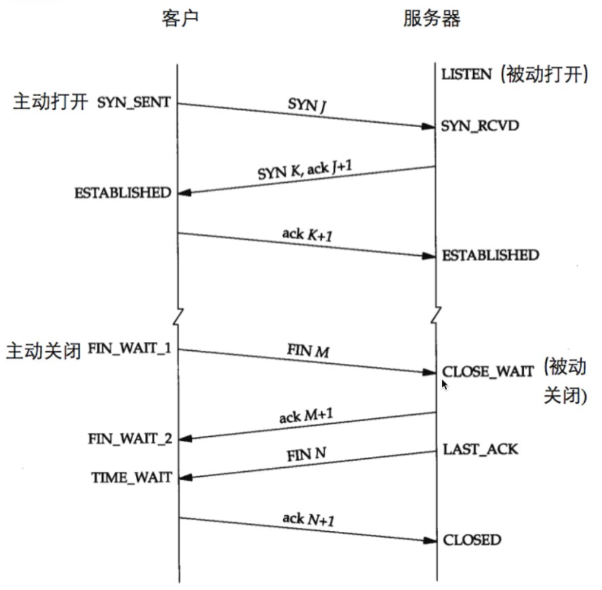
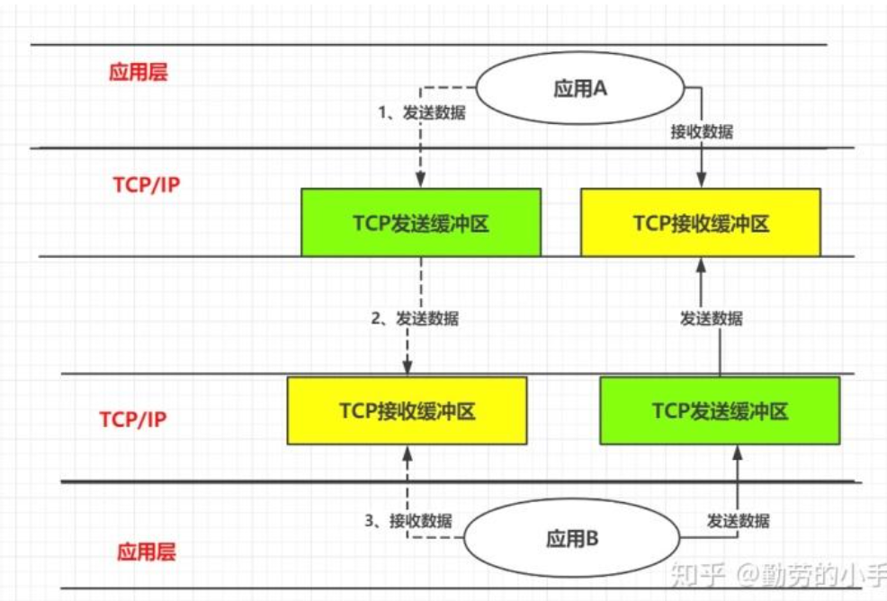

## Socket

通过Socket技术（它是计算机之间进行通信的一种约定或一种方式），我们就可以实现两台计算机之间的通信，Socket也被翻译为套接字，是操作系统底层提供的一项通信技术，它支持TCP和UDP。而Java就对socket底层支持进行了一套完整的封装，我们可以通过Java来实现Socket通信。  

### socket 连接示例

```java
//服务端
public static void main(String[] args) {
    try(ServerSocket server = new ServerSocket(8080)){    
        //将服务端创建在端口8080上
        System.out.println("正在等待客户端连接...");
        Socket socket = server.accept();  
        //当没有客户端连接时，线程会阻塞，直到有客户端连接为止
        System.out.println("客户端已连接，IP地址为："+socket.getInetAddress().getHostAddress());
        //由于继承了Autocloseble 省略 socket.close()
    }catch (IOException e){
        e.printStackTrace();
    }
}
```

```java
//客户端
public static void main(String[] args) {
    try (Socket socket = new Socket("localhost", 8080)){
        System.out.println("已连接到服务端！");
    }catch (IOException e){
        System.out.println("服务端连接失败！");
        e.printStackTrace();
    }
}
```

实际上它就是一个TCP连接的建立过程：



一旦TCP连接建立，服务端和客户端之间就可以相互发送数据，直到客户端主动关闭连接。当然，服务端不仅仅只可以让一个客户端进行连接，我们可以尝试让服务端一直运行来不断接受客户端的连接：

```java
public static void main(String[] args) {
    try(ServerSocket server = new ServerSocket(8080)){    //将服务端创建在端口8080上
        System.out.println("正在等待客户端连接...");
        while (true){   //无限循环等待客户端连接
            Socket socket = server.accept();
            System.out.println("客户端已连接，IP地址为："+socket.getInetAddress().getHostAddress());
        }
    }catch (IOException e){
        e.printStackTrace();
    }
}
```

### 使用Socket进行数据传输

通过Socket对象，我们就可以获取到对应的I/O流进行网络数据传输：

注意：

1. 如果服务端是 `Socket socket = server.accept();`  最后需要 `socket.close` 不然会报错
2. 如果接收端读取的是 `reader.readLine()`, 注意需要添加 `\n`，`writer.write(text+ "\n");`, `writer`不会主动加 `\n`
3. `OutputStream` 是把东西先到对应的流里  `InputStream` 是获取对应流的内容

```java
// Server.java
public class Server {
    public static void main(String[] args) {
        try(ServerSocket server = new ServerSocket(8080)
        ){
            System.out.println("正在等待客户端连接...");
            Socket socket = server.accept();  //当没有客户端连接时，线程会阻塞，直到有客户端连接为止
            System.out.println("客户端已连接，IP地址为："+socket.getInetAddress().getHostAddress());

            BufferedReader reader = new BufferedReader(new InputStreamReader(socket.getInputStream()));
            System.out.print("接收到客户端数据：");
            System.out.println(reader.readLine());

            //向客户端发请求
            OutputStreamWriter writer = new OutputStreamWriter(socket.getOutputStream());
            writer.write("receiver!");
            writer.flush();

            socket.close();
        } catch (IOException e) {
            throw new RuntimeException(e);
        }

    }
}
```

```java
// Client.java
public class Client {
    public static void main(String[] args) {
        try (Socket socket = new Socket("localhost", 8080);
             Scanner scanner = new Scanner(System.in);
        ){
            System.out.println("已连接到服务端！");
            OutputStream stream = socket.getOutputStream();
            OutputStreamWriter writer = new OutputStreamWriter(stream);
            System.out.println("请输入要发送给服务端的内容：");
            String text = scanner.nextLine();
            writer.write(text+ "\n");
            writer.flush();
            System.out.println("数据已发送："+text);

            BufferedReader reader = new BufferedReader(new InputStreamReader(socket.getInputStream()));
            System.out.println("收到服务器返回："+reader.readLine());

        }catch (IOException e){
            System.out.println("服务端连接失败！");
            e.printStackTrace();
        }
    }
}

```

#### 杂项

1. 我们可以手动关闭单向的流：

    ```java
    socket.shutdownOutput();  //关闭输出方向的流
    socket.shutdownInput();  //关闭输入方向的流
    ```

2. 如果我们不希望服务端等待太长的时间，我们可以通过调用`setSoTimeout()`方法来设定IO超时时间：

   ```java
    socket.setSoTimeout(3000);
   ```

    当超过设定时间都依然没有收到客户端或是服务端的数据时，会抛出异常：

    ```java
        java.net.SocketTimeoutException: Read timed out
    ```

3. 我们之前使用的都是通过构造方法直接连接服务端，那么是否可以等到我们想要的时候再去连接 `connect` 方法，调用无参构造方法不会自动连接。

    ```java
    try (Socket socket = new Socket(); 
    //调用无参构造不会自动连接
        Scanner scanner = new Scanner(System.in)){ 
        socket.connect(new InetSocketAddress("localhost", 8080), 1000);  //手动调用connect方法进行连接
    }
    ```

4. 如果连接的双方发生意外而通知不到对方，导致一方还持有连接，这样就会占用资源，因此我们可以使用`setKeepAlive()`方法来防止此类情况发生：

    ```java
    socket.setKeepAlive(true);
    ```

    当客户端连接后，如果设置了keeplive为 true，当对方没有发送任何数据过来，超过一个时间(看系统内核参数配置)，那么我们这边会发送一个ack探测包发到对方，探测双方的TCP/IP连接是否有效。

5. TCP在传输过程中，实际上会有一个缓冲区用于数据的发送和接收：
   
   此缓冲区大小为：8192，我们可以手动调整其大小来优化传输效率：

   ```java
    socket.setReceiveBufferSize(25565);   //TCP接收缓冲区
    socket.setSendBufferSize(25565);    //TCP发送缓冲区
   ```
