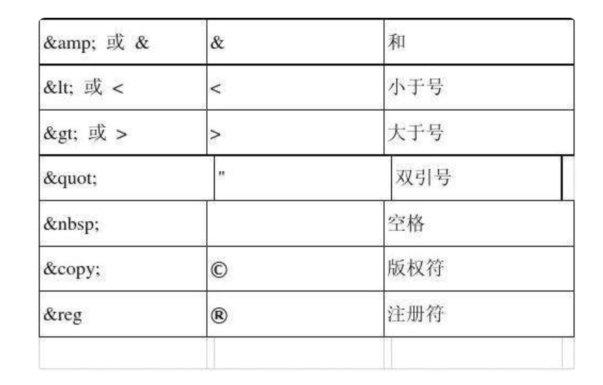

## Mybatis1

在前面JDBC的学习中，虽然我们能够通过JDBC来连接和操作数据库，但是哪怕只是完成一个SQL语句的执行，都需要编写大量的代码，更不用说如果我还需要进行实体类映射，将数据转换为我们可以直接操作的实体类型，JDBC很方便，但是还不够方便，我们需要一种更加简洁高效的方式来和数据库进行交互。

**再次强调：** 学习厉害的框架或是厉害的技术，并不是为了一定要去使用它，而是它们能够使得我们在不同的开发场景下，合理地使用这些技术，以灵活地应对需要解决的问题。


MyBatis 是一款优秀的持久层框架，它支持定制化 SQL、存储过程以及高级映射。MyBatis 避免了几乎所有的 JDBC 代码和手动设置参数以及获取结果集。MyBatis 可以使用简单的 XML 或注解来配置和映射原生信息，将接口和 Java 的 POJOs(Plain Ordinary Java Object,普通的 Java对象)映射成数据库中的记录。

### XML语言

在开始介绍Mybatis之前，XML语言发明最初是用于**数据的存储和传输**，它可以长这样：

```xml
<?xml version="1.0" encoding="UTF-8" ?>
<outer>
  <name>阿伟</name>
  <desc>怎么又在玩电动啊</desc>
  <inner type="1">
    <age>10</age>
    <sex>男</sex>
  </inner>
</outer>
```

`HTML`主要用于通过编排来展示数据，而`XML`主要是存放数据，它更像是一个配置文件！当然，浏览器也是可以直接打开`XML`文件的。

一个XML文件存在以下的格式规范：

- 必须存在一个根节点，将所有的子标签全部包含。
- 可以但不必须包含一个头部声明（主要是可以设定编码格式）
- 所有的标签必须成对出现，可以嵌套但**不能交叉嵌套**
- 区分大小写。
- 标签中可以存在属性，比如上面的`type="1"`就是`inner`标签的一个属性，属性的值由单引号或双引号包括。

XML文件也可以使用注释：

```xml
<?xml version="1.0" encoding="UTF-8" ?>
<!-- 注释内容 -->
```

通过IDEA我们可以使用`Ctrl`+`/`来快速添加注释文本（不仅仅适用于XML，还支持很多种类型的文件）

#### 转义字符



如果嫌一个一个改太麻烦，也可以使用CDATA `<![CDATA[ xxxxx ]` 来快速创建不解析区域：


```xml
<test>
    <name><![CDATA[我看你<><><>是一点都不懂哦>>>]]></name>
</test>
```

#### 解析XML文件

如何将定义好的XML文件读取到Java程序中

JDK为我们内置了一个叫做`org.w3c`的XML解析库：

```java
// 创建DocumentBuilderFactory对象
DocumentBuilderFactory factory = DocumentBuilderFactory.newInstance();
// 创建DocumentBuilder对象
try {
    DocumentBuilder builder = factory.newDocumentBuilder();
    Document d = builder.parse("file:mappers/test.xml");
    // 每一个标签都作为一个节点
    NodeList nodeList = d.getElementsByTagName("test");  
    // 可能有很多个名字为test的标签
    Node rootNode = nodeList.item(0); // 获取首个

    NodeList childNodes = rootNode.getChildNodes(); 
    // 一个节点下可能会有很多个节点，比如根节点下就囊括了所有的节点
    // 节点可以是一个带有内容的标签（它内部就还有子节点），也可以是一段文本内容

    for (int i = 0; i < childNodes.getLength(); i++) {
        Node child = childNodes.item(i);
        if(child.getNodeType() == Node.ELEMENT_NODE)  
        //过滤换行符之类的内容，因为它们都被认为是一个文本节点
        System.out.println(child.getNodeName() + "：" +child.getFirstChild().getNodeValue());
        // 输出节点名称，也就是标签名称，以及标签内部的文本
        // （内部的内容都是子节点，所以要获取内部的节点）
    }
} catch (Exception e) {
    e.printStackTrace();
}
```

当然，学习和使用XML只是为了更好地去认识`Mybatis`的工作原理，以及如何使用`XML`来作为`Mybatis`的配置文件，这是在开始之前必须要掌握的内容（使用`Java`读取XML内容不要求掌握，但是需要知道`Mybatis`就是通过这种方式来读取配置文件的）

不仅仅是`Mybatis`，包括后面的`Spring`等众多框架都会用到`XML`来作为框架的配置文件！
