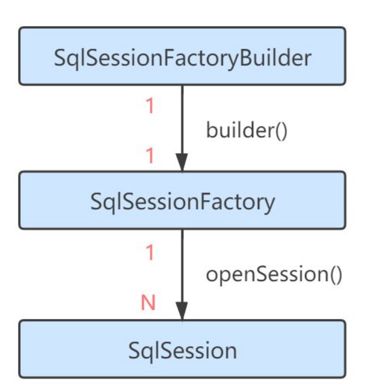

## Mybatis2

### 初次使用 Mybatis

文档网站：<https://mybatis.org/mybatis-3/zh_CN/configuration.html>

我们需要导入Mybatis的依赖，依赖导入完成后，编写`Mybatis`的配置文件(通过一个`XML`文件去配置)

按照官方文档给定的提示，在项目根目录下新建名为`mybatis-config.xml`的文件，并填写以下内容：

```xml
<?xml version="1.0" encoding="UTF-8" ?>
<!DOCTYPE configuration
  PUBLIC "-//mybatis.org//DTD Config 3.0//EN"
  "http://mybatis.org/dtd/mybatis-3-config.dtd">
<configuration>
  <environments default="development">
    <environment id="development">
      <transactionManager type="JDBC"/>
      <dataSource type="POOLED">
        <!-- 对应哪个数据库的JDBC驱动 com.mysql.cj.jdbc.Driver -->
        <property name="driver" value="${驱动类（含包名）}"/>
        <property name="url" value="${数据库连接URL}"/>
        <property name="username" value="${用户名}"/>
        <property name="password" value="${密码}"/>
      </dataSource>
    </environment>
  </environments>
</configuration>
```

我们发现，在最上方还引入了一个叫做`DTD`（文档类型定义）的东西，它提前帮助我们规定了一些标签，我们就需要使用`Mybatis`提前帮助我们规定好的标签来进行配置（因为只有这样`Mybatis`才能正确识别我们配置的内容）

通过进行配置，我们就告诉了`Mybatis`我们链接数据库的一些信息，包括URL、用户名、密码等，这样`Mybatis`就知道该链接哪个数据库、使用哪个账号进行登陆了
（也可以不使用配置文件，自行阅读官方文档）

配置文件完成后，我们需要在Java程序启动时，让Mybatis对配置文件进行读取并得到一个`SqlSessionFactory`对象：

```java
public static void main(String[] args) throws FileNotFoundException {
    String resource = "mybatis-config.xml";
    InputStream inputStream = Resources.getResourceAsStream(resource);
    SqlSessionFactory sqlSessionFactory = new SqlSessionFactoryBuilder().build(inputStream);
    try(SqlSession s = sqlSessionFactory.openSession(true)){

    }
}
```

直接运行即可，虽然没有干什么事情，但是不会出现错误，如果之前的配置文件编写错误，直接运行会产生报错！

#### `SqlSessionFactory`

那么现在我们来看看，`SqlSessionFactory`对象是什么东西：



每个基于 MyBatis 的应用都是以一个 `SqlSessionFactory` 的实例为核心的，我们可以通过`SqlSessionFactory`来创建多个新的会话 —— `SqlSession`对象，

每个会话就相当于我不同的地方登陆一个账号去访问数据库，你也可以认为这就是之前JDBC中的`Statement`对象，会话之间相互隔离，没有任何关联。

而通过`SqlSession`就可以完成几乎所有的数据库操作，我们发现这个接口中定义了大量数据库操作的方法，因此，现在我们只需要通过一个对象就能完成数据库交互了，极大简化了之前的流程。

#### 直接读取实体类

我们来尝试一下直接读取实体类，读取实体类肯定需要一个映射规则，比如类中的哪个字段对应数据库中的哪个字段

在查询语句返回结果后，Mybatis就会自动将对应的结果填入到对象的对应字段上。

首先编写实体类，直接使用Lombok：

```java
import lombok.Data;

@Data
public class Student {
    int sid;   //名称最好和数据库字段名称保持一致，不然可能会映射失败导致查询结果丢失
    String name;
    String sex;
}
```

在根目录下重新创建一个`mapper`文件夹，新建名为`TestMapper.xml`的文件作为我们的映射器，并填写以下内容：

```xml
<?xml version="1.0" encoding="UTF-8" ?>
<!DOCTYPE mapper
        PUBLIC "-//mybatis.org//DTD Mapper 3.0//EN"
        "http://mybatis.org/dtd/mybatis-3-mapper.dtd">
<mapper namespace="TestMapper">
    <select id="selectStudent" resultType="com.test.entity.Student">
        select * from student
    </select>
</mapper>
```

其中`namespace`就是命名空间，每个`Mapper`都是唯一的，因此需要用一个命名空间来区分，它还可以用来绑定一个接口。

我们在里面写入了一个`select`标签，表示添加一个`select`操作，同时`id`作为操作的名称，`resultType`指定为我们刚刚定义的实体类，表示将数据库结果映射为`Student`类，然后就在标签中写入我们的查询语句即可。

编写好后，我们在配置文件中添加这个Mapper映射器：

```xml
<mappers>
    <mapper url="file:mappers/TestMapper.xml"/>
    <!--    这里用的是url，也可以使用其他类型，我们会在后面讲解    -->
</mappers>
```

最后在程序中使用我们定义好的`Mapper`即可：

```java
public static void main(String[] args) throws FileNotFoundException {
    SqlSessionFactory sqlSessionFactory = new SqlSessionFactoryBuilder().build(new FileInputStream("mybatis-config.xml"));
    try (SqlSession sqlSession = sqlSessionFactory.openSession(true)){
        List<Student> student = sqlSession.selectList("selectStudent");
        student.forEach(System.out::println);
    }
}
```

我们会发现，Mybatis非常智能，我们只需要告诉一个映射关系，就能够直接将查询结果转化为一个实体类！
