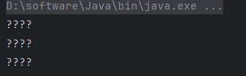
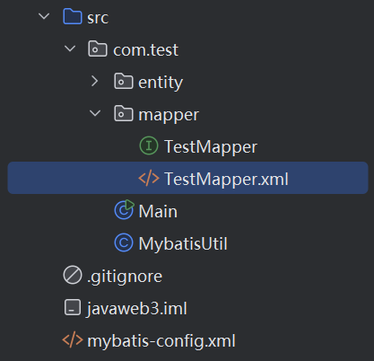

## Mybatis4

### Mybatis详解2

#### 指定构造方法

(一般不咋用)
通过前面的学习，我们已经知道如何使用Mybatis进行各种查询操作。我们知道，`Mybatis`在执行完查询语句后，会自动将查询的结果转换为我们所需要的实体类

实际上`Mybatis`一开始会通过我们实体类**默认的无参构造**得到一个**最初的对象**，然后通过**反射进行赋值**，我们可以手动编写一个带调试信息的无参构造：

```java
public User() {
    System.out.println("????");
}
```



可以看到Mybatis确实调用了我们的无参构造方法来构建对象，属性则是通过反射进行赋值，这里截取部分Mybatis源代码进行演示：

```java
//这里的object就是刚刚构造好的实体类对象，prop是要设置的值的字段信息，value就是要设置的值
private void setBeanProperty(PropertyTokenizer prop, Object object, Object value) {
  try {
    //Invoker是Mybatis内部编写一个用于反射设置对象属性值的工具
    Invoker method = metaClass.getSetInvoker(prop.getName());
    Object[] params = { value };
    try {
      method.invoke(object, params);  //通过Invoker为传入的实体类对象赋值
    } catch (Throwable t) {
      throw ExceptionUtil.unwrapThrowable(t);
    }
  } catch (Throwable t) {
    ...
  }
}
```

由于`Mybatis`默认情况下直接通过**无参构造来创建实体类对象**，如果我们的类中存在其他的构造方法覆盖掉默认的无参构造，那么`Mybatis`会选择**可用的构造方法**来进行构造。

但是如果存在多个构造方法，`Mybatis`会出现问题：

```java
@ToString
public class User {
    ...

    public User(int id) {
        this.id = id;
    }
    
    public User(String name, int age) {
        this.name = name;
        this.age = age;
    }
}
```

运行时出现错误：

```
Exception in thread "main" org.apache.ibatis.exceptions.PersistenceException: 
### Error querying database.  Cause: org.apache.ibatis.executor.ExecutorException: No constructor found in com.test.User matching [java.lang.Integer, java.lang.String, java.lang.Integer]
### The error may exist in file:mappers/TestMapper.xml
```

此时由于类中存在多个构造方法，而`Mybatis`不知道该如何选择，那么就会告诉我们找不到合适的构造方法，要解决这种问题也很简单，我们不需要删除这些多余的构造方法，只需添加一个无参构造或是全参构造即可，注意全参构造必须与查询结果字段参数一一对应。

但是注意，`Mybatis`仅仅是使用这种方式**进行对象的构建**，而字段的赋值无论是什么构造方法，都会使用反射进行一次赋值：

```java
public User(int id, String name, int age) {
    this.id = id;
    this.name = name;
    this.age = age + 20;   //这里我们让age在赋值时增加一次
}
```

我们会发现，就算像这样进行了修改，最终的结果依然是被赋值为数据库中的结果，也就是说构造方法在默认情况下**仅仅只是用于构造一个单纯的对象罢了**。

如果需要让`Mybatis`完全使用构造方法进行对象构建与赋值工作，那么我们需要在XML中手动编写配置，同样需要使用resultMap来完成：

```xml
<select id="selectUserById" resultMap="test">
    select * from user where id = #{id}
</select>
<resultMap id="test" type="com.test.User">
    <constructor>
            
    </constructor>
</resultMap>
```

这一次我们在`resultMap`中添加`constructor`标签，表示我们的查询结果直接使用指定的构造方法来处理。接着我们需要配置一下`constructor`里面的内容，使其符合我们指定构造方法的定义，比如现在我们有一个这样的构造方法：

```java
public User(int id, String name) {
    this.id = id;
    this.name = name + "同学";
}
```

那么对应的`XML`配置编写为，使用`arg`标签来代表每一个参数，**主键可以使用**`idArg`来表示，有助于优化性能：

```xml
<constructor>
    <idArg column="id" javaType="_int"/>
    <arg column="name" javaType="String"/>
</constructor>
```

注意参数的顺序，**必须和构造方法的顺序一致**，否则会导致`Mybatis`无法确认。

指定构造方法后，若此字段被填入了构造方法作为参数，将不会通过反射给字段单独赋值，**而构造方法中没有传入的字段，依然会被反射赋值**。

#### 接口绑定 `sqlSession.getMapper(xxx.class)`

之前通过创建一个映射器来将结果快速转换为实体类，但是这样可能还是不够方便，我们每次都需要去找映射器对应操作的名称，而且还要知道对应的返回类型，再通过`SqlSession`来执行对应的方法，可以用**接口**来简化

通过`namespace`来将各种操作绑定到一个接口上，然后使用方法的形式来表示，注意接口的参数和返回值必须正确对应，否则可能会出现问题：

```java
public interface TestMapper {
    List<Student> selectStudent();
    Student selectStuById(int id);
    List<Student> selectStusBySex(String sex);
}
```

接着将`Mapper`文件的命名空间修改为我们的接口完整名称：

```xml
<mapper namespace="com.test.mapper.TestMapper">
    <select id="selectStudent" resultType="Student">
        select * from student
    </select>
    
    <select id="selectStuById" resultType="Student" parameterType="_int">
        select * from student where sid = #{sid}
    </select>
    
    <select id="selectStusBySex" resultType="Student">
        select * from student where sex = #{sex}
    </select>
</mapper>
```

这里建议将对应的xml配置也放到放到同包中，作为内部资源：



作为内部资源后，我们需要修改一下配置文件中的`mapper`文件目录，不使用`url`而是`resource`表示是Jar内部的文件：

```xml
<mappers>
    <mapper resource="com/test/mapper/TestMapper.xml"/>
</mappers>
```

现在我们可以直接通过`SqlSession`获取我们编写接口的实现类，这个实现类是由`Mybatis`根据我们的配置自动生成的，不需要我们做任何事情：

```java
try(SqlSession sqlSession = MybatisUtil.openSession(true)) {
    TestMapper mapper = sqlSession.getMapper(TestMapper.class);   //直接获取实现类
    //这里调用我们编写的接口方法
    mapper.selectStudent().forEach(System.out::println);
}
```

---

那肯定有人好奇，`TestMapper`明明是一个我们自己定义接口啊，`Mybatis`也不可能提前帮我们写了实现类啊，那这接口怎么就出现了一个实现类呢？

我们可以通过调用`getClass()`方法来看看实现类是个什么：

```java
TestMapper testMapper = sqlSession.getMapper(TestMapper.class);
System.out.println(testMapper.getClass());
```

我们发现，得到的类名称很奇怪`class jdk.proxy2.$Proxy4`，它其实是通过**动态代理**生成的，相当于在程序运行过程中动态生成了一个实现类，而不是预先定义好的，有关Mybatis这一部分的原理，我们放在最后一节进行讲解。

---

##### 多参数表示

1. xml中参数名改为 `param1, param2, ...`
2. 用注解 `@param(xx)`

我们接着来看更方便的用法，有些时候，我们的查询操作可能需要不止一个参数：

```xml
<select id="selectUserByIdAndAge" resultType="com.test.entity.User">
    select * from user where id = #{id} and age = #{age}
</select>
```

一种最简单的方式就是和之前一样，我们使用一个Map作为参数，然后将这些参数添加到Map中进行传递：

```java
User selectUserByIdAndAge(Map<String, Object> map);
```

```java
TestMapper mapper = session.getMapper(TestMapper.class);
System.out.println(mapper.selectUserByIdAndAge(Map.of("id", 1, "age", 18)));
```

只不过，这样编写实在是太复杂了，要是由一种更简单的方式就好了，我们也可以直接将这两个参数定义到形参列表中：

```java
User selectUserByIdAndAge(int id, int age);
```

只不过这种方式查询的话，`Mybatis`会并不能正确获取对应的参数：

```
### Cause: org.apache.ibatis.binding.BindingException: Parameter 'id' not found. Available parameters are [arg1, arg0, param1, param2]
  at org.apache.ibatis.exceptions.ExceptionFactory.wrapException(ExceptionFactory.java:30)
```

这是因为`Java`代码编译后形参名称无法保留，导致`Mybatis`无法确定具体哪个参数交什么名字，

所以默认情况下它们将会以 `param` 加上它们在参数列表中的位置来命名，比如：`#{param1}、#{param2}`等，这里id实际上就是`param1`：

```sql
select * from user where id = #{param1} and age = #{param2}
```

当然，如果你实在需要使用对应的属性名称，我们也可以手动添加一个`@Param`注解来指定某个参数的名称：

```java
User selectUserByIdAndAge(@Param("id") int id, @Param("age") int age);
```

这样`Mybatis`就可以正确识别了。
