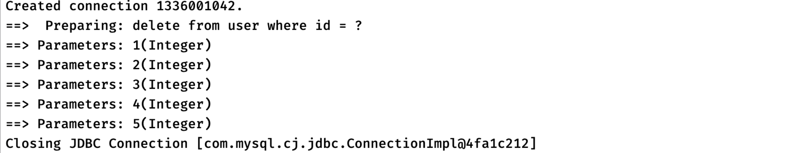

## Mybatis详解5

### 动态SQL

#### 批处理 `ExecutorType.BATCH`

在之前JDBC讲解的时候，我们就提到过批量执行语句的问题，当我们要执行很多条语句时，可能会一个一个地提交：

```java
//现在要求把下面所有用户都插入到数据库中
List<String> users = List.of("小刚", "小强", "小王", "小美", "小黑子");
//使用for循环来一个一个执行insert语句
for (String user : users) {
    statement.executeUpdate("insert into user (name, age) values ('" + user + "', 18)");
}
```

虽然这样看似非常完美，也符合逻辑，但是实际上我们每次执行`SQL`语句，都像是去厨房端菜到客人桌上一样，我们每次上菜的时候只从厨房端一个菜，效率非常低

但是如果我们每次上菜推一个小推车装满N个菜一起上，效率就会提升很多，而数据库也是这样，我们每一次执行SQL语句，都需要一定的时间开销

但是如果我把这些任务合在一起告诉数据库，效率会截然不同：


可见，使用循环操作执行数据库相关操作实际上非常耗费资源，不仅带来网络上的额外开销，还有数据库的额外开销

更推荐使用**批处理**来优化这种情况，一次性提交一个批量操作给数据库。

需要在`Mybatis`中开启批处理，我们只需要在创建`SqlSession`时进行一些配置即可：

```java
factory.openSession(ExecutorType.BATCH, autoCommit);
```

在使用`openSession`时直接配置`ExecutorType`为BATCH即可，这样SqlSession会开启批处理模式，在多次处理相同SQL时会尽可能转换为一次执行，开启批处理后，无论是否处于事务模式下，我们都需要`flushStatements()`来一次性提交之前是所有批处理操作：

```java
TestMapper mapper = session.getMapper(TestMapper.class);
for (int i = 1; i <= 5; i++) {
    mapper.deleteUserById(i);
}
session.flushStatements();
```

此时日志中可以看到Mybatis在尽可能优化我们的SQL操作：



#### 动态SQL介绍
