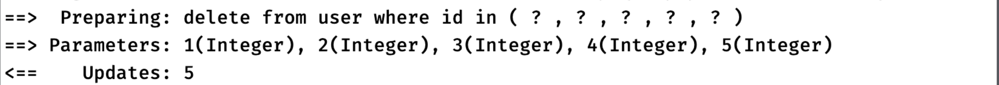

## Mybatis详解5

### 动态SQL

#### 批处理 `ExecutorType.BATCH`

在之前JDBC讲解的时候，我们就提到过批量执行语句的问题，当我们要执行很多条语句时，可能会一个一个地提交：

```java
//现在要求把下面所有用户都插入到数据库中
List<String> users = List.of("小刚", "小强", "小王", "小美", "小黑子");
//使用for循环来一个一个执行insert语句
for (String user : users) {
    statement.executeUpdate("insert into user (name, age) values ('" + user + "', 18)");
}
```

虽然这样看似非常完美，也符合逻辑，但是实际上我们每次执行`SQL`语句，都像是去厨房端菜到客人桌上一样，我们每次上菜的时候只从厨房端一个菜，效率非常低

但是如果我们每次上菜推一个小推车装满N个菜一起上，效率就会提升很多，而数据库也是这样，我们每一次执行SQL语句，都需要一定的时间开销

但是如果我把这些任务合在一起告诉数据库，效率会截然不同：


可见，使用循环操作执行数据库相关操作实际上非常耗费资源，不仅带来网络上的额外开销，还有数据库的额外开销

更推荐使用**批处理**来优化这种情况，一次性提交一个批量操作给数据库。

需要在`Mybatis`中开启批处理，我们只需要在创建`SqlSession`时进行一些配置即可：

```java
factory.openSession(ExecutorType.BATCH, autoCommit);
```

在使用`openSession`时直接配置`ExecutorType`为BATCH即可，这样SqlSession会开启批处理模式，在多次处理相同SQL时会尽可能转换为一次执行，开启批处理后，无论是否处于事务模式下，我们都需要`flushStatements()`来一次性提交之前是所有批处理操作：

```java
TestMapper mapper = session.getMapper(TestMapper.class);
for (int i = 1; i <= 5; i++) {
    mapper.deleteUserById(i);
}
session.flushStatements();
```

此时日志中可以看到Mybatis在尽可能优化我们的SQL操作：


#### 动态SQL介绍

除了使用批处理之外，Mybatis还为我们提供了一种更好的方式来处理这种问题，我们可以使用**动态SQL来一次性生成一个批量操作的SQL语句**

> 动态 SQL 是 MyBatis 的强大特性之一。如果你使用过 JDBC 或其它类似的框架，你应该能理解根据不同条件拼接 SQL 语句有多痛苦，例如拼接时要确保不能忘记添加必要的空格，还要注意去掉列表最后一个列名的逗号。利用动态 SQL，可以彻底摆脱这种痛苦。

简单来说，动态SQL在执行时可以进行各种**条件判断**以及**循环拼接**等操作，极大地提升了SQL语句编写的的灵活性。

#### 条件判断  `if`标签

在编写SQL时，我们可以添加一些用于条件判断的标签到`XML`的`SQL`语句中

比如我们希望在根据ID查询用户时，如果查询的ID大于3，那么必须同时要满足大于18岁这个条件，这看似是一个很奇怪的查询条件，此时动态SQL就能很轻松实现这个操作：

```xml
<select id="selectUserById" resultType="User">
    select * from user where id = #{id}
    <if test="id > 3">
        and age > 18
    </if>
</select>
```

这里我们使用`if`标签表示**里面的内容会在判断条件满足时拼接到后面**

如果不满足，那么就不拼接里面的内容到原本的SQL中，其中test属性就是我们需要填写的判断条件，它采用OGNL表达式进行编写，语法与Java比较相似

详细了解: <https://commons.apache.org/dormant/commons-ognl/>

当我们查询条件不同时，Mybatis会选择性拼接我们的SQL语句

#### 选择判断 `choose`

除了if操作之外，Mybatis还针对**多分支情况**提供了`choose`操作，它类似于Java中的switch语句

比如现在我们希望在查询用户时，ID等于1的必须同时要满足小于18岁，ID等于2的必须满足等于18岁，其他情况的必须满足大于18岁(这需求有点抽象)

我们可以像这样进行编写：

```xml
<select id="selectUserById" resultType="User">
    select * from user where id = #{id}
    <choose>
        <when test="id == 1">
             and age &lt;= 18
        </when>
        <when test="id == 2">
            and age = 18
        </when>
        <otherwise>
            and age > 18
        </otherwise>
    </choose>
</select>
```

注意在`when`中不允许使用`<`或是`>`这种模糊匹配的条件(实际运行好像是可以的)。

#### 实现批量处理 `foreach`

`foreach`操作，它与`Java`中的`for`类似，可以实现批量操作，这非常适合处理我们前面说的**批量执行SQL**的问题：

##### 批量删除

```java
for (int i = 1; i <= 5; i++) {
    mapper.deleteUserById(i);
}
```

但是实际上这种情况完全可以简写为一个SQL语句：

```sql
DELETE FROM users WHERE id IN (1, 2, 3, 4, 5);
```

使用`foreach`来完成它就很简单了：

```xml
<delete id="deleteUsers">
    delete from user where id in
    <foreach collection="list" item="item" index="index" open="(" separator="," close=")">
        #{item}
    </foreach>
</delete>
```

其中:

- `collection`就是我们需要遍历的集合或是数组等任意可迭代对象

- `item`和`index`分别代表我们在`foreach`标签中使用**每一个元素**和**下标的变量名称**，即我们在`JAVA`中所传给他的值

- `open`和`close`用于控制起始和结束位置添加的符号

- `separator`用于控制分隔符

现在执行以下操作：

```java
session.delete("deleteUsers", List.of(1, 2, 3, 4, 5));
```

最后实际执行的SQL为：



##### 批量插入

我们再来看一个例子，比如现在我们想要批量插入一些用户到数据库里面，原本Java应该这样写，但是这是一种极其不推荐的做法：

```java
TestMapper mapper = session.getMapper(TestMapper.class);
List<User> users = List.of(new User("小美", 17),
        new User("小张", 18),
        new User("小刘", 19));
for (User user : users) {
    mapper.insertUser(user);
}
```

实际上这种操作完全可以浓缩为一个SQL语句：

```sql
INSERT INTO user (name, age) VALUES ('小美', 17), ('小张', 18), ('小刘', 19);
```

那这时又可以直接使用咱们的动态SQL来完成操作了：

```xml
<insert id="insertAllUser">
    insert into user (name, age) values
    <foreach collection="list" item="item" separator=",">
        (#{item.name}, #{item.age})
    </foreach>
</insert>
```


通过使用动态SQL语句，我们基本上可以解决大部分的SQL查询和批量处理场景了。
