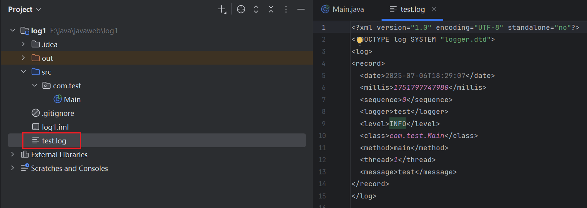
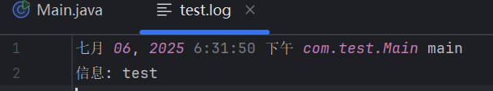

## JUL日志系统2

### 日志核心内容

#### 核心部分 `Handler`

日志打印的核心部分：`Handler`，它用于处理我们的日志内容打印

`ConsoleHandler` | `FileHandler` | `SocketHandler`

JDK为我们提供了很多种类的`Handler`用于多种不同类型的日志打印，比较常见的就是打印到控制台，当然我们也可以打印到一个日志文件中，名字一般为`xxx.log`这种格式。

常用的Handler实现有：

- `ConsoleHandler`: 将日志通过`System. err`打印到控制台，现在默认就是使用的这个。
- `FileHandler`: 将日志直接写入到指定的文件中。
- `SocketHandler`: 将日志利用Socket通过网络发送到另一个主机。

当然，一个Logger中可以包含多个Handler用于同时向不同的地方打印日志，我们可以通过`getHandlers`方法来获取Logger对象中已经配置的Handler对象：

```java
Logger logger = Logger.getLogger(Main.class.getName());
System.out.println(Arrays.toString(logger.getHandlers()));
```

此时打印的列表中不存在任何Handler对象，可见，我们创建的Logger默认是不带任何Handler对象的

那么我们之前的日志是怎么打印出来的呢？这实际上是Logger的父级提供的，这里我们先暂时不介绍继承关系。

我们使用`setUseParentHandlers`方法来屏蔽所有父级提供的日志处理器：

```java
logger.setUseParentHandlers(false);
```

现在由于Logger没有配置任何Handler处理器，因此我们打印日志就**不会有任何效果**。

##### `ConsoleHandler`

我们可以来尝试自己配置一个用于控制台打印的Handler处理器，这里直接创建一个新的ConsoleHandler对象：

```java
ConsoleHandler handler = new ConsoleHandler();
logger.addHandler(handler);
logger.info("Hello World");
```

现在我们打印日志就可以出现想要的结果了：

```
8月 28, 2024 12:12:37 上午 com.test.Main main
信息: Hello World
```

##### `FileHandler`

我们接着来尝试将日志记录到我们本地的文件中，这里使用FileHandler类型：

```java
FileHandler handler = new FileHandler("test.log", true);   
//第二个参数开启后会续写已有的日志，如果不开启会直接覆盖重写
logger.addHandler(handler);
```

最后我们就可以得到一个日志文件了，默认是以XML格式进行写入的：



这种格式有助于程序的日志读取，但是对于我们人来说，非常难以阅读，那有没有什么办法将文件的日志打印变成控制台那种格式呢？

##### 修改输出格式 `Formatter`

实际上每一个Handler都有一个`Formatter`对象，它用于控制日志的格式，默认情况下，`ConsoleHandler`会配置一个`SimpleFormatte`r对象，格式为：

```
时间 类名 方法
日志级别: 日志内容
```

我们刚刚在`FileHandler`中见到的是默认生成的`XMLFormatter`，它会将日志以XML的形式进行打印，现在我们也可以手动修改它为`SimpleFormatter`类型：

```java
Handler handler = new FileHandler("test.log");
handler.setFormatter(new SimpleFormatter());
```

此时日志文件中写入的内容就是简单的日志格式了

