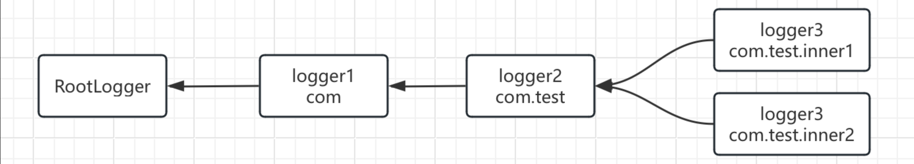

## JUL日志系统3

### 日志继承关系

#### `RootLogger`

JUL中Logger之间存在父子关系，这种父子关系类似于继承，我们可以通过Logger的`getParent`方法来获取其父Logger对象：

```java
Logger logger = Logger.getLogger(Main.class.getName());
System.out.println(logger.getParent());
```

这里我们会得到一个：

```
java.util.logging.LogManager$RootLogger@24d46ca6
```

这个`RootLogger`对象为所有日志记录器的最顶层父级对象，它包含一个默认的`ConsoleHandler`处理器用于进行控制台打印，而日志在打印时，子Logger会继承父Logger提供的所有`Handler`进行日志处理，因此我们在默认情况下才能正常使用日志打印：

```java
Logger logger = Logger.getLogger("test");
Logger parent = logger.getParent();
System.out.println(Arrays.toString(parent.getHandlers()));
```

#### 修改默认情况下的打印等级

`Handler`是属于对应的`Logger`的，即继承的子`Logger`不能直接修改父`Logger`的`Handler`

根据我们上节课学习的知识，在默认情况下如果我们需要修改日志打印等级，那么同时**也需要将父级的Handler也进行日志等级配置**：

```java
parent.getHandlers()[0].setLevel(Level.ALL);
logger.setLevel(Level.ALL);
logger.finest("test");
```

#### 重复`Logger`问题

当然，如果我们在不屏蔽父级`Handler`的情况下为子级配置一个`Handler`，那么此时两个`Handler`都会生效

顺序：先子`Logger`, 再父`Logger`

```java
logger.addHandler(new ConsoleHandler());
logger.info("你干嘛");
```

日志中出现了两次：

```
8月 28, 2024 12:57:39 上午 com.test.Main main
信息: 你干嘛
8月 28, 2024 12:57:39 上午 com.test.Main main
信息: 你干嘛
```

不过需要注意一下顺序，当父级和子级都配置时，那么**子级的Handler优先进行处理，接着才是父级。**

#### 名称分级，自动构建继承关系

除了默认的RootLogger作为父类，实际上Logger还会通过名称进行分级，自动构建一个继承关系，比如下面：

```java
Logger logger1 = Logger.getLogger("com");
Logger logger2 = Logger.getLogger("com.test");
Logger logger3 = Logger.getLogger("com.test.inner1");
Logger logger4 = Logger.getLogger("com.test.inner2");

System.out.println(logger4.getParent() == logger2);   //全true
System.out.println(logger3.getParent() == logger2);
System.out.println(logger2.getParent() == logger1);
```

就像包名一样，**日志的名称会按照包的分级，进行自动继承**，就像下面这个图一样：


