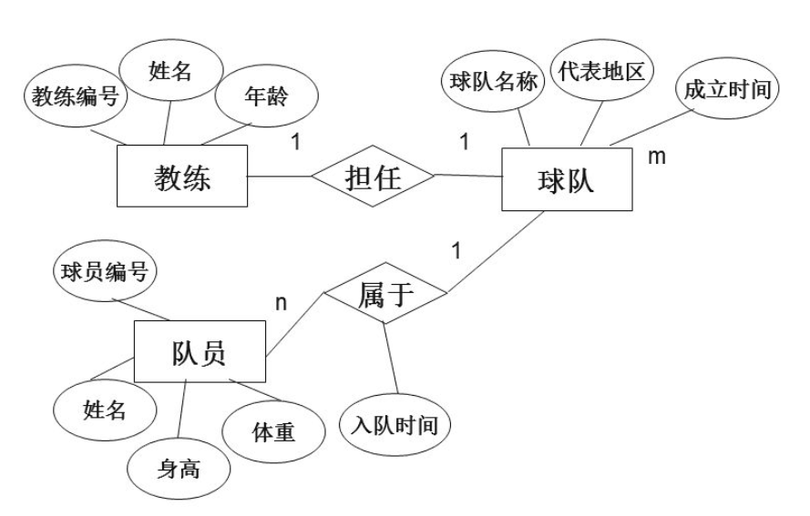

## 数据库 1

### 简介

数据库是数据管理的有效技术，是由一批数据构成的有序集合，这些数据被存放在结构化的数据表里。数据表之间相互关联，反映客观事物间的本质联系。数据库能有效地帮助一个组织或企业科学地管理各类信息资源。简而言之，我们的数据可以交给数据库来帮助我们进行管理，同时数据库能够为我们提供高效的访问性能。

常见的数据库有很多种，包括但不限于：

MySQL - 免费，用的最多的，开源数据库，适用于中小型
Microsoft SQL Server - 收钱的，但是提供技术支持，适用于Windows Server
Oracle - 收钱的，大型数据库系统

### 数据模型

数据模型与现实世界中的模型一样，是对现实世界数据特征的一种抽象。实际上，我们之前学习的类就是对现实世界数据的一种抽象，比如一个学生的特征包括姓名，年龄，年级，学号，专业等，这些特征也称为实体的一种属性，属性具有以下特点：

- 属性不可再分
- 一个实体的属性可以有很多个
- 用于唯一区分不同实体的的属性，称为**Key**，比如每个同学的学号都是不一样的
- 属性取值可以有一定的约束，比如性别只能是男或是女

实体或是属性之间可以具有一定的联系，比如一个老师可以教很多个学生，而学生相对于老师就是被教授的关系；又比如每个同学都有一个学号与其唯一对应，因此学号和学生之间也有一种联系。而像一个老师教多个学生的联系就是一种一对多的联系（1:n），而学号唯一对应，就是一种一对一的联系（1:1）；每一个老师不仅可以教多个学生，每一个学生也可以有多个教师，这就是一种多对多的联系（n:m）
MySQL就是一种**关系型数据库**，通过使用关系型数据库，我们就可以很好地存储这样带有一定联系的数据。

通过构建一个ER图，我们就能很好地理清不同数据模型之间的关系和特点。

### 数据库创建

既然了解了属性和联系，那么我们就来尝试创建一个数据库，并在数据库中添加用于存放数据的表，每一张表都代表一种实体的数据。首先我们要明确，我们需要创建什么样子的表：

- 学生表：用于存放所有学生的数据，学生（<u>学号</u>，姓名，性别）
- 教师表：用于存放所有教师的数据，教师（<u>教师号</u>，姓名）
- 授课表：用于存放教师与学生的授课信息，授课（<u>学号</u>，教师号）

其中，标注下划线的属性，作为Key，用于区别于其他实体数据的唯一标记。

### 数据库的规范化

要去设计存放一个实体的表，我们就需要了解数据库的关系规范化，尽可能减少“不好”的关系存在，如何设计一个优良的关系模型是最关键的内容！简而言之，我们要学习一下每一个表该如何去设计。

**1NF**对表中每一列进行约束，**2NF**对主属性和其他属性的依赖关系产生约束，**3NF**对依赖关系进一步加强，**BCNF**则是对主键的选取进行唯一确定

#### 第一范式（1NF）

第一范式是指数据库的每一列都是不可分割的基本数据项，而下面这样的就存在可分割的情况：

* 学生（姓名，电话号码）

电话号码实际上包括了`家用座机电话`和`移动电话`，因此它可以被拆分为：

* 学生（姓名，座机号码，手机号码）

满足第一范式是关系型数据库最基本的要求！

#### 第二范式（2NF）

第二范式要求表中必须存在主键，且其他的属性必须完全依赖于主键，比如：

* 学生（<u>学号</u>，姓名，性别）

学号是每个学生的唯一标识，每个学生都有着不同的学号，因此此表中存在一个主键，并且每个学生的所有属性都依赖于学号，学号发生改变就代表学生发生改变，姓名和性别都会因此发生改变，所有此表满足第二范式。

#### 第三范式（3NF）

在满足第二范式的情况下，所有的属性都不传递依赖于主键，满足第三范式。

* 学生借书情况（<u>借阅编号</u>，学生学号，书籍编号，书籍名称，书籍作者）

实际上**书籍编号依赖于借阅编号**，而**书籍名称和书籍作者依赖于书籍编号**，因此存在传递依赖的情况，**我们可以将书籍信息进行单独拆分为另一张表**：

* 学生借书情况（<u>借阅编号</u>，学生学号，书籍编号）
* 书籍（<u>书籍编号</u>，书籍名称，书籍作者）

这样就**消除了传递依赖**，从而满足第三范式。

#### BCNF

BCNF作为第三范式的补充，假设仓库管理关系表为StorehouseManage(仓库ID, 存储物品ID, 管理员ID, 数量)，且有一个管理员只在一个仓库工作；一个仓库可以存储多种物品。这个数据库表中存在如下决定关系：

(仓库ID, 存储物品ID) →(管理员ID, 数量)

(管理员ID, 存储物品ID) → (仓库ID, 数量)

所以，(仓库ID, 存储物品ID)和(管理员ID, 存储物品ID)都是StorehouseManage的候选关键字，表中的唯一非关键字段为数量，它是符合第三范式的。但是，由于存在如下决定关系：

(仓库ID) → (管理员ID)

(管理员ID) → (仓库ID)

即存在关键字段决定关键字段的情况，如果修改管理员ID，那么就必须逐一进行修改，所以其不符合BCNF范式。
