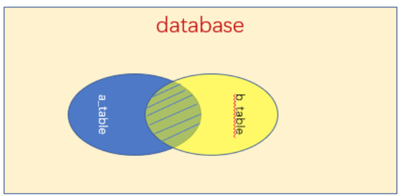

## 数据库 3

## 数据库查询语言 (DQL)

### 单表查询 `SELECET`

单表查询是最简单的一种查询，我们只需要在一张表中去查找数据即可，通过使用`select`语句来进行单表查询：

```sql
-- 指定查询某一列数据
SELECT 列名[,列名] FROM 表名
-- 会以别名显示此列
SELECT 列名 别名 FROM 表名
-- 查询所有的列数据
SELECT * FROM 表名
-- 只查询不重复的值
SELECT DISTINCT 列名 FROM 表名
```

我们也可以添加`where`字句来限定查询目标：

```sql
SELECT * FROM 表名 WHERE 条件
```

#### 常用`where`查询条件

- 一般的比较运算符，包括=、>、<、>=、<=、!=等。

- 是否在集合中：in、not in

- 字符模糊匹配：like，not like
  `%` 表示任意内容
  比如 `03%` 表示03开头

- 多重条件连接查询：and、or、not
  
#### 排序查询 `order by`

我们可以通过`order by`来将查询结果进行排序：

```sql
SELECT * FROM 表名 ORDER BY 列名 ASC|DESC
```

使用ASC表示升序排序，使用DESC表示降序排序，默认为升序。

我们也可以可以同时添加**多个排序**：

```sql
SELECT * FROM 表名 WHERE 条件 ORDER BY 列名1 ASC|DESC, 列名2 ASC|DESC
```

这样会先按照列名1进行排序，每组列名1相同的数据再按照列名2排序。

#### 聚集函数

聚集函数一般用作统计，包括：

- `count([distinct]*)`统计所有的行数（distinct表示**去重再统计**，下同）
- `count([distinct]列名)`统计某列的值总和
- `sum([distinct]列名)`求一列的和（注意必须是数字类型的）
- `avg([distinct]列名)`求一列的平均值（注意必须是数字类型）
- `max([distinct]列名)`求一列的最大值
- `min([distinct]列名)`求一列的最小值

一般聚集函数是这样使用的：

```sql
SELECT count(distinct 列名) FROM 表名 WHERE 条件
```

#### 分组和分页查询

通过使用`group by`来对查询结果进行分组，它需要结合聚合函数一起使用：

```sql
SELECT sum(*) FROM 表名 WHERE 条件 GROUP BY 列名
```

我们还可以添加`having`来限制分组条件：

```sql
SELECT sum(*) FROM 表名 WHERE 条件 GROUP BY 列名 HAVING 约束条件
```

我们可以通过`limit`来限制查询的数量，只取前n个结果：

```sql
SELECT * FROM 表名 LIMIT 数量
```

我们也可以进行分页：

```sql
SELECT * FROM 表名 LIMIT 起始位置,数量
```

---

### 多表查询

多表查询是同时查询的两个或两个以上的表，多表查询会通过连接转换为单表查询。

```sql
SELECT * FROM 表1, 表2
```

直接这样查询会得到两张表的**笛卡尔积**，也就是**每一项数据和另一张表的每一项数据都结合一次**，会产生庞大的数据。

```sql
SELECT * FROM 表1, 表2 WHERE 条件
```

这样，只会从笛卡尔积的结果中得到满足条件的数据。

**注意：** 如果两个表中都带有此属性，需要添加表名前缀来指明是哪一个表的数据。比如 `select * from a1, a2 where a1.xxx;`

#### 自身连接查询

自身连接，就是将表本身和表进行笛卡尔积计算，得到结果，但是由于表名相同，因此要先起一个别名：

```sql
SELECT * FROM 表名 别名1, 表名 别名2
```

其实自身连接查询和前面的是一样的，只是连接对象变成自己和自己了。

#### 外连接查询

可以叠着使用

外连接就是**专门用于联合查询情景**的，比如现在有一个存储所有用户的表，还有一张用户详细信息的表，我希望将这两张表结合到一起来查看完整的数据，我们就可以通过使用外连接来进行查询，外连接有三种方式：

- 通过使用`inner join xxx on`进行内连接
  只会**返回两个表满足条件的交集部分**：
  `select * from student inner join teach on student.sid = teach.sid;`
  

- 通过使用`left join xxx on`进行左连接
  不仅会**返回两个表满足条件的交集部分**，也会返回**左边表中的全部数据**，而在右表中缺失的数据会使用`null`来代替（右连接`right join`同理，只是反过来而已，这里就不再介绍了）：
  `select * from student left join teach on student.sid = teach.sid;`
  

- 右连接类似 `right join xxx on`

#### 嵌套查询

我们可以将查询的结果作为另一个查询的条件，比如：

```sql
SELECT * FROM 表名 WHERE 列名 = (SELECT 列名 FROM 表名 WHERE 条件)
```

我们来再次尝试编写一下在最开始我们查找某教师所有学生的SQL语句。

---

## 数据库控制语言（DCL）

庞大的数据库不可能由一个人来管理，我们需要更多的用户来一起管理整个数据库。

### 创建用户

我们可以通过`create user`来创建用户：

```sql
CREATE USER 用户名 identified by 密码;
```

也可以不带密码：

```sql
CREATE USER 用户名;
```

我们可以通过@来限制用户登录的登录IP地址，`%`表示匹配所有的IP地址，默认使用的就是任意IP地址。

### 登陆用户

首先需要添加一个环境变量，然后我们通过cmd去登陆mysql：

```sql
login -u 用户名 -p
```

输入密码后即可登陆此用户，我们输入以下命令来看看能否访问所有数据库：

```sql
show databases;
```

我们发现，虽然此用户能够成功登录，但是并不能查看完整的数据库列表，这是因为此用户还没有权限！

### 用户授权

我们可以通过使用`grant`来为一个数据库用户进行授权：

```sql
grant all|权限1,权限2...(列1,...) on 数据库.表 to 用户 [with grant option]
```

其中all代表授予所有权限，当数据库和表为`*`，代表为所有的数据库和表都授权。如果在最后添加了`with grant option`，那么被授权的用户还能将已获得的授权继续授权给其他用户。

我们可以使用`revoke`来收回一个权限：

```sql
revoke all|权限1,权限2...(列1,...) on 数据库.表 from 用户
```
