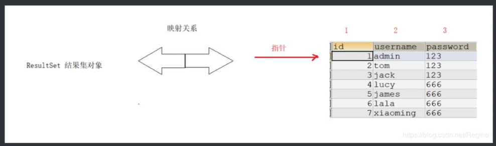

## JDBC

### 执行DML操作 `executeUpdate()`

删除、更新、添加

```java
import java.io.PrintWriter;
import java.sql.*;

public class Main {
    public static void main(String[] args) {
        try (
                Connection connection = DriverManager.getConnection("jdbc:mysql://localhost:3306/study","root","123456");
                Statement statement = connection.createStatement();
        ){
            int i = statement.executeUpdate("insert into student values(4,'monkey','男')");
            // statement.executeUpdate("delete from student where sid = 4");
            // int i = statement.executeUpdate("update student set name = 'dog' where sid=3");
            System.out.println("生效了："+i+"行");
        } catch (SQLException e) {
            throw new RuntimeException(e);
        }
    }
}
```

### 执行DQL操作 `executeQuery()`

执行`DQL操作`会返回一个`ResultSet`对象，我们来看看如何从`ResultSet`中去获取数据：
一开始是在第一行上面，可以理解在标题栏

```java
//首先要明确，select返回的数据类似于一个excel表格
while (set.next()){
    //每调用一次next()就会向下移动一行，首次调用会移动到第一行
}
```

我们在移动行数后，就可以通过`set`中提供的方法，来获取每一列的数据。



### 执行批处理操作 `addBatch()`

当我们要执行很多条语句时，可以不用一次一次地提交，而是一口气全部交给数据库处理，这样会节省很多的时间。

```java
public static void main(String[] args) throws ClassNotFoundException {
    try (Connection connection = DriverManager.getConnection();
         Statement statement = connection.createStatement()){

        statement.addBatch("insert into user values ('f', 1234)");
        statement.addBatch("insert into user values ('e', 1234)");   //添加每一条批处理语句
        statement.executeBatch();   //一起执行

    }catch (SQLException e){
        e.printStackTrace();
    }
}
```

### 将查询结果映射为对象

既然我们现在可以从数据库中获取数据了，那么现在就可以将这些数据转换为一个类来进行操作，首先定义我们的实体类：

```java
public class Student {
    Integer sid;
    String name;
    String sex;

    public Student(Integer sid, String name, String sex) {
        this.sid = sid;
        this.name = name;
        this.sex = sex;
    }

    public void say(){
        System.out.println("我叫："+name+"，学号为："+sid+"，我的性别是："+sex);
    }
}
```

现在我们来进行一个转换：

```java
while (set.next()){
    Student student = new Student(set.getInt(1), set.getString(2), set.getString(3));
    student.say();
}
```

**注意：** 列的下标是从1开始的。

我们也可以利用**反射机制**来将查询结果映射为对象，使用反射的好处是，无论什么类型都可以通过我们的方法来进行实体类型映射：

```java
private static <T> T convert(ResultSet set, Class<T> clazz){
    try {
        Constructor<T> constructor = clazz.getConstructor(clazz.getConstructors()[0].getParameterTypes());   //默认获取第一个构造方法
        Class<?>[] param = constructor.getParameterTypes();  //获取参数列表
        Object[] object = new Object[param.length];  //存放参数
        for (int i = 0; i < param.length; i++) {   //是从1开始的
            object[i] = set.getObject(i+1);
            if(object[i].getClass() != param[i])
                throw new SQLException("错误的类型转换："+object[i].getClass()+" -> "+param[i]);
        }
        return constructor.newInstance(object);
    } catch (ReflectiveOperationException | SQLException e) {
        e.printStackTrace();
        return null;
    }
}
```

现在我们就可以通过我们的方法来将查询结果转换为一个对象了：

```java
while (set.next()){
    Student student = convert(set, Student.class);
    if(student != null) student.say();
}
```

实际上，在后面我们会学习**Mybatis**框架，它对`JDBC`进行了深层次的封装，而它就进行类似上面反射的操作来便于我们对数据库数据与实体类的转换。
