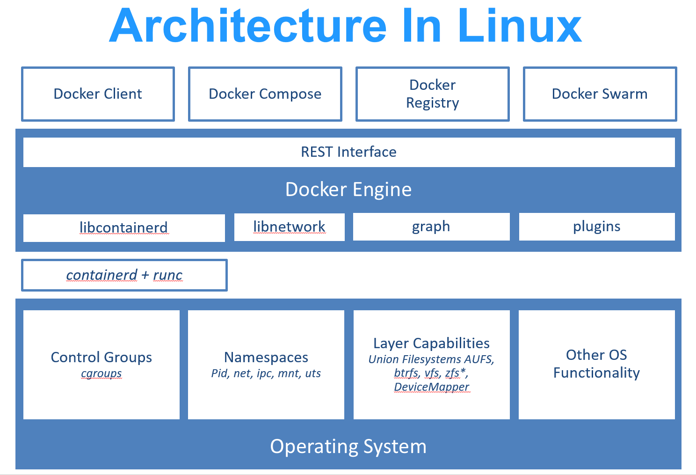
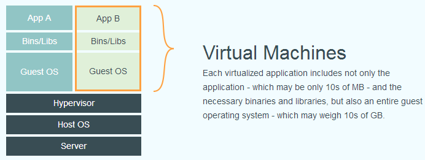

## Docker

### 简介

Docker 最初是 dotCloud 公司创始人 Solomon Hykes 在法国期间发起的一个公司内部项目，它是基于 dotCloud 公司多年云服务技术的一次革新，并于 2013 年 3 月以 Apache 2.0 授权协议开源，主要项目代码在 GitHub 上进行维护。Docker 项目后来还加入了 Linux 基金会，并成立推动 开放容器联盟（OCI）

Docker 最初是在 Ubuntu 12.04 上开发实现的；Red Hat 则从 RHEL 6.5 开始对 Docker 进行支持；Google 也在其 PaaS 产品中广泛应用 Docker

Docker 使用 Google 公司推出的 Go 语言 进行开发实现，基于 Linux 内核的 cgroup，namespace，以及 OverlayFS 类的 Union FS 等技术，对进程进行封装隔离，属于 操作系统层面的虚拟化技术

由于隔离的进程独立于宿主和其它的隔离的进程，因此也称其为容器

> runc 是一个 Linux 命令行工具，用于根据 OCI容器运行时规范 创建和运行容器。
>
> containerd 是一个守护程序，它管理容器生命周期，提供了在一个节点上执行容器和管理镜像的最小功能集

Docker 在容器的基础上，进行了进一步的封装，从文件系统、网络互联到进程隔离等等，极大的简化了容器的创建和维护。使得 Docker 技术比虚拟机技术更为轻便、快捷

传统虚拟机技术是虚拟出一套硬件后，在其上运行一个完整操作系统，在该系统上再运行所需应用进程；而容器内的应用进程直接运行于宿主的内核，容器内没有自己的内核，而且也没有进行硬件虚拟。因此容器要比传统虚拟机更为轻便

#### 与传统虚拟机的区别

Docker 不能像传统虚拟机那样模拟不同的操作系统。：

- 共享内核：容器内的进程直接运行在宿主机内核上，没有自己的内核
- 无法跨内核架构：Linux 容器只能运行在 Linux 内核上，Windows 容器只能运行在 Windows 上

容器是操作系统层的虚拟化，而传统虚拟机是硬件层的虚拟化

| 平台 | 支持方式 |
| --- | --- |
| **Linux** | 原生支持，直接调用 Linux 内核的 cgroups 和 namespaces |
| **Windows** | 通过 WSL2 或 Hyper-V 运行一个轻量级 Linux VM |
| **macOS** | 通过虚拟机（如 Lima）运行 Linux VM |

### Linux Namespaces

Namespaces 是 Linux 内核的一种隔离机制，让进程"看到"的资源是隔离的

> 同一个系统调用，在不同 namespace 中的进程看来，结果不同

| Namespace | 隔离内容 | 系统调用标志 |
| --- | --- | --- |
| **PID** | 进程 ID | `CLONE_NEWPID` |
| **Mount** | 文件系统挂载点 | `CLONE_NEWNS` |
| **Network** | 网络设备、IP、端口 | `CLONE_NEWNET` |
| **UTS** | 主机名、域名 | `CLONE_NEWUTS` |
| **User** | 用户和组 ID | `CLONE_NEWUSER` |
| **IPC** | 信号量、消息队列 | `CLONE_NEWIPC` |
