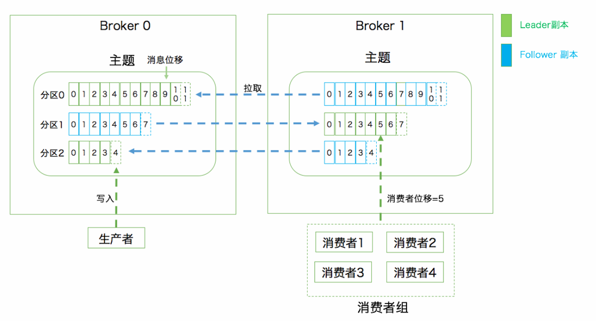

## MQ(消息队列)

MQ：MessageQueue，消息队列

队列，是⼀种FIFO 先进先出的数据结构，消息则是跨进程传递的数据

⼀个典型的MQ系统，会将消息消息由生产者发送到MQ进行排队，然后根据一定的顺序交由消息的消费者进行处理

作用主要包括

- 异步

  可以提高系统的响应速度、吞吐量

- 解耦

  服务之间进行解耦，才可以减少服务之间的影响，提高系统整体的稳定性以及可扩展性

  另外，解耦后可以实现数据分发。生产者发送一个消息后，可以由一个或者多个消费者进行消费，并且消费者的增加或者减少对生产者没有影响

- 削峰

  在流量冲击比较大的场景时，前端大量请求发送可以在MQ中存起来，而下游的消费者按照自己的速度稳定从队列里获取任务执行，避免后端服务被大流量冲垮的情况

## Kafka

Apache Kafka是由LinkedIn采⽤Scala和Java开发的开源流处理软件平台，并捐赠给了Apache Software Foundation

官网地址：<https://kafka.apache.org/>

Kafka使用高效的数据存储和管理技术，能够轻松地处理TB级别的数据量。其优点包括高吞吐量、低延迟、可扩展性、持久性和容错性等

Kafka的设计目标是高吞吐、低延迟和可扩展，主要关注消息传递而不是消息处理

所以，Kafka并没有支持死信队列、顺序消息等高级功能 (需要自己设计?)

### 基本概念



Kafka的消息发送者和消息消费者通过Topic这样一个逻辑概念来进进行业务沟通

但是实际上，所有的消息是存在服务端的Partition这样一个数据结构当中的

#### 生产者(Producer)和消费者(Consumer) - 客户端

客户端(Client)包括：生产者和消费者

向主题发布消息的客户端应用程序称为生产者，生产者程序通常持续不断地向⼀个或多个主题发送消息

订阅这些主题消息的客户端应用程序就被称为消费者，消费者也能够同时订阅多个主题的消息

#### 服务端(Broker)

一个 Kafka服务器 就是一个 Broker

集群由多个 Broker 组成，Broker 负责接收和处理客户端(即消息生产者和消息消费者)发送过来的请求，以及对消息进行持久化

虽然多个 Broker 进程能够运行在同⼀台机器上，但更常见的做法是将不同的 Broker 分散运行在不同的机器上，这样如果集群中某⼀台机器宕机，即使在它上面运行的所有 Broker 进程都挂掉了，其他机器上的 Broker 也可以对外提供服务

#### Topic(主题)

是⼀个逻辑概念，⼀个Topic被认为是业务含义相同的⼀组消息

发布订阅的对象是主题(Topic)，可以为每个业务、每个应用甚至是每类数据都创建专属的主题

客户端都通过绑定 Topic 来生产或者消费自己感兴趣的话题

#### Partition(分区)

Topic只是⼀个逻辑概念，⽽Partition就是实际存储消息的组件，每个Topic可以对应多个Partition，并且这些分区可以存在不同的Broker中

每个Partiton就是⼀个queue队列结构，所有消息以FIFO先进先出的顺序保存在这些Partition分区中

生产者生产的每条消息只会被发送到⼀个分区中，也就是说如果向⼀个双分区的主题发送⼀条消息，这条消息要么在分区 0 中，要么在分区 1 中

每个分区下可以配置若干个副本，其中只能有 1 个领导者副本和 N-1 个追随者副本

生产者向分区写入消息，每条消息在分区中的位置信息叫位移

#### 消费者组

每个消费者可以指定⼀个所属的消费者组，相同消费者组的消费者共同构成⼀个逻辑消费者组

每⼀个消息会被多个感兴趣的消费者组消费，但是在每⼀个消费者组内部，⼀个消息只会被消费⼀次

如果所有实例都属于同⼀个 Group, 那么它实现的就是消息队列模型

如果所有实例分别属于不同的 Group ，那么它实现的就是发布/订阅模型

### Kafka集群


单机服务下，Kafka已经具备了非常高的性能，TPS能够达到百万级别。但是，在实际工作中使用时，单机搭建的Kafka会有很大的局限性

一方面:消息太多，需要分开保存。

Kafka是面向海量消息设计的，一个Topic下的消息会非常多，单机服务很难存得下来。这些消息就需要分成不同的Partition，分布到多个不同的Broker上。这样每个Broker就只需要保存一部分数据。这些分区的个数就称为分区数。

另一方面:服务不稳定，数据容易丢失。

单机服务下，如果服务崩溃，数据就丢失了。

为了保证数据安全，就需要给每个Partition配置一个或多个备份，保证数据不丢失。

Kafka的集群模式下，每个Partition都有一个或多个备份。Kafka会通过一个统一的Zookeeper集群作为选举中心，给每个Partition选举出一个主节点Leader,其他节点就是从节点Follower。

主节点负责响应客户端的具体业务请求，并保存消息。而从节点则负责同步主节点的数据。当主节点发生故障时，Kafka会选举出一个从节点成为新的主节点。

> 可以在不同服务器上启动多个Broker，然后对于一个Topic，其对应消息的具体存储会对应多个 Partition，分布在不同的Broker上；同时防止某个节点宕机从而所存储的Partition没了，每个Partition可以设置多个副本(Replication)备份
>
> Zookeeper目的就是管理这些元信息
> Zookeeper是一种多数同意的选举机制，允许集群中少数节点出现故障。因此，在搭建集群时，通常都是采⽤3，5，7这样的奇数节点，这样可以最大化集群的高可用特性
>
> 目前引入了不需要Zookeeper的集群机制，Kraft集群

### docker部署

在 dokcker 拉取镜像时部署Kafka

整体主要做三件事：

- 启动一个单节点 Kafka（不依赖 Zookeeper，用 KRaft 模式）

- 等 Kafka 真正起来之后，自动创建两个 Topic：`file-processing` 和 `vectorization`
  
  Kafka 可用后，创建两个 topic：`file-processing` 和 `vectorization`
  每个都是：`replication-factor 1`（单副本）+ `partitions 1`（1 分区）

- 做健康检查 + 持久化数据

```yaml
services:
  kafka:
    image: bitnamilegacy/kafka:latest
    container_name: kafka       # 如果需要按照新的命名规则，请改为 pai_smart_kafka
    restart: always
    ports:
      # Kafka 客户端连接端口（producer/consumer 连接用）
      - "9092:9092"
      # KRaft controller 通信端口（Kafka 内部控制面用）
      - "9093:9093"
    # 把 Kafka 数据目录挂到 volume，重启容器数据不丢
    volumes:
      - kafka-data:/bitnami/kafka
    # ---------------------------------------------------- #
    environment:
      # 单节点启动
      - KAFKA_CFG_NODE_ID=0
      # 同一个进程同时扮演 controller + broker
      - KAFKA_CFG_PROCESS_ROLES=controller,broker
      - KAFKA_CFG_CONTROLLER_LISTENER_NAMES=CONTROLLER
      - KAFKA_CFG_CONTROLLER_QUORUM_VOTERS=0@localhost:9093

      # 监听器配置 对谁开放、用哪个端口
      - KAFKA_CFG_LISTENERS=CONTROLLER://:9093,PLAINTEXT://:9092
      - KAFKA_CFG_ADVERTISED_LISTENERS=PLAINTEXT://localhost:9092
      - KAFKA_CFG_LISTENER_SECURITY_PROTOCOL_MAP=CONTROLLER:PLAINTEXT,PLAINTEXT:PLAINTEXT
    command:
      - sh
      - -c
      - |
        # 启动 Kafka（使用 bitnami 完整初始化流程）
        /opt/bitnami/scripts/kafka/run.sh &

        # 等待 Kafka 完全启动（更可靠的检测方式）
        echo "Waiting for Kafka to start..."
        while ! kafka-topics.sh --bootstrap-server localhost:9092 --list 2>/dev/null; do
          sleep 2
        done

        # 创建第一个主题（忽略已存在的错误）
        echo "Creating topic: file-processing"
        kafka-topics.sh --create \
          --bootstrap-server localhost:9092 \
          --replication-factor 1 \
          --partitions 1 \
          --topic file-processing 2>/dev/null || true

        # 创建第二个主题 vectorization
        echo "Creating topic: vectorization"
        kafka-topics.sh --create \
          --bootstrap-server localhost:9092 \
          --replication-factor 1 \
          --partitions 1 \
          --topic vectorization 2>/dev/null || true
        # 保持容器运行
        tail -f /dev/null
    healthcheck:
      test:
        [
          "CMD-SHELL",
          "kafka-topics.sh --bootstrap-server localhost:9092 --list || exit 1",
        ]
      interval: 30s
      timeout: 10s
      retries: 5
      start_period: 60s
```

在使用时用的是 `KafkaTemplate<String, Object>`

## Kafka 原生客户端 (HighLevel API)

> Kafka提供了两套客户端API，HighLevel API和LowLevel API
>
> HighLevel API封装了kafka的运行细节，使用起来比较简单，是企业开发过程中最常用的客户端API。而LowLevel API则需要客户端自己管理Kafka的运行细节，Partition，Offset这些数据都由客户端自行管理。这层API功能更灵活，但是使用起来非常复杂，也更容易出错。只在极少数对性能要求非常极致的场景才会偶尔使用
>
> 重点是HighLeve API

Kafka提供了简单的原生客户端API, 对应的 Maven 坐标

```xml
<dependency>
  <groupId>org.apache.kafka</groupId>
  <artifactId>kafka_2.13</artifactId>
  <version>3.8.0</version>
</dependency>
```

### 消息发送者主流程 (`KafkaProducer`类)

KafkaProducer 是 Kafka 原生客户端的 生产者，负责将消息发送到 Kafka 对应的 topic，实现了 `Producer` 接口

都在 `org.apache.kafka.clients.producer` 包下

> 发送消息前，Topic 需要提前创建
>
> `bin/kafka-topics.sh --bootstrap-server xxxx:9092 --create --topic Topic_name --partitions 3 --replication-factor 2`

使用 HighLevel API 时，你并不需要关心 Kafka 消费者如何管理 partition 和 offset，这些都由 Kafka 自动管理

#### 配置 KafkaProducer 参数

首先，需要配置 Kafka 连接所需的参数，创建一个 Properties 对象，然后将其传递给 KafkaProducer

常见的配置项包括：

- `bootstrap.servers`：Kafka 集群的地址，生产者通过这个地址连接 Kafka
- `key.serializer`：指定 key 的序列化方式
- `value.serializer`：指定 value 的序列化方式
- `acks`：控制生产者何时认为消息已经成功写入 Kafka（all 表示所有副本都收到消息才算成功）
- `retries`：在发送失败时自动重试的次数
- `linger.ms`：等待发送更多消息的时间，增加这个值有时能提高吞吐量，但会增加延迟

```java
Properties props = new Properties();
props.put("bootstrap.servers", "localhost:9092");  // Kafka 集群地址
props.put("key.serializer", "org.apache.kafka.common.serialization.StringSerializer");
props.put("value.serializer", "org.apache.kafka.common.serialization.StringSerializer");
props.put("acks", "all");  // 确保消息被所有副本确认
props.put("retries", 3);  // 重试次数
```

##### `Properties` 类

是在 `java.util` 包下的, 用于存储一组键值对, 它继承自 Hashtable，但比 Hashtable 更常用于配置文件的读取和写入，尤其是在处理应用程序的设置时

```java
public class Properties extends Hashtable<Object,Object> {
  ...
}
```

主要特点:

- 继承自 `Hashtable`：Properties 是一个 Map，其 key 和 value 都是 `String` 类型，且可以直接操作 put()、get() 等方法。

- 支持持久化：Properties 类可以轻松地从配置文件加载数据，也可以把数据写回配置文件。它内置了对 `.properties` 格式的支持，通常用于存储应用的配置项

常见方法：

- `put(String key, String value)` 和 `get(String key)`
  
  因为继承`Hashtable`，所以自然有对应的`put`和`get`方法，但建议是不用，因为可能对应的 keys 和 values 不是 String
  Because Properties inherits from Hashtable, the put and putAll methods can be applied to a Properties object. Their use is strongly discouraged as they allow the caller to insert entries whose keys or values are not Strings.

- `setProperty(String key, String value)`
  
  强制只能是 String 类型

  ```java
  public synchronized Object setProperty(String key, String value) {
    return put(key, value);
  }
  ```

- `getProperty(String key)`
  
  与 get() 类似，但如果 key 不存在，会返回默认值。通常比 get() 更常用, 默认值可以通过第二个参数指定

- `load(InputStream inputStream)`

  从输入流中加载 .properties 文件（一般是 .properties 格式的配置文件）

  ```java
  try (InputStream input = new FileInputStream("config.properties")) {
      Properties props = new Properties();
      props.load(input);
  } catch (IOException e) {
      e.printStackTrace();
  }
  ```

- `store(OutputStream out, String comments)`

  将 Properties 对象的内容写入到文件中

  ```java
  try (OutputStream output = new FileOutputStream("config.properties")) {
      props.store(output, "Configuration File");
  } catch (IOException e) {
      e.printStackTrace();
  }
  ```

- `stringPropertyNames()`

  返回所有的 key 列表，返回的是一个 `Set<String>`

##### `ProducerConfig` 类

`ProducerConfig` 类是 Kafka 原生客户端中，用于配置 Kafka 生产者的一系列属性的类, 包含了所有 KafkaProducer 在启动时需要的配置项

比如前面提到的 `bootstrap.servers`、`key.serializer`、`value.serializer`等都有对应的

- `ProducerConfig.BOOTSTRAP_SERVERS_CONFIG`
- `ProducerConfig.KEY_SERIALIZER_CLASS_CONFIG`
- `ProducerConfig.VALUE_SERIALIZER_CLASS_CONFIG`

所以可以直接这样配置

```java
Properties props = new Properties();
props.put(ProducerConfig.BOOTSTRAP_SERVERS_CONFIG, BOOTSTRAP_SERVERS);
props.put(ProducerConfig.KEY_SERIALIZER_CLASS_CONFIG, "org.apache.kafka.common.serialization.StringSerializer");
props.put(ProducerConfig.VALUE_SERIALIZER_CLASS_CONFIG, "org.apache.kafka.common.serialization.StringSerializer");
props.put(ProducerConfig.ACKS_CONFIG, "all");
props.put(ProducerConfig.RETRIES_CONFIG, 3);
props.put(ProducerConfig.BATCH_SIZE_CONFIG, 16384);
props.put(ProducerConfig.LINGER_MS_CONFIG, 1);
props.put(ProducerConfig.COMPRESSION_TYPE_CONFIG, "gzip");
```

#### 创建 KafkaProducer

通过配置好的 Properties 对象来创建 KafkaProducer 实例

KafkaProducer 是线程安全的，因此它可以被多个线程共享使用

```java
KafkaProducer<String, String> producer = new KafkaProducer<>(props);
```

#### 创建 ProducerRecord

ProducerRecord 用于封装你要发送的消息，它包含：

- topic：消息的目标 topic
- key：消息的 key，用于控制消息的分区（可以为 null）
- value：消息的内容，生产者最终发送的实际数据

```java
ProducerRecord<String, String> record = new ProducerRecord<>("test", "key1", "Hello Kafka!");
```

这里的 test 是 topic，key1 是消息的 key，Hello Kafka! 是消息的值

##### `ProducerRecord<K,V>` 类

用来封装 Kafka 生产者发送的消息。它的作用是将消息的内容、元信息（如 topic、partition、key 等）封装成一个对象，供 KafkaProducer 使用并发送到 Kafka 集群

是 KafkaProducer.send() 方法的参数，用于描述 Kafka 消息的具体内容

- K 是消息的 key 类型
- V 是消息的 value 类型

##### 构造方法

常用的如上面的例子，指明了topic和对应的value，key是用于消息分区，可以为空

此外也可以指定 partition 以及时间戳等

```java
ProducerRecord<String, String> record = new ProducerRecord<>("test-topic", 0, "key", "value");
// ——————————————————————————————————————————————————————
ProducerRecord<String, String> record = new ProducerRecord<>("test-topic", null, System.currentTimeMillis(), "key", "value");
// 最终完整的
ProducerRecord<String, String> record = new ProducerRecord<>("test-topic", 0, System.currentTimeMillis(), "key", "value", headers);
```

```java
public ProducerRecord(String topic, Integer partition, Long timestamp, K key, V value, Iterable<Header> headers) {
  if (topic == null) {
      throw new IllegalArgumentException("Topic cannot be null.");
  } else if (timestamp != null && timestamp < 0L) {
      throw new IllegalArgumentException(String.format("Invalid timestamp: %d. Timestamp should always be non-negative or null.", timestamp));
  } else if (partition != null && partition < 0) {
      throw new IllegalArgumentException(String.format("Invalid partition: %d. Partition number should always be non-negative or null.", partition));
  } else {
      this.topic = topic;
      this.partition = partition;
      this.key = key;
      this.value = value;
      this.timestamp = timestamp;
      this.headers = new RecordHeaders(headers);
  }
}
```

#### 发送消息

##### 异步发送

send() 方法会立即返回，消息会放入生产者的缓冲区，最终由 Kafka 发送

```java
producer.send(record, new Callback() {
  @Override
  public void onCompletion(RecordMetadata metadata, Exception exception) {
      if (exception != null) {
          System.out.println("发送失败：" + exception.getMessage());
      } else {
          System.out.println("消息发送成功，主题：" + metadata.topic() + ", 分区：" + metadata.partition() + ", 偏移量：" + metadata.offset());
      }
  }
});
```

##### 同步发送（阻塞）

如果你希望发送操作是同步的，直到消息确认之后才继续，可以调用 get() 来阻塞等待消息发送完毕

```java
RecordMetadata metadata = producer.send(record).get();  
// 阻塞等待消息发送完成
System.out.println("消息发送成功，主题：" + metadata.topic() + ", 分区：" + metadata.partition() + ", 偏移量：" + metadata.offset());
```

#### 关闭生产者

```java
producer.close();
```

### 消息消费者主流程 (`KafkaConsumer`类)

和对应的 `Producer` 类类似

KafkaConsumer 是 Kafka 原生客户端的消费者类, 其实现了 `Consumer`接口，都在 `org.apache.kafka.clients.consumer` 包下

根据所传来的 `Proporeties` 类来设置参数，得到一个`Consumer`实例后，通过 消费者组（Consumer Group） 来管理消息的消费进度（offset）和分配的分区

#### 主要配置项

对应的，Consumer 也有一个配置类，`ConsumerConfig`

主要配置包括：

- `ConsumerConfig.BOOTSTRAP_SERVERS_CONFIG`: Kafka 集群的地址，消费者通过这些地址连接 Kafka
- `ConsumerConfig.GROUP_ID_CONFIG`: 消费者所在的消费者组 ID。同一个消费者组中的消费者将共享消息的消费
- `KEY_DESERIALIZER_CLASS_CONFIG`: 指定消息 Key 的反序列化器，用于将 Kafka 中的字节数据转换为 Java 对象
- `VALUE_DESERIALIZER_CLASS_CONFIG`: 指定消息 Value 的反序列化器，用于将 Kafka 中的字节数据转换为 Java 对象
- `ENABLE_AUTO_COMMIT_CONFIG`: 是否启用自动提交 offset。如果为 true，消费者会自动提交偏移量（offset）。如果为 false，则需要手动提交。
- `AUTO_OFFSET_RESET_CONFIG`: 当没有初始的 offset 或 offset 越界时，决定从哪里开始消费。
  - earliest：从最早的消息开始消费
  - latest：从最新的消息开始消费（默认行为）

#### 工作流程

##### 创建Consumer

```java
Properties props = new Properties();
props.put(ConsumerConfig.BOOTSTRAP_SERVERS_CONFIG, "localhost:9092");
props.put(ConsumerConfig.GROUP_ID_CONFIG, "test-group");
props.put(ConsumerConfig.KEY_DESERIALIZER_CLASS_CONFIG, "org.apache.kafka.common.serialization.StringDeserializer");
props.put(ConsumerConfig.VALUE_DESERIALIZER_CLASS_CONFIG, "org.apache.kafka.common.serialization.StringDeserializer");
Consumer<String, String> consumer = new KafkaConsumer<>(props);
```

##### 订阅一个或多个主题 `subscribe()`

消费者可以通过 subscribe() 方法订阅一个或多个 topic（自动分配分区）

```java
consumer.subscribe(Arrays.asList("test"));
```

##### 拉取消息 `poll()`

消费者通过 poll() 方法从 Kafka 中拉取消息。如果没有消息，它会阻塞一段时间。poll() 还会更新消费者的 offset

```java
ConsumerRecords<String, String> records = consumer.poll(Duration.ofMillis(1000));  // 阻塞 1 秒
```

##### 处理消息

poll() 方法返回的 ConsumerRecords 包含了一批消息（ConsumerRecord），可以迭代这些消息并进行处理

```java
for (ConsumerRecord<String, String> record : records) {
    System.out.println("offset = " + record.offset() + ", key = " + record.key() + ", value = " + record.value());
}
```

##### 提交消息偏移量（offset）

- 自动提交：如果配置了 `ENABLE_AUTO_COMMIT_CONFIG=true`，消费者会定期自动提交 offset，这通常是简单的使用方式。

- 手动提交：如果禁用了自动提交，需要手动提交 offset。可以使用 `commitSync()` 或 `commitAsync()` 提交已处理的消息的偏移量。

#### 消费模式

KafkaConsumer 支持两种消费模式：

##### 自动分配分区 `subscribe()`

消费者通过 subscribe() 方法订阅一个或多个 topic，Kafka 会自动为消费者分配分区。

```java
consumer.subscribe(Arrays.asList("test"));
```

##### 手动分配分区 `assign()`

你可以手动指定消费者消费某些特定的分区，这时需要用 assign() 方法。

```java
consumer.assign(Arrays.asList(new TopicPartition("test", 0), new TopicPartition("test", 1)));
```

这种方式通常用于对 offset 进行精确控制的场景。
