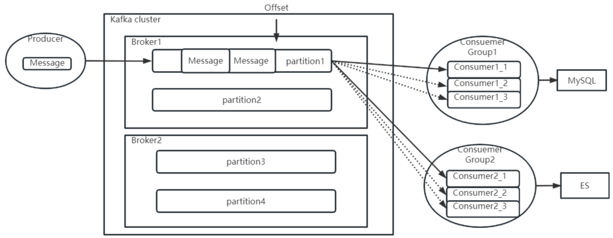

## 客户端工作机制

其实Kafka的设计精髓，是在网络不稳定，服务也随时会崩溃的这些作死的复杂场景下，如何保证消息的高并发、高吞吐，那才是Kafka最为精妙的地方。但是要理解那些复杂的问题，都是需要建立在这个基础模型基础上的

### 消费者分组消费机制

#### `GROUP_ID_CONFIG`

​在Consumer中，都需要指定一个 `GROUP_ID_CONFIG` 属性，这表示当前Consumer所属的消费者组

对应的 `ConsumerConfig` 对应的配置

```java
public static final String GROUP_ID_CONFIG = "group.id";
private static final String GROUP_ID_DOC = "A unique string that identifies the consumer group this consumer belongs to. This property is required if the consumer uses either the group management functionality by using <code>subscribe(topic)</code> or the Kafka-based offset management strategy.";
```

> 既然这里提到了kafka-based offset management strategy，那是不是也有非Kafka管理Offset的策略呢？
>
> 另外，还有一个相关的参数 `GROUP_INSTANCE_ID_CONFIG`, 可以给组成员设置一个固定的instanceId，这个参数通常可以用来减少Kafka不必要的rebalance
>
> 如果没设置，就按照动态的来进行分配member，设置了这个consumer就被视为一个静态的member，可以用来减少 Kafka 组的不必要的rebalance

对于Consumer，如果需要在subcribe时使用组管理功能以及Kafka提供的offset管理策略，那就必须要配置 `GROUP_ID_CONFIG` 属性

这个分组消费机制简单描述就是这样的：



​生产者往Topic下发消息时，会尽量均匀的将消息发送到Topic下的各个Partition当中。而这个消息，会向所有订阅了该Topic的消费者推送。推送时，每个ConsumerGroup中只会推送一份。也就是同一个消费者组中的多个消费者实例，只会共同消费一个消息副本。而不同消费者组之间，会重复消费消息副本。这就是消费者组的作用。

#### rebalance

rebalance 就是 kafka 会合理平衡地为一个消费者组里的消费者分配对应的partition

一个消费者组 是由多个 消费者 组成的，消费者组会共同消费一个或多个 topic 下的所有 分区。但是，当消费者组中的消费者数量发生变化，或者当 Kafka 集群中的分区数量变化时，就会触发 rebalance，即重新分配分区

分区是消费的基本单位，每个分区只能被 一个消费者组内的一个消费者 消费。当消费者组的成员发生变化时，比如增加/减少了消费者，或者 Kafka 中的 topic 分区发生了变化，Kafka 需要通过 rebalance 来确保每个分区有且仅有一个消费者负责消费。

一个 Kafka partition 通常 对应一个 consumer，但这是 针对同一个消费者组（Consumer Group） 的情况

只要不属于同一个消费者组，就可以同时消费同一个partition

#### 偏移量 offset

与之相关的还有Offset偏移量。这个偏移量表示每个消费者组在每个Partiton中已经消费处理的进度。在Kafka中，可以看到消费者组的Offset记录情况。

```shell
./kafka-consumer-groups.sh --bootstrap-server worker1:9092 --describe --group test
```

​这个Offset偏移量，需要消费者处理完成后主动向Kafka的Broker提交

提交完成后，Broker就会更新消费进度，表示这个消息已经被这个消费者组处理完了

但是如果消费者没有提交Offset，Broker就会认为这个消息还没有被处理过，就会重新往对应的消费者组进行推送，不过这次，一般会尽量推送给同一个消费者组当中的其他消费者实例

​在示例当中，是通过业务端主动调用Consumer的`commitAsync`方法或者`commitSync`方法主动提交的，Kafka中自然也提供了自动提交Offset的方式

使用自动提交，只需要在Comsumer中配置ENABLE_AUTO_COMMIT_CONFIG属性即可

从这里可以看到，Offset是Kafka进行消息推送控制的关键之处。这里需要思考两个问题：

- `Offset`是根据`Group`、`Partition`分开记录的。消费者如果一个Partition对应多个Consumer消费者实例，那么每个Consumer实例都会往Broker提交同一个Partition的不同Offset，这时候Broker要听谁的？
  
  所以一个Partition最多只能同时被一个Consumer消费。也就是说，示例中四个Partition的Topic，那么同一个消费者组中最多就只能配置四个消费者实例

- 这么关键的Offset数据，保存在Broker端，但是却是由"不靠谱"的消费者主导推进，这显然是不够安全的。那么应该如何提高Offset数据的安全性呢？
  
  如果你有兴趣自己观察，会发现在Consumer中，实际上也提供了`AUTO_OFFSET_RESET_CONFIG`参数，来指定消费者组在服务端的Offset不存在时如何进行后续消费。(有可能服务端初始化Consumer Group的Offset失败，也有可能Consumer Group当前的Offset对应的数据文件被过期删除了)这就相当于服务端做的兜底保障

> ConsumerConfig.AUTO_OFFSET_RESEWT_CONFIG ：当Server端没有对应的Offset时，要如何处理。 可选项：
>
> - earliest： 自动设置为当前最早的offset
> - latest：自动设置为当前最晚的offset
> - none： 如果消费者组对应的offset找不到，就向Consumer抛异常

有了服务端兜底后，消费者应该要如何保证offset的安全性呢？

异步提交 (效率高，但可能会发生消息丢失)

同步提交 (可靠性高，但效率相对低，可能发生重复处理)

有两种方式：

一种是异步提交。就是消费者在处理业务的同时，异步向Broker提交Offset

这样好处是消费者的效率会比较高，但是如果消费者的消息处理失败了，而offset又成功提交了, 这就会造成**消息丢失**。

另一种方式是同步提交。消费者保证处理完所有业务后，再提交Offset

这样的好处自然是消息不会因为offset丢失了。因为如果业务处理失败，消费者就可以不去提交Offset，这样消息还可以重试。

但是坏处是消费者处理信息自然就慢了。另外还会产生消息重复。

因为Broker端不可能一直等待消费者提交, 如果消费者的业务处理时间比较长，这时在消费者正常处理消息的过程中，Broker端就已经等不下去了，认为这个消费者处理失败了。

这时就会往同组的其他消费者实例投递消息，这就造成了**消息重复处理**

##### 可能解决方案

其实这类问题的根源在于Offset反映的是消息的处理进度。而消息处理进度跟业务的处理进度又是不同步的。所有我们可以换一种思路，将Offset从Broker端抽取出来，放到第三方存储比如Redis里自行管理。这样就可以自己控制用业务的处理进度推进Offset往前更新。

### 生产者拦截器机制

​生产者拦截机制允许客户端在生产者在消息发送到Kafka集群之前，对消息进行拦截，甚至可以修改消息内容

这涉及到Producer中指定的一个参数：`INTERCEPTOR_CLASSES_CONFIG`

```java
public static final String INTERCEPTOR_CLASSES_CONFIG = "interceptor.classes";
public static final String INTERCEPTOR_CLASSES_DOC = "A list of classes to use as interceptors. Implementing the <code>org.apache.kafka.clients.producer.ProducerInterceptor</code> interface allows you to intercept (and possibly mutate) the records received by the producer before they are published to the Kafka cluster. By default, there are no interceptors.";
```

按照他的说明，我们可以定义一个自己的拦截器实现类：

```java
public class MyInterceptor implements ProducerInterceptor {
  //发送消息时触发
  @Override
  public ProducerRecord onSend(ProducerRecord producerRecord) {
      System.out.println("prudocerRecord : " + producerRecord.toString());
      return producerRecord;
  }

  //收到服务端响应时触发
  @Override
  public void onAcknowledgement(RecordMetadata recordMetadata, Exception e) {
      System.out.println("acknowledgement recordMetadata:"+recordMetadata.toString());
  }

  //连接关闭时触发
  @Override
  public void close() {
      System.out.println("producer closed");
  }

  //整理配置项
  @Override
  public void configure(Map<String, ?> map) {
      System.out.println("=====config start======");
      for (Map.Entry<String, ?> entry : map.entrySet()) {
          System.out.println("entry.key:"+entry.getKey()+" === entry.value: "+entry.getValue());
      }
      System.out.println("=====config end======");
  }
}
```

然后在生产者中指定拦截器类（多个拦截器类，用逗号隔开）

```java
props.put(ProducerConfig.INTERCEPTOR_CLASSES_CONFIG,"com.roy.kfk.basic.MyInterceptor");
```

拦截器机制一般用得比较少，主要用在一些统一添加时间等类似的业务场景。比如，用Kafka传递一些POJO，就可以用拦截器统一添加时间属性。但是我们平常用Kafka传递的都是String类型的消息，POJO类型的消息，Kafka可以传吗？这就要用到下面的消息序列化机制

### 消息序列化机制

#### Producer的序列化

​在之前的简单示例中，Producer指定了两个属性`KEY_SERIALIZER_CLASS_CONFIG`和`VALUE_SERIALIZER_CLASS_CONFIG`，对于这两个属性，在ProducerConfig中都有配套的说明属性

```java
public static final String KEY_SERIALIZER_CLASS_CONFIG = "key.serializer";
public static final String KEY_SERIALIZER_CLASS_DOC = "Serializer class for key that implements the <code>org.apache.kafka.common.serialization.Serializer</code> interface.";
public static final String VALUE_SERIALIZER_CLASS_CONFIG = "value.serializer";
public static final String VALUE_SERIALIZER_CLASS_DOC = "Serializer class for value that implements the <code>org.apache.kafka.common.serialization.Serializer</code> interface.";
```

通过这两个参数，可以指定消息生产者如何将消息的key和value序列化成二进制数据

在Kafka的消息定义中，key和value的作用是不同的

- key是用来进行分区的可选项。Kafka通过key来判断消息要分发到哪个Partition
- Value是业务上比较关心的消息。Kafka同样需要将Value对象通过Serializer序列化接口，将Key转换成byte[]数组，这样才能比较好的在网络上传输Value信息，以及将Value信息落盘到操作系统的文件当中

如果没有填写key，那么Kafka会自动选择Partition

如果填写了key，那么会通过声明的Serializer序列化接口，将key转换成一个byte[]数组，然后对key进行hash，选择Partition。这样可以保证key相同的消息会分配到相同的Partition中

#### Consumer的反序列化

生产者要对消息进行序列化，那么消费者拉取消息时，自然需要进行反序列化

所以，在Consumer中，也有反序列化的两个配置

```java
public static final String KEY_DESERIALIZER_CLASS_CONFIG = "key.deserializer";
public static final String KEY_DESERIALIZER_CLASS_DOC = "Deserializer class for key that implements the <code>org.apache.kafka.common.serialization.Deserializer</code> interface.";
public static final String VALUE_DESERIALIZER_CLASS_CONFIG = "value.deserializer";
public static final String VALUE_DESERIALIZER_CLASS_DOC = "Deserializer class for value that implements the <code>org.apache.kafka.common.serialization.Deserializer</code> interface.";
```

与 Producer 的序列化机制相反，Consumer的反序列化是将从Kafka得到的消息二进制数据反序列化为对应的 key 和 value，以便后续的业务操作

#### 自定义序列化

在Kafka中，对于常用的一些基础数据类型，都已经提供了对应的实现类。但是，如果需要使用一些自定义的消息格式，比如自己定制的POJO，就需要定制具体的实现类了


​在自己进行序列化机制时，需要考虑的是如何用二进制来描述业务数据

例如对于一个通常的POJO类型，可以将他的属性拆分成两种类型：

一种类型是定长的基础类型，比如Integer,Long,Double等

这些基础类型转化成二进制数组都是定长的。这类属性可以直接转成序列化数组，在反序列化时，只要按照定长去读取二进制数据就可以反序列化了

另一种是不定长的浮动类型，比如String，或者基于String的JSON类型等

这种浮动类型的基础数据转化成二进制数组，长度都是不一定的

对于这类数据，通常的处理方式都是先往二进制数组中写入一个定长的数据的长度数据(Integer或者Long类型)，然后再继续写入数据本身

这样，反序列化时，就可以先读取一个定长的长度，再按照这个长度去读取对应长度的二进制数据，这样就能读取到数据的完整二进制内容

> 序列化机制是在高并发场景中非常重要的一个优化机制
>
> 高效的系列化实现能够极大的提升分布式系统的网络传输以及数据落盘的能力
>
> 例如对于一个User对象，即可以使用JSON字符串这种简单粗暴的序列化方式，也可以选择按照各个字段进行组合序列化的方式。但是显然后者的占用空间比较小，序列化速度也会比较快。而Kafka在文件落盘时，也设计了非常高效的数据序列化实现，这也是Kafka高效运行的一大支撑。
>
> 在很多其他业务场景中，也需要我们提供更高效的序列化实现
>
> 例如使用MapReduce框架时，就需要自行定义数据的序列化方式。使用Netty框架进行网络调用时，为了防止粘包，也需要定制数据的序列化机制。在这些场景下，进行序列化的基础思想，和我们这里介绍的也是一样的。当然，如果我们可以进一步设计出更简短高效的数据压缩算法，那也就能更进一步提高数据传输的效率。比如对二进制数据进行压缩。而这就是算法最直接的作用

### 消息分区路由机制

消息如何进行路由，也就是发送的消息到底是根据什么来存储到对应的Topic的指定Partition下的呢

- 对于 Producer，会根据消息的key选择Partition，那具体如何通过key找Partition呢？
- 一个消费者组会共同消费一个Topic下的多个Partition中的同一套消息副本，那具体到对应的Consumer节点是不是可以决定自己消费哪些Partition的消息呢？


这两个问题不难，同样的方法，依旧去对应的Config类进行查找即可

#### Producer 发送消息的路由机制 `PARTITIONER_CLASS_CONFIG`

当给定了 `PARTITIONER_CLASS_CONFIG` 的属性就可以自定义Producer的分区机制(决定发送的消息到哪个Partition)

具体说明如下

```java
public static final String PARTITIONER_CLASS_CONFIG = "partitioner.class";
private static final String PARTITIONER_CLASS_DOC = "Determines which partition to send a record to when records are produced. Available options are: " + 
"<ul>" + 
"<li>If not set, the default partitioning logic is used. This strategy send records to a partition until at least batch.size bytes is produced to the partition." + 
"It works with the strategy:"+
"<ol>"+
"<li>If no partition is specified but a key is present, choose a partition based on a hash of the key.</li>"+
"<li>If no partition or key is present, choose the sticky partition that changes when at least batch.size bytes are produced to the partition.</li></ol></li>"+
"<li><code>org.apache.kafka.clients.producer.RoundRobinPartitioner</code>:" +
"A partitioning strategy where each record in a series of consecutive records is sent to a different partition, regardless of whether the 'key' is provided or not, until partitions run out and the process starts over again."+
"Note: There's a known issue that will cause uneven distribution when a new batch is created. See KAFKA-9965 for more detail."+
"</li></ul>"+
"<p>Implementing the <code>org.apache.kafka.clients.producer.Partitioner</code> interface allows you to plug in a custom partitioner.";
```

如果没有设置该属性，那么会采用默认的分区机制

| **场景** | **策略名称** | **行为逻辑** |
| --- | --- | --- |
| **默认 (有 Key)** | Hash 策略 | 相同 Key -> 相同分区 |
| **默认 (无 Key)** | **Sticky 策略** | 填满一个 batch.size 后再换分区 |
| **指定 RoundRobin** | 轮询策略 | 强制轮流发，忽略 Key (绝对均衡，但可能牺牲性能) |
| **自定义** | Custom | 你通过代码自己决定 |

##### `Partitioner`接口

如果我们要自定义分区策略，那么就需要实现 `org.apache.kafka.clients.producer.Partitioner` 接口，并在传参数时指定 `PARTITIONER_CLASS_CONFIG` 为我们自定义实现类

```java
public interface Partitioner extends Configurable, Closeable {
  int partition(String var1, Object var2, byte[] var3, Object var4, byte[] var5, Cluster var6);

  void close();

  /** @deprecated */
  @Deprecated
  default void onNewBatch(String topic, Cluster cluster, int prevPartition) {
  }
}
```

这里就说明了Kafka是通过一个Partitioner接口的具体实现来决定一个消息如何根据Key分配到对应的Partition上的。你甚至可以很简单的实现一个自己的分配策略。

​在之前的3.2.0版本，Kafka提供了三种默认的Partitioner实现类，`RoundRobinPartitioner`，`DefaultPartitioner`和`UniformStickyPartitioner`

目前后面两种实现已经标记为过期，被替换成了默认的实现机制

对于生产者，默认的Sticky策略在给一个生产者分配了一个分区后，会尽可能一直使用这个分区

等待该分区的batch.size(默认16K)已满，或者这个分区的消息已完成 linger.ms(默认0毫秒，表示如果batch.size迟迟没有满后的等待时间)

RoundRobinPartitioner是在各个Partition中进行轮询发送，这种方式没有考虑到消息大小以及各个Broker性能差异，用得比较少。

​另外可以自行指定一个Partitioner实现类，定制分区逻辑。

在Partitioner接口中，核心要实现的就是partition方法。根据相关信息，选择一个Partition。比如用key对partition的个数取模之类的。而Topic下的所有Partition信息都在cluster参数中。

##### `DefaultPartitioner`

```java
/** @deprecated */
@Deprecated
public class DefaultPartitioner implements Partitioner {
  private final StickyPartitionCache stickyPartitionCache = new StickyPartitionCache();

  public void configure(Map<String, ?> configs) {
  }

  public int partition(String topic, Object key, byte[] keyBytes, Object value, byte[] valueBytes, Cluster cluster) {
      return this.partition(topic, key, keyBytes, value, valueBytes, cluster, cluster.partitionsForTopic(topic).size());
  }

  public int partition(String topic, Object key, byte[] keyBytes, Object value, byte[] valueBytes, Cluster cluster, int numPartitions) {
      return keyBytes == null ? this.stickyPartitionCache.partition(topic, cluster) : BuiltInPartitioner.partitionForKey(keyBytes, numPartitions);
  }

  public void close() {
  }

  public void onNewBatch(String topic, Cluster cluster, int prevPartition) {
      this.stickyPartitionCache.nextPartition(topic, cluster, prevPartition);
  }
}
```

默认方法同样是 如果没有 Key -> 走 sticky 如果有 Key -> 走 BuiltInPartitioner.partitionForKey (哈希)

但可以看到有标注注解 `@Deprecated`

问 Gemini 是说性能优化

在旧版本（Kafka 3.3 之前），默认流程是这样的：

1. 你没配 partitioner.class。
2. Kafka 默认帮你把 partitioner.class 设置为 DefaultPartitioner。
3. Kafka 通过反射加载这个类，实例化它。

每发一条消息，都要通过 Partitioner 接口调用 这个类的方法

现在（Kafka 3.3+）的流程是这样的：

Kafka 团队认为：既然 99% 的人都在用默认策略，为什么还要走“反射加载”和“接口虚方法调用”这种甚至有点慢的“插件化”流程呢？

于是他们做了一个改动：

1. 如果你不配置 partitioner.class（留空）。
2. Kafka Producer 不会再去加载 DefaultPartitioner 这个类了。
3. Producer 内部会直接调用内置的高效逻辑（逻辑和 DefaultPartitioner 一模一样，但不需要经过这个类的包装）

去 `org.apache.kafka.clients.producer.KafkaProducer` 类中可以找到对应的方法

```java
private int partition(ProducerRecord<K, V> record, byte[] serializedKey, byte[] serializedValue, Cluster cluster) {
  // 【情况 1：指定分区】
  // 如果你在发消息时代码里写死了分区：new ProducerRecord(topic, partition, key, value)
  // 优先级最高，直接用，不走任何计算逻辑。
  if (record.partition() != null) {
      return record.partition();
  } 
  
  // 【情况 2：外包模式 (Plugin Path)】
  // 这里就是重点！如果你在配置里设置了 partitioner.class = ...
  // 不管你是设置了自定义的类，还是显式设置了那个过时的 DefaultPartitioner，
  // this.partitioner 都不会是 null。
  else if (this.partitioner != null) {
      // 于是这里会走“接口调用”，进入你指定的类里去算。
      int customPartition = this.partitioner.partition(record.topic(), record.key(), serializedKey, record.value(), serializedValue, cluster);
      if (customPartition < 0) {
          throw new IllegalArgumentException(String.format("The partitioner generated an invalid partition number: %d. Partition number should always be non-negative.", customPartition));
      } else {
          return customPartition;
      }
  } 
  
  // 【情况 3：直营模式 (Internal Fast Path)】
  // 这就是现在默认的高效路径！
  // 如果你没配 partitioner.class，this.partitioner 就是 null，直接进这里。
  else {
    // 逻辑：
    // 1. 如果有 Key (serializedKey != null) 且没忽略 Key：直接调用内置静态方法算 Hash。
    // 2. 如果没有 Key：返回 -1。
    return serializedKey != null && !this.partitionerIgnoreKeys ? 
            BuiltInPartitioner.partitionForKey(serializedKey, cluster.partitionsForTopic(record.topic()).size()) : 
            -1;
  }
}
```

在【情况 3】中，如果没有 Key，它竟然返回了-1

这就是性能优化的核心所在：

- 以前 (DefaultPartitioner)： 如果没有 Key，DefaultPartitioner 会在一个外部类里算好“当前应该粘在哪个分区”，然后把计算好的分区号（比如 3）返回给 Producer。
- 现在 (返回 -1)： Producer 拿到 -1，并不是报错，而是代表一个信号：“我不在这一层决定分区”。 它会把消息传给下游的 RecordAccumulator（消息累加器）。累加器发现分区是 -1，就会直接根据当前哪个批次（Batch）没满，直接塞进去。

优势： 这种判断逻辑更靠近底层的数据结构，减少了上层不必要的计算和锁竞争，这就是为什么它被称为“直营模式”更高效的原因

##### `RoundRobinPartitioner`

```java
public class RoundRobinPartitioner implements Partitioner {
  // 定义了一个自增器
  // key: Topic value: 当前的partition (原子类实现并发)
  private final ConcurrentMap<String, AtomicInteger> topicCounterMap = new ConcurrentHashMap();

  public void configure(Map<String, ?> configs) {
  }

  public int partition(String topic, Object key, byte[] keyBytes, Object value, byte[] valueBytes, Cluster cluster) {
    // 得到当前的分区原始索引值
    int nextValue = this.nextValue(topic);
    // 获取当前Topic的总分区数
    List<PartitionInfo> availablePartitions = cluster.availablePartitionsForTopic(topic);
    if (!availablePartitions.isEmpty()) {
      // 优先在“活着”的分区里轮询
      // 取模运算，转到对应分区
      int part = Utils.toPositive(nextValue) % availablePartitions.size();
      return ((PartitionInfo)availablePartitions.get(part)).partition();
    } else {
      // 如果所有分区都挂了（或者不可用），那就死马当活马医，在“所有”分区里轮询
      int numPartitions = cluster.partitionsForTopic(topic).size();
      return Utils.toPositive(nextValue) % numPartitions;
    } 
  }

  private int nextValue(String topic) {
    // 如果是第一次见这个 topic，创建一个新的计数器（从0开始）
    AtomicInteger counter = (AtomicInteger)this.topicCounterMap.computeIfAbsent(topic, (k) -> new AtomicInteger(0));
    // 返回当前值，并加 1
    return counter.getAndIncrement();
  }

  public void close() {
  }
}
```

这种策略极其简单且公平，但正如官方文档提到的，它有一个致命缺点：它破坏了“粘性（Sticky）”。如果并发量大，它会导致 Producer 无法有效地将消息打包成 Batch（因为每条消息都换了地方），从而导致网络请求次数激增，效率下降

#### Consumer 接受消息的路由机制 `PARTITION_ASSIGNMENT_STRATEGY`

在Consumer中，可以指定一个PARTITION_ASSIGNMENT_STRATEGY分区分配策略，决定如何在多个Consumer实例和多个Partitioner之间建立关联关系

```java
public static final String PARTITION_ASSIGNMENT_STRATEGY_CONFIG = "partition.assignment.strategy";
private static final String PARTITION_ASSIGNMENT_STRATEGY_DOC = "A list of class names or class types, ordered by preference, of supported partition assignment strategies that the client will use to distribute partition ownership amongst consumer instances when group management is used." + 
"Available options are:"+
"<ul>"+
"<li>"+
"<code>org.apache.kafka.clients.consumer.RangeAssignor</code>:"+
"Assigns partitions on a per-topic basis."+
"</li>"+
"<li>"+
"<code>org.apache.kafka.clients.consumer.RoundRobinAssignor</code>:"+
"Assigns partitions to consumers in a round-robin fashion.</li>"+
"<li>"+
"<code>org.apache.kafka.clients.consumer.StickyAssignor</code>:"+
"Guarantees an assignment that is maximally balanced while preserving as many existing partition assignments as possible.</li>"+
"<li>"+
"<code>org.apache.kafka.clients.consumer.CooperativeStickyAssignor</code>: Follows the same StickyAssignor logic, but allows for cooperative rebalancing.</li></ul>"+
"<p>The default assignor is [RangeAssignor, CooperativeStickyAssignor], which will use the RangeAssignor by default, but allows upgrading to the CooperativeStickyAssignor with just a single rolling bounce that removes the RangeAssignor from the list.</p>"+
"<p>Implementing the <code>org.apache.kafka.clients.consumer.ConsumerPartitionAssignor</code> interface allows you to plug in a custom assignment strategy.</p>";
```

同样，Kafka内置了一些实现方式，在通常情况下也都是最优的选择。你也可以实现自己的分配策略。

​从上面介绍可以看到Kafka默认提供了三种消费者的分区分配策略

- `RangeAssignor`策略: 比如一个Topic有10个Partiton(partition 0-9) 一个消费者组下有三个Consumer(consumer1-3)。Range策略就会将分区0-3分给一个Consumer，4-6给一个Consumer，7-9给一个Consumer。
- `RoundRobinAssignor`策略：轮询分配策略，可以理解为在Consumer中一个一个轮流分配分区。比如0，3，6，9分区给一个Consumer1，1，4，7分区给一个Consumer2，然后2，5，8给一个Consumer3
- `CooperativeStickyAssignor`策略：粘性策略, 这个策略有两个原则：
  1. 在开始分区时，尽量保持分区的分配均匀。比如按照Range策略分(这一步实际上是随机的)。
  2. 分区的分配尽可能的与上一次分配的保持一致。比如在range分区的情况下，第三个Consumer的服务宕机了，那么按照sticky策略，就会保持consumer1和consumer2原有的分区分配情况。然后将consumer3分配的7~9分区尽量平均的分配到另外两个consumer上。这种粘性策略可以很好的保持Consumer的数据稳定性。
- 可以通过继承`AbstractPartitionAssignor`抽象类自定义消费者的订阅方式

官方默认提供的生产者端的默认分区器以及消费者端的RangeAssignor+CooperativeStickyAssignor分配策略，在大部分场景下都是非常高效的算法。深入理解这些算法，对于你深入理解MQ场景，以及借此去横向对比理解其他的MQ产品，都是非常有帮助的。

##### 消费者组如何确定分区

Consumer 确定分区的过程，实际上就是 Consumer Group Leader（消费者组中的一个主节点）运行对应分区策略代码，计算好分配方案，然后同步给组内其他 Consumer 的过程

以 `RangeAssignor` 策略分析

核心逻辑可以总结为：按 Topic 独立计算，将分区按数字顺序切分成段，依次分给排序后的消费者
