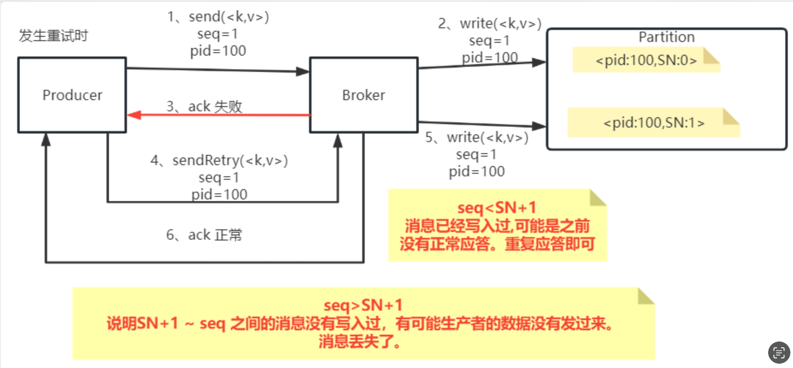
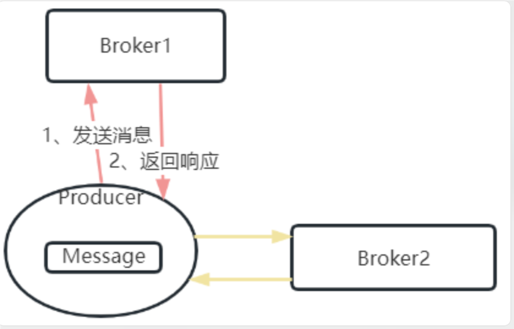
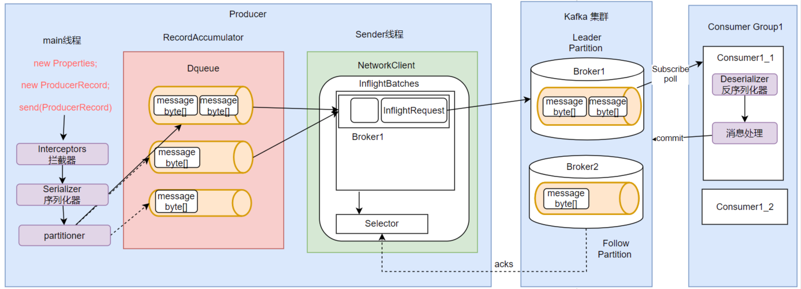

## 客户端工作机制2

### 生产者消息缓存机制

目前已经分析了消费者组、消息发送和接受时的序列化和反序列化，以及具体消息发送是到哪个partition和consumer接受哪个partition的消息

接下来就是如何具体发送消息了

​Kafka生产者为了避免高并发请求对服务端造成过大压力，每次发消息时并不是一条一条发往服务端，而是增加了一个高速缓存，将消息集中到缓存后，批量进行发送。这种缓存机制也是高并发处理时非常常用的一种机制

Kafka的消息缓存机制涉及到KafkaProducer中的两个关键组件： `accumulator` 和 `sender`

```java
//1.记录累加器
int batchSize = Math.max(1, config.getInt(ProducerConfig.BATCH_SIZE_CONFIG));
this.accumulator = new RecordAccumulator(logContext,batchSize,this.compressionType,lingerMs(config),retryBackoffMs,deliveryTimeoutMs, partitionerConfig,metrics,PRODUCER_METRIC_GROUP_NAME,time,apiVersions,transactionManager,new BufferPool(this.totalMemorySize, batchSize, metrics, time, PRODUCER_METRIC_GROUP_NAME));
//2. 数据发送线程
this.sender = newSender(logContext, kafkaClient, this.metadata);
```


#### `RecordAccumulator`

RecordAccumulator，就是Kafka生产者的消息累加器

KafkaProducer要发送的消息都会在`ReocrdAccumulator`中缓存起来，然后再分批发送给kafka broker

在我们调用 Producer 的 `send` 方法时，最终就会调用将我们的 `Record` 存到累加器里

```java
RecordAccumulator.RecordAppendResult result = this.accumulator.append(record.topic(), partition, timestamp, serializedKey, serializedValue, headers, appendCallbacks, remainingWaitMs, abortOnNewBatch, nowMs, cluster);
```

成功存完之后，再会去尝试唤醒 sender 来实现消息发送

在`RecordAccumulator`中，其每一个Deque双端队列对应的是具体一个Topic下的一个Partition

这些Dequeue队列基本上是和Kafka服务端的Topic下的Partition对应的

每个Dequeue里会放入若干个ProducerBatch数据

KafkaProducer每次发送的消息，都会根据key分配到对应的Deque队列中, 然后每个消息都会保存在这些队列中的某一个ProducerBatch中

而消息分发的规则，就是由上面的Partitioner组件完成的, 来选择把这个消息发到哪个Partition，即内部是存到哪个 Dequeue 里面

##### 主要参数 `BUFFER_MEMORY_CONFIG` + `BATCH_SIZE_CONFIG`

对于 `RecordAccumulator` 主要涉及两个参数

- `BUFFER_MEMORY_CONFIG`：就是这个累加器缓冲区的总大小
- `BATCH_SIZE_CONFIG`：缓冲区每一个batch的大小，作为发送的最小单位 (默认 16K)

```java
//RecordAccumulator缓冲区大小
public static final String BUFFER_MEMORY_CONFIG = "buffer.memory";
private static final String BUFFER_MEMORY_DOC = "The total bytes of memory the producer can use to buffer records waiting to be sent to the server." + 
"If records are sent faster than they can be delivered to the server the producer will block for <code>max.block.ms</code> after which it will throw an exception." + 
"<p>This setting should correspond roughly to the total memory the producer will use, but is not a hard bound since not all memory the producer uses is used for buffering." + 
"Some additional memory will be used for compression (if compression is enabled) as well as for maintaining in-flight requests.";


//缓冲区每一个batch的大小
public static final String BATCH_SIZE_CONFIG = "batch.size";
private static final String BATCH_SIZE_DOC = "The producer will attempt to batch records together into fewer requests whenever multiple records are being sent to the same partition."+
"This helps performance on both the client and the server. This configuration controls the default batch size in bytes." + 
"<p>No attempt will be made to batch records larger than this size."+
"<p>Requests sent to brokers will contain multiple batches, one for each partition with data available to be sent.<p>"+
"A small batch size will make batching less common and may reduce throughput (a batch size of zero will disable batching entirely)."+
"A very large batch size may use memory a bit more wastefully as we will always allocate a buffer of the specified batch size in anticipation of additional records."+
"<p>Note: This setting gives the upper bound of the batch size to be sent."+
"If we have fewer than this many bytes accumulated for this partition, we will 'linger' for the <code>linger.ms</code> time waiting for more records to show up."+
"This <code>linger.ms</code> setting defaults to 0, which means we'll immediately send out a record even the accumulated batch size is under this <code>batch.size</code> setting.";
```

#### `Sender`


sender就是KafkaProducer中用来发送消息的一个单独的线程

从这里可以看到，每个KafkaProducer对象都对应一个sender线程

他会负责将RecordAccumulator中的消息发送给Kafka

Sender也并不是一次就把RecordAccumulator中缓存的所有消息都发送出去，而是每次只拿一部分消息

他只获取`RecordAccumulator`中缓存内容达到`BATCH_SIZE_CONFIG`大小的`ProducerBatch`消息

当然，如果消息比较少，`ProducerBatch`中的消息大小长期达不到`BATCH_SIZE_CONFIG`的话，Sender也不会一直等待，最多等待`LINGER_MS_CONFIG`时长，然后就会将`ProducerBatch`中的消息读取出来

`LINGER_MS_CONFIG`默认值是0，这意味着 Sender 默认是不会等待的

​然后，Sender对读取出来的消息，会以Broker为key，缓存到一个对应的队列当中 (`InflightBatches`)

这些队列当中的消息就称为`InflightRequest`

接下来这些`Inflight`就会一一发往Kafka对应的Broker中，直到收到Broker的响应，才会从队列中移除

这些队列也并不会无限缓存，最多缓存`MAX_IN_FLIGHT_REQUESTS_PER_CONNECTION`(默认值为5)个请求

即每次 累加器唤醒sender时，它就会根据对应的设置`MAX_IN_FLIGHT_REQUESTS_PER_CONNECTION` 默认从累加器中最多拉取5条消息放到 `InflightBatches`中，然后去发给kafka的Broker

然后发送过去不会立刻又发，会等待 Broker 返回响应确认消息已经成功发送了 (ack应答)

> 生产者缓存机制的主要目的是将消息打包，减少网络IO频率。所以，在Sender的InflightRequest队列中，消息也不是一条一条发送给Broker的，而是一批消息一起往Broker发送。而这就意味着这一批消息是没有固定的先后顺序的。

##### sender 什么时候去 Deque 拉取消息

当一个`Dequeue`中消息容量超过了设定的 `BATCH_SIZE_CONFIG`，那么就会唤醒sender，叫他来收信息去发送

```java
//org.apache.kafka.clients.producer.KafkaProducer#doSend
if (result.batchIsFull || result.newBatchCreated) {
  log.trace("Waking up the sender since topic {} partition {} is either full or getting a new batch", record.topic(), appendCallbacks.getPartition());
  this.sender.wakeup();
}
```

或者等待时间超过了 `LINGER_MS_CONFIG`，那么 sender 也会自动去拉取一批消息

##### 主要参数 `LINGER_MS_CONFIG` + `MAX_IN_FLIGHT_REQUESTS_PER_CONNECTION`

- `LINGER_MS_CONFIG`：默认0，意思默认情况下不会等你装满，而是一直会尝试拉取消息去发送
- `MAX_IN_FLIGHT_REQUESTS_PER_CONNECTION`：默认是5，

这两个被标记 `@Deprecated`, 为了确保幂等性，`MAX_IN_FLIGHT_REQUESTS_PER_CONNECTION` 必须小于5

Kafka 社区希望用户 只关注“开启幂等性”这一高层意图，而不必去微调底层的 max.in.flight 参数

```java
public static final String LINGER_MS_CONFIG = "linger.ms";
private static final String LINGER_MS_DOC = "The producer groups together any records that arrive in between request transmissions into a single batched request. Normally this occurs only under load when records arrive faster than they can be sent out. However in some circumstances the client may want to reduce the number of requests even under moderate load. This setting accomplishes this by adding a small amount of artificial delay&mdash;that is, rather than immediately sending out a record, the producer will wait for up to the given delay to allow other records to be sent so that the sends can be batched together. This can be thought of as analogous to Nagle's algorithm in TCP. This setting gives the upper bound on the delay for batching: once we get <code>batch.size</code> worth of records for a partition it will be sent immediately regardless of this setting, however if we have fewer than this many bytes accumulated for this partition we will 'linger' for the specified time waiting for more records to show up. This setting defaults to 0 (i.e. no delay). Setting <code>linger.ms=5</code>, for example, would have the effect of reducing the number of requests sent but would add up to 5ms of latency to records sent in the absence of load.";

private static final int MAX_IN_FLIGHT_REQUESTS_PER_CONNECTION_FOR_IDEMPOTENCE = 5;
public static final String MAX_IN_FLIGHT_REQUESTS_PER_CONNECTION = "max.in.flight.requests.per.connection";
private static final String MAX_IN_FLIGHT_REQUESTS_PER_CONNECTION_DOC = "The maximum number of unacknowledged requests the client will send on a single connection before blocking."+
"Note that if this configuration is set to be greater than 1 and <code>enable.idempotence</code> is set to false, there is a risk of message reordering after a failed send due to retries (i.e., if retries are enabled);"+
"if retries are disabled or if <code>enable.idempotence</code> is set to true, ordering will be preserved."+
"Additionally, enabling idempotence requires the value of this configuration to be less than or equal to 5."+
"If conflicting configurations are set and idempotence is not explicitly enabled, idempotence is disabled. ";
```

最后，Sender会通过其中的一个Selector组件完成与Kafka的IO请求，并接收Kafka的响应, 成功拿到ACK响应后，才会把对应的消息移除掉

Kafka的生产者缓存机制是Kafka面对海量消息时非常重要的优化机制

合理优化这些参数，对于Kafka集群性能提升是非常重要的

比如如果你的消息体比较大，那么应该考虑加大batch.size，尽量提升batch的缓存效率

而如果Producer要发送的消息确实非常多，那么就需要考虑加大total.memory参数，尽量避免缓存不够造成的阻塞

如果发现生产者发送消息比较慢，那么可以考虑提升`max.in.flight.requests.per.connection`参数，这样能加大消息发送的吞吐量

### 发送应答机制

在Producer将消息发送到Broker后，要怎么确定消息是不是成功发到Broker上了呢？

​这是在开发过程中比较重要的一个机制，也是面试过程中最喜欢问的一个机制

这里涉及到的，就是在Producer端一个不太起眼的属性`ACKS_CONFIG`

这说明判断消息是否成功接收，这个设置是由我们客户端决定的，然后进行处理，而不是由服务端kafka决定的

```java
public static final String ACKS_CONFIG = "acks";
private static final String ACKS_DOC = "The number of acknowledgments the producer requires the leader to have received before considering a request complete."+
"This controls the  durability of records that are sent. The following settings are allowed:"+
"<ul>"+
"<li><code>acks=0</code> If set to zero then the producer will not wait for any acknowledgment from the server at all."+
"The record will be immediately added to the socket buffer and considered sent."+
"No guarantee can be made that the server has received the record in this case,"+
"and the <code>retries</code> configuration will not take effect (as the client won't generally know of any failures)."+
"The offset given back for each record will always be set to <code>-1</code>."+
"<li><code>acks=1</code> This will mean the leader will write the record to its local log but will respond without awaiting full acknowledgement from all followers."+
"In this case should the leader fail immediately after acknowledging the record but before the followers have replicated it then the record will be lost."+
"<li><code>acks=all</code> This means the leader will wait for the full set of in-sync replicas to acknowledge the record."+
"This guarantees that the record will not be lost as long as at least one in-sync replica remains alive."+
"This is the strongest available guarantee. This is equivalent to the acks=-1 setting.</ul>"+
"<p>Note that enabling idempotence requires this config value to be 'all'."+
"If conflicting configurations are set and idempotence is not explicitly enabled, idempotence is disabled.";
```

​官方给出的这段解释，同样比任何外部的资料都要准确详细了

如果你理解了Topic的分区模型，这个属性就非常容易理解了

这个属性更大的作用在于保证消息的安全性，尤其在`replica-factor`备份因子比较大的Topic中，尤为重要

- `acks=0`，生产者不关心Broker端有没有将消息写入到Partition，只发送消息就不管了。吞吐量是最高的，但是数据安全性是最低的
- `acks=1`，则是一种相对中和的策略。Leader Partition在完成自己的消息写入后，就向生产者返回结果
- `acks=all or -1`，生产者需要等Broker端的所有Partiton(Leader Partition以及其对应的Follower Partition)都写完了才能得到返回结果，这样数据是最安全的，但是每次发消息需要等待更长的时间，吞吐量是最低的。

> 在生产环境中，acks=0可靠性太差，很少使用。acks=1，一般用于传输日志等，允许个别数据丢失的场景。使用范围最广。acks=-1，一般用于传输敏感数据，比如与钱相关的数据

#### `ack=1 or -1`

​如果ack设置为all或者-1，Kafka也并不是强制要求所有Partition都写入数据后才响应

实际上默认Broker只要成功同步一个Follower，就会向服务端返回响应 (建议设置为副本数的一半)

在Kafka的Broker服务端会有一个配置参数`min.insync.replicas`，控制Leader Partition在完成多少个Partition的消息写入后，往Producer返回响应

这个参数可以在broker.conf文件中进行配置

```conf
min.insync.replicas
When a producer sets acks to "all" (or "-1"), min.insync.replicas specifies the minimum number of replicas that must acknowledge a write for the write to be considered successful. If this minimum cannot be met, then the producer will raise an exception (either NotEnoughReplicas or NotEnoughReplicasAfterAppend).
When used together, min.insync.replicas and acks allow you to enforce greater durability guarantees. A typical scenario would be to create a topic with a replication factor of 3, set min.insync.replicas to 2, and produce with acks of "all". This will ensure that the producer raises an exception if a majority of replicas do not receive a write.

Type: int
Default: 1
Valid Values: [1,...]
Importance: high
Update Mode: cluster-wide
```

关于消息应答机制，最后强调一点：acks设置成all或者-1，能够有效提高消息的安全性。但是从消息安全性方面考虑，应答机制只是保证Broker可以给Producer一个比较靠谱的响应，但并不代表就保证了消息不丢失

即设置了 ACK 机制目的只是来让服务端知道这个消息是传递成功了还是失败了，然后根据后续结果来自己决定该怎么处理，比如消息丢失的情况

`Producer`拿到响应后如何进行后续处理，Kafka是不参与的。

```java
RecordMetadata recordMetadata = producer.send(record).get();
```

通过ACKs机制，可以保证拿到这个 `RecordMetadata` 这个响应结果是什么状态，而之后怎么处理服务端是不管的

#### 幂等性要求

acks机制的配置不光影响到客户端什么时候收到相应，同时在服务端还影响到消息幂等性机制(idempotence)

(幂等性)当我消息发过去了，成功了服务端就应该只记录一条消息，消费者也只有一条信息

网络是不靠谱的，如果生产者发送了一条信息，成功传给了broker，对应服务端也保存了，但是在发送 ack 请求的时候丢了，那么生产者等不到消息就默认发送失败了，那又会重新发送，这就导致本来存过一次的消息又存了一遍，这就需要确保幂等性

那么服务端就需要处理这种特殊情况，从而可以保证消息的幂等性

### 生产者消息幂等性

源码中对于acks属性的说明，会看到另外一个单词，idempotence 这个单词的意思就是幂等性

#### 幂等性问题

之前分析过，当Producer的acks设置成1或-1时，Producer每次发送消息都是需要获取Broker端返回的RecordMetadata的。这个过程中就需要两次跨网络请求


如果要保证消息安全，那么对于每个消息，这两次网络请求就必须要求是幂等的

但是，网络是不靠谱的，在高并发场景下，往往没办法保证这两个请求是幂等的

Producer发送消息的过程中，如果第一步请求成功了，但是第二步却没有返回，这时，Producer就会认为消息发送失败了，那么Producer必然会发起重试

重试次数由参数`ProducerConfig.RETRIES_CONFIG`，默认值是`Integer.MAX`

这时问题就来了, Producer会重复发送多条消息到Broker中, Kafka如何保证无论Producer向Broker发送多少次重复的数据，Broker端都只保留一条消息，而不会重复保存多条消息呢？

这就是Kafka消息生产者的幂等性问题

##### 分布式数据传递三个数据语义

- `at-least-once`: 至少一次
- `at-most-once`: 最多一次
- `exactly-once`: 精确一次

比如，你往银行存100块钱，这时银行往往需要将存钱动作转化成一个消息，发到MQ，然后通过MQ通知另外的系统去完成修改你的账户余额以及其他一些其他的业务动作

而这个MQ消息的安全性，往往是需要分层次来设计的

首先，你要保证存钱的消息能够一定发送到MQ, 如果一次发送失败了，那就重试几次，只到成功为止, 这就是 **at-least-once** 至少一次, 如果保证不了这个语义，那么你肯定不会接受

然后，你往银行存100块，不管这个消息你发送了多少次，银行最多只能记录一次，也就是100块存款，可以少，但决不能多, 这就是 **at-most-once** 最多一次

最后，这个业务动作要让双方都满意，就必须保证存钱这个消息正正好好被记录一次，不多也不少, 这就是 **Exactly-once** 语义

所以，通常意义上，**at-least-once** 可以保证数据不丢失，但是不能保证数据不重复

而 **at-most-once** 保证数据不重复，但是又不能保证数据不丢失

这两种语义虽然都有缺陷，但是实现起来相对来说比较简单。但是对一些敏感的业务数据，往往要求数据即不重复也不丢失，这就需要支持 **Exactly-once** 语义, 而要支持Exactly-once语义，需要有非常精密的设计。

​回到Producer发消息给Broker这个场景

如果要保证 at-most-once 语义，可以将ack级别设置为0即可，此时，是不存在幂等性问题的

如果要保证at-least-once语义，就需要将ack级别设置为1或者-1，这样就能保证Leader Partition中的消息至少是写成功了一次的，但是不保证只写了一次

如果要支持Exactly-once语义怎么办呢？这就需要使用到idempotence幂等性属性了

#### kafka 幂等性实现



​Kafka为了保证消息发送的Exactly-once语义，增加了几个概念：

- `PID`：每个新的Producer在初始化的过程中就会被分配一个唯一的PID。这个PID对用户是不可见的

- `Sequence Numer`: 对于每个PID，这个Producer针对Partition会维护一个sequenceNumber。这是一个从0开始单调递增的数字。当Producer要往同一个Partition发送消息时，这个Sequence Number就会加1。然后会随着消息一起发往Broker

- `SN`: Broker端则会针对每个`<PID,Partition>`维护一个序列号(SN)，只有当对应的`Sequence Number = SN+1`时，Broker才会接收消息，同时将SN更新为SN+1。否则，`SequenceNumber`过小就认为消息已经写入了，不需要再重复写入。而如果`SequenceNumber`过大，就会认为中间可能有数据丢失了。对生产者就会抛出一个`OutOfOrderSequenceException`

​这样，Kafka在打开idempotence幂等性控制后，在Broker端就会保证每条消息在一次发送过程中，Broker端最多只会刚刚好持久化一条。这样就能保证at-most-once语义。再加上之前分析的将生产者的acks参数设置成1或-1，保证at-least-once语义，这样就整体上保证了Exactaly-once语义

#### 幂等性作用范围

首先，它只能保证单分区上的幂等性，即⼀个幂等性Producer能够保证某个主题的⼀个分区上不出现重复消息，它无法实现多个分区的幂等性

其次，它只能实现单会话上的幂等性，不能实现跨会话的幂等性。

这里的会话，可以理解为Producer进程的⼀次运行，当你重启了Producer进程之后，这种幂等性保证就丧失了

#### kafka 幂等性配置

Kafka围绕生产者幂等性问题，其实是做了一整套设计的

```java
public static final String ENABLE_IDEMPOTENCE_CONFIG = "enable.idempotence";
public static final String ENABLE_IDEMPOTENCE_DOC = "When set to 'true', the producer will ensure that exactly one copy of each message is written in the stream."+ 
"If 'false', producer retries due to broker failures, etc., may write duplicates of the retried message in the stream."+
"Note that enabling idempotence"+
"requires <code>max.in.flight.requests.per.connection</code> to be less than or equal to 5 (with message ordering preserved for any allowable value),"+
"<code>retries</code> to be greater than 0, and <code>acks</code> must be 'all'. <p>"+
"Idempotence is enabled by default if no conflicting configurations are set."+
"If conflicting configurations are set and idempotence is not explicitly enabled, idempotence is disabled."+
"If idempotence is explicitly enabled and conflicting configurations are set, a <code>ConfigException</code> is thrown.";
```

在当前 kafka 的幂等性是默认开启的

要保证幂等性可以实现

- `max.in.flight.requests.per.connection` 必须小于5
- `retries` 必须大于0，存在重试
- `acks` 必须设置为 `all`

### 生产者数据压缩机制

当生产者往Broker发送消息时，还会对每个消息进行压缩，从而降低Producer到Broker的网络数据传输压力，同时也降低了Broker的数据存储压力

具体涉及到ProducerConfig中的 `COMPRESSION_TYPE_CONFIG` 配置项

```java
public static final String COMPRESSION_TYPE_CONFIG = "compression.type";
private static final String COMPRESSION_TYPE_DOC = "The compression type for all data generated by the producer. The default is none (i.e. no compression). Valid  values are <code>none</code>, <code>gzip</code>, <code>snappy</code>, <code>lz4</code>, or <code>zstd</code>. Compression is of full batches of data, so the efficacy of batching will also impact the compression ratio (more batching means better compression).";
```

从介绍中可以看到，Kafka的生产者支持四种压缩算法。这几种压缩算法中，zstd算法具有最高的数据压缩比，但是吞吐量不高。lz4在吞吐量方面的优势比较明显。在实际使用时，可以根据业务情况选择合适的压缩算法。但是要注意下，压缩消息必然增加CPU的消耗，如果CPU资源紧张，就不要压缩了

关于数据压缩机制，在Broker端的broker.conf文件中，也是可以配置压缩算法的。正常情况下，Broker从Producer端接收到消息后不会对其进行任何修改，但是如果Broker端和Producer端指定了不同的压缩算法，就会产生很多异常的表现

```conf
compression.type
Specify the final compression type for a given topic. This configuration accepts the standard compression codecs ('gzip', 'snappy', 'lz4', 'zstd'). It additionally accepts 'uncompressed' which is equivalent to no compression; and 'producer' which means retain the original compression codec set by the producer.

Type: string
Default: producer
Valid Values: [uncompressed, zstd, lz4, snappy, gzip, producer]
Server Default Property: compression.type
Importance: medium
```

如果开启了消息压缩，那么在消费者端自然是要进行解压缩的

在Kafka中，消息从Producer到Broker再到Consumer会一直携带消息的压缩方式，这样当Consumer读取到消息集合时，自然就知道了这些消息使用的是哪种压缩算法，也就可以自己进行解压了

但是这时要注意的是应用中使用的Kafka客户端版本和Kafka服务端版本是否匹配。

### 生产者消息事务

​接下来，通过生产者消息幂等性问题，能够解决单生产者消息写入单分区的的幂等性问题

但是，如果是要写入多个分区呢？

比如生产者一次发送多条消息，然后给不同的消息指定不同的key

这批消息就有可能写入多个Partition，而这些Partition是分布在不同Broker上的, 这意味着，Producer需要对多个Broker同时保证消息的幂等性



​这时候，通过上面的生产者消息幂等性机制就无法保证所有消息的幂等了。这时候就需要有一个事务机制，保证这一批消息最好同时成功的保持幂等性。或者这一批消息同时失败，这样生产者就可以开始进行整体重试，消息不至于重复

即目的：保证发送多条消息这个操作也是原子性

#### 事务API

对这个问题， Kafka就引入了消息事务机制。这涉及到Producer中的几个API

```java
// 1 初始化事务
void initTransactions();
// 2 开启事务
void beginTransaction() throws ProducerFencedException;
// 3 提交事务
void commitTransaction() throws ProducerFencedException;
// 4 放弃事务（类似于回滚事务的操作）
void abortTransaction() throws ProducerFencedException;
```

#### 示例

```java
public class TransactionErrorDemo {
  private static final String BOOTSTRAP_SERVERS = "worker1:9092,worker2:9092,worker3:9092";
  private static final String TOPIC = "disTopic";

  public static void main(String[] args) throws ExecutionException, InterruptedException {
      Properties props = new Properties();
      // 此处配置的是kafka的端口
      props.put(ProducerConfig.BOOTSTRAP_SERVERS_CONFIG, BOOTSTRAP_SERVERS);
      // 事务ID
      props.put(ProducerConfig.TRANSACTIONAL_ID_CONFIG,"111");
      // 配置key的序列化类
      props.put(ProducerConfig.KEY_SERIALIZER_CLASS_CONFIG,"org.apache.kafka.common.serialization.StringSerializer");
      // 配置value的序列化类
      props.put(ProducerConfig.VALUE_SERIALIZER_CLASS_CONFIG,"org.apache.kafka.common.serialization.StringSerializer");

      Producer<String,String> producer = new KafkaProducer<>(props);
      producer.initTransactions();
      producer.beginTransaction();
      for(int i = 0; i < 5; i++) {
          ProducerRecord<String, String> record = new ProducerRecord<>(TOPIC, Integer.toString(i), "MyProducer" + i);
          //异步发送。
          producer.send(record);
          if(i == 3){
              //第三条消息放弃事务之后，整个这一批消息都回退了。
              System.out.println("error");
              producer.abortTransaction();
          }
      }
      System.out.println("message sended");
      try {
          Thread.sleep(10000);
      } catch (Exception e) {
          e.printStackTrace();
      }
    //producer.commitTransaction();
      producer.close();
  }
}
```

可以先启动一个订阅了disTopic这个Topic的消费者，然后启动这个生产者，进行试验。在这个试验中，发送到第3条消息时，主动放弃事务，此时之前的消息也会一起回滚

#### 分析

实际上，Kafka的事务消息还会做两件事情：

1、一个TransactionId只会对应一个PID

如果当前一个Producer的事务没有提交，而另一个新的Producer保持相同的TransactionId，这时旧的生产者会立即失效，无法继续发送消息

2、跨会话事务对齐

​如果某个Producer实例异常宕机了，事务没有被正常提交。那么新的TransactionId相同的Producer实例会对旧的事务进行补齐。保证旧事务要么提交，要么终止。这样新的Producer实例就可以以一个正常的状态开始工作

> 如果你对消息事务的实现机制比较感兴趣，可以自行参看下Apache下的这篇文章： <https://cwiki.apache.org/confluence/display/KAFKA/KIP-98+-+Exactly+Once+Delivery+and+Transactional+Messaging#KIP98ExactlyOnceDeliveryandTransactionalMessaging-AnExampleApplication>

所以，如果一个Producer需要发送多条消息，通常比较安全的发送方式是这样的：

```java
public class TransactionProducer {
  private static final String BOOTSTRAP_SERVERS = "worker1:9092,worker2:9092,worker3:9092";
  private static final String TOPIC = "disTopic";
  public static void main(String[] args) throws ExecutionException, InterruptedException {
      Properties props = new Properties();
      // 此处配置的是kafka的端口
      props.put(ProducerConfig.BOOTSTRAP_SERVERS_CONFIG, BOOTSTRAP_SERVERS);
      // 事务ID。
      props.put(ProducerConfig.TRANSACTIONAL_ID_CONFIG,"111");
      // 配置key的序列化类
      props.put(ProducerConfig.KEY_SERIALIZER_CLASS_CONFIG,"org.apache.kafka.common.serialization.StringSerializer");
      // 配置value的序列化类
      props.put(ProducerConfig.VALUE_SERIALIZER_CLASS_CONFIG,"org.apache.kafka.common.serialization.StringSerializer");

      Producer<String,String> producer = new KafkaProducer<>(props);
      producer.initTransactions();
      producer.beginTransaction();
      try{
          for(int i = 0; i < 5; i++) {
              ProducerRecord<String, String> record = new ProducerRecord<>(TOPIC, Integer.toString(i), "MyProducer" + i);
              //异步发送。
              producer.send(record);
          }
          producer.commitTransaction();
      }catch (ProducerFencedException e){
          producer.abortTransaction();
      }finally {
          producer.close();
      }
  }
}
```

其中对于事务ID这个参数，可以任意起名，但是建议包含一定的业务唯一性。

​生产者的事务消息机制保证了Producer发送消息的安全性，但是，他并不保证已经提交的消息就一定能被所有消费者消费

### 流程总结

对于这些属性，你并不需要煞有介事的强行去记忆，随时可以根据ProducerConfig和ConsumerConfig以及他们的父类CommonClientConfig去理解，大部分的属性都配有非常简明扼要的解释。

但是，一定需要尝试自己建立一个消息流转模型，理解其中比较重要的过程。然后重点从高可用，高并发的角度去理解Kafka客户端的设计，最后再尝试往其中填充具体的参数。


