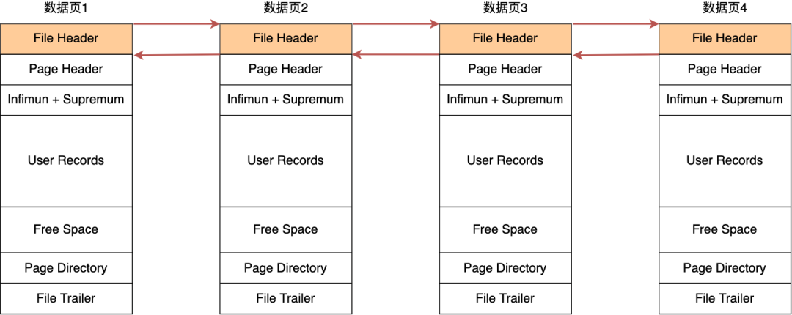
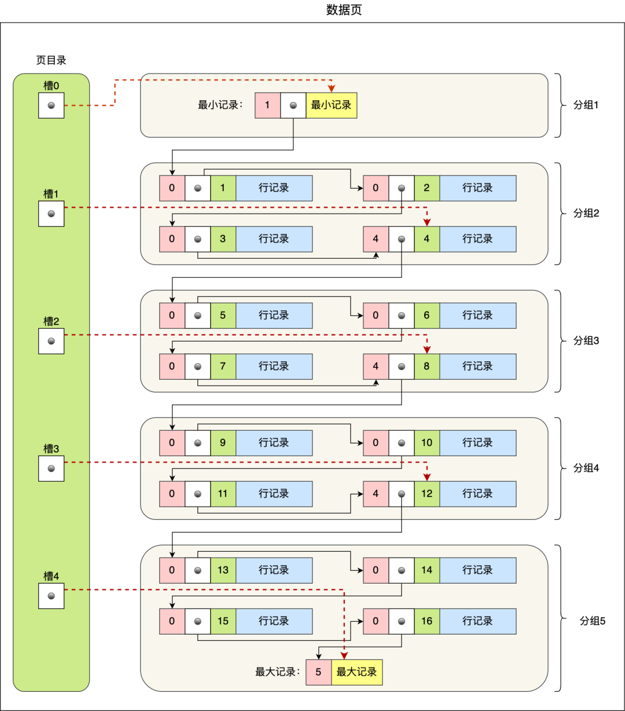
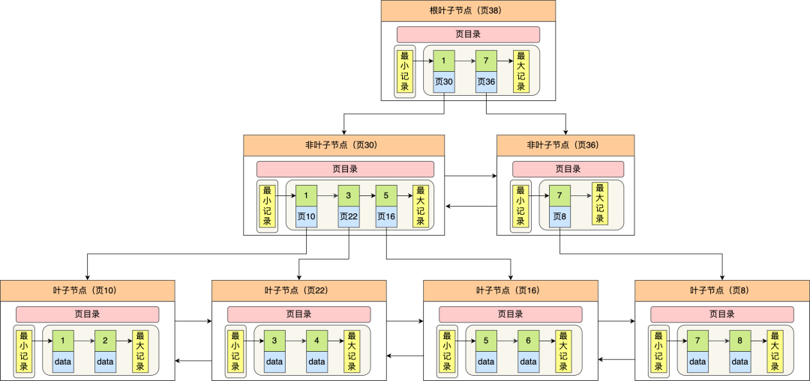

## 索引

### 索引分类

按数据结构分：

- B+ 树索引
- 哈希索引

功能分：

- 主键索引 (Primary key)
- 唯一索引 (Unique)
- 普通索引 (Normal)
- 全文索引 (Full text)

存储位置分：

- 聚簇索引
- 非聚簇索引 (二级索引)

### InnoDB存储方式和查询

InnoDB 的数据是按「数据页」为单位来读写的，默认数据页大小为 16 KB。

每个数据页之间通过**双向链表**的形式组织起来，物理上不连续，但是逻辑上连续。

数据页内包含用户记录，每个记录之间用**单向链表**的方式组织起来

为了加快在数据页内高效查询记录，设计了一个页目录，页目录存储各个槽（分组），且主键值是有序的，于是可以通过二分查找法的方式进行检索从而提高效率。

为了高效查询记录所在的数据页，InnoDB 采用 b+ 树作为索引，每个节点都是一个数据页。

如果叶子节点存储的是实际数据的就是聚簇索引，一个表只能有一个聚簇索引；如果叶子节点存储的不是实际数据，而是主键值则就是二级索引，一个表中可以有多个二级索引。

在使用二级索引进行查找数据时，如果查询的数据能在二级索引找到，那么就是「索引覆盖」操作，如果查询的数据不在二级索引里，就需要先在二级索引找到主键值，需要去聚簇索引中获得数据行，这个过程就叫作「回表」。

#### InnoDB 是如何存储数据

记录是按照行来存储的，但是数据库的读取并不以「行」为单位

InnoDB 的数据是按「数据页」为单位来读写的，也就是说，当需要读一条记录的时候，并不是将这个记录本身从磁盘读出来，而是以页为单位，将其整体读入内存

数据库的 I/O 操作的最小单位是页，InnoDB 数据页的默认大小是 16KB

##### 数据页结构

数据页与数据页之间是通过 **双向链表** 构建连接

数据页中可以存储多个数据行(用户记录)，这些是按照索引来升序排序的

| 名称       | 说明                                                   |
|------------|--------------------------------------------------------|
| 文件头     | 文件头，表示页的信息                                   |
| 页头       | 页头，表示页的状态信息                                 |
| 最小和最大记录 | 两个虚拟的仿记录，分别表示页中的最小记录和最大记录 |
| 用户记录   | 存储行记录内容                                         |
| 空闲空间   | 页中还没被使用的空间                                   |
| 页目录     | 存储用户记录的相对位置，对记录起到索引作用            |
| 文件尾     | 校验页是否完整                                         |

在 File Header 中有两个指针，分别指向上一个数据页和下一个数据页，连接起来的页相当于一个双向的链表，如下图所示：

##### User Records

记录会分组，几个组对应几个槽，每个槽指向该组的最大值，即该组最后一个元素

数据页的主要作用是存储记录，也就是数据库的数据，所以重点说一下数据页中的 User Records 是怎么组织数据的

数据页中的记录按照「主键」顺序组成单向链表，单向链表的特点就是插入、删除非常方便，但是检索效率不高，最差的情况下需要遍历链表上的所有节点才能完成检索

因此，数据页中有一个页目录，起到记录的索引作用，就像我们书那样，针对书中内容的每个章节设立了一个目录，想看某个章节的时候，可以查看目录，快速找到对应的章节的页数，而数据页中的页目录就是为了能快速找到记录

页目录创建的过程如下：

1. 将所有的记录划分成几个组，这些记录包括最小记录和最大记录，但不包括标记为“已删除”的记录；
2. 每个记录组的最后一条记录就是组内最大的那条记录，并且最后一条记录的头信息中会存储该组一共有多少条记录，作为 `n_owned` 字段（上图中粉红色字段）
3. 页目录用来存储每组最后一条记录的地址偏移量，这些地址偏移量会按照先后顺序存储起来，每组的地址偏移量也被称之为槽（slot），每个槽相当于指针指向了不同组的最后一个记录。

以上面那张图举个例子，5 个槽的编号分别为 0，1，2，3，4，我想查找主键为 11 的用户记录：

- 先二分得出槽中间位是 (0+4)/2=2，2 号槽里最大的记录为 8。因为 11 > 8，所以需要从 2 号槽后继续搜索记录；
- 再使用二分搜索出 2 号和 4 号槽的中间位是 (2+4)/2= 3，3 号槽里最大的记录为 12。因为 11 < 12，所以主键为 11 的记录在 3 号槽里；
- 这里有个问题，「槽对应的值都是这个组的主键最大的记录，如何找到组里最小的记录」？比如槽 3 对应最大主键是 12 的记录，那如何找到最小记录 9。解决办法是：通过槽 3 找到 槽 2 对应的记录，也就是主键为 8 的记录。主键为 8 的记录的下一条记录就是槽 3 当中主键最小的 9 记录，然后开始向下搜索 2 次，定位到主键为 11 的记录，取出该条记录的信息即为我们想要查找的内容。

> 如果某个槽内的记录很多，然后因为记录都是单向链表串起来的，那这样在槽内查找某个记录的时间复杂度不就是 O(n) 了吗？
>
> 这点不用担心，InnoDB 对每个分组中的记录条数都是有规定的，槽内的记录就只有几条：
>
> 1. 第一个分组中的记录只能有 1 条记录；
> 2. 最后一个分组中的记录条数范围只能在 1-8 条之间；
> 3. 剩下的分组中记录条数范围只能在 4-8 条之间。

#### InnoDB 的 B+ 树如何查询

InnoDB 的 B+ 树是以 数据页 为单位进行构建的

一个数据页中的记录是有限的，且主键值是有序的，所以通过对所有记录进行分组，然后将组号（槽号）存储到页目录，使其起到索引作用，通过二分查找的方法快速检索到记录在哪个分组，来降低检索的时间复杂度。

但是，当我们需要存储大量的记录时，就需要多个数据页，这时我们就需要考虑如何建立合适的索引，才能方便定位记录所在的页。

> 为了解决这个问题，InnoDB 采用了 B+ 树作为索引
>
> 磁盘的 I/O 操作次数对索引的使用效率至关重要，因此在构造索引的时候，我们更倾向于采用“矮胖”的 B+ 树数据结构，这样所需要进行的磁盘 I/O 次数更少，而且 B+ 树 更适合进行关键字的范围查询。

InnoDB 里的 B+ 树中的每个节点都是一个数据页，结构示意图如下：

B+ 树的特点：

- 只有叶子节点（最底层的节点）才存放了数据，非叶子节点（其他上层节）仅用来存放目录项作为索引。
- 非叶子节点分为不同层次，通过分层来降低每一层的搜索量；
- 所有节点按照索引键大小排序，构成一个双向链表，便于范围查询；

再看看 B+ 树如何实现快速查找主键为 6 的记录，以上图为例子：

- 从根节点开始，通过二分法快速定位到符合页内范围包含查询值的页，因为查询的主键值为 6，在 [1, 7) 范围之间，所以到页 30 中查找更详细的目录项；
- 在非叶子节点（页 30）中，继续通过二分法快速定位到符合页内范围包含查询值的页，主键值大于 5，所以就到叶子节点（页 16）查找记录；
- 接着，在叶子节点（页 16）中，通过槽查找记录时，使用二分法快速定位要查询的记录在哪个槽（哪个记录分组），定位到槽后，再遍历槽内的所有记录，找到主键为 6 的记录。

可以看到，在定位记录所在哪一个页时，也是通过二分法快速定位到包含该记录的页。定位到该页后，又会在该页内进行二分法快速定位记录所在的分组（槽号），最后在分组内进行遍历查找。

#### 聚簇索引和二级索引

索引又可以分成**聚簇索引**和**非聚簇索引**（二级索引）

区别就在于叶子节点存放的是什么数据：

- 聚簇索引的叶子节点存放的是实际数据，所有完整的用户记录都存放在聚簇索引的叶子节点；
- 二级索引的叶子节点存放的是主键值，而不是实际数据。

因为表的数据都是存放在聚簇索引的叶子节点里，所以 InnoDB 存储引擎一定会为表创建一个聚簇索引，且由于数据在物理上只会保存一份，所以聚簇索引只能有一个。

InnoDB 在创建聚簇索引时，会根据不同的场景选择不同的列作为索引：

- 如果有主键，默认会使用主键作为聚簇索引的索引键；
- 如果没有主键，就选择第一个不包含 NULL 值的唯一列作为聚簇索引的索引键；
- 在上面两个都没有的情况下，InnoDB 将自动生成一个隐式自增 id 列作为聚簇索引的索引键；

一张表只能有一个聚簇索引，那为了实现非主键字段的快速搜索，就引出了二级索引（非聚簇索引/辅助索引），它也是利用了 B+ 树的数据结构，但是二级索引的叶子节点存放的是主键值，不是实际数据。

二级索引的 B+ 树如下图，数据部分为主键值：

##### 回表

因此，如果某个查询语句使用了二级索引，但是查询的数据不是主键值，这时在二级索引找到主键值后，需要去聚簇索引中获得数据行，这个过程就叫作「回表」，也就是说要查两个 B+ 树才能查到数据。不过，当查询的数据是主键值时，因为只在二级索引就能查询到，不用再去聚簇索引查，这个过程就叫作「索引覆盖」，也就是只需要查一个 B+ 树就能找到数据。

#### 总结

数据页是 InnoDB 的最小单位，可以分为：

- 记录页（Data Page）：数据页可以存储表的实际数据记录。每一行数据都会占用一定的空间，取决于表的字段长度。
- 索引页（Index Page）：在InnoDB中，索引是通过B+树来实现的。索引页存储了索引的键值及其对应的记录地址。数据表的索引结构本身也是由数据页组成的。

在索引页中，存储的是某一页对应的 最小记录值

- 在 叶子索引页 中，每个索引项包含了 索引的键值 和对应的 数据记录地址。这个地址可以是数据页的编号和该页内数据记录的偏移量。

- 在 非叶子索引页 中，索引项包含了 最小键值 和指向下一级索引页的指针。每个内部索引页的 键值 用来指示该页的索引范围，以便查询时能够快速导航到正确的页。
