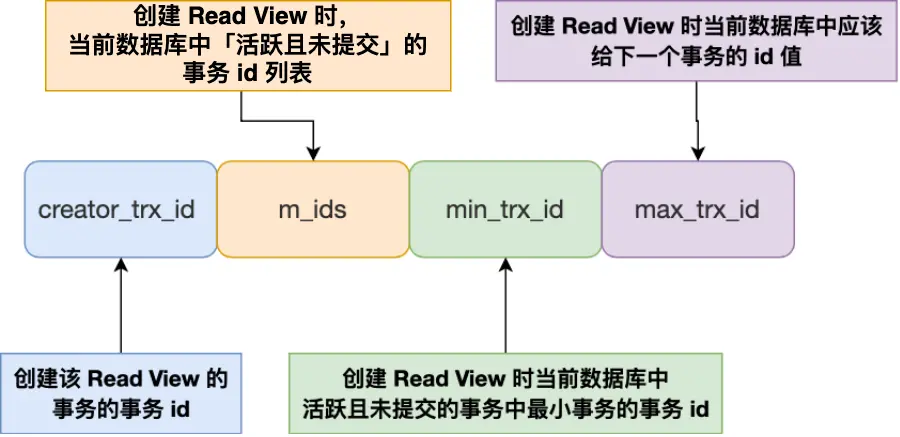
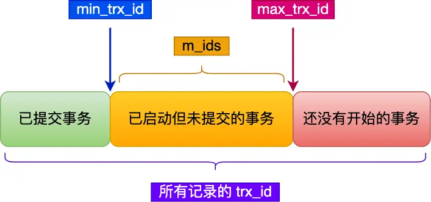
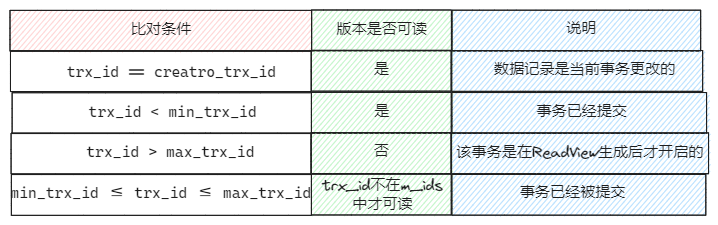
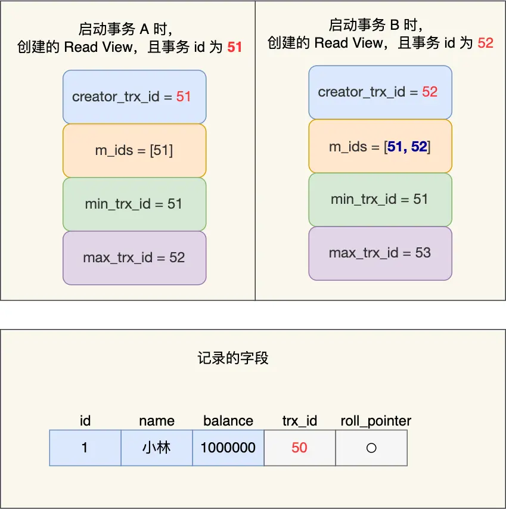
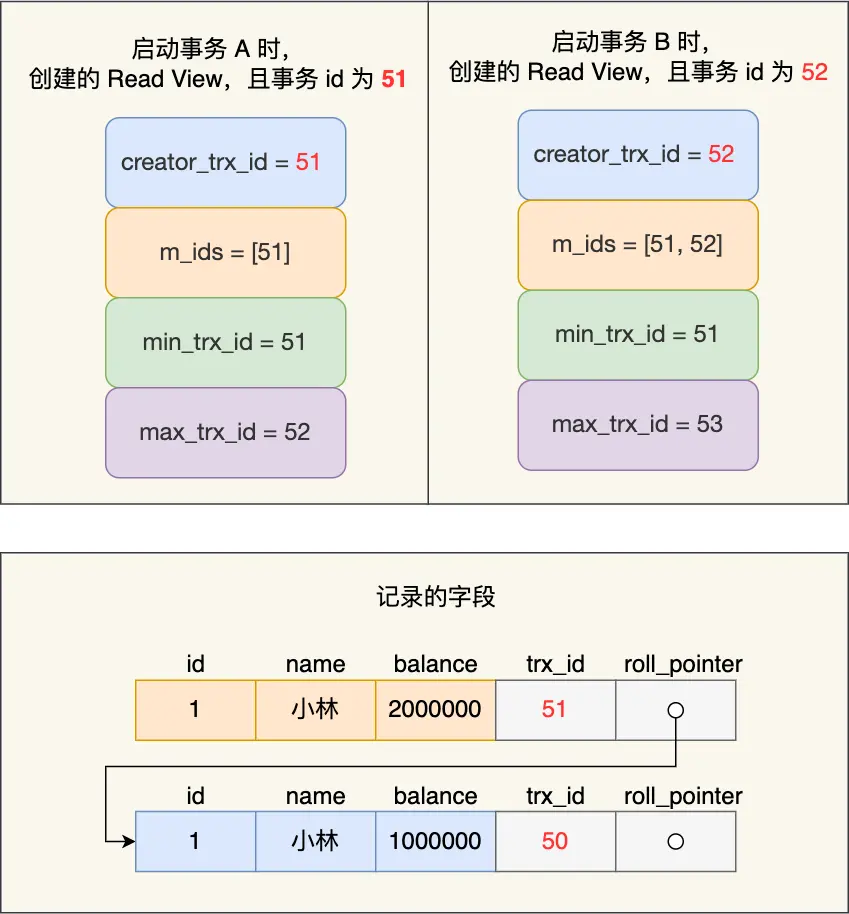
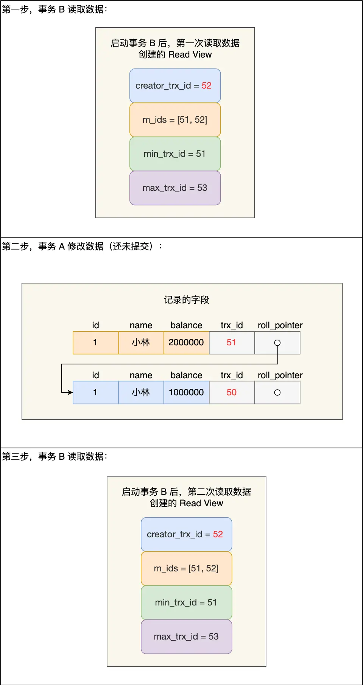
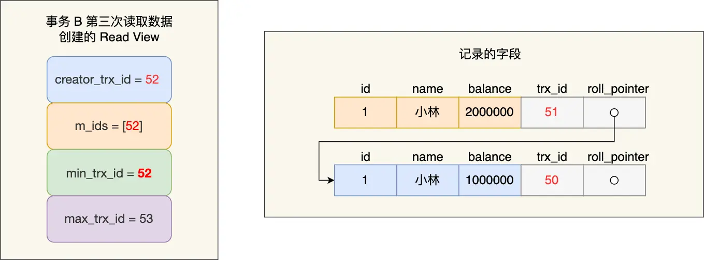

## 事务2

### MVCC 多版本并发控制

多版本并发控制（MVCC）是一种用来解决读-写冲突的无锁并发控制，可以做到在读操作时不用阻塞写操作，写操作也不用阻塞读操作，提高了数据库并发读写的性能 同时还可以解决脏读，幻读，不可重复读等事务隔离问题，但不能解决更新丢失问题。

#### 工作原理

- Read View 中四个字段作用；
- 聚簇索引记录中两个跟事务有关的隐藏列；

##### 行隐藏字段

InnoDB在每行数据都增加三个隐藏字段，一个唯一行号，一个记录创建的版本号，一个记录回滚的版本号

- row_id：6byte，隐含的自增ID（隐藏主键），如果数据表没有主键，InnoDB会自动以DB_ROW_ID生成一个聚簇索引。

- trx_id：6byte，最近修改（修改、插入）事务ID：记录创建这条记录以及最后一次修改该记录的事务的ID，是一个指针。

- roll_ptr：7byte，回滚指针，每次对某条聚簇索引记录进行改动时，都会把旧版本的记录写入到 undo 日志中，然后这个隐藏列是个指针，指向每一个旧版本记录，于是就可以通过它找到修改前的记录。

所以每个记录在undo会形成一个链表

判断数据记录可见性的逻辑就是通过readview和【行记录的隐藏字段trx_id】做对比的

##### Read View

> Read View就是事务进行快照读操作的时候生产的读视图(Read View)，在该事务执行的快照读的那一刻，会生成数据库系统当前的一个快照，记录并维护系统当前活跃事务的ID(当每个事务开启时，都会被分配一个ID, 这个ID是递增的，所以最新的事务，ID值越大)。

创建 readview 的事务id + 此时活跃的事务id列表 + 全局最大事务id+1 + 活跃事务id最小值

Read View 有四个重要的字段：

- m_ids：指的是在创建 Read View 时，当前数据库中「活跃事务」的事务 id 列表，注意是一个列表，“活跃事务”指的就是，启动了但还没提交的事务。
- min_trx_id：指的是在创建 Read View 时，当前数据库中「活跃事务」中事务 id 最小的事务，也就是 m_ids 的最小值。
- max_trx_id：这个并不是 m_ids 的最大值，而是创建 Read View 时当前数据库中应该给下一个事务的 id 值，也就是**全局事务中最大的事务 id 值 + 1**；
- creator_trx_id：指的是创建该 Read View 的事务的事务 id (就是当前执行的快照读事务的id)

当前事务id就是 `creator_trx_id`

max_try_id 是全局事务中最大的事务 id 值 + 1！！

在创建 Read View 后，我们可以将记录中的 trx_id 划分这三种情况：

一个事务去访问记录的时候，除了自己的更新记录总是可见之外，还有这几种情况：

- 如果记录的 trx_id 值小于 Read View 中的 min_trx_id 值，表示这个版本的记录是在创建 Read View 前已经提交的事务生成的，所以该版本的记录对当前事务可见。
- 如果记录的 trx_id 值大于等于 Read View 中的 max_trx_id 值，表示这个版本的记录是在创建 Read View 后才启动的事务生成的，所以该版本的记录对当前事务不可见。
- 如果记录的 trx_id 值在 Read View 的 min_trx_id 和 max_trx_id 之间，需要判断 trx_id 是否在 m_ids 列表中：
  - 如果记录的 trx_id 在 m_ids 列表中，表示生成该版本记录的活跃事务依然活跃着（还没提交事务），所以该版本的记录对当前事务不可见。
  - 如果记录的 trx_id 不在 m_ids列表中，表示生成该版本记录的活跃事务已经被提交，所以该版本的记录对当前事务可见。

也就是说如果当前事务执行一个 select 语句到某行数据，对应的 trx_id 与 Read View 的进行比较逻辑，如果不可见，就去从 roll_ptr 到 undo 日志里找上一版本的数据，直到可见为止

### 实现可重复读隔离级别原理

可重复读隔离级别是启动事务时创建一个 Read View，然后整个事务期间都是服用这个 Read View

假设事务 A（事务 id 为 51）启动后，紧接着事务 B（事务 id 为 52）也启动了，那这两个事务创建的 Read View 如下

接着，在可重复读隔离级别下，事务 A 和事务 B 按顺序执行了以下操作：

- 事务 B 读取账户余额记录，读到余额是 100 万；
- 事务 A 将账户余额记录修改成 200 万，并没有提交事务；
- 事务 B 读取账户余额记录，读到余额还是 100 万；
- 事务 A 提交事务；
- 事务 B 读取账户余额记录，读到余额依然还是 100 万；

分析：

事务B在读取记录时，会先看这条记录的 trx_id, 此时发现 trx_id 为 50，比事务 B 的 Read View 中的 min_trx_id 值（51）还小，这意味着修改这条记录的事务早就在事务 B 启动前提交过了，所以该版本的记录对事务 B 可见的，也就是事务 B 可以获取到这条记录

接着，事务 A 通过 update 语句将这条记录修改了（还未提交事务），将余额改成 200 万，这时 MySQL 会记录相应的 undo log，并以链表的方式串联起来，形成版本链

由于事务 A 修改了该记录，以前的记录就变成旧版本记录了，于是最新记录和旧版本记录通过链表的方式串起来，而且最新记录的 trx_id 是事务 A 的事务 id（trx_id = 51）

然后事务 B 第二次去读取该记录

发现此时这条记录的 trx_id 值为 51，在事务 B 的 Read View 的 min_trx_id 和 max_trx_id 之间，则需要判断 trx_id 值是否在 m_ids 范围内，判断的结果是在的，那么说明这条记录是**被还未提交的事务修改的** (事务A)，这时事务 B 并不会读取这个版本的记录。

而是沿着 undo log 链条往下找旧版本的记录，直到找到 trx_id 可见的第一条记录（trx_id「小于」事务 B 的 Read View 中的 min_trx_id 值，或者 trx_id 在事务 B 的 Read View 的 min_trx_id 和 max_trx_id 之间，但是不在 m_ids 范围内），所以事务 B 能读取到的是 trx_id 为 50 的记录，也就是余额是 100 万的这条记录

最后，当事物 A 提交事务后，由于隔离级别时「可重复读」，所以事务 B 再次读取记录时，还是**基于启动事务时创建**的 Read View 来判断当前版本的记录是否可见。所以，即使事物 A 将余额修改为 200 万并提交了事务，事务 B 第三次读取记录时，读到的记录都是余额是 100 万的这条记录

「可重复读」隔离级别下在事务期间读到的记录都是事务启动前的记录

### 实现读提交隔离级别原理

读提交隔离级别是在每次读取数据时，都会生成一个新的 Read View

意味着，事务期间的多次读取同一条数据，前后两次读的数据可能会出现不一致，因为可能这期间另外一个事务修改了该记录，并提交了事务

只有另一个事务更改然后提交了，那么在另一个事务那里的 m_ids 列表里被去除了

假设事务 A（事务 id 为 51）启动后，紧接着事务 B（事务 id 为 52）也启动了，接着按顺序执行了以下操作：

- 事务 B 读取数据（创建 Read View），账户余额为 100 万；
- 事务 A 修改数据（还没提交事务），将账户余额从 100 万修改成了 200 万；
- 事务 B 读取数据（创建 Read View），账户余额为 100 万；
- 事务 A 提交事务；
- 事务 B 读取数据（创建 Read View），账户余额为 200 万；

分析：

前两次 事务 B 读取数据时创建的 Read View 如下图：

来分析下为什么事务 B 第二次读数据时，读不到事务 A（还未提交事务）修改的数据？

事务 B 在找到小林这条记录时，会看这条记录的 trx_id 是 51，在事务 B 的 Read View 的 min_trx_id 和 max_trx_id 之间，接下来需要判断 trx_id 值是否在 m_ids 范围内，判断的结果是在的，那么说明这条记录是被还未提交的事务修改的，这时事务 B 并不会读取这个版本的记录。而是，沿着 undo log 链条往下找旧版本的记录，直到找到 trx_id 可见的第一条记录（trx_id「小于」事务 B 的 Read View 中的 min_trx_id 值，或者 trx_id 在事务 B 的 Read View 的 min_trx_id 和 max_trx_id 之间，但是不在 m_ids 范围内），所以事务 B 能读取到的是 trx_id 为 50 的记录，也就是小林余额是 100 万的这条记录。

我们来分析下为什么事务 A 提交后，事务 B 就可以读到事务 A 修改的数据？

在事务 A 提交后，由于隔离级别是「读提交」，所以事务 B 在每次读数据的时候，会重新创建 Read View，此时事务 B 第三次读取数据时创建的 Read View 如下：

事务 B 在找到小林这条记录时，会发现这条记录的 trx_id 是 51，比事务 B 的 Read View 中的 min_trx_id 值（52）还小，这意味着修改这条记录的事务早就在创建 Read View 前提交过了，所以该版本的记录对事务 B 是可见的。

正是因为在读提交隔离级别下，事务每次读数据时都重新创建 Read View，那么在事务期间的多次读取同一条数据，前后两次读的数据可能会出现不一致，因为可能这期间另外一个事务修改了该记录，并提交了事务。

### 总结

事务是在 MySQL 引擎层实现的，我们常见的 InnoDB 引擎是支持事务的，事务的四大特性是原子性、一致性、隔离性、持久性，我们这次主要讲的是隔离性。

当多个事务并发执行的时候，会引发脏读、不可重复读、幻读这些问题，那为了避免这些问题，SQL 提出了四种隔离级别，分别是读未提交、读已提交、可重复读、串行化，从左往右隔离级别顺序递增，隔离级别越高，意味着性能越差，InnoDB 引擎的默认隔离级别是可重复读。

要解决脏读现象，就要将隔离级别升级到读已提交以上的隔离级别，要解决不可重复读现象，就要将隔离级别升级到可重复读以上的隔离级别。

而对于幻读现象，不建议将隔离级别升级为串行化，因为这会导致数据库并发时性能很差。MySQL InnoDB 引擎的默认隔离级别虽然是「可重复读」，但是它很大程度上避免幻读现象（并不是完全解决了，详见这篇文章），解决的方案有两种：

- 针对快照读（普通 select 语句），是通过 MVCC 方式解决了幻读，因为可重复读隔离级别下，事务执行过程中看到的数据，一直跟这个事务启动时看到的数据是一致的，即使中途有其他事务插入了一条数据，是查询不出来这条数据的，所以就很好了避免幻读问题。
- 针对当前读（select ... for update 等语句），是通过 next-key lock（记录锁 + 间隙锁）方式解决了幻读，因为当执行 select ... for update 语句的时候，会加上 next-key lock，如果有其他事务在 next-key lock 锁范围内插入了一条记录，那么这个插入语句就会被阻塞，无法成功插入，所以就很好了避免幻读问题。

对于「读提交」和「可重复读」隔离级别的事务来说，它们是通过 Read View 来实现的，它们的区别在于创建 Read View 的时机不同：

- 「读提交」隔离级别是在每个 select 都会生成一个新的 Read View，也意味着，事务期间的多次读取同一条数据，前后两次读的数据可能会出现不一致，因为可能这期间另外一个事务修改了该记录，并提交了事务。
- 「可重复读」隔离级别是启动事务时生成一个 Read View，然后整个事务期间都在用这个 Read View，这样就保证了在事务期间读到的数据都是事务启动前的记录。

这两个隔离级别实现是通过「事务的 Read View 里的字段」和「记录中的两个隐藏列」的比对，来控制并发事务访问同一个记录时的行为，这就叫 MVCC（多版本并发控制）。

在可重复读隔离级别中，普通的 select 语句就是基于 MVCC 实现的快照读，也就是不会加锁的。而 select .. for update 语句就不是快照读了，而是当前读了，也就是每次读都是拿到最新版本的数据，但是它会对读到的记录加上 next-key lock 锁
