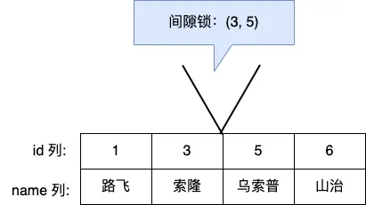
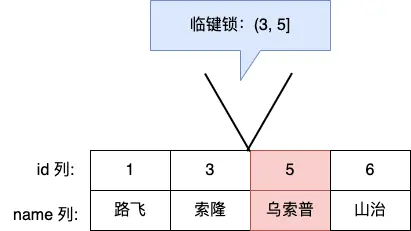

## 锁

锁的目的就是在我执行语句和返回结果这段时间内，不能让其他事务对相关数据进行修改或访问，以保证数据的一致性 (不能出现脏读、幻读、不可重复读等)

在 MySQL 里，根据加锁的范围，可以分为全局锁、表级锁和行锁三类

- 全局锁 (FTWRL)
- 表级锁
  - 表锁
  - 元数据锁
  - 意向锁
  - AUTO-INC 锁
- 行级锁
  - Record Lock
  - Gap Lock
  - Next-key Lock

### 全局锁

要使用全局锁，则要执行这条命令

```sql
-- 加全局读锁
FLUSH TABLES WITH READ LOCK;

-- 释放锁
UNLOCK TABLES;
```

执行后，整个数据库就处于只读状态了，这时其他线程执行以下操作，都会被阻塞：

- 对数据的增删改操作，比如 insert、delete、update 等语句；
- 对表结构的更改操作，比如 alter table、drop table 等语句。、

当然，当会话断开了，全局锁会被自动释放

#### 全局锁应用场景

全局锁主要应用于做全库逻辑备份 (mysqldump)，这样在备份数据库期间，不会因为数据或表结构的更新，而出现备份文件的数据与预期的不一样

#### 缺点

加上全局锁，意味着整个数据库都是只读状态。

那么如果数据库里有很多数据，备份就会花费很多的时间，关键是备份期间，业务只能读数据，而不能更新数据，这样会造成业务停滞

#### 备份时如何避免全局锁影响事务

如果数据库的引擎支持的事务支持可重复读的隔离级别，那么在备份数据库之前先开启事务，会先创建 Read View，然后整个事务执行期间都在用这个 Read View，而且由于 MVCC 的支持，备份期间业务依然可以对数据进行更新操作。

因为在可重复读的隔离级别下，即使其他事务更新了表的数据，也不会影响备份数据库时的 Read View，这就是事务四大特性中的隔离性，这样备份期间备份的数据一直是在开启事务时的数据

备份数据库的工具是 mysqldump，在使用 mysqldump 时加上 –single-transaction 参数的时候，就会在备份数据库之前先开启事务。这种方法只适用于支持「可重复读隔离级别的事务」的存储引擎。

### 表级锁

MySQL 里面表级别的锁有这几种：

- 表锁；
- 元数据锁（MDL）;
- 意向锁；
- AUTO-INC 锁；

#### 表锁

分(共享锁)读锁和(独占锁)写锁

```sql
-- 表级别的共享锁，也就是读锁；
lock tables t_student read;

-- 表级别的独占锁，也就是写锁；
lock tables t_student write;
```

表锁除了会限制别的线程的读写外，也会限制本线程接下来的读写操作

如果本线程对学生表加了「共享表锁」，那么本线程接下来如果要对学生表执行写操作的语句，是会被阻塞的，当然其他线程对学生表进行写操作时也会被阻塞，直到锁被释放

尽量避免在使用 InnoDB 引擎的表使用表锁，因为表锁的颗粒度太大，会影响并发性能，InnoDB 牛逼的地方在于实现了颗粒度更细的行级锁

#### 元数据锁

避免表结构变化在 CRUD 期间

MDL 是为了保证当用户对表执行 CRUD 操作时，防止其他线程对这个表结构做了变更

不需要显式的使用 MDL，因为当我们对数据库表进行操作时，会自动给这个表加上 MDL：

- 对一张表进行 CRUD 操作时，加的是 MDL 读锁 (共享锁)；
- 对一张表做结构变更操作的时候，加的是 MDL 写锁 (排它锁)；

当有线程在执行 select 语句（加 MDL 读锁）的期间，如果有其他线程要更改该表的结构（申请 MDL 写锁），那么将会被阻塞，直到执行完 select 语句（释放 MDL 读锁）。

反之，当有线程对表结构进行变更（加 MDL 写锁）的期间，如果有其他线程执行了 CRUD 操作（申请 MDL 读锁），那么就会被阻塞，直到表结构变更完成（释放 MDL 写锁）。

> 申请 MDL 锁的操作会形成一个队列，队列中写锁获取优先级高于读锁，一旦出现 MDL 写锁等待，会阻塞后续该表的所有 CRUD 操作。
>
> 所以为了能安全的对表结构进行变更，在对表结构变更前，先要看看数据库中的长事务，是否有事务已经对表加上了 MDL 读锁，如果可以，考虑 kill 掉这个长事务，然后再做表结构的变更。

#### 意向锁

为了避免DML在执行时，加的行锁与表锁的冲突，在InnoDB中引入了意向锁，使得表锁不用检查每行数据是否加锁，使用意向锁来减少表锁的检查。

当执行插入、更新、删除操作，需要先对表加上「意向独占锁」，然后对该记录加独占锁

普通的 select 是不会加行级锁的，普通的 select 语句是利用 MVCC 实现一致性读，是无锁的。

- 在使用 InnoDB 引擎的表里对某些记录加上「共享锁」之前，需要先在表级别加上一个「意向共享锁」；
- 在使用 InnoDB 引擎的表里对某些记录加上「独占锁」之前，需要先在表级别加上一个「意向独占锁」；

如果没有「意向锁」，那么加「独占表锁」时，就需要遍历表里所有记录，查看是否有记录存在独占锁，这样效率会很慢。

那么有了「意向锁」，由于在对记录加独占锁前，先会加上表级别的意向独占锁，那么在加「独占表锁」时，直接查该表是否有意向独占锁，如果有就意味着表里已经有记录被加了独占锁，这样就不用去遍历表里的记录。

#### AUTO-INC 锁

### 行级锁

InnoDB 引擎是支持行级锁的，而 MyISAM 引擎并不支持行级锁

普通的 select 语句是不会对记录加锁的，因为它属于快照读。如果要在查询时对记录加行锁，可以使用下面这两个方式，这种查询会加锁的语句称为锁定读。

```sql
-- 对读取的记录加共享锁
select ... lock in share mode;

-- 对读取的记录加独占锁
select ... for update;
```

独占锁 -- `for update`   |   共享锁 -- `in share mode`

上面这两条语句必须在一个事务中，因为当事务提交了，锁就会被释放，所以在使用这两条语句的时候，要加上 begin、start transaction 或者 set autocommit = 0

共享锁（S 锁）满足读读共享，读写互斥。独占锁（X 锁）满足写写互斥、读写互斥。

行级锁的类型主要有三类：(锁一条，锁范围内，锁范围内和自己)

- Record Lock，记录锁，也就是仅仅把一条记录锁上；
- Gap Lock，间隙锁，锁定一个范围，但是不包含记录本身；
- Next-Key Lock：Record Lock + Gap Lock 的组合，锁定一个范围，并且锁定记录本身

#### Record Lock

Record Lock 称为记录锁，锁住的是一条记录。而且记录锁是有 S 锁和 X 锁之分的：

- 当一个事务对一条记录加了 S 型记录锁后，其他事务也可以继续对该记录加 S 型记录锁（S 型与 S 锁兼容），但是不可以对该记录加 X 型记录锁（S 型与 X 锁不兼容）;
- 当一个事务对一条记录加了 X 型记录锁后，其他事务既不可以对该记录加 S 型记录锁（S 型与 X 锁不兼容），也不可以对该记录加 X 型记录锁（X 型与 X 锁不兼容）。

#### Gap Lock

隔离级别必须是 RR, 只存在于可重复读隔离级别，目的是为了解决可重复读隔离级别下幻读的现象

假设，表中有一个范围 id 为（3，5）间隙锁，那么其他事务就无法插入 id = 4 这条记录了，这样就有效的防止幻读现象的发生



间隙锁虽然存在 X 型间隙锁和 S 型间隙锁，但是并没有什么区别

间隙锁之间是兼容的，即两个事务可以同时持有包含共同间隙范围的间隙锁，并不存在互斥关系，因为间隙锁的目的是防止插入幻影记录而提出的

```sql
-- 这些操作会加间隙锁
SELECT * FROM users WHERE id > 5 FOR UPDATE;
SELECT * FROM users WHERE id > 5 FOR SHARE;
UPDATE users SET name = 'xxx' WHERE id > 5;
DELETE FROM users WHERE id > 5;

-- 普通查询不加锁（使用 MVCC）
SELECT * FROM users WHERE id > 5;  -- 不加间隙锁
```

##### 通过间隙锁解决幻读

```sql
-- 事务 A（没有间隙锁的情况）
BEGIN;
SELECT * FROM users WHERE id > 5 AND id < 10;
-- 结果：空（没有记录）

-- 事务 B
BEGIN;
INSERT INTO users VALUES (7, '新用户');
COMMIT;

-- 事务 A 再次查询
SELECT * FROM users WHERE id > 5 AND id < 10;
-- 结果：出现了 id=7 的记录（幻读！）
```

加 gap lock

```sql
-- 事务 A
BEGIN;
SELECT * FROM users WHERE id > 5 AND id < 10 FOR UPDATE;
-- 加间隙锁，锁定 (5, 10) 这个间隙

-- 事务 B
BEGIN;
INSERT INTO users VALUES (7, '新用户');
-- ❌ 被阻塞！无法插入到 (5, 10) 间隙

-- 事务 A 再次查询
SELECT * FROM users WHERE id > 5 AND id < 10;
-- 结果：仍然是空，没有幻读
```

#### Next-key Lock

Next-Key Lock 称为临键锁，是 Record Lock + Gap Lock 的组合，锁定一个范围，并且锁定记录本身

假设，表中有一个范围 id 为（3，5] 的 next-key lock，那么其他事务即不能插入 id = 4 记录，也不能修改 id = 5 这条记录



所以，next-key lock 即能保护该记录，又能阻止其他事务将新纪录插入到被保护记录前面的间隙中。

next-key lock 是包含间隙锁 + 记录锁的，如果一个事务获取了 X 型的 next-key lock，那么另外一个事务在获取相同范围的 X 型的 next-key lock 时，是会被阻塞的

#### 插入意向锁

插入意向锁（Insert Intention Lock）是一种特殊的间隙锁，在插入数据之前获取

一个事务在插入一条记录的时候，需要判断插入位置是否已被其他事务加了间隙锁（next-key lock 也包含间隙锁）。

如果有的话，插入操作就会发生阻塞，直到拥有间隙锁的那个事务提交为止（释放间隙锁的时刻），在此期间会生成一个插入意向锁，表明有事务想在某个区间插入新记录，但是现在处于等待状态。

插入意向锁名字虽然有意向锁，但是它并不是意向锁，它是一种特殊的间隙锁，属于行级别锁

如果说间隙锁锁住的是一个区间，那么「插入意向锁」锁住的就是一个点

### Mysql如何加锁

- 无索引 - 锁全表

  ```sql
  -- name 没有索引
  UPDATE users SET age = 20 WHERE name = '张三';
  ```

  加锁： 全表扫描，锁住所有行（相当于表锁）

- 有索引 - 锁索引记录
  
  ```sql
  -- id 是主键
  UPDATE users SET name = '张三' WHERE id = 10;
  ```

  加锁： 只锁 id=10 这一行（精准锁定）

所以，针对唯一索引(主键索引)和非唯一索引(二级索引)查询时，如何加行锁进行分析

#### 如何加行级锁

加锁的对象是索引，加锁的基本单位是 next-key lock，由记录锁和间隙锁组合而成的

临键锁 是前开后闭区间，而间隙锁是前开后开区间

next-key lock 在一些场景下会退化成记录锁或间隙锁

在能使用记录锁或者间隙锁就能避免幻读现象的场景下，next-key lock 就会退化成记录锁或间隙锁

#### 唯一索引查询

##### 等值查询

当我们用唯一索引进行等值查询的时候，查询的记录存不存在，加锁的规则也会不同：

- 当查询的记录是「存在」的，在索引树上定位到这一条记录后，将该记录的索引中的 next-key lock 会退化成「记录锁」。
- 当查询的记录是「不存在」的，在索引树找到第一条大于该查询记录的记录后，将该记录的索引中的 next-key lock 会退化成「间隙锁」

如果是不存在，那么显然在返回结果之前要把 (大于该查询记录的记录索引，$\infty$] 加入间隙锁来避免问题

假设索引中有记录：5, 10, 15, 20

情况1：唯一索引等值查询（存在）

```sql
SELECT * FROM t WHERE id = 10 FOR UPDATE;
```

- 默认加 (5, 10] 的 next-key lock
- 退化成记录锁：只锁 10 这条记录

情况2：唯一索引等值查询（不存在）

```sql
SELECT * FROM t WHERE id = 12 FOR UPDATE;
```

- 默认加 (10, 15] 的 next-key lock
- 退化成间隙锁：只锁 (10, 15) 这个间隙

##### 范围查询

当唯一索引进行范围查询时，会对每一个扫描到的索引加 next-key 锁，然后如果遇到下面这些情况，会退化成记录锁或者间隙锁：

- 情况一：针对「大于等于」的范围查询，因为存在等值查询的条件，那么如果等值查询的记录是存在于表中，那么该记录的索引中的 next-key 锁会退化成记录锁。
- 情况二：针对「小于或者小于等于」的范围查询，要看条件值的记录是否存在于表中：
  - 当条件值的记录不在表中，那么不管是「小于」还是「小于等于」条件的范围查询，扫描到终止范围查询的记录时，该记录的索引的 next-key 锁会退化成间隙锁，其他扫描到的记录，都是在这些记录的索引上加 next-key 锁。
  - 当条件值的记录在表中，如果是「小于」条件的范围查询，扫描到终止范围查询的记录时，该记录的索引的 next-key 锁会退化成间隙锁，其他扫描到的记录，都是在这些记录的索引上加 next-key 锁；如果「小于等于」条件的范围查询，扫描到终止范围查询的记录时，该记录的索引 next-key 锁不会退化成间隙锁。其他扫描到的记录，都是在这些记录的索引上加 next-key 锁

#### 非唯一索引查询

##### 等值查询

假设索引中有记录：5, 10, 15, 20

```sql
SELECT * FROM t WHERE id > 10 FOR UPDATE;
```

- 加 (10, 15]、(15, 20]、(20, +∞) 的 next-key lock
- 不退化，保持临键锁

因为存在两个索引，一个是主键索引，一个是非唯一索引（二级索引），所以在加锁时，同时会对这两个索引都加锁，但是对主键索引加锁的时候，只有满足查询条件的记录才会对它们的主键索引加锁。

针对非唯一索引等值查询时，查询的记录存不存在，加锁的规则也会不同：

- 当查询的记录「存在」时，由于不是唯一索引，所以肯定存在索引值相同的记录，于是非唯一索引等值查询的过程是一个扫描的过程，直到扫描到第一个不符合条件的二级索引记录就停止扫描，然后在扫描的过程中，对扫描到的二级索引记录加的是 next-key 锁，而对于第一个不符合条件的二级索引记录，该二级索引的 next-key 锁会退化成间隙锁。
  同时，在符合查询条件的记录的主键索引上加记录锁。
- 当查询的记录「不存在」时，扫描到第一条不符合条件的二级索引记录，该二级索引的 next-key 锁会退化成间隙锁。因为不存在满足查询条件的记录，所以不会对主键索引加锁。

```
id: 1,  age: 10
id: 2,  age: 10  -- age 有重复值
id: 3,  age: 15
id: 4,  age: 20
```

> 为什么第一个不符合条件的记录要加间隙锁？
> 防止在 (10, 15) 之间插入新的 age=10 的记录（防止幻读）
> 但不需要锁住 age=15 这条记录本身，因为它不在查询范围内
>
> 为什么主键索引只加记录锁
> 主键索引只需要锁住具体的记录，不需要锁间隙
> 因为间隙的控制已经在二级索引上完成了

##### 范围查询

非唯一索引和主键索引的范围查询的加锁也有所不同，不同之处在于非唯一索引范围查询，索引的 next-key lock 不会有退化为间隙锁和记录锁的情况，也就是非唯一索引进行范围查询时，对二级索引记录加锁都是加 next-key 锁

#### 无索引查询

前面的案例，我们的查询语句都有使用索引查询，也就是查询记录的时候，是通过索引扫描的方式查询的，然后对扫描出来的记录进行加锁。

如果锁定读查询语句，没有使用索引列作为查询条件，或者查询语句没有走索引查询，导致扫描是全表扫描。那么，每一条记录的索引上都会加 next-key 锁，这样就相当于锁住的全表，这时如果其他事务对该表进行增、删、改操作的时候，都会被阻塞。

不只是锁定读查询语句不加索引才会导致这种情况，update 和 delete 语句如果查询条件不加索引，那么由于扫描的方式是全表扫描，于是就会对每一条记录的索引上都会加 next-key 锁，这样就相当于锁住的全表。

因此，在线上在执行 update、delete、select ... for update 等具有加锁性质的语句，一定要检查语句是否走了索引，如果是全表扫描的话，会对每一个索引加 next-key 锁，相当于把整个表锁住了，这是挺严重的问题。
