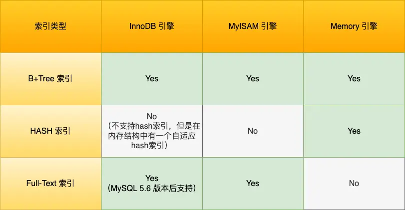
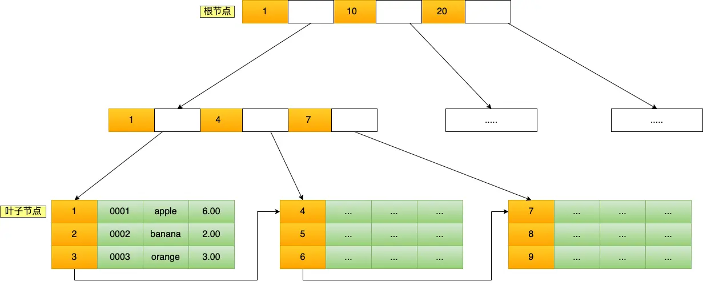
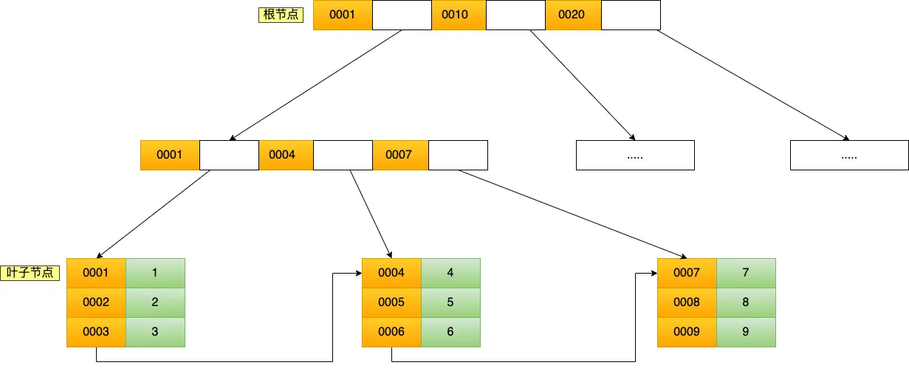
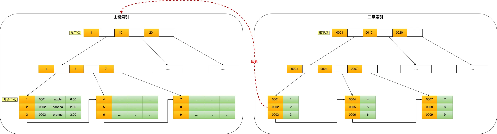
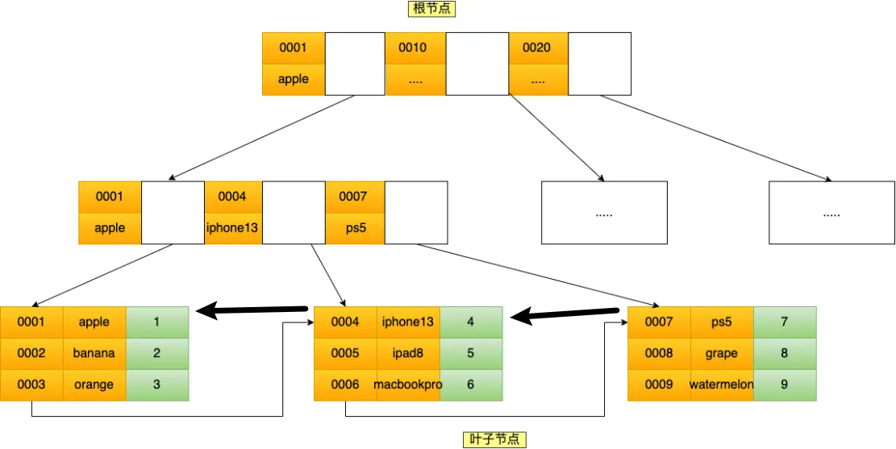

## 索引

### 索引分类

按数据结构分：

- B+ 树索引
- 哈希索引

功能分：

- 主键索引 (Primary key)
- 唯一索引 (Unique)
- 普通索引 (Normal)
- 前缀索引
- 全文索引 (Full text)

存储位置分：

- 聚簇索引
- 非聚簇索引 (二级索引)

#### 按数据结构分

MySQL 常见的存储引擎 InnoDB、MyISAM 和 Memory 分别支持的索引类型 (数据结构)



InnoDB 是在 MySQL 5.5 之后成为默认的 MySQL 存储引擎，B+Tree 索引类型也是 MySQL 存储引擎采用最多的索引类型

在创建表时，InnoDB 存储引擎会根据不同的场景选择不同的列作为索引：

- 如果有主键，默认会使用**主键**作为聚簇索引的索引键（key）；
- 如果没有主键，就选择**第一个不包含 NULL 值的唯一列**作为聚簇索引的索引键（key）；
- 在上面两个都没有的情况下，InnoDB 将自动生成一个**隐式自增 id 列**作为聚簇索引的索引键（key）；

其它索引都属于辅助索引（Secondary Index），也被称为二级索引或非聚簇索引。创建的主键索引和二级索引默认使用的是 B+Tree 索引

##### B+ tree索引介绍

> B+树中只有叶子节点通过双向链表连接，非叶子节点之间没有链表连接

B+Tree 是一种多叉树，叶子节点才存放数据，非叶子节点只存放索引，而且每个节点里的数据是按主键顺序存放的

每一层父节点的索引值都会出现在下层子节点的索引值中，因此在叶子节点中，包括了所有的索引值信息，并且每一个叶子节点都指向下一个叶子节点，形成一个链表

一张商品表，id 为主键，如下：

```sql
CREATE TABLE `product`  (
  `id` int(11) NOT NULL,
  `product_no` varchar(20)  DEFAULT NULL,
  `name` varchar(255) DEFAULT NULL,
  `price` decimal(10, 2) DEFAULT NULL,
  PRIMARY KEY (`id`) USING BTREE
) CHARACTER SET = utf8 COLLATE = utf8_general_ci ROW_FORMAT = Dynamic;
```

主键索引的B+ tree：



当执行

```sql
select * from product where id = 5;
```

- 将 5 与根节点的索引数据 (1，10，20) 比较，5 在 1 和 10 之间，所以根据 B+Tree 的搜索逻辑，找到第二层的索引数据 (1，4，7)；
- 在第二层的索引数据 (1，4，7) 中进行查找，因为 5 在 4 和 7 之间，所以找到第三层的索引数据（4，5，6）；
- 在叶子节点的索引数据（4，5，6）中进行查找，然后我们找到了索引值为 5 的行数据。

数据库的索引和数据都是存储在硬盘的，我们可以把读取一个节点当作一次磁盘 I/O 操作。那么上面的整个查询过程一共经历了 3 个节点，也就是进行了 3 次 I/O 操作。

B+Tree 存储千万级的数据只需要 3-4 层高度就可以满足，这意味着从千万级的表查询目标数据最多需要 3-4 次磁盘 I/O，所以B+Tree 相比于 B 树和二叉树来说，最大的优势在于查询效率很高，因为即使在数据量很大的情况，查询一个数据的磁盘 I/O 依然维持在 3-4 次

##### 二级索引查询过程

在 InnoDB 存储引擎中，主键索引的 B+Tree 和二级索引的 B+Tree 区别如下：

- 主键索引的 B+Tree 的叶子节点存放的是实际数据，所有完整的用户记录都存放在主键索引的 B+Tree 的叶子节点里；
- 二级索引的 B+Tree 的叶子节点存放的是主键值，而不是实际数据。

将前面的商品表中的 product_no（商品编码）字段设置为二级索引，那么二级索引的 B+Tree 如下图，其中非叶子的 key 值是 product_no（图中橙色部分），叶子节点存储的数据是主键值（图中绿色部分）



如果我用 product_no 二级索引查询商品：

```sql
select * from product where product_no = '0002';
```

会先检查二级索引中的 B+Tree 的索引值（商品编码，product_no），找到对应的叶子节点，然后获取主键值，然后再通过主键索引中的 B+Tree 查询到对应的叶子节点，然后获取整行数据。这个过程叫「回表」，也就是说要查两个 B+Tree 才能查到数据



不过，当查询的数据是能在二级索引的 B+Tree 的叶子节点里查询到，这时就不用再去主键索引中查寻了 (只查主键id时)

```sql
select id from product where product_no = '0002';
```

这种在二级索引的 B+Tree 就能查询到结果的过程就叫作「覆盖索引」，也就是只需要查一个 B+Tree 就能找到数据

#### InnoDB 选择 B+tree 的原因

1、B+Tree vs B Tree

B+Tree 只在叶子节点存储数据，而 B 树 的**非叶子节点也要存储数据**，所以 B+Tree 的单个节点的数据量更小，在相同的磁盘 I/O 次数下，就能查询更多的节点。

另外，B+Tree 叶子节点采用的是双链表连接，适合 MySQL 中常见的**基于范围的顺序查找**，而 B 树无法做到这一点。

2、B+Tree vs 二叉树

对于有 N 个叶子节点的 B+Tree，其搜索复杂度为`O(logdN)`，其中 d 表示节点允许的最大子节点个数为 d 个。

在实际的应用当中，d 值是大于 100 的，这样就保证了，即使数据达到千万级别时，B+Tree 的高度依然维持在 3~4 层左右，也就是说一次数据查询操作只需要做 3~4 次的磁盘 I/O 操作就能查询到目标数据。

而二叉树的每个父节点的儿子节点个数只能是 2 个，意味着其搜索复杂度为 `O(logN)`，这已经比 B+Tree 高出不少，因此二叉树检索到目标数据所经历的磁盘 I/O 次数要更多。

3, B+Tree vs Hash

Hash 在做等值查询的时候效率贼快，搜索复杂度为 O(1)。但也有其局限性：

- **数据顺序性**：哈希表无法提供数据的顺序访问，更适合做等值的查询。很多查询不仅需要找到特定的键值，还需要根据键值排序来返回结果，或者执行范围查询。B+Tree 可以很好地支持，Hash 表则无法做到。

- **空间效率**：可能导致空间利用效率不高，特别是在处理大量数据时。数据量变大时冲突也会增加。

- **需要重新构建**：哈希索引通常只存储在内存中，当数据库重启或发生崩溃时，需要重新构建。

#### 按字段特性分类

从字段特性的角度来看，索引分为主键索引、唯一索引、普通索引、前缀索引。

##### 主键索引

主键索引就是建立在主键字段上的索引，通常在创建表的时候一起创建，一张表最多只有一个主键索引，索引列的值不允许有空值。

在创建表时，创建主键索引的方式如下：

```sql
CREATE TABLE table_name  (
  ....
  PRIMARY KEY (index_column_1) USING BTREE
);
```

##### 唯一索引

唯一索引是建立在 UNIQUE 字段上的索引，一张表可以**有多个唯一索引**，索引列的值必须唯一，但是允许有空值。

在创建表时，创建唯一索引的方式如下：

```sql
CREATE TABLE table_name  (
  ....
  UNIQUE KEY(index_column_1,index_column_2,...) 
);
```

建表后，如果要创建唯一索引，可以使用这面这条命令：

```sql
CREATE UNIQUE INDEX index_name
ON table_name(index_column_1,index_column_2,...); 
```

##### 普通索引

普通索引就是建立在普通字段上的索引，既不要求字段为主键，也不要求字段为 UNIQUE。

在创建表时，创建普通索引的方式如下：

```sql
CREATE TABLE table_name  (
  ....
  INDEX(index_column_1,index_column_2,...) 
);
```

建表后，如果要创建普通索引，可以使用这面这条命令：

```sql
CREATE INDEX index_name
ON table_name(index_column_1,index_column_2,...); 
```

##### 前缀索引

前缀索引是指对**字符类型字段的前几个字符建立的索引**，而不是在整个字段上建立的索引，前缀索引可以建立在字段类型为 char、varchar、binary、varbinary 的列上。

使用前缀索引的目的是为了**减少索引占用的存储空间**，提升查询效率。

在创建表时，创建前缀索引的方式如下：

```sql
CREATE TABLE table_name(
    column_list,
    INDEX(column_name(length))
); 
```

建表后，如果要创建前缀索引，可以使用这面这条命令：

```sql
CREATE INDEX index_name
ON table_name(column_name(length)); 
```

#### 按字段个数分类

从字段个数的角度来看，索引分为单列索引、联合索引（复合索引）。

- 建立在单列上的索引称为单列索引，比如主键索引；
- 建立在多列上的索引称为联合索引；

##### 联合索引

通过将多个字段组合成一个索引，该索引就被称为联合索引。

比如，将商品表中的 product_no 和 name 字段组合成联合索引`(product_no, name)`，创建联合索引的方式如下：

```sql
CREATE INDEX index_product_no_name ON product(product_no, name);
```

联合索引(product_no, name) 的 B+Tree 示意图如下



可以看到，联合索引的非叶子节点用两个字段的值作为  B+Tree 的 key 值。当在联合索引查询数据时，先按 product_no 字段比较，在 product_no 相同的情况下再按 name 字段比较。

也就是说，联合索引查询的 B+Tree 是先按 product_no 进行排序，然后再 product_no 相同的情况再按 name 字段排序。

因此，使用联合索引时，存在**最左匹配原则**，也就是按照最左优先的方式进行索引的匹配。在使用联合索引进行查询的时候，如果不遵循「最左匹配原则」，联合索引会失效，这样就无法利用到索引快速查询的特性了

##### 最左匹配法则

最左匹配原则是指在使用联合索引时，查询条件必须从索引的最左边字段开始匹配，才能有效利用索引

联合索引只有最左边那个属性是全局有序的，其他都是局部有序

比如，如果创建了一个 `(a, b, c)` 联合索引，如果查询条件是以下这几种，就可以匹配上联合索引：

- where a=1.
- where a=1 and b=2 and c=3.
- where a=1 and b=2.
- where a=1 and c=3.

需要注意的是，因为有查询优化器，所以 a 字段在 where 子句的顺序并不重要。

但是，如果查询条件是以下这几种，因为不符合最左匹配原则，所以就无法匹配上联合索引，联合索引就会失效：

- where b=2.
- where c=3.
- where b=2 and c=3.

上面这些查询条件之所以会失效，是因为`(a, b, c)` 联合索引，是先按 a 排序，在 a 相同的情况再按 b 排序，在 b 相同的情况再按 c 排序。所以，**b 和 c 是全局无序，局部相对有序的**，这样在没有遵循最左匹配原则的情况下，是无法利用到索引的。

##### 联合索引的范围查询

"使用了联合索引"不等于"所有字段都走了索引"，可能只是部分字段走索引，其他字段退化成普通的条件过滤

> 联合索引有一些特殊情况，**并不是查询过程使用了联合索引查询，就代表联合索引中的所有字段都用到了联合索引进行索引查询**，也就是可能存在部分字段用到联合索引的 B+Tree，部分字段没有用到联合索引的 B+Tree 的情况。

这种特殊情况就发生在范围查询。联合索引的最左匹配原则会一直向右匹配直到遇到「范围查询」就会停止匹配。**也就是范围查询的字段可以用到联合索引，但是在范围查询字段的后面的字段无法用到联合索引**

假设有联合索引 `(a, b, c)`

```sql
WHERE a = 1 AND b = 2 AND c = 3
```

a、b、c 三个字段都通过 B+Tree 索引查询

```sql
WHERE a = 1 AND b > 2 AND c = 3
```

- a 字段：用到索引
- b 字段：用到索引（范围查询）
- c 字段：没有用到索引，因为 b 使用了范围查询后，c 就无序了

##### 索引下推

对于联合索引（a, b），在执行 `select * from table where a > 1 and b = 2` 语句的时候，只有 a 字段能用到索引

那在联合索引的 B+Tree 找到第一个满足条件的主键值（ID 为 2）后，还需要判断其他条件是否满足（看 b 是否等于 2），那是在联合索引里判断？还是回主键索引去判断呢？

- 在 MySQL 5.6 之前，只能从 ID2（主键值）开始一个个回表，到「主键索引」上找出数据行，再对比 b 字段值。

- 而 MySQL 5.6 引入的**索引下推优化** (index condition pushdown)， **可以在联合索引遍历过程中，对联合索引中包含的字段先做判断，直接过滤掉不满足条件的记录，减少回表次数**。

当你的查询语句的执行计划里，出现了  Extra 为 `Using index condition`，那么说明使用了索引下推的优化。

##### 索引区分度

另外，建立联合索引时的字段顺序，对索引效率也有很大影响。越靠前的字段被用于索引过滤的概率越高，实际开发工作中**建立联合索引时，要把区分度大的字段排在前面，这样区分度大的字段越有可能被更多的 SQL 使用到**。

区分度就是某个字段 column 不同值的个数「除以」表的总行数，计算公式如下：

$$
区分度=\frac{distinct(column)}{count(*)}
$$

比如，性别的区分度就很小，不适合建立索引或不适合排在联合索引列的靠前的位置 ($\frac{2}{xxx}$)，而 UUID 这类字段就比较适合做索引或排在联合索引列的靠前的位置。

> 最好大家都有不一样的索引值，即区分度==1，是最好的

因为如果索引的区分度很小，假设字段的值分布均匀，那么无论搜索哪个值都可能得到一半的数据。在这些情况下，还不如不要索引，因为 MySQL 还有一个查询优化器，查询优化器发现某个值出现在表的数据行中的百分比（惯用的百分比界线是"30%"）很高的时候，它一般会忽略索引，进行全表扫描

##### 联合索引排序

针对针对下面这条 SQL 怎么通过索引来提高查询效率呢？

```sql
select * from order where status = 1 order by create_time asc
```

单独给 status 建立一个索引就可以。

但是更好的方式给 status 和 create_time 列建立一个联合索引，因为这样可以避免 MySQL 数据库发生文件排序。

因为在查询时，如果只用到 status 的索引，但是这条语句还要对 create_time 排序，这时就要用文件排序 filesort，也就是在 SQL 执行计划中，Extra 列会出现 Using filesort。

所以，要利用索引的有序性，在 status 和 create_time 列建立联合索引，这样根据 status 筛选后的数据就是按照 create_time 排好序的，避免在文件排序，提高了查询效率
