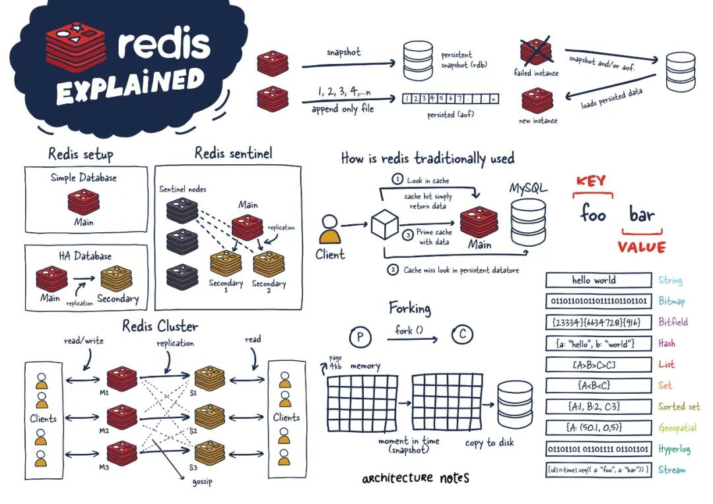
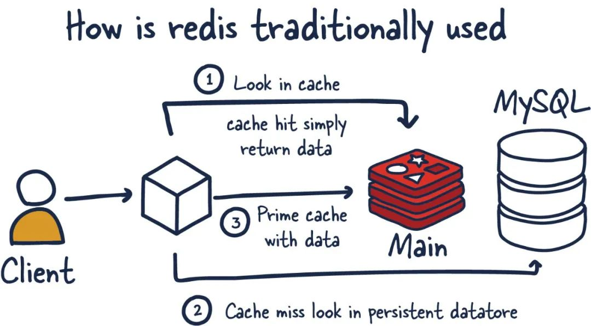

## Redis 简介

Redis 是⼀种基于键值对的 NoSQL 数据库

Redis 是一种基于内存的数据库，对数据的读写操作都是在内存中完成，因此**读写速度非常快**，常用于**缓存，消息队列、分布式锁**等场景。

Redis 提供了多种数据类型来支持不同的业务场景，比如 String(字符串)、Hash(哈希)、List (列表)、Set(集合)、Zset(有序集合)、Bitmaps（位图）、HyperLogLog（基数统计）、GEO（地理信息）、Stream（流），并且对数据类型的操作都是**原子性**的，因为执行命令由**单线程**负责的，不存在并发竞争的问题。

除此之外，Redis 还支持事务、持久化、Lua 脚本、多种集群方案（主从复制模式、哨兵模式、切片集群模式）、发布/订阅模式，内存淘汰机制、过期删除机制等等

主要来说，Redis 是一个内存数据库，用作另一个“真实”数据库（如 MySQL 或PostgreSQL）前面的缓存，以帮助提高应用程序性能。它通过利用内存的高速访问速度，从而减轻核心应用程序数据库的负载，例如：

- 不经常更改且经常被请求的数据
- 任务关键性较低且经常变动的数据

另一个重要方面是 Redis 模糊了缓存和数据存储之间的界限。这里要理解的重要一点是，相比于使用 SSD 或 HDD 作为存储的传统数据库，读取和操作内存中数据的速度要快得多。

## Redis 架构

Redis可以不同配置：

- 单个 Redis 实例
- Redis 高可用性
- Redis 哨兵
- Redis 集群

### 单个 Redis 实例

单个 Redis 实例是最直接的 Redis 部署方式。它允许用户设置和运行小型实例，从而帮助他们快速发展和加速服务。但是，这种部署并非没有缺点。例如，如果此实例失败或不可用，则所有客户端对 Redis 的调用都将失败，从而降低系统的整体性能和速度。

发送到 Redis 的命令首先在内存中处理。然后，如果在这些实例上设置了持久性，则在某个时间间隔上会有一个fork进程，来生成数据持久化 RDB（Redis 数据的非常紧凑的时间点表示）快照或 AOF（仅附加文件）。

这两个流程可以让 Redis 拥有长期存储，支持各种复制策略，并启用更复杂的拓扑。如果 Redis 未设置为持久化数据，则在重新启动或故障转移时数据会丢失。如果在重启时启用了持久化，它会将 RDB 快照或 AOF 中的所有数据加载回内存，然后实例可以支持新的客户端请求。

### Redis 复制

#### 高可用性

Redis 的另一个流行设置是主从部署方式，从部署保持与主部署之间数据同步。当数据写入主实例时，它会将这些命令的副本发送到从部署客户端输出缓冲区，从而达到数据同步的效果。从部署可以有一个或多个实例。这些实例可以帮助扩展 Redis 的读取操作或提供故障转移，以防 main 丢失。

#### Redis复制

Redis 的每个主实例都有一个复制 ID 和一个偏移量。这两条数据对于确定副本可以继续其复制过程的时间点或确定它是否需要进行完整同步至关重要。对于主 Redis 部署上发生的每个操作，此偏移量都会增加。

> 复制 ID 是一个唯一标识符，用于标识一个 Redis 主实例的"身份"：
>
> - 每个主实例都有自己的复制 ID
> - 当实例被提升为主实例或重启时，会生成新的复制 ID
> - 它用于判断两个实例是否来自同一个"复制链"
>
> 举例：主实例 A 的复制 ID 是 abc123，它的所有副本也会记录这个 ID
>
> 偏移量是一个递增的数字，用于记录主实例上执行的操作数量：
>
> - 主实例每执行一个写操作，偏移量就会增加
> - 它标记了数据变更的"进度位置"
> - 副本实例通过偏移量知道自己与主实例的数据差距有多大
>
> 举例：如果主实例偏移量是 1000，副本偏移量是 950，说明副本落后了 50 个操作命令

更明确地说，当 Redis 副本实例仅落后于主实例几个偏移量时，它会从主实例接收剩余的命令，然后在其数据集上重放，直到同步完成。

如果两个实例无法就复制 ID 达成一致，或者主实例不知道偏移量，则副本将请求全量同步。这时主实例会创建一个新的 RDB 快照并将其发送到副本。

在此传输之间，主实例会缓冲快照截止和当前偏移之间的所有中间更新指令，这样在快照同步完后，再将这些指令发送到副本实例。这样完成后，复制就可以正常继续。

如果一个实例具有相同的复制 ID 和偏移量，则它们具有完全相同的数据。现在你可能想知道为什么需要复制 ID。

当 Redis 实例被提升为主实例或作为主实例从头开始重新启动时，它会被赋予一个新的复制 ID。

这用于推断此新提升的副本实例是从先前哪个主实例复制出来的。这允许它能够执行部分同步（与其他副本节点），因为新的主实例会记住其旧的复制 ID。

例如，两个实例（主实例和从实例）具有相同的复制 ID，但偏移量相差几百个命令，这意味着如果在实例上重放这些偏移量后面的命令，它们将具有相同的数据集。现在，如果复制 ID 完全不同，并且我们不知道新降级（或重新加入）从节点的先前复制 ID（没有共同祖先）。我们将需要执行昂贵的全量同步。

相反，如果我们知道以前的复制 ID，我们就可以推断如何使数据同步，因为我们能够推断出它们共享的共同祖先，并且偏移量对于部分同步再次有意义。
