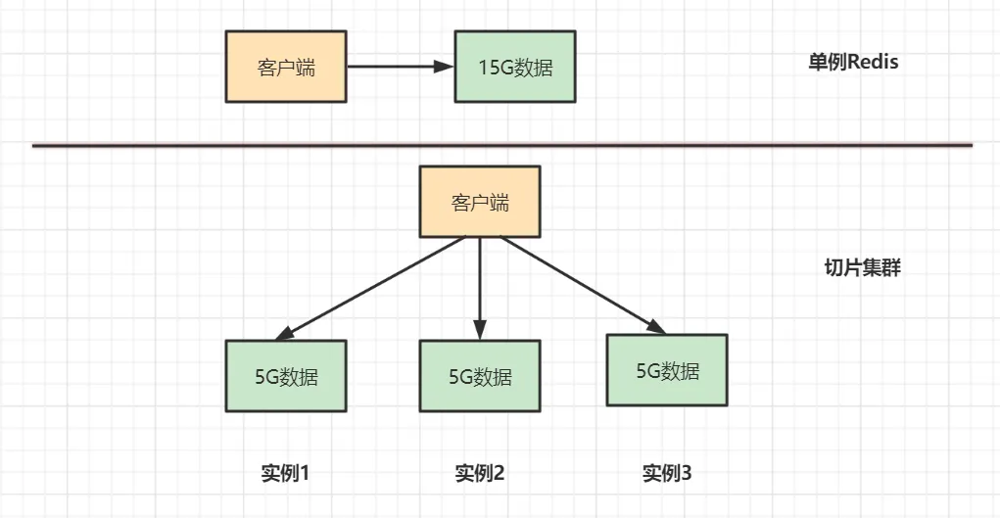
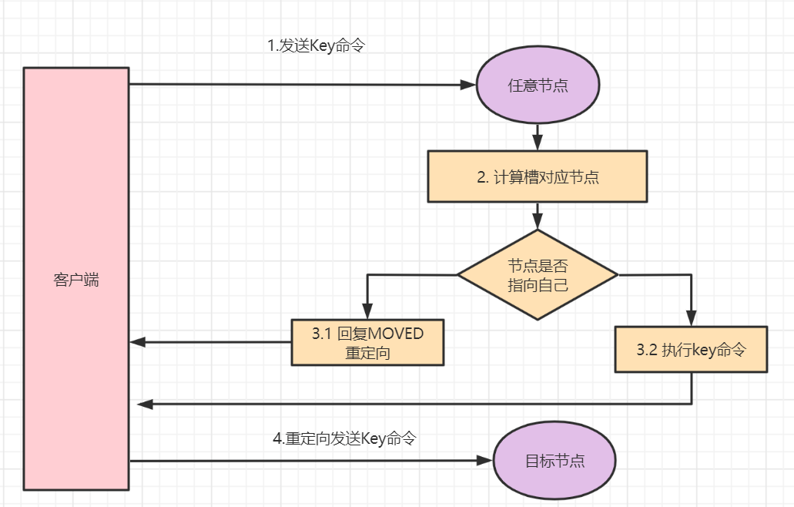
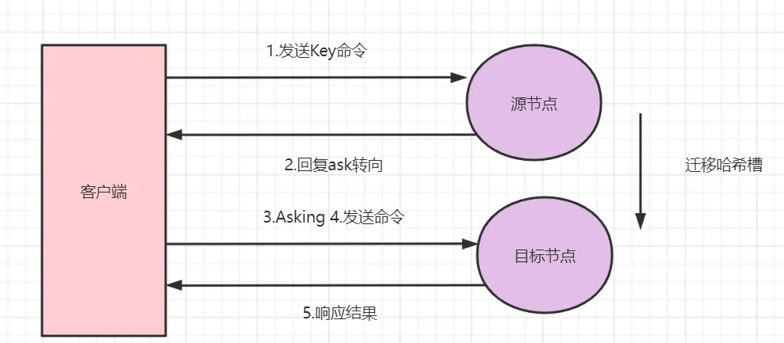
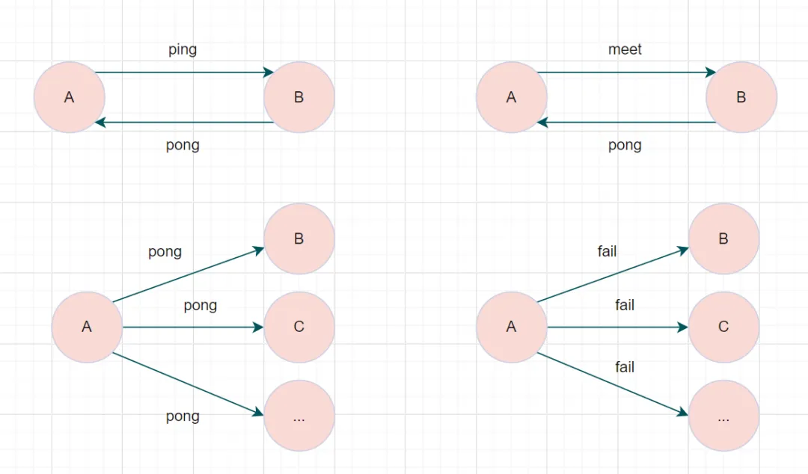

## Redis 高可用 - 集群

主要内容：

- 为什么需要Redis Cluster？
- 客户端是怎样知道该访问哪个分片的? (哈希槽)
- redis实例上并没有相应的数据，会怎么样？(MOVED重定向和ASK重定向)
- 各个节点之间是怎么通信的呢(Gossip协议)
- 集群内节点出现故障怎么办（故障转移）
- Redis Cluster的Hash Slot 为什么是16384？

### Redis Cluster

哨兵模式基于主从模式，实现读写分离，它还可以自动切换，系统可用性更高。但是它**每个节点存储的数据是一样的，浪费内存，并且不好在线扩容**

> 比如你一个Redis实例保存15G甚至更大的数据，响应就会很慢，这是因为Redis RDB 持久化机制导致的，Redis会fork子进程完成 RDB 持久化操作，fork执行的耗时与 Redis 数据量成正相关

因此，Reids Cluster集群（切片集群的实现方案）应运而生

它在Redis3.0加入的，实现了Redis的分布式存储

对数据进行分片，也就是说每台Redis节点上存储不同的内容，来解决在线扩容的问题。并且，它可以保存大量数据，即分散数据到各个Redis实例，还提供复制和故障转移的功能。

因此，如果将这 15G 数据进行切片保存，分散来存储就可以缓解了

> 切片集群和Redis Cluster的区别：Redis Cluster是从Redis3.0版本开始，官方提供的一种实现切片集群的方案

既然数据是分片分布到不同Redis实例的，那客户端到底是怎么确定想要访问的数据在哪个实例上

#### 客户端如何知道该访问哪个分片

Redis Cluster方案采用哈希槽（Hash Slot），来处理数据和实例之间的映射关系

> 一个切片集群被分为16384个slot（槽），每个进入Redis的键值对，根据key进行散列，分配到这16384插槽中的一个
>
> 使用的哈希映射也比较简单，用CRC16算法计算出一个16bit的值，再对16384取模。数据库中的每个键都属于这16384个槽的其中一个，集群中的每个节点都可以处理这16384个槽

集群中的每个节点负责一部分的哈希槽，假设当前集群有A、B、C3个节点，每个节点上负责的哈希槽数 =16384/3，那么可能存在的一种分配：

- 节点A负责0~5460号哈希槽
- 节点B负责5461~10922号哈希槽
- 节点C负责10923~16383号哈希槽

客户端给一个Redis实例发送数据读写操作时，如果这个实例上并没有相应的数据，会怎么样

#### 实例上并没有相应的数据，会怎么样 (Moved重定向 | ACK重定向)

在Redis cluster模式下，节点对请求的处理过程如下：

- 通过哈希槽映射，检查当前Redis key是否存在当前节点
- 若哈希槽不是由自身节点负责，就返回MOVED重定向
- 若哈希槽确实由自身负责，且key在slot中，则返回该key对应结果
- 若Redis key不存在此哈希槽中，检查该哈希槽是否正在迁出（MIGRATING）？
- 若Redis key正在迁出，返回ASK错误重定向客户端到迁移的目的服务器上
- 若哈希槽未迁出，检查哈希槽是否导入中？
- 若哈希槽导入中且有ASKING标记，则直接操作，否则返回MOVED重定向

##### MOVED 重定向

客户端给一个Redis实例发送数据读写操作时，如果计算出来的槽不是在该节点上，这时候它会返回MOVED重定向错误，MOVED重定向错误中，会将哈希槽所在的新实例的IP和port端口带回去。这就是Redis Cluster的MOVED重定向机制

##### ASK 重定向

Ask重定向一般发生于集群伸缩的时候。集群伸缩会导致槽迁移，当我们去源节点访问时，此时数据已经可能已经迁移到了目标节点，使用Ask重定向可以解决此种情况

#### 节点之间通信 (Gossip 协议)

一个Redis集群由多个节点组成，各个节点之间是通过Gossip协议通信

Gossip是一种谣言传播协议，每个节点周期性地从节点列表中选择 k 个节点，将本节点存储的信息传播出去，直到所有节点信息一致，即算法收敛了

> Gossip协议基本思想：一个节点想要分享一些信息给网络中的其他的一些节点。于是，它周期性的随机选择一些节点，并把信息传递给这些节点。这些收到信息的节点接下来会做同样的事情，即把这些信息传递给其他一些随机选择的节点。一般而言，信息会周期性的传递给N个目标节点，而不只是一个。这个N被称为fanout

Redis Cluster集群通过Gossip协议进行通信，节点之前不断交换信息，交换的信息内容包括节点出现故障、新节点加入、主从节点变更信息、slot信息等等

gossip协议包含多种消息类型，包括ping，pong，meet，fail等等

- meet消息：通知新节点加入。消息发送者通知接收者加入到当前集群，meet消息通信正常完成后，接收节点会加入到集群中并进行周期性的ping、pong消息交换。
- ping消息：节点每秒会向集群中其他节点发送 ping 消息，消息中带有自己已知的两个节点的地址、槽、状态信息、最后一次通信时间等
- pong消息：当接收到ping、meet消息时，作为响应消息回复给发送方确认消息正常通信。消息中同样带有自己已知的两个节点信息。
- fail消息：当节点判定集群内另一个节点下线时，会向集群内广播一个fail消息，其他节点接收到fail消息之后把对应节点更新为下线状态

> 特别的，每个节点是通过集群总线(cluster bus) 与其他的节点进行通信的。通讯时，使用特殊的端口号，即对外服务端口号加10000。例如如果某个node的端口号是6379，那么它与其它nodes通信的端口号是 16379。nodes 之间的通信采用特殊的二进制协议

#### 集群内节点出现故障怎么办（故障转移）

Redis集群实现了高可用，当集群内节点出现故障时，通过故障转移，以保证集群正常对外提供服务

redis集群通过ping/pong消息，实现故障发现。

这个环境包括**主观下线**和**客观下线**

- 主观下线：某个节点认为另一个节点不可用，即下线状态，这个状态并不是最终的故障判定，只能代表一个节点的意见，可能存在误判情况
- 客观下线：指标记一个节点真正的下线，集群内多个节点都认为该节点不可用，从而达成共识的结果。如果是持有槽的主节点故障，需要为该节点进行故障转移

#### 为什么Redis Cluster的Hash Slot 是16384

对于客户端请求过来的键值key，哈希槽=CRC16(key) % 16384，CRC16算法产生的哈希值是16bit的，按道理该算法是可以产生2^16=65536个值，为什么不用65536，用的是16384（2^14）

- 在redis节点发送心跳包时需要把所有的槽放到这个心跳包里，如果slots数量是65536，占空间= 65536 / 8(一个字节8bit) / 1024(1024个字节1kB) =8kB，如果使用slots数量是16384，所占空间 =16384 / 8(每个字节8bit) / 1024(1024个字节1kB) = 2kB，可见16384个slots比 65536省 6kB内存左右，假如一个集群有100个节点,那每个实例里就省了600kB啦
- 一般情况下Redis cluster集群主节点数量基本不可能超过1000个，超过1000会导致网络拥堵。对于节点数在1000以内的Redis cluster集群，16384个槽位其实够用了