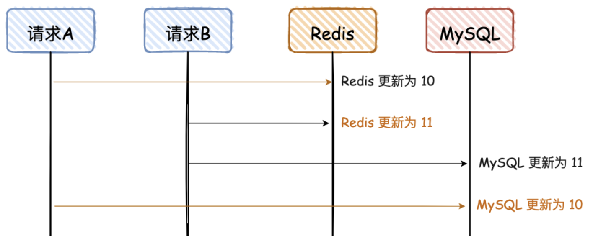
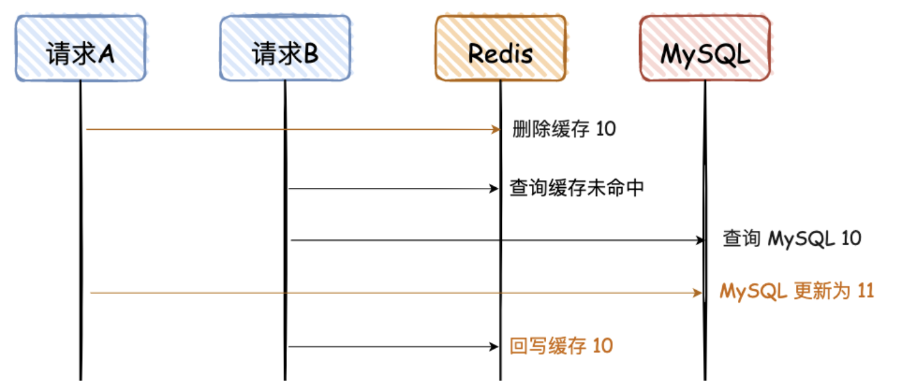
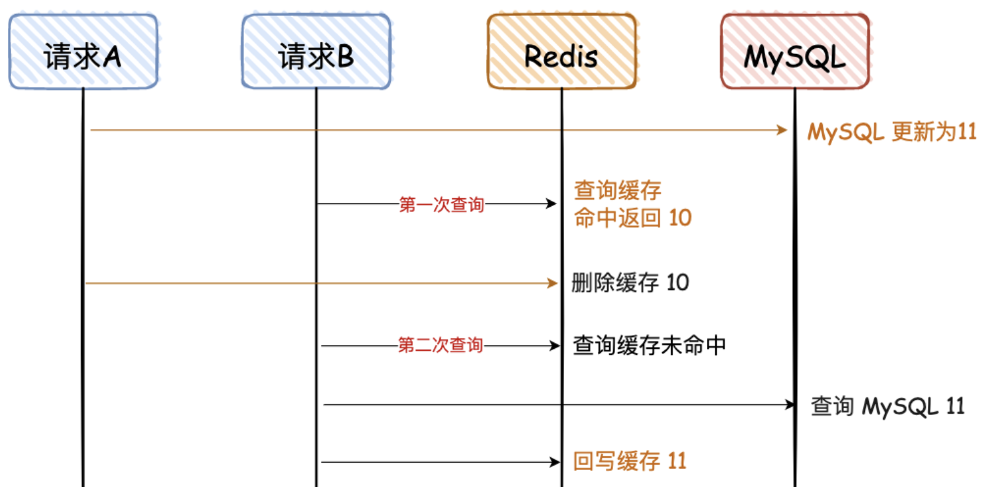
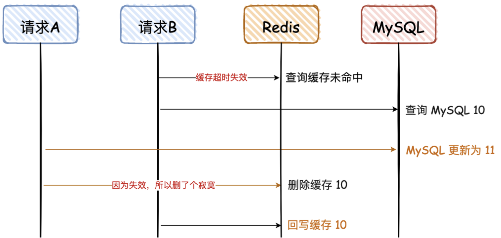
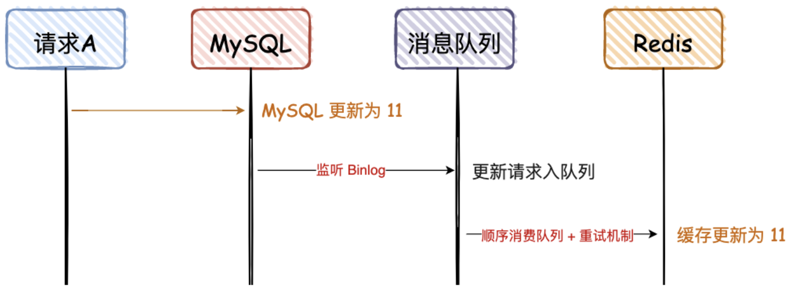

## Redis 缓存2

给服务器加上 Redis，让其作为数据库的缓存

这样，在客户端请求数据时，如果能在缓存中命中数据，那就查询缓存，不用在去查询数据库，从而减轻数据库的压力，提高服务器的性能

由于引入了缓存，那么在数据更新时，不仅要更新数据库，而且要更新缓存，这两个更新操作存在前后的问题：

- 先更新数据库，再更新缓存；
- 先更新缓存，再更新数据库；

### 数据库与缓存一致性问题

#### 不好的方案

##### 先写 MySQL，再写 Redis

请求 A、B 都是先写 MySQL，然后再写 Redis，在高并发情况下，如果请求 A 在写 Redis 时卡了一会，请求 B 已经依次完成数据的更新

如果并发同时写，后写被先写覆盖

##### 先写 Redis，再写 MySQL

##### 先删除 Redis，再写 MySQL

请求 A 是更新请求，但是请求 B 是读请求，且请求 B 的读请求会回写 Redis

请求 A 先删除缓存，可能因为卡顿，数据一直没有更新到 MySQL，导致两者数据不一致。

这种情况出现的概率比较大，因为请求 A 更新 MySQL 可能耗时会比较长，而请求 B 的前两步都是查询，会非常快

#### 好的方案

##### 先删除 Redis，再写 MySQL，再删除 Redis

对于“先删除 Redis，再写 MySQL”，如果要解决最后的不一致问题，其实再对 Redis 重新删除即可，这个也是大家常说的“缓存双删”

第一个方案是，让请求 A 的最后一次删除，等待 500ms。

对于这种方案，看看就行，反正我是不会用，太 Low 了，风险也不可控。

那有没有更好的方案呢，我建议**异步串行化删除**，即**删除请求入队列**

> “缓存双删”不要用无脑的 sleep 500 ms；
> 通过消息队列的异步&串行，实现最后一次缓存删除；
> 缓存删除失败，增加重试机制

##### 先写 MySQL，再删除 Redis

这种情况，对于第一次查询，请求 B 查询的数据是 10，但是 MySQL 的数据是 11，只存在这一次不一致的情况，对于不是强一致性要求的业务，可以容忍（那什么情况下不能容忍呢，比如秒杀业务、库存服务等）

当请求 B 进行第二次查询时，因为没有命中 Redis，会重新查一次 DB，然后再回写到 Reids

可能意外情况

这里需要满足 2 个条件：

- 缓存刚好自动失效；
- 请求 B 从数据库查出 10，回写缓存的耗时，比请求 A 写数据库，并且删除缓存的还长。

对于第二个条件，我们都知道更新 DB 肯定比查询耗时要长，所以出现这个情况的概率很小，同时满足上述条件的情况更小

##### 先写 MySQL，通过 Binlog，异步更新 Redis

这种方案，主要是监听 MySQL 的 Binlog，然后通过异步的方式，将数据更新到 Redis，这种方案有个前提，查询的请求，不会回写 Redis

这个方案，会保证 MySQL 和 Redis 的最终一致性，但是如果中途请求 B 需要查询数据，如果缓存无数据，就直接查 DB；如果缓存有数据，查询的数据也会存在不一致的情况。

所以这个方案，是实现**最终一致性**的终极解决方案，但是不能保证实时性

#### 总结

- 实时一致性方案：采用“先写 MySQL，再删除 Redis”的策略，这种情况虽然也会存在两者不一致，但是需要满足的条件有点苛刻，所以是**满足实时性条件**下，能**尽量满足一致性的最优解**。
- 最终一致性方案：采用“先写 MySQL，通过 Binlog，异步更新 Redis”，可以通过 Binlog，结合消息队列异步更新 Redis，是**最终一致性的最优解**
