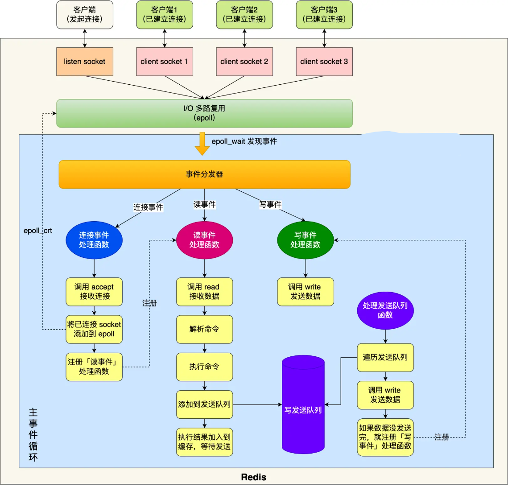
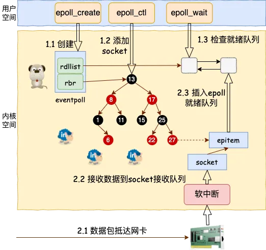
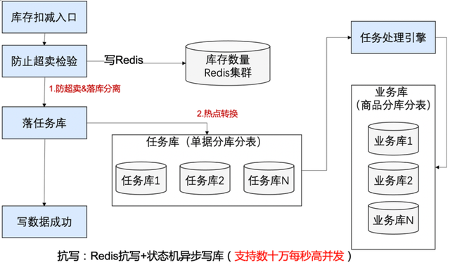
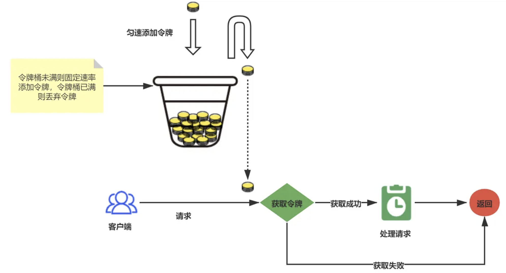
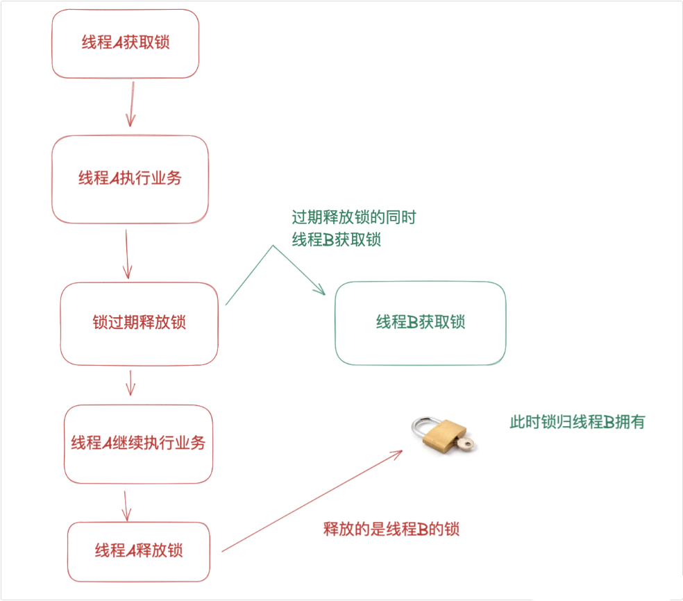
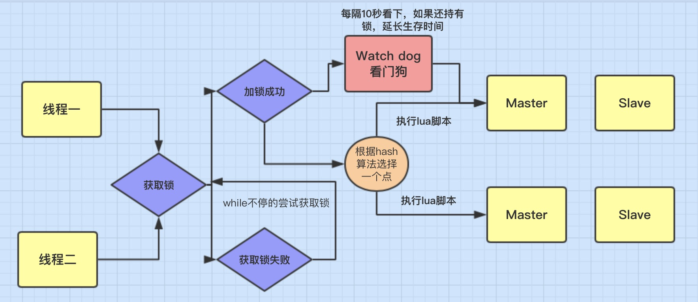
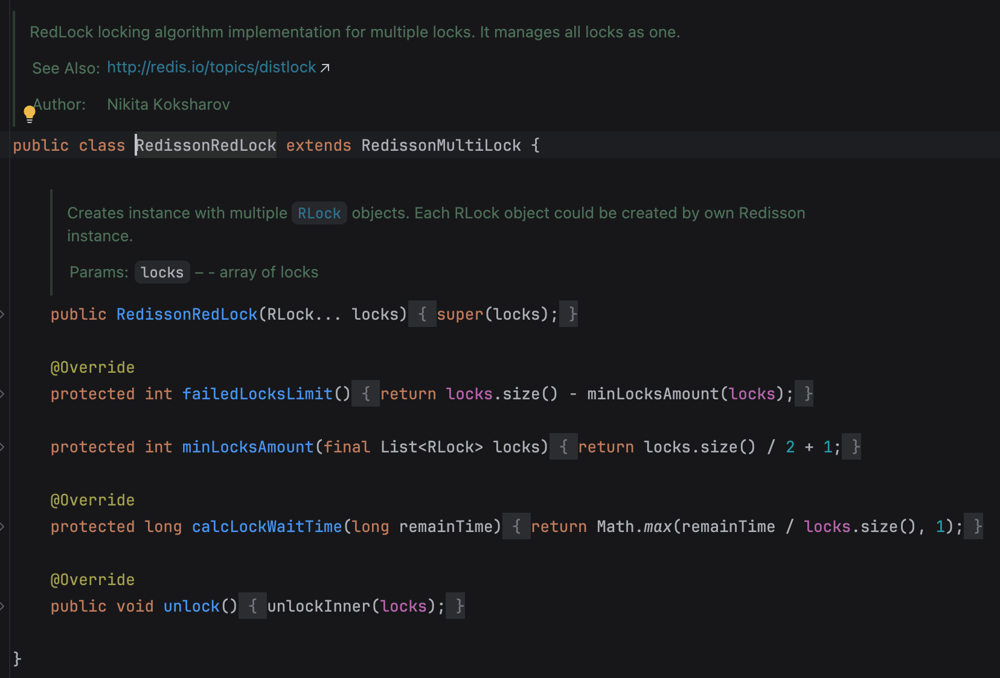

## Redis 简介

Redis 是一种基于**内存的数据库**，对数据的读**写操作都是在内存中完成**，因此**读写速度非常快**，常用于**缓存，消息队列、分布式锁**等场景

### Redis 和 Memcached 区别

Redis 与 Memcached 共同点：

- 都是基于内存的数据库，一般都用来当做缓存使用。
- 都有过期策略。
- 两者的性能都非常高。

Redis 与 Memcached 区别：(数据类型、持久化、集群管理、其他功能)

- Redis 支持的数据类型更丰富（String、Hash、List、Set、ZSet），而 Memcached 只支持最简单的 key-value 数据类型；
- Redis 支持数据的持久化，可以将内存中的数据保持在磁盘中，重启的时候可以再次加载进行使用，而 Memcached 没有持久化功能，数据全部存在内存之中，Memcached 重启或者挂掉后，数据就没了；
- Redis 原生支持集群模式，Memcached 没有原生的集群模式，需要依靠客户端来实现往集群中分片写入数据；
- Redis 支持发布订阅模型、Lua 脚本、事务等功能，而 Memcached 不支持；

## Redis 线程模型

### Redis 是单线程吗

Redis 单线程指的是「**接收客户端请求->解析请求 ->进行数据读写等操作->发送数据给客户端**」这个过程是由一个线程（主线程）来完成的

但是，Redis 程序并不是单线程的，Redis 在启动的时候，是会启动后台线程（BIO）的：

- Redis 在 2.6 版本，会启动 2 个后台线程，分别处理关闭文件、AOF 刷盘这两个任务；
- Redis 在 4.0 版本之后，新增了一个新的后台线程，用来异步释放 Redis 内存，也就是 lazyfree 线程。例如执行 unlink key / flushdb async / flushall async 等命令，会把这些删除操作交给后台线程来执行，好处是不会导致 Redis 主线程卡顿。因此，当我们要删除一个大 key 的时候，不要使用 del 命令删除，因为 del 是在主线程处理的，这样会导致 Redis 主线程卡顿，因此我们应该使用 unlink 命令来异步删除大 key

后台线程相当于一个消费者，生产者把耗时任务丢到任务队列中，消费者（BIO）不停轮询这个队列，拿出任务就去执行对应的方法即可

**关闭文件、AOF 刷盘、释放内存**这三个任务都有各自的任务队列：

- BIO_CLOSE_FILE，关闭文件任务队列：当队列有任务后，后台线程会调用 close(fd) ，将文件关闭；
- BIO_AOF_FSYNC，AOF 刷盘任务队列：当 AOF 日志配置成 everysec 选项后，主线程会把 AOF 写日志操作封装成一个任务，也放到队列中。当发现队列有任务后，后台线程会调用 fsync(fd)，将 AOF 文件刷盘，
- BIO_LAZY_FREE，lazy free 任务队列：当队列有任务后，后台线程会 free(obj) 释放对象 / free(dict) 删除数据库所有对象 / free(skiplist) 释放跳表对象；

### Redis 单线程模式

Redis 6.0 版本之前的单线模式：



蓝色部分是一个事件循环，是由主线程负责的，可以看到网络 I/O 和命令处理都是单线程

Redis 初始化的时候，会做下面这几件事情 (多路复用)：

- 首先，调用 epoll_create() 创建一个 epoll 对象和调用 socket() 一个服务端 socket
- 然后，调用 bind() 绑定端口和调用 listen() 监听该 socket；
- 然后，将调用 epoll_ctl() 将 listen socket 加入到 epoll，同时注册「连接事件」处理函数

初始化完后，主线程就进入到一个事件循环函数，主要会做以下事情：

- 首先，先调用处理发送队列函数，看是发送队列里是否有任务，如果有发送任务，则通过 write 函数将客户端发送缓存区里的数据发送出去，如果这一轮数据没有发送完，就会注册写事件处理函数，等待 epoll_wait 发现可写后再处理。
- 接着，调用 epoll_wait 函数等待事件的到来：
- 如果是连接事件到来，则会调用连接事件处理函数，该函数会做这些事情：调用 accpet 获取已连接的 socket -> 调用 epoll_ctl 将已连接的 socket 加入到 epoll -> 注册「读事件」处理函数；
- 如果是读事件到来，则会调用读事件处理函数，该函数会做这些事情：调用 read 获取客户端发送的数据 -> 解析命令 -> 处理命令 -> 将客户端对象添加到发送队列 -> 将执行结果写到发送缓存区等待发送；
- 如果是写事件到来，则会调用写事件处理函数，该函数会做这些事情：通过 write 函数将客户端发送缓存区里的数据发送出去，如果这一轮数据没有发送完，就会继续注册写事件处理函数，等待 epoll_wait 发现可写后再处理

#### 多路复用

在传统的同步阻塞网络编程模型里（没有协程以前），性能上不来的根本原因在于进程线程都是笨重的家伙

让一个进(线)程只处理一个用户请求确确实实是有点浪费了

先抛开高内存开销不说，在海量的网络请求到来的时候，光是频繁的进程线程上下文就让 CPU 疲于奔命

> 如果把进程比作牧羊人，一个进(线)程同时只能处理一个用户请求，相当于一个人只能看一只羊，放完这一只才能放下一只。如果同时来了 1000 只羊，那就得 1000 个人去放，这人力成本是非常高的

性能提升思路很简单，就是让很多的用户连接来复用同一个进(线)程，这就是**多路复用**

多路指的是许许多多个用户的网络连接。复用指的是对进(线)程的复用

不过复用实现起来是需要特殊的 socket 事件管理机制的，最典型和高效的方案就是 epoll

在 epoll 的系列函数里， epoll_create 用于创建一个 epoll 对象，epoll_ctl 用来给 epoll 对象添加或者删除一个 socket。epoll_wait 就是查看它当前管理的这些 socket 上有没有可读可写事件发生



当网卡上收到数据包后，Linux 内核进行一系列的处理后把数据放到 socket 的接收队列

然后会检查是否有 epoll 在管理它，如果是则在 epoll 的就绪队列中插入一个元素。epoll_wait 的操作就非常的简单了，就是到 epoll 的就绪队列上来查询有没有事件发生就行了

在基于 epoll 的编程中，和传统的函数调用思路不同的是，我们并不能主动调用某个 API 来处理。因为无法知道我们想要处理的事件啥时候发生。所以只好提前把想要处理的事件的处理函数注册到一个**事件分发器**上去

当事件发生的时候，由这个事件分发器调用回调函数进行处理。这类基于实现注册事件分发器的开发模式也叫 Reactor 模型

### 为什么单线程还这么快

官方使用基准测试的结果是，单线程的 Redis 吞吐量可以达到 10W/每秒

之所以 Redis 采用单线程（网络 I/O 和执行命令）那么快，有如下几个原因：

- Redis 的大部分操作都在**内存中完成**，并且采用了**高效的数据结构**，因此 Redis 瓶颈可能是机器的内存或者网络带宽，而并非 CPU，既然 CPU 不是瓶颈，那么自然就采用单线程的解决方案了；
- Redis 采用**单线程模型**可以**避免了多线程之间的竞争**，省去了**多线程切换带来的时间和性能上的开销**，而且也不会导致死锁问题。
- Redis 采用了**I/O 多路复用机制**处理大量的客户端 Socket 请求，IO 多路复用机制是指一个线程处理多个 IO 流，就是我们经常听到的 select/epoll 机制。简单来说，在 Redis 只运行单线程的情况下，该机制允许内核中，同时存在多个监听 Socket 和已连接 Socket。内核会一直监听这些 Socket 上的连接请求或数据请求。一旦有请求到达，就会交给 Redis 线程处理，这就实现了一个 Redis 线程处理多个 IO 流的效果

### Redis 6.0 之后为什么引入了多线程

虽然 Redis 的主要工作（网络 I/O 和执行命令）一直是单线程模型，但是在 Redis 6.0 版本之后，也**采用了多个 I/O 线程来处理网络请求，这是因为随着网络硬件的性能提升，Redis 的性能瓶颈有时会出现在网络 I/O 的处理上**

所以为了提高网络 I/O 的并行度，Redis 6.0 对于网络 I/O 采用多线程来处理。但是对于命令的执行，Redis 仍然使用单线程来处理

## 如何设计一个缓存策略，可以动态缓存热点数据

由于数据存储受限，系统并不是将所有数据都需要存放到缓存中的，而只是将其中一部分热点数据缓存起来

热点数据动态缓存的策略总体思路：**通过数据最新访问时间来做排名，并过滤掉不常访问的数据，只留下经常访问的数据**

以电商平台场景中的例子，现在要求只缓存用户经常访问的 Top 1000 的商品。具体细节如下：

- 先通过缓存系统做一个排序队列（比如存放 1000 个商品），系统会根据商品的访问时间，更新队列信息，**越是最近访问的商品排名越靠前**；
- 同时系统会定期**过滤掉队列中排名最后的 200 个商品**，然后再从数据库中随机读取出 200 个商品加入队列中；
- 这样当请求每次到达的时候，会先从队列中获取商品 ID，如果命中，就根据 ID 再从另一个缓存数据结构中读取实际的商品信息，并返回。

在 Redis 中可以用 zadd 方法和 zrange 方法来完成排序队列和获取 200 个商品的操作

## Redis 在秒杀场景的角色

秒杀是一种非常特殊的业务场景，它的特点是在极短时间内会有大量用户涌入系统，对系统的并发处理能力、响应速度和数据一致性都提出了极高的要求

在这种场景下，Redis 作为一种高性能的内存数据库，能够发挥多方面的关键作用。

比如说在秒杀开始前，我们可以将商品信息、库存数据等预先加载到 Redis 中，这样大量的用户读请求就可以直接从 Redis 中获取响应，而不必每次都去访问数据库，这样就能大大减轻数据库的访问压力

其次，Redis 在库存控制方面具有得天独厚的优势

秒杀最核心的问题之一就是**容易发生超卖**

Redis 提供的原子操作如 DECR、DECRBY 等命令，可以确保在高并发环境下库存计数的准确性



更复杂的逻辑，可以通过 Lua 脚本来实现，因为 Lua 脚本在 Redis 中是原子执行的，所以可以包含复杂的判断和操作逻辑，比如先检查库存是否充足，再进行扣减，这整个过程是不会被其他操作打断的

第三点，Redis 的分布式锁可以确保多个用户同时抢购同一件商品时的操作是互斥的，保证数据一致性的同时，还可以用来防止用户重复下单

第四点，限流削峰。秒杀开始的瞬间，可能会有成千上万的请求同时到达，如果不加控制，很容易导致系统崩溃。Redis 可以实现多种限流算法，比如简单的计数器限流、令牌桶或漏桶算法等

通过限流算法我们可以控制单位时间内系统能够处理的请求数量，超出部分可以排队或者直接拒绝，从而保护系统的稳定运行

### Redis 限流

限流是为了控制系统的请求速率，防止系统被过多的请求压垮

#### 基于计数器的固定窗口限流

比如限制用户每分钟最多访问 100 次

用 INCR 命令给每个用户设个计数器

key 是 rate_limit:用户ID:分钟时间戳，每次请求就加 1，同时设置 60 秒过期

如果计数超过 100 就拒绝请求

这种方法简单粗暴，但有个问题就是临界时间会有突刺，比如用户在第 59 秒访问了 100 次，第 61 秒又访问 100 次，相当于 2 秒内访问了 200 次

#### 滑动窗口限流

通过 Redis 的 ZSET 来实现

把每次请求的时间戳作为 score 存进去，然后用 ZREMRANGEBYSCORE 删除窗口外的旧数据，再用 ZCARD 统计当前窗口内的请求数

这样限流就比较均匀了

```lua
-- 滑动窗口限流 Lua 脚本
local key = KEYS[1]
local limit = tonumber(ARGV[1])
local window = tonumber(ARGV[2])
local now = tonumber(ARGV[3])

-- 删除窗口外的数据
redis.call('ZREMRANGEBYSCORE', key, 0, now - window)

-- 统计当前请求数
local count = redis.call('ZCARD', key)

if count < limit then
    -- 添加当前请求
    redis.call('ZADD', key, now, now)
    redis.call('EXPIRE', key, window + 1)
    return 1
else
    return 0
end
```

优点:

- 限流精确，不会出现固定窗口的"突刺"问题
- 窗口真正"滑动"，每次请求都重新计算

缺点:

- 内存占用较高(存储每个请求的时间戳)
- 需要频繁操作 ZSET

#### 令牌桶算法

可以在 Redis 里存两个值，一个是令牌数量，一个是上次更新时间。

每次请求时用 Lua 脚本计算应该补充多少令牌，然后判断是否有足够的令牌

Redis 存储结构:

```plain
key: "rate_limit:user_123"
  ├─ last_micros: 上次更新时间(微秒)
  └─ stored_permits: 当前令牌数
```



```lua
-- Redis Lua脚本实现令牌桶算法
local key = KEYS[1]  -- 限流的key
local max_permits = tonumber(ARGV[1])  -- 最大令牌数
local permits_per_second = tonumber(ARGV[2])  -- 每秒产生的令牌数
local required_permits = tonumber(ARGV[3])  -- 请求的令牌数

-- 获取当前时间
local time = redis.call('time')
local now_micros = tonumber(time[1]) * 1000000 + tonumber(time[2])

-- 获取上次更新的时间和当前存储的令牌数
local last_micros = tonumber(redis.call('hget', key, 'last_micros') or 0)
local stored_permits = tonumber(redis.call('hget', key, 'stored_permits') or 0)

-- 计算时间间隔内新产生的令牌数
local interval_micros = now_micros - last_micros
local new_permits = interval_micros * permits_per_second / 1000000
stored_permits = math.min(max_permits, stored_permits + new_permits)

-- 判断令牌是否足够
local result = 0
if stored_permits >= required_permits then
    -- 令牌足够，更新令牌数和时间
    stored_permits = stored_permits - required_permits
    result = 1
end

-- 更新Redis中的数据
redis.call('hset', key, 'last_micros', now_micros)
redis.call('hset', key, 'stored_permits', stored_permits)
redis.call('expire', key, 10)  -- 设置过期时间，避免长期占用内存

return result
```

- 令牌补充是懒加载的 - 不是定时补充，而是每次请求时计算应该补充多少
- 原子操作 - Lua 脚本保证整个过程原子执行
- 微秒精度 - 使用 redis.call('time') 获取高精度时间
- 自动过期 - 设置 10 秒过期避免内存泄漏

### Redis 实现削峰

削峰的本质是将瞬时的高流量请求缓冲起来，通过排队、限流等机制，使系统以一个可承受的速度来处理请求

那第一步就是缓存预热

在秒杀活动开始前，先把商品信息这些热点数据提前加载到 Redis 中。这样用户访问商品页面时，可以直接从 Redis 读取，数据库基本上不会有压力

第二步是**引入消息队列**

特别是下单这种写操作，不能让用户等太久，但后端处理订单、扣库存这些操作又比较重

所以可以用 Redis 的 List 做了个队列，或者直接用 RocketMQ 这种标准的消息中间件，用户下单后立即返回"订单提交成功"，然后把订单数据丢到队列里，后台服务慢慢消费。这样既保证了用户体验，又避免了系统被瞬时写请求压垮

第三步，可以在秒杀活动中加入答题环节，只有答对题目的用户才能参与秒杀活动，这样可以最大程度减少无效请求

例子:

```java
@Service
public class SeckillServiceImpl implements SeckillService {
    
  @Autowired
  private RedisTemplate<String, String> redisTemplate;
  
  @Autowired
  private OrderService orderService;
  
  @Autowired
  private CommodityService commodityService;
  
  /**
   * 秒杀请求入口
   */
  public Result seckill(Long userId, Long commodityId) {
      // 1. 用户请求频率限制
      if (!countRateLimit("user:" + userId, 5, 60)) {
          return Result.error("请求过于频繁");
      }
      
      // 2. 商品是否在秒杀时间内
      if (!isInSeckillTime(commodityId)) {
          return Result.error("秒杀未开始或已结束");
      }
      
      // 3. 是否还有库存(快速失败)
      String stockKey = "seckill:stock:" + commodityId;
      Integer stock = Integer.valueOf(redisTemplate.opsForValue().get(stockKey));
      if (stock != null && stock <= 0) {
          return Result.error("商品已售罄");
      }
      
      // 4. 全局限流
      if (!acquireToken("global", 1000, 100)) {
          // 系统负载过高，将请求放入队列延迟处理
          enqueueDelayedRequest(userId, commodityId);
          return Result.success("秒杀请求已受理，排队处理中");
      }
      
      // 5. 检查用户是否已购买
      if (hasUserBought(userId, commodityId)) {
          return Result.error("您已经购买过该商品");
      }
      
      // 6. 将请求放入队列，返回排队状态
      String requestId = generateRequestId(userId, commodityId);
      enqueueRequest(userId, commodityId, requestId);
      
      return Result.success("秒杀请求已提交，请等待结果", requestId);
  }
  
  /**
   * 异步处理秒杀请求
   */
  @Scheduled(fixedRate = 50) // 每50ms处理一批
  public void processSeckillQueue() {
      String queueKey = "seckill:queue";
      
      // 批量处理，控制处理速度
      for (int i = 0; i < 10; i++) {
          String requestJson = redisTemplate.opsForList().leftPop(queueKey);
          if (requestJson == null) {
              break;
          }
          
          SeckillRequest request = JSON.parseObject(requestJson, SeckillRequest.class);
          try {
              // 执行秒杀核心逻辑
              boolean success = doSeckill(request.getUserId(), request.getCommodityId());
              
              // 更新请求状态，便于用户查询
              String statusKey = "seckill:status:" + request.getRequestId();
              redisTemplate.opsForValue().set(statusKey, success ? "SUCCESS" : "FAILED", 1, TimeUnit.HOURS);
              
          } catch (Exception e) {
              log.error("处理秒杀请求失败", e);
              // 记录失败状态
              String statusKey = "seckill:status:" + request.getRequestId();
              redisTemplate.opsForValue().set(statusKey, "ERROR", 1, TimeUnit.HOURS);
          }
      }
  }
  
  /**
   * 秒杀核心逻辑
   */
  private boolean doSeckill(Long userId, Long commodityId) {
      // 使用Lua脚本保证原子性操作
      String script = 
          "-- 检查库存\n" +
          "local stockKey = KEYS[1]\n" +
          "local stock = tonumber(redis.call('get', stockKey))\n" +
          "if stock == nil or stock <= 0 then\n" +
          "    return 0\n" +
          "end\n" +
          "\n" +
          "-- 检查是否重复购买\n" +
          "local boughtKey = KEYS[2]\n" +
          "local hasBought = redis.call('sismember', boughtKey, ARGV[1])\n" +
          "if hasBought == 1 then\n" +
          "    return -1\n" +
          "end\n" +
          "\n" +
          "-- 扣减库存并记录购买\n" +
          "redis.call('decr', stockKey)\n" +
          "redis.call('sadd', boughtKey, ARGV[1])\n" +
          "\n" +
          "-- 返回成功\n" +
          "return 1";
      
      String stockKey = "seckill:stock:" + commodityId;
      String boughtKey = "seckill:bought:" + commodityId;
      
      Long result = (Long) redisTemplate.execute(
          new DefaultRedisScript<>(script, Long.class),
          Arrays.asList(stockKey, boughtKey),
          userId.toString()
      );
      
      if (result == 1) {
          // 创建订单(可以进一步异步化)
          createOrder(userId, commodityId);
          return true;
      }
      
      return false;
  }
  
  // 其他辅助方法...
}
```

## Redis 实现分布式锁

分布式锁是一种用于控制多个不同进程在分布式系统中访问共享资源的锁机制

它能确保在同一时刻，只有一个节点可以对资源进行访问，从而避免分布式场景下的并发问题

可以使用 Redis 的 SETNX 命令实现简单的分布式锁

比如 SET key value NX PX 3000 就创建了一个锁名为 key 的分布式锁，锁的持有者为 value

NX 保证只有在 key 不存在时才能创建成功，EX 设置过期时间用以防止死锁

### SETNX 误删导致死锁

使用 SETNX 创建分布式锁时，虽然可以通过设置过期时间来避免死锁，但会误删锁



比如线程 A 获取锁后，业务执行时间比较长，锁过期了。这时线程 B 获取到锁，但线程 A 执行完业务逻辑后，会尝试删除锁，这时候删掉的其实是线程 B 的锁

可以通过锁的自动续期机制来解决锁过期的问题

比如 Redisson 的看门狗机制，在后台启动一个定时任务，每隔一段时间就检查锁是否还被当前线程持有，如果是就自动延长过期时间。

这样既避免了死锁，又防止了锁被提前释放

### Redisson

Redisson 是一个基于 Redis 的 Java 客户端，它不只是对 Redis 的操作进行简单地封装，还提供了很多分布式的数据结构和服务，比如最常用的分布式锁

Redisson 的分布式锁比 SETNX 完善的得多，它的看门狗机制可以让我们在获取锁的时候省去手动设置过期时间的步骤，它在内部封装了一个定时任务，每隔 10 秒会检查一次，如果当前线程还持有锁就自动续期 30 秒

另外，Redisson 还提供了分布式限流器 `RRateLimiter`，基于令牌桶算法实现，用于控制分布式环境下的访问频率

```java
// API 接口限流
@RestController
public class ApiController {
  @Autowired
  private RedissonClient redissonClient;
  
  @GetMapping("/api/data")
  public ResponseEntity<?> getData() {
      RRateLimiter limiter = redissonClient.getRateLimiter("api.data");
      limiter.trySetRate(RateType.OVERALL, 100, 1, RateIntervalUnit.MINUTES);
      
      if (limiter.tryAcquire()) {
          // 处理请求
          return ResponseEntity.ok(processData());
      } else {
          // 限流触发
          return ResponseEntity.status(429).body("Rate limit exceeded");
      }
  }
}
```

#### Redisson 看门狗机制

Redisson 的看门狗机制是一种自动续期机制，用于解决分布式锁的过期问题

基本原理是这样的：当调用 lock() 方法加锁时，如果没有显式设置过期时间，Redisson 会默认给锁加一个 30 秒的过期时间，同时**启用一个名为“看门狗”的定时任务**，每隔 10 秒（默认是过期时间的 1/3），去检查一次锁是否还被当前线程持有，如果是，就自动续期，将过期时间延长到 30 秒



续期的 Lua 脚本会检查锁的 value 是否匹配当前线程，如果匹配就延长过期时间。这样就能保证只有锁的真正持有者才能续期

当调用 unlock() 方法时，看门狗任务会被取消。或者如果业务逻辑执行完但忘记 unlock 了，看门狗也会帮我们自动检查锁，如果锁已经不属于当前线程了，也会自动停止续期。

这样我们就不用担心业务执行时间过长导致锁被提前释放，也避免了手动估算过期时间的麻烦，同时也解决了分布式环境下的死锁问题

Redisson 使用了 Lua 脚本来保证锁检查的原子性

#### RedLock

Redlock 是 Redis 作者 antirez 提出的一种分布式锁算法，用于解决单个 Redis 实例作为分布式锁时存在的单点故障问题

Redlock 的核心思想是通过在**多个完全独立的 Redis 实例上同时获取锁来实现容错**



minLocksAmount 方法返回的 `locks.size()/2 + 1`，正是 Redlock 算法要求的**少数服从多数**原则

failedLocksLimit 方法会计算允许失败的锁数量，确保即使部分实例失败，只要成功的实例数量超过一半就认为获取锁成功。

红锁会尝试依次向所有 Redis 实例获取锁，并记录成功获取的锁数量，**当数量达到 minLocksAmount 时就认为获取成功**，否则释放

虽然 Redlock 存在一些争议，比如说时钟漂移问题、网络分区导致的脑裂问题，但它仍然是一个相对成熟的分布式锁解决方案

##### 红锁能否保证百分白上锁

不能，Redlock 无法保证百分百上锁成功，这是由分布式系统的本质特性决定的。

当有网络分区时，客户端可能无法与足够数量的 Redis 实例通信。比如在 5 个 Redis 实例的部署中，如果网络分区导致客户端只能访问到 2 个实例，那么无论如何都无法满足红锁要求的少数服从多数原则，获取锁的时候必然失败

时钟漂移也会影响成功率。即使所有实例都可达，如果各个 Redis 实例之间存在明显的时钟漂移，或者客户端在获取锁的过程中耗时过长，比如网络延迟、GC 停顿等，都可能会导致锁在获取完成前就过期，从而获取失败

## Redis 有哪些日志

| 日志类型 | 用途 | 配置参数 | 查看方式 |
|---------|------|---------|---------|
| **服务器日志** | 记录运行事件、错误、启动信息 | `loglevel notice`<br>`logfile "/var/log/redis.log"` | `tail -f /var/log/redis.log` |
| **慢查询日志** | 记录执行时间超过阈值的命令 | `slowlog-log-slower-than 10000`<br>`slowlog-max-len 128` | `SLOWLOG GET 10`<br>`SLOWLOG LEN` |
| **AOF日志** | 持久化所有写操作命令 | `appendonly yes`<br>`appendfilename "appendonly.aof"`<br>`appendfsync everysec` | `cat appendonly.aof`<br>或使用 `redis-check-aof` |
| **RDB日志** | 快照保存事件(记录在服务器日志) | `save 900 1`<br>`dbfilename dump.rdb` | 查看服务器日志中的 BGSAVE 信息 |
| **复制日志** | 主从复制相关事件(记录在服务器日志) | 主从配置相关 | 查看服务器日志中的 replica 信息 |
| **哨兵日志** | 故障检测、主从切换 | `sentinel.conf` 中配置 | `tail -f /var/log/redis/sentinel.log` |
| **集群日志** | 集群状态变更、故障转移(记录在服务器日志) | 集群配置相关 | 查看服务器日志中的 cluster 信息 |

### 服务器日志 Server Log

记录 Redis 运行时的各种事件和错误信息

日志级别:

- debug - 大量调试信息(开发用)
- verbose - 详细信息
- notice - 重要信息(默认，生产推荐)
- warning - 只记录警告和错误

#### 输出方式

在 redis.conf 配置

```conf
# 文件输出
logfile "/var/log/redis/redis-server.log"

# 标准输出(stdout)
logfile ""

# Syslog（系统日志）
syslog-enabled yes
syslog-ident redis
syslog-facility local0
```

#### 关键日志内容

##### 启动与初始化

```plain
# Redis 7.0.12 (00000000/0) 64 bit
# Port: 6379
# PID: 12345
# Configuration loaded
# Server initialized
* Ready to accept connections
```

##### 内存不足

```plain
# WARNING overcommit_memory is set to 0! Background save may fail under low memory condition.
# WARNING you have Transparent Huge Pages (THP) support enabled in your kernel. This will create latency and memory usage issues with Redis.
```

##### 持久化失败

```plain
# Can't save in background: fork: Cannot allocate memory
```

原因：系统内存不足，无法 fork 子进程

##### 主从同步异常

```plain
# Partial resynchronization not accepted: Replication ID mismatch
# MASTER <-> REPLICA sync started
# Non blocking connect for SYNC fired the event.
```

可能原因：主从版本不一致、网络抖动、repl-backlog-size 过小

### 慢查询日志 Slow Log

记录执行时间超过阈值的命令

#### 配置设置

```conf
slowlog-log-slower-than 10000  # 微秒，即 10ms
slowlog-max-len 128            # 保留最近 128 条
```

| 日志类型 | 用途 | 默认位置 |
|---------|------|---------|---------|
| **服务器日志** | 记录运行事件、错误、启动信息 | stdout 或 logfile 指定文件 |
| **慢查询日志** | 记录执行时间超过阈值的命令 | 内存中，可通过 SLOWLOG 命令查看 |
| **AOF日志** | 持久化所有写操作命令 | Server Log |
| **RDB日志** | 快照保存事件(记录在服务器日志) | Server Log |
| **复制日志** | 主从复制相关事件(记录在服务器日志) | 包含在 Server Log 中 |
