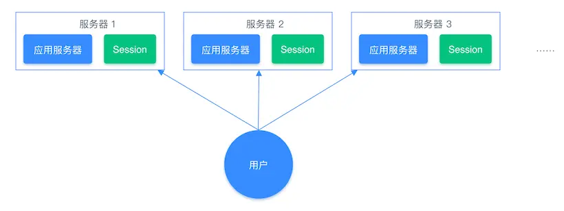
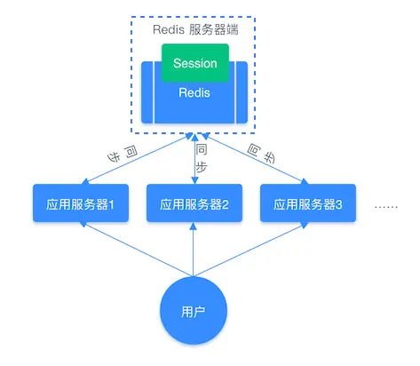
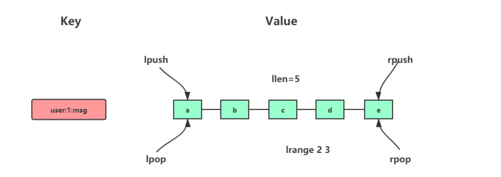
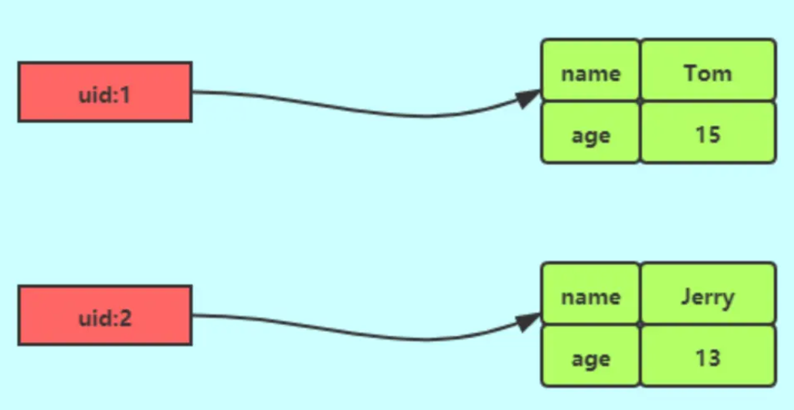
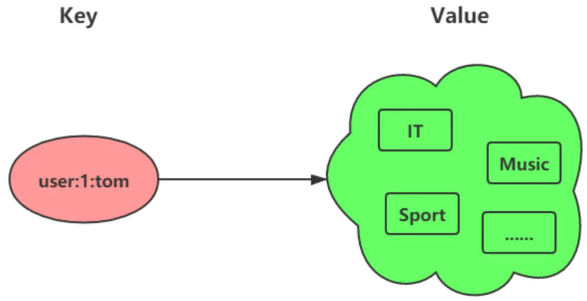
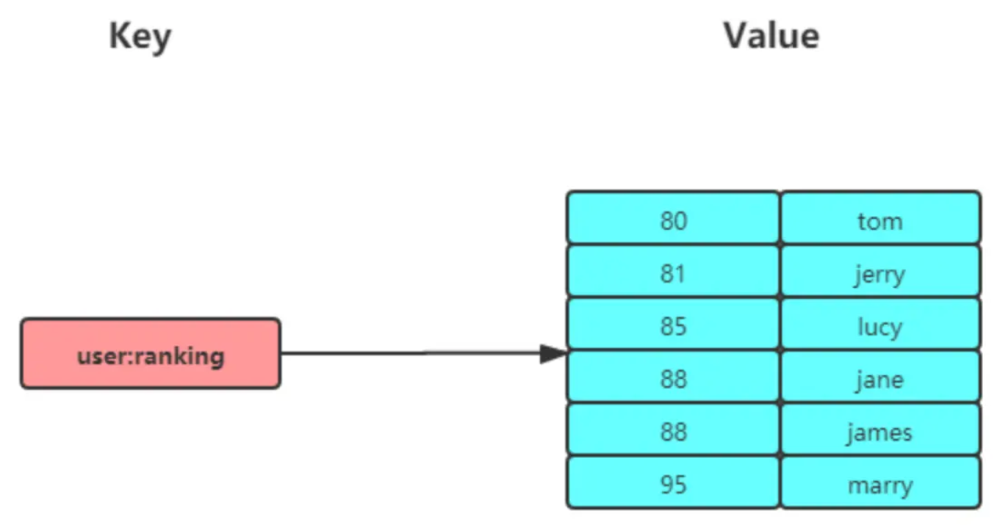

## Redis 数据类型

Redis常见的数据类型有：

- String（字符串）
- Hash（哈希）
- List（列表）
- Set（集合）
- Zset（有序集合）

后面又支持了四种数据类型：

- BitMap（2.2 版新增）
- HyperLogLog（2.8 版新增）
- GEO（3.2 版新增）
- Stream（5.0 版新增）

### String

String 是最基本的 key-value 结构，key 是唯一标识，value 是具体的值，value其实不仅是字符串， 也可以是数字（整数或浮点数），value 最多可以容纳的数据长度是 512M

适合缓存单个对象，⽐如验证码、token、计数器等

#### 常用命令

##### 基本操作

SET GET EXISTS STRLEN DEL SETNX

```shell
# 设置 key-value 类型的值
> SET name lin
OK
# 根据 key 获得对应的 value
> GET name
"lin"
# 判断某个 key 是否存在
> EXISTS name
(integer) 1
# 返回 key 所储存的字符串值的长度
> STRLEN name
(integer) 3
# 删除某个 key 对应的值
> DEL name
(integer) 1
# 不存在就插入（not exists）
>SETNX key value
(integer) 1
```

##### 过期设置

EXPIRE TTL

默认为永不过期

```shell
# 设置 key 在 60 秒后过期（该方法是针对已经存在的key设置过期时间）
> EXPIRE name  60 
(integer) 1
# 查看数据还有多久过期
> TTL name 
(integer) 51

#设置 key-value 类型的值，并设置该key的过期时间为 60 秒
> SET key  value EX 60
OK
> SETEX key  60 value
OK
```

##### 批量设置

MSET MGET

```shell
# 批量设置 key-value 类型的值
> MSET key1 value1 key2 value2 
OK
# 批量获取多个 key 对应的 value
> MGET key1 key2 
1) "value1"
2) "value2"
```

##### 计数器

字符串的内容为整数的时候可以使用

```shell
# 设置 key-value 类型的值
> SET number 0
OK
# 将 key 中储存的数字值增一
> INCR number
(integer) 1
# 将key中存储的数字值加 10
> INCRBY number 10
(integer) 11
# 将 key 中储存的数字值减一
> DECR number
(integer) 10
# 将key中存储的数字值键 10
> DECRBY number 10
(integer) 0
```

#### 应用场景

##### 缓存对象

使用 String 来缓存对象有两种方式：

- 直接缓存整个对象的 JSON，命令例子： `SET user:1 '{"name":"xiaolin", "age":18}'`。
- 采用将 key 进行分离为 user:ID:属性，采用 MSET 存储，用 MGET 获取各属性值，命令例子： `MSET user:1:name xiaolin user:1:age 18 user:2:name xiaomei user:2:age 2`

##### 常规计数

因为 Redis 处理命令是单线程，所以执行命令的过程是原子的。因此 String 数据类型适合计数场景，比如计算访问次数、点赞、转发、库存数量等等

##### 分布式锁

SET 命令有个 NX 参数可以实现「key 不存在才插入」，可以用它来实现分布式锁：

- 如果 key 不存在，则显示插入成功，可以用来表示加锁成功；
- 如果 key 存在，则会显示插入失败，可以用来表示加锁失败。

一般而言，还会对分布式锁加上过期时间

```shell
SET lock_key unique_value NX PX 10000
```

- lock_key 就是 key 键；
- unique_value 是客户端生成的唯一的标识；
- NX 代表只在 lock_key 不存在时，才对 lock_key 进行设置操作；
- PX 10000 表示设置 lock_key 的过期时间为 10s，这是为了避免客户端发生异常而无法释放锁

而解锁的过程就是将 lock_key 键删除，但不能乱删，要保证执行操作的客户端就是加锁的客户端。所

以，解锁的时候，我们要先判断锁的 unique_value 是否为加锁客户端，是的话，才将 lock_key 键删除

> 解锁是有两个操作，这时就需要 Lua 脚本来保证解锁的原子性，因为 Redis 在执行 Lua 脚本时，可以以原子性的方式执行，保证了锁释放操作的原子性

```lua
// 释放锁时，先比较 unique_value 是否相等，避免锁的误释放
if redis.call("get",KEYS[1]) == ARGV[1] then
    return redis.call("del",KEYS[1])
else
    return 0
end
```

这样一来，就通过使用 SET 命令和 Lua 脚本在 Redis 单节点上完成了分布式锁的加锁和解锁

##### 共享Redis信息

通常我们在开发后台管理系统时，会使用 Session 来保存用户的会话 (登录) 状态，这些 Session 信息会被保存在服务器端，但这只适用于单系统应用，如果是分布式系统此模式将不再适用。

例如用户一的 Session 信息被存储在服务器一，但第二次访问时用户一被分配到服务器二，这个时候服务器并没有用户一的 Session 信息，就会出现需要重复登录的问题，问题在于分布式系统每次会把请求随机分配到不同的服务器。

分布式系统单独存储 Session 流程图：



因此，我们需要借助 Redis 对这些 Session 信息进行统一的存储和管理，这样无论请求发送到那台服务器，服务器都会去同一个 Redis 获取相关的 Session 信息，这样就解决了分布式系统下 Session 存储的问题。

分布式系统使用同一个 Redis 存储 Session 流程图



#### 内部实现

String 类型的底层的数据结构实现主要是 int 和 SDS（简单动态字符串）

### List

List 列表是简单的字符串列表，按照插入顺序排序，可以从头部或尾部向 List 列表添加元素。

列表的最大长度为 2^32 - 1，也即每个列表支持超过 40 亿个元素。

#### 内部实现

List 类型的底层数据结构是由双向链表或压缩列表实现的：

- 如果列表的元素个数小于 512 个（默认值，可由 list-max-ziplist-entries 配置），列表每个元素的值都小于 64 字节（默认值，可由 list-max-ziplist-value 配置），Redis 会使用**压缩列表**作为 List 类型的底层数据结构；
- 如果列表的元素不满足上面的条件，Redis 会使用**双向链表**作为 List 类型的底层数据结构；

但是在 Redis 3.2 版本之后，List 数据类型底层数据结构就只由 `quicklist` 实现了，替代了双向链表和压缩列表

#### 常用命令

LPUSH RPUSH LPOP RPOP LRANGE BLPOP BRPOP



```shell
# 将一个或多个值value插入到key列表的表头(最左边)，最后的值在最前面
LPUSH key value [value ...] 
# 将一个或多个值value插入到key列表的表尾(最右边)
RPUSH key value [value ...]
# 移除并返回key列表的头元素
LPOP key     
# 移除并返回key列表的尾元素
RPOP key 

# 返回列表key中指定区间内的元素，区间以偏移量start和stop指定，从0开始
LRANGE key start stop

# 从key列表表头弹出一个元素，没有就阻塞timeout秒，如果timeout=0则一直阻塞
BLPOP key [key ...] timeout
# 从key列表表尾弹出一个元素，没有就阻塞timeout秒，如果timeout=0则一直阻塞
BRPOP key [key ...] timeout
```

#### 应用场景

##### 消息队列

消息队列在存取消息时，必须要满足三个需求，分别是消息保序、处理重复的消息和保证消息可靠性。

Redis 的 List 和 Stream 两种数据类型，就可以满足消息队列的这三个需求。

> 实现消息的保序性

List 本身就是按先进先出的顺序对数据进行存取的，所以，如果使用 List 作为消息队列保存消息的话，就已经能满足消息保序的需求了。

List 可以使用 LPUSH + RPOP（或者反过来，RPUSH+LPOP）命令实现消息队列。

不过，在消费者读取数据时，有一个潜在的性能风险点。

在生产者往 List 中写入数据时，List 并不会主动地通知消费者有新消息写入，如果消费者想要及时处理消息，就需要在程序中不停地调用 RPOP 命令（比如使用一个 while(1) 循环）。如果有新消息写入，RPOP 命令就会返回结果，否则，RPOP 命令返回空值，再继续循环。

所以，即使没有新消息写入 List，消费者也要不停地调用 RPOP 命令，这就会导致消费者程序的 CPU 一直消耗在执行 RPOP 命令上，带来不必要的性能损失。

为了解决这个问题，Redis 提供了 BRPOP 命令。

**BRPOP 命令也称为阻塞式读取，客户端在没有读到队列数据时，自动阻塞，直到有新的数据写入队列，再开始读取新数据。**

与消费者程序自己不停地调用 RPOP 命令相比，这种方式能节省 CPU 开销。

> 处理重复的消息

消费者要实现重复消息的判断，需要 2 个方面的要求：

- 每个消息都有一个全局唯一的 ID。
- 消费者要记录已经处理过的消息的 ID。当收到一条消息后，消费者程序就可以对比收到的消息 ID 和记录的已处理过的消息 ID，来判断当前收到的消息有没有经过处理。如果已经处理过，那么，消费者程序就不再进行处理了。

但是 List 并不会为每个消息生成 ID 号，所以我们需要自行为每个消息生成一个全局唯一 ID，生成之后，我们在用 LPUSH 命令把消息插入 List 时，需要在消息中包含这个全局唯一 ID

> 保证消息可靠性

当消费者程序从 List 中读取一条消息后，List 就不会再留存这条消息了。所以，如果消费者程序在处理消息的过程出现了故障或宕机，就会导致消息没有处理完成，那么，消费者程序再次启动后，就没法再次从 List 中读取消息了。

为了留存消息，List 类型提供了 BRPOPLPUSH 命令，这个命令的作用是让消费者程序从一个 List 中读取消息，同时，Redis 会把这个消息再插入到另一个 List（可以叫作备份 List）留存。

这样一来，如果消费者程序读了消息但没能正常处理，等它重启后，就可以从备份 List 中重新读取消息并进行处理了。

### Hash

Hash 是一个键值对（key - value）集合，其中 value 的形式如： value=[{field1，value1}，...{fieldN，valueN}]

Hash 特别适合用于存储对象。

Hash 与 String 对象的区别：


#### 内部实现

Hash 类型的底层数据结构是由**压缩列表或哈希表**实现的：

- 如果哈希类型元素个数小于 512 个（默认值，可由 hash-max-ziplist-entries 配置），所有值小于 64 字节（默认值，可由 hash-max-ziplist-value 配置）的话，Redis 会使用压缩列表作为 Hash 类型的底层数据结构；
- 如果哈希类型元素不满足上面条件，Redis 会使用哈希表作为 Hash 类型的 底层数据结构。

在 Redis 7.0 中，压缩列表数据结构已经废弃了，交由 listpack 数据结构来实现了

#### 常用命令

HSET HGET HMSET HMGET HDEL HLEN HGETALL HINCRBY

```shell
# 存储一个哈希表key的键值
HSET key field value   
# 获取哈希表key对应的field键值
HGET key field

# 在一个哈希表key中存储多个键值对
HMSET key field value [field value...] 
# 批量获取哈希表key中多个field键值
HMGET key field [field ...]       
# 删除哈希表key中的field键值
HDEL key field [field ...]    

# 返回哈希表key中field的数量
HLEN key       
# 返回哈希表key中所有的键值
HGETALL key 

# 为哈希表key中field键的值加上增量n
HINCRBY key field n
```

#### 应用场景

##### 缓存对象

Hash 类型的（key，field，value）的结构与对象的（对象 id，属性，值）的结构相似，也可以用来存储对象

但一般还是用 String 的多

一般对象用 String + Json 存储，对象中某些频繁变化的属性可以考虑抽出来用 Hash 类型存储

可以使用如下命令，将用户对象的信息存储到 Hash 类型：

```shell
# 存储一个哈希表uid:1的键值
> HMSET uid:1 name Tom age 15
2
# 存储一个哈希表uid:2的键值
> HMSET uid:2 name Jerry age 13
2
# 获取哈希表用户id为1中所有的键值
> HGETALL uid:1
1) "name"
2) "Tom"
3) "age"
4) "15"
```



##### 购物车

以用户 id 为 key，商品 id 为 field，商品数量为 value，恰好构成了购物车的 3 个要素

涉及的命令如下：

- 添加商品：`HSET  cart:{用户id}  {商品id}  1`
- 添加数量：`HINCRBY  cart:{用户id}  {商品id}  1`
- 商品总数：`HLEN  cart:{用户id}`
- 删除商品：`HDEL  cart:{用户id}  {商品id}`
- 获取购物车所有商品：`HGETALL  cart:{用户id}`

当前仅仅是将商品 ID 存储到了 Redis 中，在回显商品具体信息的时候，还需要拿着商品 id 查询一次数据库，获取完整的商品的信息

### Set

Set 类型是一个无序并唯一的键值集合，它的存储顺序不会按照插入的先后顺序进行存储。

一个集合最多可以存储 2^32-1 个元素。

概念和数学中个的集合基本类似，可以交集，并集，差集等等，所以 Set 类型除了支持集合内的增删改查，同时还支持多个集合取交集、并集、差集



Set 类型和 List 类型的区别如下：

- List 可以存储重复元素，Set 只能存储非重复元素；
- List 是按照元素的先后顺序存储元素的，而 Set 则是无序方式存储元素的

#### 内部实现

Set 类型的底层数据结构是由哈希表或整数集合实现的：

- 如果集合中的元素都是整数且元素个数小于 512 （默认值，set-maxintset-entries配置）个，Redis 会使用**整数集合**作为 Set 类型的底层数据结构；
- 如果集合中的元素不满足上面条件，则 Redis 使用哈希表作为 Set 类型的底层数据结构

#### 常用命令

SADD SREM SMEMBERS SCARD SISMEMBER SRANDMEMBER SPOP

```shell
# 往集合key中存入元素，元素存在则忽略，若key不存在则新建
SADD key member [member ...]
# 从集合key中删除元素
SREM key member [member ...] 
# 获取集合key中所有元素
SMEMBERS key
# 获取集合key中的元素个数
SCARD key

# 判断member元素是否存在于集合key中
SISMEMBER key member

# 从集合key中随机选出count个元素，元素不从key中删除
SRANDMEMBER key [count]
# 从集合key中随机选出count个元素，元素从key中删除
SPOP key [count]
```

##### 运算操作

```shell
# 交集运算
SINTER key [key ...]
# 将交集结果存入新集合destination中
SINTERSTORE destination key [key ...]

# 并集运算
SUNION key [key ...]
# 将并集结果存入新集合destination中
SUNIONSTORE destination key [key ...]

# 差集运算
SDIFF key [key ...]
# 将差集结果存入新集合destination中
SDIFFSTORE destination key [key ...]
```

#### 应用场景

集合的主要几个特性，无序、不可重复、支持并交差等操作

因此 Set 类型比较适合用来数据去重和保障数据的唯一性，还可以用来统计多个集合的交集、差集和并集等，当我们存储的数据是无序并且需要去重的情况下，比较适合使用集合类型进行存储

但 **Set 的差集、并集和交集的计算复杂度较高，在数据量较大的情况下，如果直接执行这些计算，会导致 Redis 实例阻塞**

在主从集群中，为了避免主库因为 Set 做聚合计算（交集、差集、并集）时导致主库被阻塞，我们可以选择一个从库完成聚合统计，或者把数据返回给客户端，由客户端来完成聚合统计

##### 点赞

Set 类型可以保证一个用户只能点一个赞，这里举例子一个场景，key 是文章 id，value 是用户 id

`uid:1` 、`uid:2`、`uid:3`   三个用户分别对 article:1 文章点赞了。

```shell
# uid:1 用户对文章 article:1 点赞
> SADD article:1 uid:1
(integer) 1
# uid:2 用户对文章 article:1 点赞
> SADD article:1 uid:2
(integer) 1
# uid:3 用户对文章 article:1 点赞
> SADD article:1 uid:3
(integer) 1
```

`uid:1` 取消了对 article:1 文章点赞。

```plain
> SREM article:1 uid:1
(integer) 1
```

获取  article:1 文章所有点赞用户 :

```shell
> SMEMBERS article:1
1) "uid:3"
2) "uid:2"
```

获取 article:1 文章的点赞用户数量：

```shell
> SCARD article:1
(integer) 2
```

判断用户 `uid:1` 是否对文章 article:1 点赞了：

```shell
> SISMEMBER article:1 uid:1
(integer) 0  # 返回0说明没点赞，返回1则说明点赞了
```

##### 共同关注

Set 类型支持交集运算，所以可以用来计算共同关注的好友、公众号等。

key 可以是用户 id，value 则是已关注的公众号的 id

`uid:1` 用户关注公众号 id 为 5、6、7、8、9，`uid:2`  用户关注公众号 id 为 7、8、9、10、11。

```shell
# uid:1 用户关注公众号 id 为 5、6、7、8、9
> SADD uid:1 5 6 7 8 9
(integer) 5
# uid:2  用户关注公众号 id 为 7、8、9、10、11
> SADD uid:2 7 8 9 10 11
(integer) 5
```

`uid:1`  和 `uid:2`  共同关注的公众号：

```shell
# 获取共同关注
> SINTER uid:1 uid:2
1) "7"
2) "8"
3) "9"
```

给  `uid:2`   推荐 `uid:1` 关注的公众号：

```shell
> SDIFF uid:1 uid:2
1) "5"
2) "6"
```

验证某个公众号是否同时被  `uid:1`   或  `uid:2`   关注：

```shell
> SISMEMBER uid:1 5
(integer) 1 # 返回1，说明关注了
> SISMEMBER uid:2 5
(integer) 0 # 返回0，说明没关注
```

##### 抽奖活动

存储某活动中中奖的用户名，Set 类型因为有去重功能，可以保证同一个用户不会中奖两次。

key 为抽奖活动名，value 为员工名称

### ZSet

Zset 类型（有序集合类型）相比于 Set 类型多了一个排序属性 score（分值），对于有序集合 ZSet 来说，每个存储元素相当于有两个值组成的，一个是有序结合的元素值，一个是排序值

有序集合保留了集合不能有重复成员的特性（分值可以重复），但不同的是，有序集合中的元素可以排序



ZSet 默认是升序排列

- 使用 ZRANGE 系列命令 = 升序
- 使用 ZREVRANGE 系列命令 = 降序

#### 内部实现

Zset 类型的底层数据结构是由**压缩列表或跳表**实现的：

- 如果有序集合的元素个数小于 128 个，并且每个元素的值小于 64 字节时，Redis 会使用**压缩列表**作为 Zset 类型的底层数据结构；
- 如果有序集合的元素不满足上面的条件，Redis 会使用**跳表**作为 Zset 类型的底层数据结构；
在 Redis 7.0 中，压缩列表数据结构已经废弃了，交由 listpack 数据结构来实现了。

#### 常用命令

```shell
# 往有序集合key中加入带分值元素
ZADD key score member [[score member]...]   
# 往有序集合key中删除元素
ZREM key member [member...]                 
# 返回有序集合key中元素member的分值
ZSCORE key member
# 返回有序集合key中元素个数
ZCARD key 

# 为有序集合key中元素member的分值加上increment
ZINCRBY key increment member 

# 正序获取有序集合key从start下标到stop下标的元素
ZRANGE key start stop [WITHSCORES]
# 倒序获取有序集合key从start下标到stop下标的元素
ZREVRANGE key start stop [WITHSCORES]

# 返回有序集合中指定分数区间内的成员，分数由低到高排序。
ZRANGEBYSCORE key min max [WITHSCORES] [LIMIT offset count]

# 返回指定成员区间内的成员，按字典正序排列, 分数必须相同。
ZRANGEBYLEX key min max [LIMIT offset count]
# 返回指定成员区间内的成员，按字典倒序排列, 分数必须相同
ZREVRANGEBYLEX key max min [LIMIT offset count]
```

Zset 运算操作（相比于 Set 类型，ZSet 类型没有支持差集运算）：

```shell
# 并集计算(相同元素分值相加)，numberkeys一共多少个key，WEIGHTS每个key对应的分值乘积
ZUNIONSTORE destkey numberkeys key [key...] 
# 交集计算(相同元素分值相加)，numberkeys一共多少个key，WEIGHTS每个key对应的分值乘积
ZINTERSTORE destkey numberkeys key [key...]
```

#### 应用场景

##### 排行榜

有序集合比较典型的使用场景就是排行榜。例如学生成绩的排名榜、游戏积分排行榜、视频播放排名、电商系统中商品的销量排名等

以博文点赞排名为例，小林发表了五篇博文，分别获得赞为 200、40、100、50、150

```shell
# arcticle:1 文章获得了200个赞
> ZADD user:xiaolin:ranking 200 arcticle:1
(integer) 1
# arcticle:2 文章获得了40个赞
> ZADD user:xiaolin:ranking 40 arcticle:2
(integer) 1
# arcticle:3 文章获得了100个赞
> ZADD user:xiaolin:ranking 100 arcticle:3
(integer) 1
# arcticle:4 文章获得了50个赞
> ZADD user:xiaolin:ranking 50 arcticle:4
(integer) 1
# arcticle:5 文章获得了150个赞
> ZADD user:xiaolin:ranking 150 arcticle:5
(integer) 1
```

文章 arcticle:4 新增一个赞，可以使用 ZINCRBY 命令（为有序集合 key 中元素 member 的分值加上 increment）：

```shell
> ZINCRBY user:xiaolin:ranking 1 arcticle:4
"51"
```

查看某篇文章的赞数，可以使用 ZSCORE 命令（返回有序集合 key 中元素个数）：

```shell
> ZSCORE user:xiaolin:ranking arcticle:4
"50"
```

获取小林文章赞数最多的 3 篇文章，可以使用 ZREVRANGE 命令（倒序获取有序集合 key 从 start 下标到 stop 下标的元素）：

```shell
# WITHSCORES 表示把 score 也显示出来
> ZREVRANGE user:xiaolin:ranking 0 2 WITHSCORES
1) "arcticle:1"
2) "200"
3) "arcticle:5"
4) "150"
5) "arcticle:3"
6) "100"
```

##### 电话、姓名排序

使用有序集合的 `ZRANGEBYLEX` 或 `ZREVRANGEBYLEX` 可以帮助我们实现电话号码或姓名的排序，我们以 `ZRANGEBYLEX` （返回指定成员区间内的成员，按 key 正序排列，分数必须相同）为例。

**注意：不要在分数不一致的 SortSet 集合中去使用 ZRANGEBYLEX 和 ZREVRANGEBYLEX 指令，因为获取的结果会不准确。**

*1、电话排序*

我们可以将电话号码存储到 SortSet 中，然后根据需要来获取号段：

```shell
> ZADD phone 0 13100111100 0 13110114300 0 13132110901 
(integer) 3
> ZADD phone 0 13200111100 0 13210414300 0 13252110901 
(integer) 3
> ZADD phone 0 13300111100 0 13310414300 0 13352110901 
(integer) 3
```

获取所有号码：

```shell
> ZRANGEBYLEX phone - +
1) "13100111100"
2) "13110114300"
3) "13132110901"
4) "13200111100"
5) "13210414300"
6) "13252110901"
7) "13300111100"
8) "13310414300"
9) "13352110901"
```

获取 132 号段的号码：

```shell
> ZRANGEBYLEX phone [132 (133
1) "13200111100"
2) "13210414300"
3) "13252110901"
```

获取 132、133 号段的号码：

```shell
> ZRANGEBYLEX phone [132 (134
1) "13200111100"
2) "13210414300"
3) "13252110901"
4) "13300111100"
5) "13310414300"
6) "13352110901"
```

*2、姓名排序*

```shell
> zadd names 0 Toumas 0 Jake 0 Bluetuo 0 Gaodeng 0 Aimini 0 Aidehua 
(integer) 6
```

获取所有人的名字：

```shell
> ZRANGEBYLEX names - +
1) "Aidehua"
2) "Aimini"
3) "Bluetuo"
4) "Gaodeng"
5) "Jake"
6) "Toumas"
```

获取名字中大写字母 A 开头的所有人：

```shell
> ZRANGEBYLEX names [A (B
1) "Aidehua"
2) "Aimini"
```

获取名字中大写字母 C 到 Z 的所有人：

```shell
> ZRANGEBYLEX names [C [Z
1) "Gaodeng"
2) "Jake"
3) "Toumas"
```
