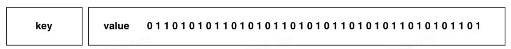
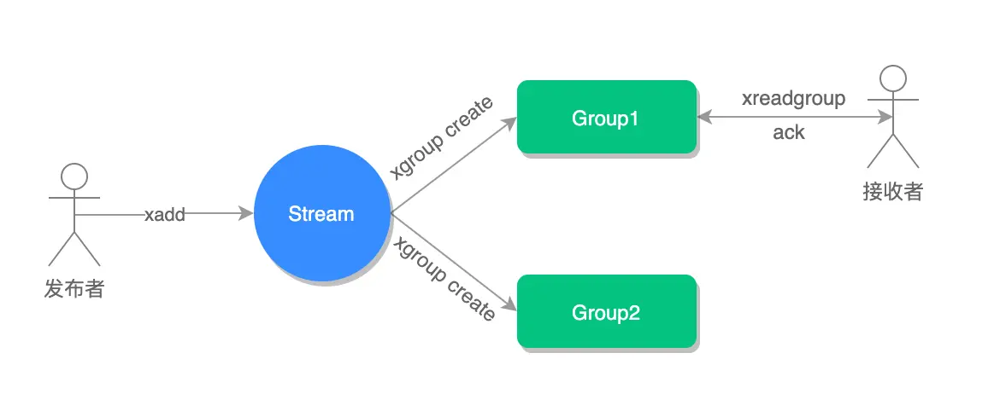
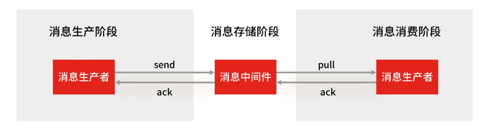

## Redis 数据类型

Redis常见的数据类型有：

- String（字符串）
- Hash（哈希）
- List（列表）
- Set（集合）
- Zset（有序集合）

后面又支持了四种数据类型：

- BitMap（2.2 版新增）
- HyperLogLog（2.8 版新增）
- GEO（3.2 版新增）
- Stream（5.0 版新增）

### BitMap

Bitmap，即位图，是一串连续的二进制数组（0 和 1），可以通过偏移量（offset）定位元素。

BitMap 通过最小的单位 bit 来进行0|1的设置，表示某个元素的值或者状态，时间复杂度为 O(1)。

由于 bit 是计算机中最小的单位，使用它进行储存将非常节省空间，特别适合一些数据量大且使用二值统计的场景。



#### 内部实现

Bitmap 本身是用 String 类型作为底层数据结构实现的一种统计二值状态的数据类型。

String 类型是会保存为二进制的字节数组，所以，Redis 就把字节数组的每个 bit 位利用起来，用来表示一个元素的二值状态，你可以把 Bitmap 看作是一个 bit 数组。

#### 常用命令

基本命令：SETBIT GETBIT BITCOUNT

```shell
# 设置值，其中value只能是 0 和 1
SETBIT key offset value

# 获取值
GETBIT key offset

# 获取指定范围内值为 1 的个数
# start 和 end 以字节为单位
BITCOUNT key start end
```

bitmap 运算操作：

```shell
# BitMap间的运算
# operations 位移操作符，枚举值
  AND 与运算 &
  OR 或运算 |
  XOR 异或 ^
  NOT 取反 ~
# result 计算的结果，会存储在该key中
# key1 … keyn 参与运算的key，可以有多个，空格分割，not运算只能一个key
# 当 BITOP 处理不同长度的字符串时，较短的那个字符串所缺少的部分会被看作 0。返回值是保存到 destkey 的字符串的长度（以字节byte为单位），和输入 key 中最长的字符串长度相等。
BITOP [operations] [result] [key1] [keyn…]

# 返回指定key中第一次出现指定value(0/1)的位置
BITPOS [key] [value]
```

#### 应用场景

Bitmap 类型非常适合二值状态统计的场景，这里的二值状态就是指集合元素的取值就只有 0 和 1 两种，在记录海量数据时，Bitmap 能够有效地节省内存空间。

##### 签到统计

在签到打卡的场景中，我们只用记录签到（1）或未签到（0），所以它就是非常典型的二值状态。

签到统计时，每个用户一天的签到用 1 个 bit 位就能表示，一个月（假设是 31 天）的签到情况用 31 个 bit 位就可以，而一年的签到也只需要用 365 个 bit 位，根本不用太复杂的集合类型。

假设我们要统计 ID 100 的用户在 2022 年 6 月份的签到情况，就可以按照下面的步骤进行操作。

第一步，执行下面的命令，记录该用户 6 月 3 号已签到。

```shell
SETBIT uid:sign:100:202206 2 1
```

第二步，检查该用户 6 月 3 日是否签到。

```shell
GETBIT uid:sign:100:202206 2 
```

第三步，统计该用户在 6 月份的签到次数。

```shell
BITCOUNT uid:sign:100:202206
```

这样，我们就知道该用户在 6 月份的签到情况了。

> 如何统计这个月首次打卡时间呢？

Redis 提供了 `BITPOS key bitValue [start] [end]`指令，返回数据表示 Bitmap 中第一个值为 `bitValue` 的 offset 位置。

在默认情况下，命令将检测整个位图，用户可以通过可选的 `start` 参数和 `end` 参数指定要检测的范围。所以我们可以通过执行这条命令来获取 userID = 100 在 2022 年 6 月份**首次打卡**日期：

```apache
BITPOS uid:sign:100:202206 1
```

需要注意的是，因为 offset 从 0 开始的，所以我们需要将返回的 value + 1。

##### 判断用户登录状态

Bitmap 提供了 GETBIT、SETBIT 操作，通过一个偏移值 offset 对 bit 数组的 offset 位置的 bit 位进行读写操作，需要注意的是 offset 从 0 开始。

只需要一个 key = login_status 表示存储用户登录状态集合数据，将用户 ID 作为 offset，在线就设置为 1，下线设置 0。通过 GETBIT判断对应的用户是否在线。50000 万 用户只需要 6 MB 的空间

假如我们要判断 ID = 10086 的用户的登录情况：

第一步，执行以下指令，表示用户已登录。

```shell
SETBIT login_status 10086 1
```

第二步，检查该用户是否登录，返回值 1 表示已登录。

```shell
GETBIT login_status 10086
```

第三步，登出，将 offset 对应的 value 设置成 0。

```shell
SETBIT login_status 10086 0
```

##### 连续签到用户总数

我们把每天的日期作为 Bitmap 的 key，userId 作为 offset，若是打卡则将 offset 位置的 bit 设置成 1。

key 对应的集合的每个 bit 位的数据则是一个用户在该日期的打卡记录。

一共有 7 个这样的 Bitmap，如果我们能对这 7 个 Bitmap 的对应的 bit 位做 『与』运算。同样的 UserID offset 都是一样的，当一个 userID 在 7 个 Bitmap 对应对应的 offset 位置的 bit = 1 就说明该用户 7 天连续打卡。

结果保存到一个新 Bitmap 中，我们再通过 BITCOUNT 统计 bit = 1 的个数便得到了连续打卡 7 天的用户总数了。

假设要统计 3 天连续打卡的用户数，则是将三个 bitmap 进行 AND 操作，并将结果保存到 destmap 中，接着对 destmap 执行 BITCOUNT 统计，如下命令：

```shell
# 与操作
BITOP AND destmap bitmap:01 bitmap:02 bitmap:03
# 统计 bit 位 =  1 的个数
BITCOUNT destmap
```

即使一天产生一个亿的数据，Bitmap 占用的内存也不大，大约占 12 MB 的内存（10^8/8/1024/1024），7 天的 Bitmap 的内存开销约为 84 MB。同时我们最好给 Bitmap 设置过期时间，让 Redis 删除过期的打卡数据，节省内存

### HyperLogLog

Redis HyperLogLog 是 Redis 2.8.9 版本新增的数据类型，是一种用于「统计基数」的数据集合类型，基数统计就是指统计一个集合中不重复的元素个数。但要注意，HyperLogLog 统计规则是基于概率完成的，不是非常准确，标准误算率是 0.81%。

所以，简单来说 HyperLogLog 提供不精确的去重计数。

HyperLogLog 的优点是，在输入元素的数量或者体积非常非常大时，计算基数所需的内存空间总是固定的、并且是很小的。

在 Redis 里面，每个 HyperLogLog 键只需要花费 12 KB 内存，就可以计算接近 2^64 个不同元素的基数，和元素越多就越耗费内存的 Set 和 Hash 类型相比，HyperLogLog 就非常节省空间。

#### 常用命令

HyperLogLog 命令很少，就三个

```shell
# 添加指定元素到 HyperLogLog 中
PFADD key element [element ...]

# 返回给定 HyperLogLog 的基数估算值。
PFCOUNT key [key ...]

# 将多个 HyperLogLog 合并为一个 HyperLogLog
PFMERGE destkey sourcekey [sourcekey ...]
```

#### 应用场景

##### 百万级网页 UA (User Agent) 计数

Redis HyperLogLog 优势在于只需要花费 12 KB 内存，就可以计算接近 2^64 个元素的基数，和元素越多就越耗费内存的 Set 和 Hash 类型相比，HyperLogLog 就非常节省空间。

所以，非常适合统计百万级以上的网页 UA 的场景

### GEO

Redis GEO 是 Redis 3.2 版本新增的数据类型，主要用于存储地理位置信息，并对存储的信息进行操作。

在日常生活中，我们越来越依赖搜索“附近的餐馆”、在打车软件上叫车，这些都离不开基于位置信息服务（Location-Based Service，LBS）的应用。LBS 应用访问的数据是和人或物关联的一组经纬度信息，而且要能查询相邻的经纬度范围，GEO 就非常适合应用在 LBS 服务的场景中。

#### 内部实现

GEO 本身并没有设计新的底层数据结构，而是直接使用了 Sorted Set 集合类型。

GEO 类型使用 GeoHash 编码方法实现了经纬度到 Sorted Set 中元素权重分数的转换，这其中的两个关键机制就是「对二维地图做区间划分」和「对区间进行编码」。一组经纬度落在某个区间后，就用区间的编码值来表示，并把编码值作为 Sorted Set 元素的权重分数。

这样一来，我们就可以把经纬度保存到 Sorted Set 中，利用 Sorted Set 提供的“按权重进行有序范围查找”的特性，实现 LBS 服务中频繁使用的“搜索附近”的需求。

#### 常用命令

```shell
# 存储指定的地理空间位置，可以将一个或多个经度(longitude)、纬度(latitude)、位置名称(member)添加到指定的 key 中。
GEOADD key longitude latitude member [longitude latitude member ...]

# 从给定的 key 里返回所有指定名称(member)的位置（经度和纬度），不存在的返回 nil。
GEOPOS key member [member ...]

# 返回两个给定位置之间的距离。
GEODIST key member1 member2 [m|km|ft|mi]

# 根据用户给定的经纬度坐标来获取指定范围内的地理位置集合。
GEORADIUS key longitude latitude radius m|km|ft|mi [WITHCOORD] [WITHDIST] [WITHHASH] [COUNT count] [ASC|DESC] [STORE key] [STOREDIST key]
```

#### 应用场景

假设车辆 ID 是 33，经纬度位置是（116.034579，39.030452），我们可以用一个 GEO 集合保存所有车辆的经纬度，集合 key 是 cars:locations

把 ID 号为 33 的车辆的当前经纬度位置存入 GEO 集合中：

```shell
GEOADD cars:locations 116.034579 39.030452 33
```

当用户想要寻找自己附近的网约车时，LBS 应用就可以使用 GEORADIUS 命令

LBS 应用执行下面的命令时，Redis 会根据输入的用户的经纬度信息（116.054579，39.030452），查找以这个经纬度为中心的 5 公里内的车辆信息，并返回给 LBS 应用

```shell
GEORADIUS cars:locations 116.054579 39.030452 5 km ASC COUNT 10
```

### Stream

Redis Stream 是 Redis 5.0 版本新增加的数据类型，Redis 专门为消息队列设计的数据类型。

在 Redis 5.0 Stream 没出来之前，消息队列的实现方式都有着各自的缺陷，例如：

- 发布订阅模式，不能持久化也就无法可靠的保存消息，并且对于离线重连的客户端不能读取历史消息的缺陷；
- List 实现消息队列的方式不能重复消费，一个消息消费完就会被删除，而且生产者需要自行实现全局唯一 ID。

基于以上问题，Redis 5.0 便推出了 Stream 类型也是此版本最重要的功能，用于完美地实现消息队列，它支持消息的持久化、支持自动生成全局唯一 ID、支持 ack 确认消息的模式、支持消费组模式等，让消息队列更加的稳定和可靠。

#### 常用命令

Stream 消息队列操作命令：

- XADD：插入消息，保证有序，可以自动生成全局唯一 ID；
- XLEN：查询消息长度；
- XREAD：用于读取消息，可以按 ID 读取数据；
- XDEL：根据消息 ID 删除消息；
- DEL：删除整个 Stream；
- XRANGE：读取区间消息
- XREADGROUP：按消费组形式读取消息；
- XPENDING 和 XACK：
- XPENDING 命令可以用来查询每个消费组内所有消费者「已读取、但尚未确认」的消息；
- XACK 命令用于向消息队列确认消息处理已完成

#### 应用场景

##### 消息队列

Stream 的基础方法，使用 xadd 存入消息和 xread 循环阻塞读取消息的方式可以实现简易版的消息队列，交互流程如下图所示


> 基于 Stream 实现的消息队列，如何保证消费者在发生故障或宕机再次重启后，仍然可以读取未处理完的消息？

Streams 会自动使用内部队列（也称为 PENDING List）留存消费组里每个消费者读取的消息，直到消费者使用 XACK 命令通知 Streams“消息已经处理完成”。

消费确认增加了消息的可靠性，一般在业务处理完成之后，需要执行 XACK 命令确认消息已经被消费完成



如果消费者没有成功处理消息，它就不会给 Streams 发送 XACK 命令，消息仍然会留存。此时，消**费者可以在重启后，用 XPENDING 命令查看已读取、但尚未确认处理完成的消息**

- 消息保序：XADD/XREAD
- 阻塞读取：XREAD block
- 重复消息处理：Stream 在使用 XADD 命令，会自动生成全局唯一 ID；
- 消息可靠性：内部使用 PENDING List 自动保存消息，使用 XPENDING 命令查看消费组已经读取但是未被确认的消息，消费者使用 XACK 确认消息；
- 支持消费组形式消费数据

#### 讨论

> Redis 基于 Stream 消息队列与专业的消息队列有哪些差距

一个专业的消息队列，必须要做到两大块：

- 消息不丢。
- 消息可堆积

##### Redis Stream 消息会丢失吗

使用一个消息队列，其实就分为三大块：生产者、队列中间件、消费者，所以要保证消息就是保证三个环节都不能丢失数据



- Redis 生产者会不会丢消息？

  生产者会不会丢消息，取决于生产者对于异常情况的处理是否合理。从消息被生产出来，然后提交给 MQ 的过程中，只要能正常收到（MQ 中间件）的 ack 确认响应，就表示发送成功，所以只要处理好返回值和异常，如果返回异常则进行消息重发，那么这个阶段是不会出现消息丢失的。

- Redis 消费者会不会丢消息？

  不会，因为 Stream（MQ 中间件）会自动使用内部队列（也称为 PENDING List）留存消费组里每个消费者读取的消息，但是未被确认的消息。消费者可以在重启后，用 XPENDING 命令查看已读取、但尚未确认处理完成的消息。等到消费者执行完业务逻辑后，再发送消费确认 XACK 命令，也能保证消息的不丢失。

- Redis 消息中间件会不会丢消息？

  会，Redis 在以下 2 个场景下，都会导致数据丢失：
  
  AOF 持久化配置为每秒写盘，但这个写盘过程是异步的，Redis 宕机时会存在数据丢失的可能
  
  主从复制也是异步的，主从切换时，也存在丢失数据的可能。

可以看到，Redis 在队列中间件环节无法保证消息不丢。像 RabbitMQ 或 Kafka 这类专业的队列中间件，在使用时是部署一个集群，生产者在发布消息时，队列中间件通常会写「多个节点」，也就是有多个副本，这样一来，即便其中一个节点挂了，也能保证集群的数据不丢失

##### Redis Stream 消息可堆积吗

Redis 的数据都存储在内存中，这就意味着一旦发生消息积压，则会导致 Redis 的内存持续增长，如果超过机器内存上限，就会面临被 OOM 的风险。

所以 Redis 的 Stream 提供了可以指定队列最大长度的功能，就是为了避免这种情况发生。

当指定队列最大长度时，队列长度超过上限后，旧消息会被删除，只保留固定长度的新消息。这么来看，Stream 在消息积压时，如果指定了最大长度，还是有可能丢失消息的。

但 Kafka、RabbitMQ 专业的消息队列它们的数据都是存储在磁盘上，当消息积压时，无非就是多占用一些磁盘空间。

因此，把 Redis 当作队列来使用时，会面临的 2 个问题：

- Redis 本身可能会丢数据；
- 面对消息挤压，内存资源会紧张；

所以，能不能将 Redis 作为消息队列来使用，关键看你的业务场景：

- 如果你的业务场景足够简单，对于数据丢失不敏感，而且消息积压概率比较小的情况下，把 Redis 当作队列是完全可以的。
- 如果你的业务有海量消息，消息积压的概率比较大，并且不能接受数据丢失，那么还是用专业的消息队列中间件吧。

> Redis 发布/订阅机制为什么不可以作为消息队列？

发布订阅机制存在以下缺点，都是跟丢失数据有关：

- 发布/订阅机制没有基于任何数据类型实现，所以不具备「数据持久化」的能力，也就是发布/订阅机制的相关操作，不会写入到 RDB 和 AOF 中，当 Redis 宕机重启，发布/订阅机制的数据也会全部丢失。
- 发布订阅模式是“发后既忘”的工作模式，如果有订阅者离线重连之后不能消费之前的历史消息。
- 当消费端有一定的消息积压时，也就是生产者发送的消息，消费者消费不过来时，如果超过 32M 或者是 60s 内持续保持在 8M 以上，消费端会被强行断开，这个参数是在配置文件中设置的，默认值是 client-output-buffer-limit pubsub 32mb 8mb 60。

所以，发布/订阅机制只适合即时通讯的场景，比如构建哨兵集群的场景采用了发布/订阅机制。

### 总结

Redis 常见的五种数据类型：String（字符串），Hash（哈希），List（列表），Set（集合）及 Zset(sorted set：有序集合)。

这五种数据类型都由多种数据结构实现的，主要是出于时间和空间的考虑，当数据量小的时候使用更简单的数据结构，有利于节省内存，提高性能。

Redis 五种数据类型的应用场景：

- String 类型的应用场景：缓存对象、常规计数、分布式锁、共享 session 信息等。
- List 类型的应用场景：消息队列（有两个问题：1. 生产者需要自行实现全局唯一 ID；2. 不能以消费组形式消费数据）等。
- Hash 类型：缓存对象、购物车等。
- Set 类型：聚合计算（并集、交集、差集）场景，比如点赞、共同关注、抽奖活动等。
- Zset 类型：排序场景，比如排行榜、电话和姓名排序等。

Redis 后续版本又支持四种数据类型，它们的应用场景如下：

- BitMap（2.2 版新增）：二值状态统计的场景，比如签到、判断用户登录状态、连续签到用户总数等；
- HyperLogLog（2.8 版新增）：海量数据基数统计的场景，比如百万级网页 UV 计数等；
- GEO（3.2 版新增）：存储地理位置信息的场景，比如滴滴叫车；
- Stream（5.0 版新增）：消息队列，相比于基于 List 类型实现的消息队列，有这两个特有的特性：自动生成全局唯一消息 ID，支持以消费组形式消费数据。

针对 Redis 是否适合做消息队列，关键看你的业务场景：

- 如果你的业务场景足够简单，对于数据丢失不敏感，而且消息积压概率比较小的情况下，把 Redis 当作队列是完全可以的。
- 如果你的业务有海量消息，消息积压的概率比较大，并且不能接受数据丢失，那么还是用专业的消息队列中间件吧。
