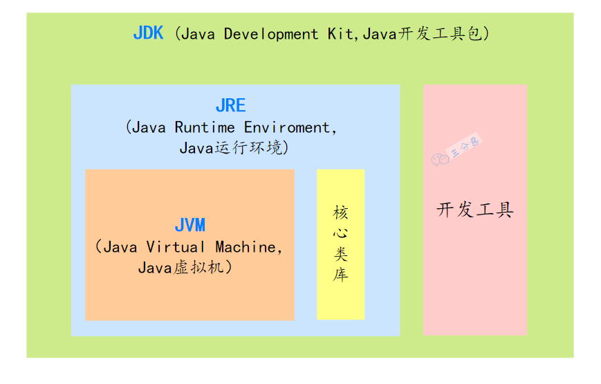
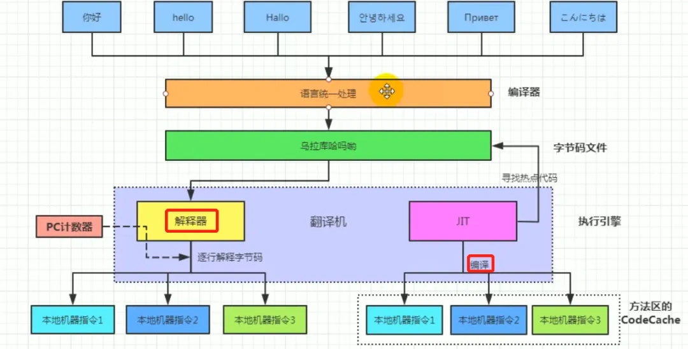

## Java 基础

### JAVA 概述

#### JAVA 特点

1. 平台无关性，跨平台
2. 面向对象
3. 内存自动管理
4. 支持多线程

##### JAVA 的优劣

优势：

支持跨平台，面向对象，有强大的生态系统 (Spring、Hibernate等)

内存管理上有自动垃圾回收机制，减少内存泄露，并且支持多线程，稳定

劣势：

虽然JVM优化了很多，但相比C++或者Rust这种原生编译语言，还是有一定开销

语法繁琐，比如样板代码多

内存消耗，JVM本身占内存，对于资源有限的环境可能不太友好

##### 跨平台原因

Java 能支持跨平台，主要依赖于 JVM

> 所谓的跨平台，是指 Java 语言编写的程序，一次编译后，可以在多个操作系统上运行。
>
> 原理是增加了一个中间件 JVM，JVM 负责将 Java 字节码转换为特定平台的机器码，并执行

JVM也是一个软件，不同的平台有不同的版本

我们编写的Java源码，编译后会生成一种 .class 文件，称为字节码文件

Java虚拟机就是负责将字节码文件翻译成特定平台下的机器码然后运行

也就是说，只要在不同平台上安装对应的JVM，就可以运行字节码文件，运行我们编写的Java程序

JVM是一个”桥梁“，是一个”中间件“，是实现跨平台的关键，Java代码首先被编译成字节码文件，再由JVM将字节码文件翻译成机器语言，从而达到运行Java程序的目的

编译的结果不是生成机器码，而是生成字节码，字节码不能直接运行，必须通过JVM翻译成机器码才能运行

不同平台下编译生成的字节码是一样的，但是由JVM翻译成的机器码却不一样

所以，运行Java程序必须有JVM的支持，因为编译的结果不是机器码，必须要经过JVM的再次翻译才能执行。即使你将Java程序打包成可执行文件（例如 .exe），仍然需要JVM的支持。

跨平台的是Java程序，不是JVM。JVM是用C/C++开发的，是编译后的机器码，不能跨平台，不同平台下需要安装不同版本的JVM

#### JVM JDK JRE三者关系

- JVM：也就是 Java 虚拟机，是 Java 实现跨平台的关键所在，不同的操作系统有不同的 JVM 实现。JVM 负责将 Java 字节码转换为特定平台的机器码，并执行。

- JRE：也就是 Java 运行时环境，包含了运行 Java 程序所必需的库，以及 JVM。

- JDK：一套完整的 Java SDK，包括 JRE，编译器 javac、Java 文档生成工具 javadoc、Java 字节码工具 javap 等。为开发者提供了开发、编译、调试 Java 程序的一整套环境

简单来说，JDK 包含 JRE，JRE 包含 JVM

#### 什么是字节码

字节码，就是 Java 程序经过编译后产生的 .class 文件

Java 程序从源代码到运行需要经过三步：

- 编译：将源代码文件 .java 编译成 JVM 可以识别的字节码文件 .class
- 解释：JVM 执行字节码文件，将字节码翻译成操作系统能识别的机器码
- 执行：操作系统执行二进制的机器码

#### Java 是“编译与解释并存”的语言

首先在Java经过编译之后生成字节码文件，接下来进入JVM中，就有两个步骤编译和解释

编译性：

- Java源代码首先被编译成字节码，JIT 会把编译过的机器码保存起来,以备下次使用。

解释性：

- JVM中一个方法调用计数器，当累计计数大于一定值的时候，就使用JIT进行编译生成机器码文件。否则就是用解释器进行解释执行，然后字节码也是经过解释器进行解释运行的。

所以Java既是编译型也是解释性语言，默认采用的是解释器和编译器混合的模式
