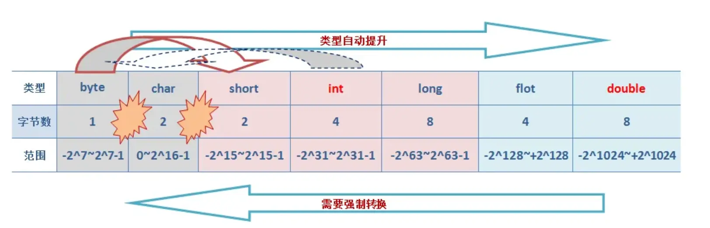
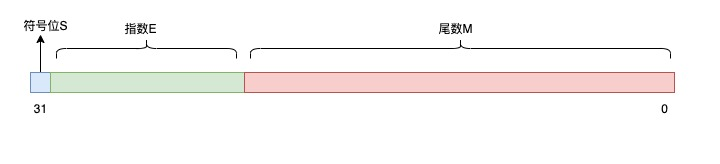

## Java 基础

### JAVA 数据类型

#### JAVA 有哪些数据类型

Java 的数据类型可以分为两种：基本数据类型和引用数据类型

##### 基本数据类型

- 数值型
  - 整数：short int long
  - 浮点：float doublee
  - 字节：byte
- 字符型
  - char
- 布尔型
  - boolean

| 数据类型 | 占用大小（字节） | 位数 | 取值范围 | 默认值 | 描述 |
| --- | --- | --- | --- | --- | --- |
| `byte` | 1 | 8 | -128（-2^7） 到 127（2^7 - 1） | 0 | 是最小的整数类型，适合用于节省内存，例如在处理文件或网络流时存储小范围整数数据。 |
| `short` | 2 | 16 | -32768（-2^15） 到 32767（2^15 - 1） | 0 | 较少使用，通常用于在需要节省内存且数值范围在该区间的场景。 |
| `int` | 4 | 32 | -2147483648（-2^31） 到 2147483647（2^31 - 1） | 0 | 最常用的整数类型，可满足大多数日常编程中整数计算的需求。 |
| `long` | 8 | 64 | -9223372036854775808（-2^63） 到 9223372036854775807（2^63 - 1） | 0L | 用于表示非常大的整数，当 `int` 类型无法满足需求时使用，定义时数值后需加 `L` 或 `l`。 |
| `float` | 4 | 32 | 1.4E - 45 到 3.4028235E38 | 0.0f | 单精度浮点数，用于表示小数，精度相对较低，定义时数值后需加 `F` 或 `f`。 |
| `double` | 8 | 64 | 4.9E - 324 到 1.7976931348623157E308 | 0.0d | 双精度浮点数，精度比 `float` 高，是 Java 中表示小数的默认类型。 |
| `char` | 2 | 16 | '\u0000'（0） 到 '\uffff'（65535） | '\u0000' | 用于表示单个字符，采用 Unicode 编码，可表示各种语言的字符。 |
| `boolean` | 无明确字节大小（理论上 1 位） | 无明确位数 | `true` 或 `false` | `false` | 用于逻辑判断，只有两个取值，常用于条件判断和循环控制等逻辑场景。 |

- Java八种基本数据类型的字节数：1字节(byte、boolean)、 2字节(short、char)、4字节(int、float)、8字节(long、double)
- 浮点数的默认类型为double（如果需要声明一个常量为float型，则必须要在末尾加上f或F）
- 整数的默认类型为int（声明Long型在末尾加上l或者L）
- 八种基本数据类型的包装类：除了char的是Character、int类型的是Integer，其他都是首字母大写
- char类型是无符号的，不能为负，所以是0开始的

##### 引用数据类型

- 类 class
- 接口 interface
- 数组 []

#### 自动类型转换与强制类型转换

当把一个范围较小的数值或变量赋给另外一个范围较大的变量时，会进行自动类型转换；反之，需要强制转换



- 自动类型转换（隐式转换）：当**目标类型的范围大于源类型**时，Java会自动将源类型转换为目标类型，不需要显式的类型转换。例如，将int转换为long、将float转换为double等。
- 强制类型转换（显式转换）：当**目标类型的范围小于源类型**时，需要使用**强制类型转换**将源类型转换为目标类型。这可能**导致数据丢失或溢出**。例如，将long转换为int、将double转换为int等。语法为：目标类型 变量名 = (目标类型) 源类型。
- 字符串转换：Java提供了将字符串表示的数据转换为其他类型数据的方法。例如，将字符串转换为整型int，可以使用Integer.parseInt()方法；将字符串转换为浮点型double，可以使用Double.parseDouble()方法等。
- 数值之间的转换：Java提供了一些数值类型之间的转换方法，如将整型转换为字符型、将字符型转换为整型等。这些转换方式可以通过类型的包装类来实现，例如Character类、Integer类等提供了相应的转换方法

#### 自动拆箱/装箱

- 装箱：将基本数据类型转换为包装类型，例如 int 转换为 Integer。
- 拆箱：将包装类型转换为基本数据类型

```java
Integer i = 10;  //装箱
int n = i;   //拆箱
```

#### 有 int 为什么要有 Integer

Integer对应是int类型的包装类，就是把int类型包装成Object对象，对象封装有很多好处

可以把属性也就是数据跟处理这些数据的方法结合在一起

比如Integer就有parseInt()等方法来专门处理int型相关的数据

另一个非常重要的原因就是在Java中绝大部分方法或类都是用来处理类类型对象的，如ArrayList集合类就只能以类作为他的存储对象，而这时如果想把一个int型的数据存入list是不可能的，必须把它包装成类，也就是Integer才能被List所接受。所以Integer的存在是很必要的

> 泛型中的应用

在Java中，泛型只能使用引用类型，而不能使用基本类型。因此，如果要在泛型中使用int类型，必须使用Integer包装类。例如，假设我们有一个列表，我们想要将其元素排序，并将排序结果存储在一个新的列表中。如果我们使用基本数据类型int，无法直接使用Collections.sort()方法。但是，如果我们使用Integer包装类，我们就可以轻松地使用Collections.sort()方法

##### integer的缓存

Java的Integer类内部实现了一个静态缓存池，用于存储特定范围内的整数值对应的Integer对象。

默认情况下，这个范围是**-128至127**

当通过`Integer.valueOf(int)`方法创建一个在这个范围内的整数对象时，并不会每次都生成新的对象实例，而是**复用缓存中的现有对象**，会直接从内存中取出，不需要新建一个对象

#### 用效率最高的方法计算 2 乘以 8

`2 << 3`: 位运算，数字的二进制位左移三位相当于乘以 2 的三次方

#### 自增自减运算

在写代码的过程中，常见的一种情况是需要某个整数类型变量增加 1 或减少 1，Java 提供了一种特殊的运算符，用于这种表达式，叫做自增运算符（++）和自减运算符（--）

当运算符放在变量之前时(前缀)，先自增/减，再赋值；当运算符放在变量之后时(后缀)，先赋值，再自增/减

```java
int i  = 1;
i = i++;
System.out.println(i);
```

返回是 1

因为后++的赋值字节码如下

```java
0: iconst_1
1: istore_1        // i = 1
2: iload_1         // 步骤1：将 i 的当前值 (1) 压入操作数栈（保留副本用于赋值）
3: iinc 1, 1       // 步骤2：局部变量表中的 i 自增为 2 (此时栈顶还是 1)
6: istore_2        // 步骤3：将栈顶的值 (1) 存入局部变量 a
```

最终赋值的是存在临时变量的值，而不是自增的值，相当于

```java
int i = 1；
int temp = i;
i++；
i = temp;
System.out.println(i);
```

#### float 怎么表示小数

float 表示小数的方式是基于 IEEE 754 标准的，采用二进制浮点数格式

$$
V=(-1)^S\times M \times 2^e
$$

- S：符号位，0 代表正数，1 代表负数；
- M：尾数部分，用于表示数值的精度；
- R：基数，十进制中的基数是 10，二进制中的基数是 2；
- E：指数部分, e = E - 127

单精度浮点数占用 4 字节（32 位），这 32 位被分为三个部分：符号位、指数部分和尾数部分



1 位符号位、8 位指数位、23 位尾数位

符号位决定正负，0 表示正数，1 表示负数。指数位存储的是偏置后的指数，实际指数要减去 127。尾数位存储的是小数部分的二进制表示

按照这个规则，将十进制数 25.125 转换为浮点数:

- 确定符号位 (Sign)正数符号位为 $0$。负数符号位为 $1$
- 转换为二进制并规格化, $11001.001 = 1.1001001 \times 2^4$
  - 指数 (e) 为 $4$
  - 尾数 (Fraction) 部分为 $1001001$
- 计算阶码: 在 32 位浮点数中，指数部分使用“偏移量”（Bias）表示，偏移量为 $127$
  - $E = 4 + 127 = 131$
  - 阶码 $E = 10000011$
- 确定尾数
  - 尾数位共有 23 位。规格化形式 $1.1001001$ 中，小数点左边的“1”是隐含的，不存储
- 将三部分按顺序拼接：符号位 (1bit) + 阶码 (8bits) + 尾数 (23bits)
  - 二进制结果：0 10000011 10010010000000000000000
  - 十六进制表示：0x41C90000

使用浮点数时需要注意，由于精度的限制，进行数学运算时可能会遇到舍入误差，特别是连续运算累积误差可能会变得显著

对于需要高精度计算的场景（如金融计算），可能需要考虑使用`BigDecimal`类来避免这种误差

#### BigDecimal

在金融计算中，保证数据准确性有两种方案，一种使用 BigDecimal，一种将浮点数转换为整数 int 进行计算

> float 和 double 类型，它们无法避免浮点数运算中常见的精度问题

```java
BigDecimal num1 = new BigDecimal("0.1");
BigDecimal num2 = new BigDecimal("0.2");
BigDecimal sum = num1.add(num2);
System.out.println("Sum of 0.1 and 0.2 using BigDecimal: " + sum);  // 输出 0.3，精确计算
```
