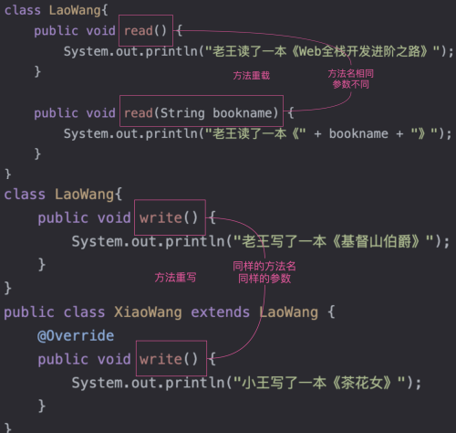
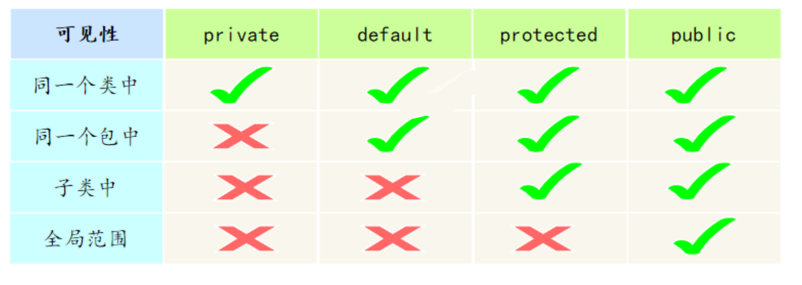
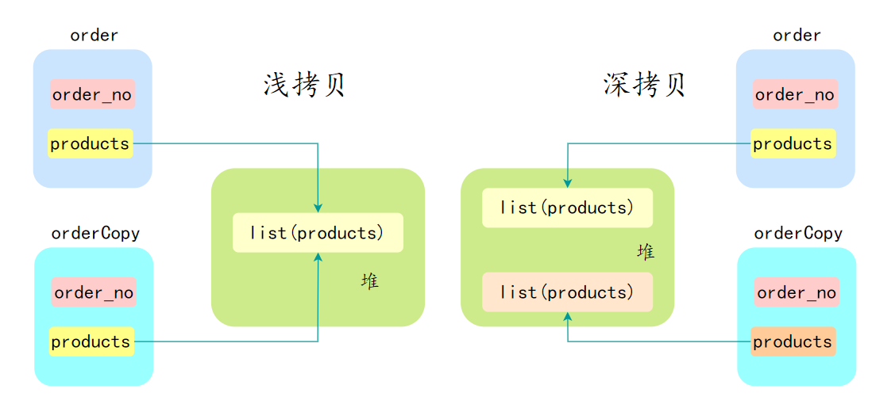

## Java 基础

### JAVA 面向对象

#### 面向对象和面向过程的区别

面向过程是以过程为核心，通过函数完成任务，程序结构是函数+步骤组成的顺序流程

面向对象是以对象为核心，通过对象交互完成任务，程序结构是类和对象组成的模块化结构，代码可以通过继承、组合、多态等方式复用

#### 面向对象的特性

面向对象编程有三大特性：**封装**、**继承**、**多态**

##### 封装

封装是指将数据（属性，或者叫字段）和操作数据的方法（行为）捆绑在一起，形成一个独立的对象（类的实例）

##### 继承

继承允许一个类（子类）继承现有类（父类或者基类）的属性和方法，以提高代码的复用性，建立类之间的层次关系

同时，子类还可以**重写或者扩展**从父类继承来的属性和方法，从而实现多态

##### 多态

**多态指同一个接口或方法在不同的类中有不同的实现**

多态允许不同类的对象对同一消息做出响应，但表现出不同的行为（即方法的多样性）

多态其实是一种能力 —— 同一个行为具有不同的表现形式；换句话说就是，执行一段代码，Java 在运行时能根据对象类型的不同产生不同的结果

多态性可以分为编译时多态（重载）和运行时多态（重写）

它使得程序具有良好的灵活性和扩展性

#### 多态设计

**多态指同一个接口或方法在不同的类中有不同的实现**, 比如说动态绑定，父类引用指向子类对象，方法的具体调用会延迟到运行时决定

多态在面向对象编程中可以体现在以下几个方面：

- 方法重载：
  - 方法重载是指同一类中可以有多个同名方法，它们具有**不同的参数列表**（参数类型、数量或顺序不同）。虽然方法名相同，但根据传入的参数不同，编译器会在编译时确定调用哪个方法。
  - 示例：对于一个 add 方法，可以定义为 add(int a, int b) 和 add(double a, double b)
- 方法重写：
  - 方法重写是指**子类能够提供对父类中同名方法的具体实现**。在运行时，JVM会根据对象的实际类型确定调用哪个版本的方法。这是实现多态的主要方式。
  - 示例：在一个动物类中，定义一个 sound 方法，子类 Dog 可以重写该方法以实现 bark，而 Cat 可以实现 meow。
- 接口与实现：
  - 多态也体现在接口的使用上，**多个类可以实现同一个接口**，并且用**接口类型的引用来调用**这些类的方法。这使得程序在面对不同具体实现时保持一贯的调用方式。
  - 示例：多个类（如 Dog, Cat）都实现了一个 Animal 接口，当用 Animal 类型的引用来调用 makeSound 方法时，会触发对应的实现。
- 向上转型和向下转型：
  - 在Java中，可以使用父类类型的引用指向子类对象，这是向上转型。通过这种方式，可以在运行时期采用不同的子类实现。
  - 向下转型是将父类引用转回其子类类型，但在执行前需要确认引用实际指向的对象类型以避免 ClassCastException

##### 多态的实现原理

多态通过**动态绑定**实现，Java 使用虚方法表存储方法指针，方法调用时根据对象实际类型从虚方法表查找具体实现

#### 重载与重写 区别

如果一个类有多个**名字相同**但**参数个数不同**的方法，我们通常称这些方法为**方法重载**

如果**子类具有和父类一样的方法**（参数相同、返回类型相同、方法名相同，但**方法体不同**，就是方法里面的内容不同），我们称之为方法重写

- 重载：方法重载发生在同一个类中，同名的方法如果有不同的参数（参数类型不同、参数个数不同或者二者都不同）

- 重写：重写发生在子类与父类之间，要求子类与父类具有相同的返回类型，方法名和参数列表，并且不能比父类的方法声明更多的异常，遵守里氏代换原则



#### 面向对象设计的六大原则

- 单一职责原则（SRP）：一个类应该只有一个引起它变化的原因，即一个类应该只负责一项职责。例子：考虑一个员工类，它应该只负责管理员工信息，而不应负责其他无关工作。
- 开放封闭原则（OCP）：软件实体应该对扩展开放，对修改封闭。例子：通过制定接口来实现这一原则，比如定义一个图形类，然后让不同类型的图形继承这个类，而不需要修改图形类本身。
- 里氏替换原则（LSP）：(**任何父类可以出现的地方，子类也一定可以出现**) 子类对象应该能够替换掉所有父类对象。例子：一个正方形是一个矩形，但如果修改一个矩形的高度和宽度时，正方形的行为应该如何改变就是一个违反里氏替换原则的例子。
- 接口隔离原则（ISP）：客户端不应该依赖那些它不需要的接口，即接口应该小而专。例子：通过接口抽象层来实现底层和高层模块之间的解耦，比如使用依赖注入。
- 依赖倒置原则（DIP）：高层模块不应该依赖低层模块，二者都应该依赖于抽象；抽象不应该依赖于细节，细节应该依赖于抽象。例子：如果一个公司类包含部门类，应该考虑使用合成/聚合关系，而不是将公司类继承自部门类。
- 最少知识原则 (Law of Demeter)：一个对象应当对其他对象有最少的了解，只与其直接的朋友交互

> LSP 是继承复用的基石，只有当子类可以替换掉父类，并且单位功能不受到影响时，父类才能真正被复用，而子类也能够在父类的基础上增加新的行为。
>
> 这意味着子类在扩展父类时，不应改变父类原有的行为。例如，如果有一个方法接受一个父类对象作为参数，那么传入该方法的任何子类对象也应该能正常工作

#### 访问修饰符

Java 中，可以使用访问控制符来保护对类、变量、方法和构造方法的访问

Java 支持 4 种不同的访问权限。

- default （即默认，什么也不写）: 在同一包内可见，不使用任何修饰符。可以修饰在类、接口、变量、方法。
- private : 在同一类内可见。可以修饰变量、方法。注意：**不能修饰类（外部类）**
- public : 对所有类可见。可以修饰类、接口、变量、方法
- protected : 对同一包内的类和所有子类可见。可以修饰变量、方法。注意：**不能修饰类（外部类）**



#### this 关键字

this 是自身的一个对象，代表对象本身，可以理解为：指向对象本身的一个指针。

this 的用法在 Java 中大体可以分为 3 种：

- 普通的直接引用，this 相当于是指向当前对象本身
- 形参与成员变量名字重名，用 this 来区分
- 引用本类的构造方法

#### 抽象类和接口区别

一个类只能继承一个抽象类

但一个类可以实现多个接口

抽象类符合 is-a 的关系，而接口更像是 has-a 的关系

比如说一个类可以序列化的时候，它只需要实现 Serializable 接口就可以了，不需要去继承一个序列化类

抽象类更多地是用来为多个相关的类提供一个共同的基础框架，包括状态的初始化，而接口则是定义一套行为标准，让不同的类可以实现同一接口，提供行为的多样化实现

##### abstract 抽象类

如果一个类被 abstract 关键字修饰，它就是抽象类。

- 不能被实例化： 你不能直接使用 new 关键字来创建一个抽象类的对象。
- 可以包含抽象方法： 抽象方法只有声明，没有方法体（即没有 {}）。
- 可以包含普通成员： 它和普通类一样，可以有成员变量、构造方法、静态方法和带有方法体的普通方法

抽象方法必须使用 abstract 修饰，且不能有方法体

```java
public abstract class Animal {
  // 抽象方法：强制子类必须实现
  public abstract void makeSound();

  // 普通方法：子类可以直接继承使用
  public void sleep() {
      System.out.println("Zzz...");
  }
}
```

当一个类继承了抽象类时：

- 必须重写（Override） 父类中所有的抽象方法。
- 或者，该子类本身也声明为 抽象类

抽象类不一定非要有抽象方法，但有抽象方法的类必须声明为抽象类

> 虽然抽象类不能实例化，但它是有构造函数的。每当子类对象被创建时，父类的构造函数依然会被调用，用来初始化父类的状态
>
> 接口则不能定义构造方法，接口主要用于定义一组方法规范，没有具体的实现细节

#### 继承问题

Java 不支持多继承，一个类只能继承一个类，多继承会引发菱形继承问题

接口可以多继承，一个接口可以继承多个接口，使用逗号分隔

#### static 关键字

static 关键字可以用来修饰变量、方法、代码块和内部类，以及导入包

| 修饰对象 | 作用 |
| --- | --- |
| 变量 | 静态变量，类级别变量，所有实例共享同一份数据。 |
| 方法 | 静态方法，类级别方法，与实例无关。 |
| 代码块 | 在类加载时初始化一些数据，只执行一次。 |
| 内部类 | 与外部类绑定但独立于外部类实例。 |
| 导入 | 可以直接访问静态成员，无需通过类名引用，简化代码书写，但会降低代码可读性 |

##### 静态变量

- 静态变量: 是被 static 修饰符修饰的变量，也称为类变量，它**属于类**，不属于类的任何一个对象，一个类不管创建多少个对象，**静态变量在内存中有且仅有一个副本**。
- 实例变量: 必须依存于某一实例，**需要先创建对象然后通过对象才能访问到它**。静态变量可以实现让多个对象共享内存

##### 静态方法

- 静态方法：static 修饰的方法，也被称为类方法。在外部调⽤静态⽅法时，可以使⽤"**类名.⽅法名**"的⽅式，也可以使⽤"对象名.⽅法名"的⽅式。静态方法里不能访问类的非静态成员变量和方法。
- 实例⽅法：依存于类的实例，需要使用"对象名.⽅法名"的⽅式调用；可以访问类的所有成员变量和方法

#### final 关键字

- 当 final 修饰一个类时，表明这个类不能被继承。比如，String 类、Integer 类和其他包装类都是用 final 修饰的
- 当 final 修饰一个方法时，表明这个方法不能被重写（Override）。也就是说，如果一个类继承了某个类，并且想要改变父类中被 final 修饰的方法的行为，是不被允许的
- 当 final 修饰一个变量时，表明这个变量的值一旦被初始化就不能被修改

如果是基本数据类型的变量，其**数值一旦在初始化之后就不能更改**

如果是引用类型的变量，在对其初始化之后就**不能再让其指向另一个对象**，但是引**用指向的对象内容可以改变**

##### final、finally、finalize 的区别

- final 是一个修饰符，可以修饰类、方法和变量。当 final 修饰一个类时，表明这个类不能被继承；当 final 修饰一个方法时，表明这个方法不能被重写；当 final 修饰一个变量时，表明这个变量是个常量，一旦赋值后，就不能再被修改了
- finally 是 Java 中异常处理的一部分，用来创建 try 块后面的 finally 块。无论 try 块中的代码是否抛出异常，finally 块中的代码总是会被执行。通常，finally 块被用来释放资源，如关闭文件、数据库连接等
- finalize 是Object 类的一个方法，用于在垃圾回收器将对象从内存中清除出去之前做一些必要的清理工作
  - 这个方法在垃圾回收器准备释放对象占用的内存之前被自动调用。我们**不能显式地调用** finalize 方法，因为它总是由垃圾回收器在适当的时间自动调用

#### == 与 equals 的区别

在 Java 中，== 操作符和 equals() 方法用于比较两个对象：

- ==：用于比较两个对象的引用，即它们是否指向同一个对象实例
  - 如果两个变量引用同一个对象实例，== 返回 true，否则返回 false
  - 对于基本数据类型（如 int, double, char 等），== 比较的是值是否相等
- equals() 方法：用于比较两个对象的内容是否相等。默认情况下，equals() 方法的行为与 == 相同，即比较对象引用

在超类 Object 中：

```java
public boolean equals(Object obj) {
  return (this == obj);
}
```

然而，equals() 方法通常被各种类重写。例如，String 类重写了 equals() 方法，以便它可以比较两个字符串的字符内容是否完全一样

也就是通常通过重写类的equals方法，来实现我们自定义的匹配规则

#### 为什么重写 equals 时必须重写 hashCode 方法

因为基于哈希的集合类（如 HashMap）需要基于这一点来正确存储和查找对象

如果只重写 equals 而不重写 hashCode，会导致原本“逻辑相等”的对象，在集合中被当成两个不同的东西，从而引发严重的 Bug

> 具体地说，HashMap 通过对象的哈希码将其存储在不同的“桶”中，当查找对象时，它需要使用 key 的哈希码来确定对象在哪个桶中，然后再通过 equals() 方法找到对应的对象
>
> equals 如果是 true，意味着这两个对象是相等的

如果重写了 equals()方法而没有重写 hashCode()方法，那么被认为相等的对象可能会有不同的哈希码，从而导致无法在 HashMap 中正确处理这些对象

**如果两个对象通过 equals 相等，它们的 hashCode 必须相等**。否则会导致哈希表类数据结构（如 HashMap、HashSet）的行为异常。

Java 对 hashCode 的规范（Object 类的文档）中有明确的约定：

- 一致性：在一次执行期间，只要对象的 equals 比较属性没变，hashCode 必须返回相同的值。
- 相等对象必须有相等的 HashCode：如果 a.equals(b) 为 true，那么 a.hashCode() 必须等于 b.hashCode()。
- 不相等对象不要求 HashCode 不同：如果 a.equals(b) 为 false，hashCode 可以相同（这叫哈希冲突），但不同的哈希值能提高性能

##### hashcode 方法

hashCode() 方法的作⽤是获取哈希码，它会返回⼀个 int 整数，定义在 Object 类中， 是一个本地⽅法

hashCode 方法主要用来获取对象的哈希码，哈希码是由对象的内存地址或者对象的属性计算出来的，它是⼀个 int 类型的整数，通常是不会重复的，因此可以用来作为键值对的建，以提高查询效率

例如 HashMap 中的 key 就是通过 hashCode 来实现的，通过调用 hashCode 方法获取键的哈希码，并将其与右移 16 位的哈希码进行异或运算

```java
static final int hash(Object key) {
  int h;
  return (key == null) ? 0 : (h = key.hashCode()) ^ (h >>> 16);
}
```

##### 哈希冲突时的分析

哈希码是通过哈希函数将对象中映射成一个整数值，其主要目的是在哈希表中快速定位对象的存储位置。

由于哈希函数将一个较大的输入域映射到一个较小的输出域，不同的输入值（即不同的对象）可能会产生相同的输出值（即相同的哈希码）

这种情况被称为哈希冲突。当两个不相等的对象发生哈希冲突时，它们会有相同的 hashCode

为了解决哈希冲突的问题，哈希表在处理键时，不仅会比较键对象的哈希码，还会使用 equals 方法来检查键对象是否真正相等。如果两个对象的哈希码相同，但通过 equals 方法比较结果为 false，那么这两个对象就不被视为相等

```java
if (p.hash == hash &&
  ((k = p.key) == key || (key != null && key.equals(k))))
  e = p;
```

##### 例子

假设我们有一个 Person 类，只重写了 equals：

```java
public class Person {
  String id;
  public Person(String id) { this.id = id; }

  @Override
  public boolean equals(Object o) {
      if (this == o) return true;
      if (!(o instanceof Person)) return false;
      return id.equals(((Person) o).id);
  }
  // 故意不重写 hashCode
}
```

测试：

```java
Map<Person, String> map = new HashMap<>();
Person p1 = new Person("123");
map.put(p1, "张三");

// 我们认为 p1 和 p2 是同一个人，因为 ID 相同
Person p2 = new Person("123");
System.out.println(map.get(p2)); // 输出：null
```

因为 p2.hashCode() 调用的是 Object 类的默认实现（通常基于内存地址），它和 p1 的哈希值大概率不同。HashMap 根本没去 p1 所在的那个桶里找，直接就报“查无此人”了

- hashCode 是为了初筛：快速定位，缩小搜索范围。
- equals 是为了精筛：在小范围内确定两个对象是否真的逻辑一致

#### JAVA是值传递

Java 是值传递，不是引用传递。

当一个对象被作为参数传递到方法中时，参数的值就是该对象的引用。引用的值是对象在堆中的地址

对象是存储在堆中的，所以传递对象的时候，可以理解为把变量存储的对象地址给传递过去

##### 引用型变量值传递

引用类型的变量存储的是对象的地址，而不是对象本身。因此，引用类型的变量在传递时，传递的是对象的地址，也就是说，传递的是引用的值

#### 深拷贝与浅拷贝

在 Java 中，深拷贝（Deep Copy）和浅拷贝（Shallow Copy）是两种拷贝对象的方式，它们在拷贝对象的方式上有很大不同



##### 浅拷贝

浅拷贝只复制对象本身和其中的基本数据类型（如 int, double），但对于对象内部的引用类型，它只复制了内存地址。

- 原始对象和拷贝后的对象指向同一个内部子对象。
- 如果你修改了拷贝对象里的子对象，原对象也会跟着变

实现方式 (实现 Cloneable 接口并重写 clone() 方法)

```java
class Person implements Cloneable {
  String name;
  int age;
  Address address;

  public Person(String name, int age, Address address) {
      this.name = name;
      this.age = age;
      this.address = address;
  }

  @Override
  protected Object clone() throws CloneNotSupportedException {
      return super.clone();
  }
}

class Address {
  String city;

  public Address(String city) {
      this.city = city;
  }
}

public class Main {
  public static void main(String[] args) throws CloneNotSupportedException {
      Address address = new Address("aaaa");
      Person person1 = new Person("ppppp", 18, address);
      Person person2 = (Person) person1.clone();

      System.out.println(person1.address == person2.address); // true
  }
}
```

##### 深拷贝

深拷贝会递归地复制对象内部所有的引用对象。它会创建一个全新的子对象，并把内容填进去

确保新对象和原对象完全独立。新对象与原对象的任何更改都不会相互影响

- 两个对象在内存中完全独立，互不影响。
- 性能开销较大，实现起来比浅拷贝复杂

实现方式：

- 手动重写 clone()：在 clone 方法里手动 new 出子对象并赋值。
- 序列化 (Recommended)：将对象序列化为字节流再反序列化回来，这是最彻底的深拷贝。
- 构造函数：通过拷贝构造函数手动复制每一个字段

```java
import java.io.*;

class Person implements Serializable {
  String name;
  int age;
  Address address;

  public Person(String name, int age, Address address) {
      this.name = name;
      this.age = age;
      this.address = address;
  }

  public Person deepClone() throws IOException, ClassNotFoundException {
      ByteArrayOutputStream bos = new ByteArrayOutputStream();
      ObjectOutputStream oos = new ObjectOutputStream(bos);
      oos.writeObject(this);

      ByteArrayInputStream bis = new ByteArrayInputStream(bos.toByteArray());
      ObjectInputStream ois = new ObjectInputStream(bis);
      return (Person) ois.readObject();
  }
}

class Address implements Serializable {
  String city;

  public Address(String city) {
      this.city = city;
  }
}

public class Main {
  public static void main(String[] args) throws IOException, ClassNotFoundException {
      Address address = new Address("aaaaa");
      Person person1 = new Person("ccccc", 18, address);
      Person person2 = person1.deepClone();

      System.out.println(person1.address == person2.address); // false
  }
}
```

#### JAVA 创建对象的方式

- new 创建对象
- 反射机制来创建对象
- clone
- 序列化

##### new 关键字

这是最常见和直接的方式，通过调用类的构造方法来创建对象

```java
Person person = new Person();
```

##### 反射机制

反射机制创建，反射机制允许在运行时创建对象，并且可以访问类的私有成员，在框架和工具类中比较常见

```java
Class clazz = Class.forName("Person");
Person person = (Person) clazz.newInstance();
```

##### clone 拷贝创建

通过 clone 方法创建对象，需要实现 Cloneable 接口并重写 clone 方法

```java
Person person = new Person();
Person person2 = (Person) person.clone();
```

##### 序列化机制创建

通过序列化将对象转换为字节流，再通过反序列化从字节流中恢复对象。需要实现 Serializable 接口

```java
Person person = new Person();
ObjectOutputStream oos = new ObjectOutputStream(new FileOutputStream("person.txt"));
oos.writeObject(person);
ObjectInputStream ois = new ObjectInputStream(new FileInputStream("person.txt"));
Person person2 = (Person) ois.readObject();
```

#### new 子类的时候，子类和父类静态代码块，构造方法的执行顺序

在 Java 中，当创建一个子类对象时，子类和父类的静态代码块、构造方法的执行顺序遵循一定的规则

这些规则主要包括以下几个步骤：

- 首先执行父类的静态代码块（仅在类第一次加载时执行）。
- 接着执行子类的静态代码块（仅在类第一次加载时执行）。
- 再执行父类的构造方法。
- 最后执行子类的构造方法

总结：

- 静态代码块：在**类加载时**执行，仅执行一次，按父类-子类的顺序执行。
- 构造方法：在**每次创建对象时执行**，按父类-子类的顺序执行，先初始化块后构造方法
