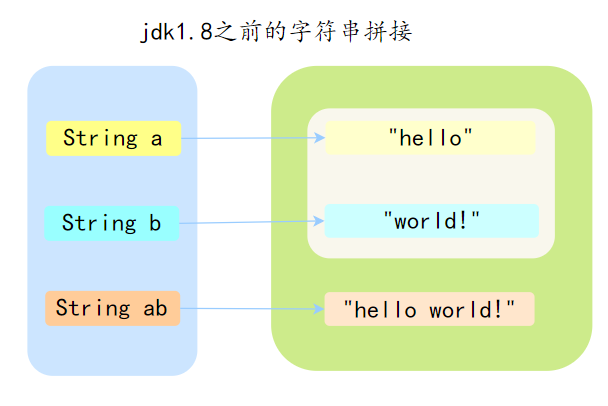
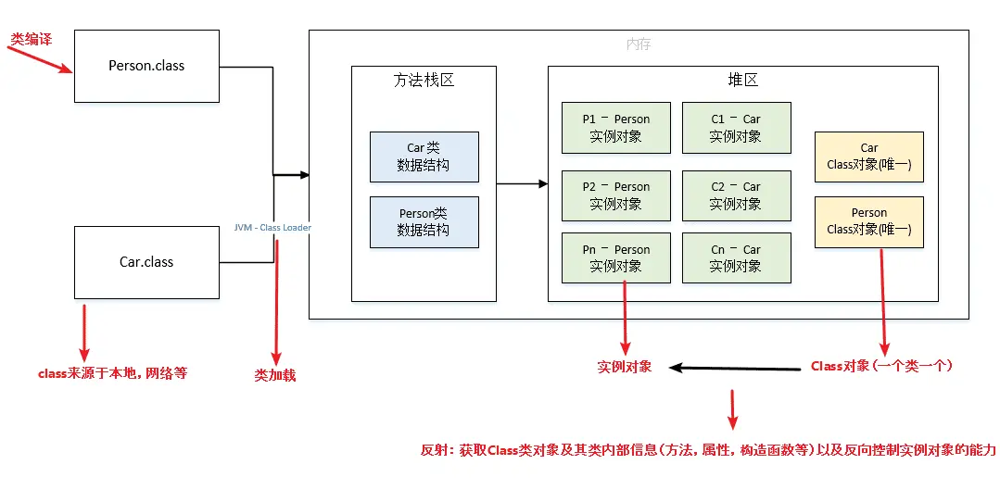

## Java 基础

### String

String 是一个类，属于引用数据类型，使用 final 修饰，是所谓的不可变类，无法被继承

#### 常用方法

- `length()`: 返回字符串的长度。
- `charAt(int index)`: 返回指定位置的字符。
- `substring(int beginIndex, int endIndex)`: 返回字符串的一个子串，从 beginIndex 到 endIndex-1。
- `contains(CharSequence s)`: 检查字符串是否包含指定的字符序列
- `equals(Object anotherObject)`: 比较两个字符串的内容是否相等
- `indexOf(int ch) 和 indexOf(String str)`: 返回指定字符或字符串首次出现的位置
- `toCharArray()`: 将字符串转换为字符数组
- `replace(char oldChar, char newChar)` 和 `replace(CharSequence target, CharSequence replacement)`: 替换字符串中的字符或字符序列

#### String 和 StringBuilder、StringBuffer 的区别

String、StringBuilder和StringBuffer在 Java 中都是用于处理字符串的

- String：适用于字符串内容不会改变的场景，比如说作为 HashMap 的 key。
- StringBuilder：适用于单线程环境下需要频繁修改字符串内容的场景，比如在循环中拼接或修改字符串，是 String 的完美替代品。
- StringBuffer：现在已经不怎么用了，因为一般不会在多线程场景下去频繁的修改字符串内容

> 由于字符串是不可变的，所以当遇到字符串拼接（尤其是使用+号操作符）的时候，就需要考量性能的问题，你不能毫无顾虑地生产太多 String 对象，对珍贵的内存造成不必要的压力
>
> 于是 Java 就设计了一个专门用来解决此问题的 StringBuffer 类
>
> 不过，由于 StringBuffer 操作字符串的方法加了 synchronized 关键字进行了同步，主要是考虑到多线程环境下的安全问题，所以如果在非多线程环境下，执行效率就会比较低，因为加了没必要的锁
>
> 于是 Java 就给 StringBuffer 设计了一个单线程下的对象，名叫 StringBuilder
>
> 在单线程环境下使用，这样效率会高得多，如果要在多线程环境下修改字符串，可以使用 `ThreadLocal` 来避免多线程冲突
>
> 除了类名不同，方法没有加 synchronized，基本上完全一样

##### String 特点

- String类的对象是不可变的。也就是说，一旦一个String对象被创建，它所包含的字符串内容是不可改变的。
- 每次对String对象进行修改操作（如拼接、替换等）实际上都会**生成一个新的String对象**，而不是修改原有对象。这可能会导致内存和性能开销，尤其是在大量字符串操作的情况下

##### StringBuilder 的特点

- StringBuilder提供了一系列的方法来进行字符串的增删改查操作，这些操作都是**直接在原有字符串对象的底层数组上进行**的，而**不是生成新的 String 对象**。
- StringBuilder不是线程安全的。这意味着在**没有外部同步的情况**下，它**不适用于多线程环境**。
- 相比于String，在进行频繁的字符串修改操作时，StringBuilder能提供更好的性能。 Java 中的字符串连+操作其实就是通过StringBuilder实现的

##### StringBuffer 的特点

StringBuffer和StringBuilder类似，但StringBuffer是线程安全的，方法前面都加了synchronized关键字

#### String str1 = new String("abc") 和 String str2 = "abc" 的区别

直接使用双引号为字符串变量赋值时，Java 首先会检查**字符串常量池**中是否已经存在相同内容的字符串

如果存在，Java 就会让新的变量引用池中的那个字符串；如果不存在，它会创建一个新的字符串，放入池中，并让变量引用它

使用 new String("abc") 的方式创建字符串时，实际分为两步：

- 第一步，先检查字符串字面量 "abc" 是否在字符串常量池中，如果没有则创建一个；如果已经存在，则引用它。
- 第二步，在堆中再创建一个新的字符串对象，并将其初始化为字符串常量池中 "abc" 的一个副本

```java
String str1 = new String("abc");  // str1 指向堆内存
String str2 = "abc";               // str2 指向字符串常量池
String str3 = "abc";               // str3 也指向常量池中同一个对象
```

`String str1 = new String("abc")`

创建了 1/2 个对象：

- 字符串常量池中的 "abc"（如果池中还没有）
- 堆内存中的 String 对象（通过 new 创建）

`String str2 = "abc"`

创建了 0/1 个对象：

- 如果常量池中已有 "abc"，直接返回引用，不创建新对象
- 如果常量池中没有，创建 1 个对象并放入常量池

#### 字符串拼接是如何实现

在jdk 1.8之前，因为 String 是不可变的，因此通过“+”操作符进行的字符串拼接，会生成新的字符串对象



a 和 b 是通过双引号定义的，所以会在字符串常量池中，而 ab 是通过“+”操作符拼接的，所以会在堆中生成一个新的对象

Java 8 时，JDK 对“+”号的字符串拼接进行了优化，Java 会在编译期基于 StringBuilder 的 append 方法进行拼接

优化为：

```java
String a = "hello ";
String b = "world!";
StringBuilder sb = new StringBuilder();
sb.append(a);
sb.append(b);
String ab = sb.toString();
```

加号拼接在编译期还会创建一个 StringBuilder 对象，最终调用 toString() 方法的时候再返回一个新的 String 对象

#### String对象如何保证不可变

- String 类内部使用一个私有的字符数组来存储字符串数据，这个字符数组在创建字符串时被初始化，之后不允许被改变
  
  ```java
  private final char value[];
  ```

- String 类没有提供任何可以修改其内容的公共方法，像 concat 这些看似修改字符串的操作，实际上都是返回一个新创建的字符串对象，而原始字符串对象保持不变
- String 类本身被声明为 final，这意味着它不能被继承。这防止了子类可能通过添加修改方法来改变字符串内容的可能性

#### intern 方法

返回在字符串常量池的地址

```java
* <p>
* When the intern method is invoked, if the pool already contains a
* string equal to this {@code String} object as determined by
* the {@link #equals(Object)} method, then the string from the pool is
* returned. Otherwise, this {@code String} object is added to the
* pool and a reference to this {@code String} object is returned.
* <p>
```

- 如果当前字符串内容存在于字符串常量池（即 equals()方法为 true，也就是内容一样），直接返回字符串常量池中的字符串
- 否则，将此 String 对象添加到池中，并返回 String 对象的引用

### Integer

#### Integer 缓存机制

对于

```java
Integer a = 127;
Integer b = 127;
```

a和b是相等的

这是因为 Java 在自动装箱过程中，会使用`Integer.valueOf()`方法来创建Integer对象

`Integer.valueOf()`方法会针对数值在 -128 到 127 之间的Integer对象使用缓存

因此，a和b实际上引用了常量池中相同的Integer对象

而如果超出了范围，就不相等了，自动装箱过程会创建两个不同的Integer对象，它们有不同的引用地址

要比较Integer对象的数值是否相等，应该使用`equals`方法，而不是`==`运算符

##### 缓存

根据实践发现，大部分的数据操作都集中在值比较小的范围，因此 Integer 搞了个缓存池，默认范围是 -128 到 127

当我们**使用自动装箱来创建**这个范围内的 Integer 对象时，Java 会直接从缓存中返回一个已存在的对象，而不是每次都创建一个新的对象。这意味着，对于这个值范围内的所有 Integer 对象，它们实际上是引用相同的对象实例。

Integer 缓存的主要目的是优化性能和内存使用。对于小整数的频繁操作，使用缓存可以显著减少对象创建的数量。

可以在运行的时候添加 `-Djava.lang.Integer.IntegerCache.high=1000` 来调整缓存池的最大值

##### new Integer(10) == new Integer(10)

不相等

因为缓存是在自动装箱时才触发

new 关键字会在堆（Heap）上为每个 Integer 对象分配新的内存空间，所以这里创建了两个不同的 Integer 对象，它们有不同的内存地址。

当使用==运算符比较这两个对象时，实际上比较的是它们的内存地址，而不是它们的值，因此即使两个对象代表相同的数值（10），结果也是 false

#### String 怎么转成 Integer

String 转成 Integer，主要有两个方法：

- Integer.parseInt(String s)
- Integer.valueOf(String s)

不管哪一种，最终还是会调用 Integer 类内中的`parseInt(String s, int radix)`方法

```java
public static int parseInt(String s, int radix)
                throws NumberFormatException
{

  int result = 0;
  //是否是负数
  boolean negative = false;
  //char字符数组下标和长度
  int i = 0, len = s.length();
  ……
  int digit;
  //判断字符长度是否大于0，否则抛出异常
  if (len > 0) {
      ……
      while (i < len) {
          // Accumulating negatively avoids surprises near MAX_VALUE
          //返回指定基数中字符表示的数值。（此处是十进制数值）
          digit = Character.digit(s.charAt(i++),radix);
          //进制位乘以数值
          result *= radix;
          result -= digit;
      }
  }
  //根据上面得到的是否负数，返回相应的值
  return negative ? result : -result;
}
```

剩下的就是一个简单的字符串遍历计算，不过计算方式有点反常规，是用负的值累减

### Object

在 Java 中，经常提到一个词“万物皆对象”，其中的“万物”指的是 Java 中的所有类，而这些类都是 Object 类的子类

Object 主要提供了 11 个方法：

- 对象比较
  - hashCode()
  - equals()
- 对象拷贝
  - clone()
- 对象转字符串
  - toString()
- 多线程调度
  - wait()
  - wait(long timeout)
  - wait(long timeout, int nanos)
  - notify()
  - notifyAll()
- 反射
  - getClass()
- 垃圾回收
  - finalize()

#### 对象比较

`public native int hashCode()`：native 方法，用于返回对象的哈希码

按照约定，**相等的对象必须具有相等的哈希码**

如果重写了 equals 方法，就应该重写 hashCode 方法。

可以使用 Objects.hash() 方法来生成哈希码

```java
public int hashCode() {
  return Objects.hash(name, age);
}
```

`public boolean equals(Object obj)`: 用于比较 2 个对象的内存地址是否相等

如果比较的是两个对象的值是否相等，就要重写该方法，比如 String 类、Integer 类等都重写了该方法

#### 对象拷贝

`protected native Object clone() throws CloneNotSupportedException`: naitive 方法，返回此对象的一个副本。默认实现只做浅拷贝，且类必须实现 Cloneable 接口

Object 本身没有实现 Cloneable 接口，所以在不重写 clone 方法的情况下直接直接调用该方法会发生 CloneNotSupportedException 异常

#### 对象转字符串

`public String toString()`: 返回对象的字符串表示。默认实现返回类名@哈希码的十六进制表示，但通常会被重写以返回更有意义的信息

```java
public String toString() {
  return getClass().getName() + "@" + Integer.toHexString(hashCode());
}
```

当然了，这项工作也可以直接交给 IDE，比如 IntelliJ IDEA，直接右键选择 Generate，然后选择 toString 方法，就会自动生成一个 toString 方法。

也可以交给 Lombok，使用 @Data 注解，它会自动生成 toString 方法。

数组也是一个对象，所以通常我们打印数组的时候，会看到诸如 `[I@1b6d3586` 这样的字符串，这个就是 int 数组的哈希码

#### 多线程调度

每个对象都可以调用 Object 的 wait/notify 方法来实现等待/通知机制

```java
public class WaitNotifyDemo {
  public static void main(String[] args) {
    Object lock = new Object();
    new Thread(() -> {
        synchronized (lock) {
            System.out.println("线程1：我要等待");
            try {
                lock.wait();
            } catch (InterruptedException e) {
                e.printStackTrace();
            }
            System.out.println("线程1：我被唤醒了");
        }
    }).start();
    new Thread(() -> {
        synchronized (lock) {
            System.out.println("线程2：我要唤醒");
            lock.notify();
            System.out.println("线程2：我已经唤醒了");
        }
    }).start();
  }
}
```

#### 反射

`public final native Class<?> getClass()`：用于获取对象的类信息，如类名

```java
public class GetClassDemo {
  public static void main(String[] args) {
    Person p = new Person();
    Class<? extends Person> aClass = p.getClass();
    System.out.println(aClass.getName());
  }
}
```

#### 垃圾回收

`protected void finalize() throws Throwable`：当垃圾回收器决定回收对象占用的内存时调用此方法。用于清理资源，但 Java 不推荐使用，因为它不可预测且容易导致问题，Java 9 开始已被弃用

### 泛型

泛型主要用于提高代码的类型安全，它允许在定义类、接口和方法时使用类型参数，这样可以在编译时检查类型一致性，避免不必要的类型转换和类型错误

#### 泛型类别

泛型一般有三种使用方式: **泛型类**、**泛型接口**、**泛型方法**

##### 泛型类

```java
//此处T可以随便写为任意标识，常见的如T、E、K、V等形式的参数常用于表示泛型
//在实例化泛型类时，必须指定T的具体类型
public class Generic<T>{

  private T key;

  public Generic(T key) {
      this.key = key;
  }

  public T getKey(){
      return key;
  }
}
```

实例化泛型类

```java
Generic<Integer> genericInteger = new Generic<Integer>(123456);
```

##### 泛型接口

```java
public interface Generator<T> {
  public T method();
}
```

实现泛型接口，指定类型：

```java
class GeneratorImpl<T> implements Generator<String>{
  @Override
  public String method() {
      return "hello";
  }
}
```

##### 泛型方法

```java
public static < E > void printArray( E[] inputArray )
{
  for ( E element : inputArray ){
    System.out.printf( "%s ", element );
  }
  System.out.println();
}
```

```java
// 创建不同类型数组： Integer, Double 和 Character
Integer[] intArray = { 1, 2, 3 };
String[] stringArray = { "Hello", "World" };
printArray( intArray  );
printArray( stringArray  );
```

#### 泛型通配符

常用的通配符为： T，E，K，V，？

- ？ 表示不确定的 java 类型
- T (type) 表示具体的一个 java 类型
- K V (key value) 分别代表 java 键值中的 Key Value
- E (element) 代表 Element

#### 泛型擦除

所谓的泛型擦除，官方名叫“类型擦除”。

主要是为了向下兼容，因为 JDK5 之前是没有泛型的，为了让 JVM 保持向下兼容，就出了类型擦除这个策略

Java 的泛型是伪泛型，这是因为 Java 在编译期间，所有的类型信息都会被擦掉。

也就是说，在运行的时候是没有泛型的。

```java
LinkedList<Cat> cats = new LinkedList<Cat>();
LinkedList list = cats;  // 注意我在这里把范型去掉了，但是list和cats是同一个链表！
list.add(new Dog());  // 完全没问题！
```

因为 Java 的范型只存在于源码里，编译的时候给你静态地检查一下范型类型是否正确，而到了运行时就不检查了。上面这段代码在 JRE（Java运行环境）看来和下面这段没区别：

```java
LinkedList cats = new LinkedList();  // 注意：没有范型！
LinkedList list = cats;
list.add(new Dog());
```

##### 反编译分析

虚拟机没有泛型

比如对于

```java
class Arraylist<E> {
  private Object[] elementData;
  private int size = 0;

  public Arraylist(int initialCapacity) {
    this.elementData = new Object[initialCapacity];
  }
  
  public boolean add(E e) {
    elementData[size++] = e;
    return true;
  }
  
  E elementData(int index) {
    return (E) elementData[index];
  }
}
```

对应字节码将 class 文件反编译

```java
// Decompiled by Jad v1.5.8g. Copyright 2001 Pavel Kouznetsov.
// Jad home page: http://www.kpdus.com/jad.html
// Decompiler options: packimports(3) 
// Source File Name:   Arraylist.java

package com.cmower.java_demo.fanxing;

import java.util.Arrays;

class Arraylist
{

  public Arraylist(int initialCapacity)
  {
    size = 0;
    elementData = new Object[initialCapacity];
  }

  public boolean add(Object e)
  {
    elementData[size++] = e;
    return true;
  }

  Object elementData(int index)
  {
    return elementData[index];
  }

  private Object elementData[];
  private int size;
}
```

类型变量 `<E>` 消失了，取而代之的是 Object

如果泛型类使用了限定符 extends, 会替换为限定类型

因此，如果

```java
public class Penguin {
  public static void method(Arraylist<String> list) {
      System.out.println("Arraylist<String> list");
  }

  public static void method(Arraylist<Date> list) {
      System.out.println("Arraylist<Date> list");
  }
}
```

由于类型擦除的原因，以上代码是不会通过编译的——编译器会提示一个错误（这正是类型擦除引发的那些“问题”）

### 反射

Java 反射机制是在运行状态中，对于任意一个类，都能够知道这个类中的所有属性和方法，对于任意一个对象，都能够调用它的任意一个方法和属性；这种动态获取的信息以及动态调用对象的方法的功能称为 Java 语言的反射机制

通过反射，可以动态地获取类的字段、方法、构造方法等信息，并在运行时调用方法或访问字段

假如在编译期无法确定类的信息，但又想在运行时获取类的信息、创建类的实例、调用类的方法，这时候就要用到反射

反射具有以下特性：

- 运行时类信息访问：反射机制允许程序在运行时获取类的完整结构信息，包括类名、包名、父类、实现的接口、构造函数、方法和字段等。
- 动态对象创建：可以使用反射API动态地创建对象实例，即使在编译时不知道具体的类名。这是通过Class类的newInstance()方法或Constructor对象的newInstance()方法实现的。
- 动态方法调用：可以在运行时动态地调用对象的方法，包括私有方法。这通过Method类的invoke()方法实现，允许你传入对象实例和参数值来执行方法。
- 访问和修改字段值：反射还允许程序在运行时访问和修改对象的字段值，即使是私有的。这是通过Field类的get()和set()方法完成的

#### 原理



反射的基石是 Class 对象，在运行时，每个类被加载时，都会生成一个 Class 对象，这个对象包含了所有关于这个类的信息

- 当你运行程序时，JVM 会寻找 .class 文件并将其读入内存
- 创建 Class 对象：JVM 在堆中创建一个 java.lang.Class 类型的对象。这个对象就像是一面镜子，映射了类的结构（父类、接口、字段、方法等）

对于任何一个类，无论你 new 多少个实例，对应的 Class 对象在 JVM 中只有一个

反射机制允许程序在运行时通过这个 Class 对象，反向获取类的内部细节

- 获取 Class 对象：可以通过 `Object.getClass()`、`ClassName.class` 或 `Class.forName("全类名")`
- 一旦拿到 Class 对象，你可以调用以下方法获取内部组件：
  - getFields() / getDeclaredFields()：获取成员变量
  - getMethods()：获取方法
  - getConstructors()：获取构造函数

#### 反射相关类

反射功能主要通过 java.lang.Class 类及 java.lang.reflect 包中的类来实现的

- Class 类
- Field 类
- Constructor 类
- Method 类

##### Class 类

Class 类的实例表示正在运行的 Java 应用程序中的类和接口

- Object.getClass()：通过实例获取。
- ClassName.class：通过类名获取（最安全、性能最好）。
- Class.forName("全类名")：动态加载（最灵活）

##### Field 类

在 Java 反射中，java.lang.reflect.Field 专门用来表示类的成员变量（属性）。它不仅能获取变量的名字和类型，最强大的地方在于它能在运行时动态地读写对象里的值

通过 Class 对象，你有四种主要方式获取字段：

- getFields(): 返回所有 public 的字段（包括从父类继承来的）。
- getDeclaredFields(): 返回当前类中定义的所有字段（包含 private、protected、default），但不包括继承的字段。
- getField(String name): 获取指定的 public 字段。
- getDeclaredField(String name): 获取当前类中指定的任意访问权限字段

通过 Field 可以获取标注在属性上的注解、属性名、属性的数据类型、属性访问修饰符

##### Constructer 类

描述 Class 类中的构造方法的一个类

```java
Constructor<Student> constructor = Student.class.getConstructor(String.class);
```

##### Method 类

描述 Class 类中的所有方法(不包括构造方法)的类

#### 为什么反射比直接调用慢

虽然反射功能强大（甚至能访问 private 成员），但它是有代价的：

- 编译器无法优化：普通代码在编译时就能确定逻辑，反射必须在运行时动态解析。
- 类型检查：每次调用都要进行额外的安全检查和参数校验。
- 性能开销：涉及查找方法名、封装/拆箱参数等过程

#### 应用场景

> 加载数据库驱动

Class.forName("com.mysql.cj.jdbc.Driver") 动态加载驱动类

> Spring 框架就大量使用了反射来动态加载和管理 Bean

```java
Class<?> clazz = Class.forName("com.example.MyClass");
Object instance = clazz.newInstance();
```

> Java 的动态代理机制就使用了反射来创建代理类。代理类可以在运行时动态处理方法调用，这在实现 AOP 和拦截器时非常有用

为对象提供一个代理，通过代理控制对原对象的访问, 运行时动态生成代理类，无需手动编写

```java
InvocationHandler handler = new MyInvocationHandler();
MyInterface proxyInstance = (MyInterface) Proxy.newProxyInstance(
  MyInterface.class.getClassLoader(),
  new Class<?>[] { MyInterface.class },
  handler
);
```

> 配置文件加载

Spring 框架的 IOC（动态加载管理 Bean），Spring通过配置文件配置各种各样的bean，你需要用到哪些bean就配哪些，spring容器就会根据你的需求去动态加载，你的程序就能健壮地运行

Spring通过XML配置模式装载Bean的过程：

- 将程序中所有XML或properties配置文件加载入内存
- Java类里面解析xml或者properties里面的内容，得到对应实体类的字节码字符串以及相关的属性信息
- 使用反射机制，根据这个字符串获得某个类的Class实例
- 动态配置实例的属性

配置文件中：

```xml
className=com.example.reflectdemo.TestInvoke
methodName=printlnState
```

解析配置文件内容

```java
// 解析xml或properties里面的内容，得到对应实体类的字节码字符串以及属性信息
public static String getName(String key) throws IOException {
  Properties properties = new Properties();
  FileInputStream in = new FileInputStream("D:\IdeaProjects\AllDemos\language-specification\src\main\resources\application.properties");
  properties.load(in);
  in.close();
  return properties.getProperty(key);
}
```

利用反射获取实体类的Class实例，创建实体类的实例对象，调用方法

```java
public static void main(String[] args) throws NoSuchMethodException, InvocationTargetException, IllegalAccessException, IOException, ClassNotFoundException, InstantiationException {
  // 使用反射机制，根据这个字符串获得Class对象
  Class<?> c = Class.forName(getName("className"));
  System.out.println(c.getSimpleName());
  // 获取方法
  Method method = c.getDeclaredMethod(getName("methodName"));
  // 绕过安全检查
  method.setAccessible(true);
  // 创建实例对象
  TestInvoke testInvoke = (TestInvoke)c.newInstance();
  // 调用方法
  method.invoke(testInvoke);
}
```
