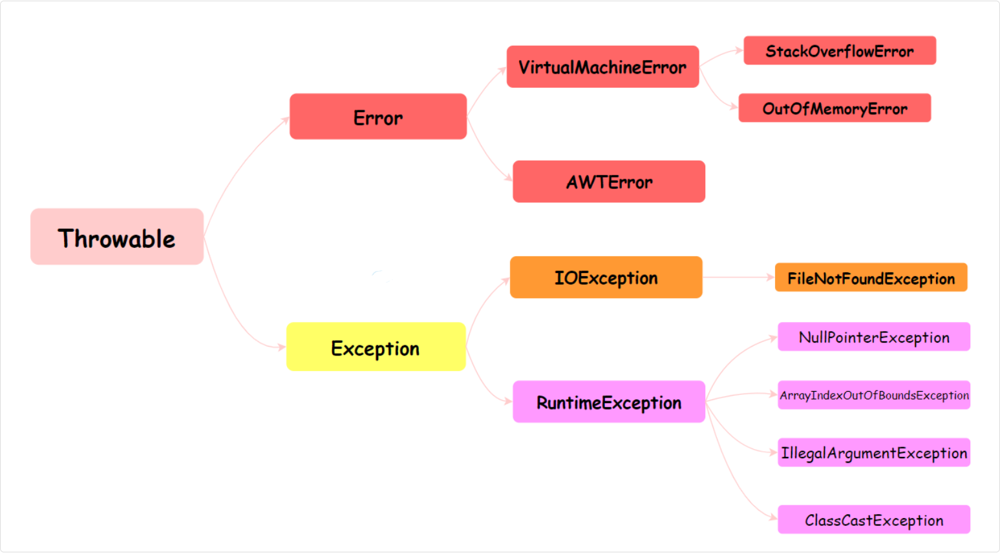

## Java 基础

### 注解 Annotation

注解（Annotation）是 Java 提供的一种元数据机制，用于为代码添加说明信息，可以在编译期、类加载期或运行期被读取和处理

Java 语言中的类、方法、变量、参数和包等都可以被标注，Java 标注可以通过反射获取标注内容。在编译器生成类文件时，标注可以被嵌入到字节码中，Java 虚拟机可以保留标注内容，在运行时可以获取到标注内容

注解本质上是一种特殊的接口，它继承自 java.lang.annotation.Annotation 接口，所以注解也叫声明式接口，编译后，Java 编译器会将其转换为一个继承自 Annotation 的接口，并生成相应的字节码文件

```java
// 定义注解
public @interface MyAnnotation {
  String value();
}

// 编译后实际上是：
public interface MyAnnotation extends java.lang.annotation.Annotation {
  String value();
}
```

#### 例子

编译指令 `javac`：

```shell
# 编译单个文件
javac com/ekko/Main.java
javac com/ekko/Penguin.java

# 或者一次编译所有文件
javac com/ekko/*.java

# 编译后会在相同位置生成 .class 文件
# com/ekko/Main.class
# com/ekko/Penguin.class

# 编译到 out 目录
javac -d out com/ekko/*.java
```

运行 `java`:

```shell
# 在项目根目录运行
java com.ekko.Main

# 如果编译到了 out 目录
java -cp out com.ekko.Main
```

反编译 `javap`

```shell
# 在项目根目录
javap -c com/ekko/Main.class
javap -v com/ekko/Penguin.class

# 查看详细信息
javap -c -v -p com/ekko/Main.class
```

##### 代码

```java
// com/ekko/Penguin.java
package com.ekko;

import java.lang.annotation.ElementType;
import java.lang.annotation.Retention;
import java.lang.annotation.RetentionPolicy;
import java.lang.annotation.Target;

@Target({ElementType.TYPE, ElementType.METHOD})
@Retention(RetentionPolicy.RUNTIME)
public @interface Penguin {
    String value() default "";
}

// com/ekko/Main.java
package com.ekko;

@Penguin("penguin")
public class Main {
    @Penguin("test")
    public static void main(String[] args) throws InterruptedException {
        System.out.println("penguin");
    }
}
```

编译后通过反编码，可以看到注解会被单独拎出来

```plain
{
  public com.ekko.Main();
    descriptor: ()V
    flags: (0x0001) ACC_PUBLIC
    Code:
      stack=1, locals=1, args_size=1
         0: aload_0
         1: invokespecial #1                  // Method java/lang/Object."<init>":()V
         4: return
      LineNumberTable:
        line 4: 0

  public static void main(java.lang.String[]) throws java.lang.InterruptedException;
    descriptor: ([Ljava/lang/String;)V
    flags: (0x0009) ACC_PUBLIC, ACC_STATIC
    Code:
      stack=2, locals=1, args_size=1
         0: getstatic     #7                  // Field java/lang/System.out:Ljava/io/PrintStream;
         3: ldc           #13                 // String penguin
         5: invokevirtual #15                 // Method java/io/PrintStream.println:(Ljava/lang/String;)V
         8: return
      LineNumberTable:
        line 7: 0
        line 8: 8
    Exceptions:
      throws java.lang.InterruptedException
    RuntimeVisibleAnnotations:
      0: #31(#32=s#33)
        com.ekko.Penguin(
          value="test"
        )
}
SourceFile: "Main.java"
RuntimeVisibleAnnotations:
  0: #31(#32=s#14)
    com.ekko.Penguin(
      value="penguin"
    )
```

如果注解的 @Retention 是 RUNTIME, 会看到在对应的方法以及类上会有

```plain
RuntimeVisibleAnnotations:
  0: #注解编号(#com/ekko/Penguin)
    value="测试"
```

#### Annotation 通用定义和组成

```java
@Documented
@Target(ElementType.TYPE)
@Retention(RetentionPolicy.RUNTIME)
public @interface MyAnnotation1 {
}
```

Annotation 的组成中，有 3 个非常重要的主干类，Annotation 接口父类，ElementType 决定作用域，RetentionPolicy 生效范围

Annotation 就是个接口, 每 1 个 Annotation 对象，都会有唯一的 RetentionPolicy 属性；至于 ElementType 属性，则有 1~n 个

- ElementType 是 Enum 枚举类型，它用来指定 Annotation 的类型
- RetentionPolicy 是 Enum 枚举类型，它用来指定 Annotation 的策略
  - 若 Annotation 的类型为 `SOURCE`，则意味着：Annotation 仅存在于编译器处理期间，编译器处理完之后，该 Annotation 就没用了
  - 若 Annotation 的类型为 `CLASS`，则意味着：编译器将 Annotation 存储于类对应的 .class 文件中，它是 Annotation 的默认行为
  - 若 Annotation 的类型为 `RUNTIME`，则意味着：编译器将 Annotation 存储于 class 文件中，并且可由JVM读入

##### Annotation

```java
package java.lang.annotation;
public interface Annotation {
  boolean equals(Object obj);
  int hashCode();
  String toString();
  Class<? extends Annotation> annotationType();
}
```

##### `RetentionPolicy` 作用范围

```java
package java.lang.annotation;
public enum RetentionPolicy {
    SOURCE,            /* Annotation信息仅存在于编译器处理期间，编译器处理完之后就没有该Annotation信息了  */
    CLASS,             /* 编译器将Annotation存储于类对应的.class文件中。默认行为  */
    RUNTIME            /* 编译器将Annotation存储于class文件中，并且可由JVM读入 */
}
```

- 源码级别注解 ：仅存在于源码中，编译后不会保留（@Retention(RetentionPolicy.SOURCE)）。
- 类文件级别注解 ：保留在 .class 文件中，但运行时不可见（@Retention(RetentionPolicy.CLASS)）。
- 运行时注解 ：保留在 .class 文件中，并且可以通过反射在运行时访问（@Retention(RetentionPolicy.RUNTIME)）

只有运行时注解可以通过反射机制进行解析

##### `ElementType` 作用域

```java
package java.lang.annotation;

public enum ElementType {
    TYPE,               /* 类、接口（包括注释类型）或枚举声明  */
    FIELD,              /* 字段声明（包括枚举常量）  */
    METHOD,             /* 方法声明  */
    PARAMETER,          /* 参数声明  */
    CONSTRUCTOR,        /* 构造方法声明  */
    LOCAL_VARIABLE,     /* 局部变量声明  */
    ANNOTATION_TYPE,    /* 注释类型声明  */
    PACKAGE             /* 包声明  */
}
```

注解的作用域（Scope）指的是注解可以应用在哪些程序元素上，例如类、方法、字段等

- 类级别作用域：用于描述类的注解，通常放置在类定义的上面，可以用来指定类的一些属性，如类的访问级别、继承关系、注释等。
- 方法级别作用域：用于描述方法的注解，通常放置在方法定义的上面，可以用来指定方法的一些属性，如方法的访问级别、返回值类型、异常类型、注释等。
- 字段级别作用域：用于描述字段的注解，通常放置在字段定义的上面，可以用来指定字段的一些属性，如字段的访问级别、默认值、注释等

#### 作用

- 编译检查：如 @Override 检查方法是否正确重写
- 代码生成：如 Lombok 的 @Data 自动生成 getter/setter
- 运行时处理：如 Spring 的 @Autowired 实现依赖注入

#### 内置注解

Java 定义了一套注解，共有 7 个，3 个在 java.lang 中，剩下 4 个在 java.lang.annotation 中

从 Java 7 开始，额外添加了 3 个注解:

- @SafeVarargs：Java 7 开始支持，忽略任何使用参数为泛型变量的方法或构造函数调用产生的警告。
- @FunctionalInterface：Java 8 开始支持，标识一个匿名函数或函数式接口。
- @Repeatable：Java 8 开始支持，标识某注解可以在同一个声明上使用多次

##### 作用在代码的注解

- @Override： 检查该方法是否是重写方法，如果发现其父类，或者是引用的接口中并没有该方法时，会报编译错误
- @Deprecated：标记过时方法。如果使用该方法，会报编译警告。
- @SuppressWarnings：指示编译器去忽略注解中声明的警告

##### 作用在其他注解的注解(元注解)

- @Retention：标识这个注解怎么保存，是只在代码中，还是编入class文件中，或者是在运行时可以通过反射访问。
- @Documented：标记这些注解是否包含在用户文档中。
- @Target：标记这个注解应该是哪种 Java 成员。
- @Inherited：标记这个注解是继承于哪个注解类(默认 注解并没有继承于任何子类)

### 异常

Java 中的异常处理机制用于处理程序运行过程中可能发生的各种异常情况，通常通过 try-catch-finally 语句和 throw 关键字来实现



Throwable 是 Java 语言中所有错误和异常的基类

它有两个主要的子类：Error 和 Exception，这两个类分别代表了 Java 异常处理体系中的两个分支

#### Error类

Error 类代表那些严重的错误，这类错误通常是程序无法处理的

比如，OutOfMemoryError 表示内存不足，StackOverflowError 表示栈溢出

这些错误通常与 JVM 的运行状态有关，一旦发生，应用程序通常无法恢复

#### Exceprion类

Exception 类代表程序可以处理的异常

它分为两大类：编译时异常（Checked Exception）和运行时异常（Runtime Exception）

##### 编译时异常

编译时异常（Checked Exception），这类异常在编译时必须被显式处理（捕获或声明抛出）

如果方法可能抛出某种编译时异常，但没有捕获它（try-catch）或没有在方法声明中用 throws 子句声明它，那么编译将不会通过。例如：IOException、SQLException 等

##### 运行时异常

这类异常在运行时抛出，它们都是 RuntimeException 的子类。对于运行时异常，Java 编译器不要求必须处理它们（即不需要捕获也不需要声明抛出）

运行时异常通常是由程序逻辑错误导致的，如 NullPointerException、IndexOutOfBoundsException 等

#### 异常处理

- 抛出异常
  - throw
  - throws
- 捕获异常
  - try catch

> 遇到异常时可以不处理，直接通过throw 和 throws 抛出异常，交给上层调用者处理

throws 关键字用于在方法声明中声明可能抛出的异常类型，如果一个方法可能抛出异常，但不想在方法内部进行处理，可以使用throws关键字将异常传递给调用者来处理

而 throw 关键字用于手动抛出异常，可以根据需要在代码中使用throw语句主动抛出特定类型的异常

```java
public void test() throws Exception {
  throw new Exception("抛出异常");
}
```

> 使用 try-catch 捕获异常，处理异常

```java
try {
  //包含可能会出现异常的代码以及声明异常的方法
}catch(Exception e) {
  //捕获异常并进行处理
}finally {
  //可选，必执行的代码
}
```

##### catch和finally的异常可以同时抛出吗

如果 catch 块抛出一个异常，而 finally 块中也抛出异常，那么最终抛出的将是 finally 块中的异常

catch 块中的异常会被丢弃，而 finally 块中的异常会覆盖并向上传递

```java
public class Example {
  public static void main(String[] args) {
    try {
      throw new Exception("Exception in try");
    } catch (Exception e) {
      throw new RuntimeException("Exception in catch");
    } finally {
      throw new IllegalArgumentException("Exception in finally");
    }
  }
}
```

- try 块首先抛出一个 Exception
- 控制流进入 catch 块，catch 块中又抛出了一个 RuntimeException
- 但是在 finally 块中，抛出了一个 IllegalArgumentException，最终程序抛出的异常是 finally 块中的 IllegalArgumentException

最终返回

```java
Exception in thread "main" java.lang.IllegalArgumentException: Exception in finally
  at com.ekko.Main.main(Main.java:12)
```

#### 异常代码顺序分析

##### 题目1

```java
public class TryDemo {
  public static void main(String[] args) {
    System.out.println(test());
  }
  public static int test() {
    try {
      return 1;
    } catch (Exception e) {
      return 2;
    } finally {
      System.out.print("3");
    }
  }
}
```

在test()方法中，首先有一个try块，接着是一个catch块（用于捕获异常），最后是一个finally块（无论是否捕获到异常，finally块总会执行）

最终返回：`31`

##### 题目2

```java
public class TryDemo {
  public static void main(String[] args) {
    System.out.println(test1());
  }
  public static int test1() {
    try {
      return 2;
    } finally {
      return 3;
    }
  } 
}
```

执行结果：3。

try 返回前先执行 finally，结果 finally 里不按套路出牌，直接 return 了，自然也就走不到 try 里面的 return 了

##### 题目3

return 语句的值会事先保存起来放到返回槽里

需要注意的是，如果返回的是对象引用，finally 中修改对象的属性是会生效的

```java
public class TryDemo {
  public static void main(String[] args) {
    System.out.println(test1());
  }
  public static int test1() {
    int i = 0;
    try {
      i = 2;
      return i;
    } finally {
      i = 3;
    }
  }
}
```

1. i = 2 - 变量 i 被赋值为 2
2. return i - JVM 准备返回，此时会做两件事：
   - 计算返回值：i 的当前值是 2
   - 将返回值 2 保存到一个临时的返回值槽位（return slot）中
3. 执行 finally 块 - i = 3，变量 i 被修改为 3
4. 返回之前保存的值 - 返回的是步骤 2 中保存的 2，而不是当前 i 的值 3

执行结果：2

在执行 finally 之前，JVM 会先将 i 的结果暂存起来，然后 finally 执行完毕后，会返回之前暂存的结果，而不是返回 i，所以即使 i 已经被修改为 3，最终返回的还是之前暂存起来的结果 2
