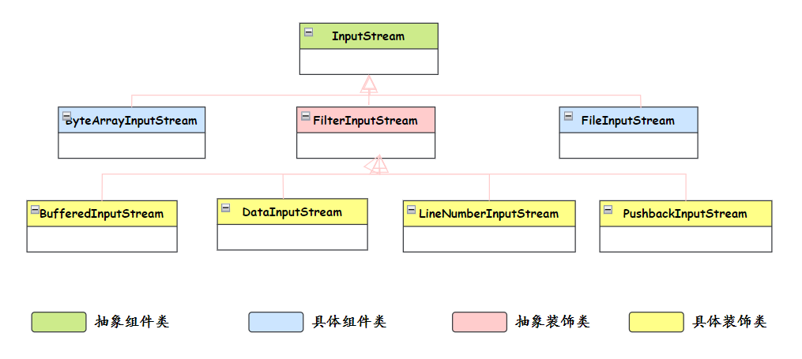
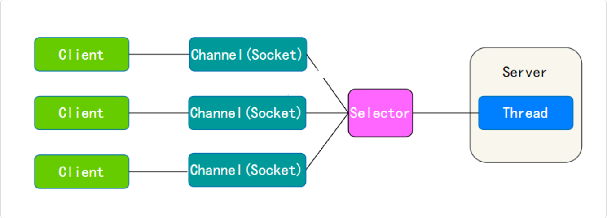

## Java 基础

### 序列化

序列化（Serialization）是指将对象转换为字节流的过程，以便能够将该对象保存到文件、数据库，或者进行网络传输

反序列化（Deserialization）就是将字节流转换回对象的过程，以便构建原始对象

#### Serializable 接口 (JAVA原生提供的序列化)

Serializable 接口用于标记一个类可以被序列化

```java
public class Person implements Serializable {
  private static final long serialVersionUID = 1L;
  private String name;
  private int age;
  // 省略 getter 和 setter 方法
}

// 2. 序列化
ObjectOutputStream oos = new ObjectOutputStream(new FileOutputStream("person.dat"));
oos.writeObject(person);
oos.close();

// 3. 反序列化
ObjectInputStream ois = new ObjectInputStream(new FileInputStream("person.dat"));
Person person = (Person) ois.readObject();
ois.close();
```

##### serialVersionUID

serialVersionUID 是 Java 序列化机制中用于标识类版本的唯一标识符。它的作用是确保在序列化和反序列化过程中，类的版本是兼容的

serialVersionUID 被设置为 1L 是一种比较省事的做法，也可以使用 Intellij IDEA 进行自动生成。

但只要 serialVersionUID 在序列化和反序列化过程中保持一致，就不会出现问题。

如果不显式声明 serialVersionUID，Java 运行时会根据类的详细信息自动生成一个 serialVersionUID。那么当类的结构发生变化时，自动生成的

##### Java 序列化不包含静态变量

序列化机制只会保存对象的状态，而静态变量属于类的状态，不属于对象的状态

##### transient 关键字

使用transient关键字修饰不想序列化的变量

```java
public class Person implements Serializable {
  private String name;
  private transient int age;
  // 省略 getter 和 setter 方法
}
```

##### 具体过程

在Java中通过序列化对象流来完成序列化和反序列化：

- `ObjectOutputStream`：通过`writeObject()`方法做序列化操作。
- `ObjectInputStrean`：通过`readObject()`方法做反序列化操作

实现 Serializable 接口

```java
public class Person implements Serializable {
  private String name;
  private int age;

  // 省略构造方法、getters和setters
}
```

创建输出流并写入对象：

```java
ObjectOutputStream out = new ObjectOutputStream(new FileOutputStream("person.ser"));
Person person = new Person("penguin", 18);
out.writeObject(person);
```

实现对象反序列化：

```java
import java.io.FileInputStream;
import java.io.ObjectInputStream;

MyClass newObj = null;
try {
  FileInputStream fileIn = new FileInputStream("person.ser");
  ObjectInputStream in = new ObjectInputStream(fileIn);
  newObj = (MyClass) in.readObject();
  in.close();
  fileIn.close();
} catch (IOException | ClassNotFoundException e) {
  e.printStackTrace();
}
```

##### 读取

##### 缺点

Java 默认的序列化虽然实现方便，但却存在安全漏洞、不跨语言以及性能差等缺陷

- 无法跨语言： Java 序列化目前只适用基于 Java 语言实现的框架，其它语言大部分都没有使用 Java 的序列化框架，也没有实现 Java 序列化这套协议。因此，如果是两个基于不同语言编写的应用程序相互通信，则无法实现两个应用服务之间传输对象的序列化与反序列化。
- 容易被攻击：Java 序列化是不安全的，我们知道对象是通过在 ObjectInputStream 上调用 readObject() 方法进行反序列化的，这个方法其实是一个神奇的构造器，它可以将类路径上几乎所有实现了 Serializable 接口的对象都实例化。这也就意味着，在反序列化字节流的过程中，该方法可以执行任意类型的代码，这是非常危险的。
- 序列化后的流太大：序列化后的二进制流大小能体现序列化的性能。序列化后的二进制数组越大，占用的存储空间就越多，存储硬件的成本就越高。如果我们是进行网络传输，则占用的带宽就更多，这时就会影响到系统的吞吐量

#### 其他序列化方法

会考虑用主流序列化框架，比如FastJson、Protobuf来替代Java 序列化

实际开发中，Java 原生序列化使用较少，更常用：

- JSON：Jackson、Gson、Fastjson
- Protobuf：Google 的高效序列化框架
- Hessian：二进制序列化，常用于 Dubbo
- Kryo：高性能序列化框架

### IO

Java IO 流的划分可以根据多个维度进行，包括数据流的方向（输入或输出）、处理的数据单位（字节或字符）、流的功能以及流是否支持随机访问等

> IO 不只是文件操作
>
> 网络通信本质上就是数据的输入和输出
>
>1. 文件 IO
>
> - 读取文件
> - 写入文件
> - 文件复制
>
>2. 网络 IO（更重要）
>
> - 客户端与服务器通信
> - 浏览器访问网站
> - 微信发消息
> - 游戏联机
> - API 调用

```java
// 文件 IO - 从文件读取数据
FileInputStream fis = new FileInputStream("file.txt");
byte[] data = fis.read();  // 输入

// 网络 IO - 从网络读取数据
Socket socket = new Socket("www.baidu.com", 80);
InputStream in = socket.getInputStream();
byte[] data = in.read();  // 输入（从网络接收数据）
```

#### 分类

- 字节流
  - InputStream
    - FileInputStream - 从文件读取字节
    - ByteArrayInputStream - 从字节数组读取
    - BufferedInputStream - 带缓冲的字节输入流，提高读取效率
    - DataInputStream - 读取基本数据类型
    - ObjectInputStream - 读取对象（反序列化）
  - OutputStream
    - FileOutputStream - 向文件写入字节
    - ByteArrayOutputStream - 向字节数组写入
    - BufferedOutputStream - 带缓冲的字节输出流，提高写入效率
    - DataOutputStream - 写入基本数据类型
    - ObjectOutputStream - 写入对象（序列化）
- 字符流
  - Reader
    - FileReader - 从文件读取字符
    - CharArrayReader - 从字符数组读取
    - BufferedReader - 带缓冲的字符输入流，可按行读取
    - InputStreamReader - 字节流到字符流的桥梁，可指定编码
  - Writer
    - FileWriter - 向文件写入字符
    - CharArrayWriter - 向字符数组写入
    - BufferedWriter - 带缓冲的字符输出流
    - OutputStreamWriter - 字符流到字节流的桥梁，可指定编码
    - PrintWriter - 格式化输出

##### 按数据流方向

- 输入流（Input Stream）：从源（如文件、网络等）读取数据到程序。
- 输出流（Output Stream）：将数据从程序写出到目的地（如文件、网络、控制台等）

##### 按处理数据单位如何划分

- 字节流（Byte Streams）：以字节为单位读写数据，主要用于处理二进制数据，如音频、图像文件等
- 字符流（Character Streams）：以字符为单位读写数据，主要用于处理文本数据

##### 按功能如何划分

- 节点流（Node Streams）：直接与数据源或目的地相连，如 FileInputStream、FileOutputStream。
- 处理流（Processing Streams）：对一个已存在的流进行包装，如缓冲流 BufferedInputStream、BufferedOutputStream。
- 管道流（Piped Streams）：用于线程之间的数据传输，如 PipedInputStream

#### 用到的设计模式

装饰器模式

装饰器模式的核心思想是在不改变原有对象结构的前提下，动态地给对象添加新的功能



具体到 Java IO 中，InputStream 和 OutputStream 这些抽象类定义了基本的读写操作，然后通过各种装饰器类来增强功能

比如 BufferedInputStream 给基础的输入流增加了缓冲功能，DataInputStream 增加了读取基本数据类型的能力，它们都是对基础流的装饰和增强

这里 FileInputStream 提供基本的文件读取能力，DataInputStream 装饰它增加了数据类型转换功能，BufferedInputStream 再装饰它增加了缓冲功能。每一层装饰都在原有功能基础上增加新特性，而且可以灵活组合

#### 缓冲区溢出怎么预防

Java 缓冲区溢出主要是由于向缓冲区写入的数据超过其能够存储的数据量

- 合理设置缓冲区大小：在创建缓冲区时，应根据实际需求合理设置缓冲区的大小，避免创建过大或过小的缓冲区
- 控制写入数据量：在向缓冲区写入数据时，应该控制写入的数据量，确保不会超过缓冲区的容量。Java 的 ByteBuffer 类提供了remaining()方法，可以获取缓冲区中剩余的可写入数据量

#### 字节流与字符流

其实字符流是由 Java 虚拟机将字节转换得到的，问题就出在这个过程还比较耗时，并且，如果我们不知道编码类型就很容易出现乱码问题

所以， I/O 流就干脆提供了一个直接操作字符的接口，方便我们平时对字符进行流操作。如果音频文件、图片等媒体文件用字节流比较好，如果涉及到字符的话使用字符流比较好

在计算机中，文本和视频都是按照字节存储的，只是如果是文本文件的话，我们可以通过字符流的形式去读取，这样更方面的我们进行直接处理

处理视频文件时，通常使用字节流（如 Java 中的FileInputStream、FileOutputStream）来读取或写入数据，并且会尽量使用缓冲流（如BufferedInputStream、BufferedOutputStream）来提高读写效率

#### BIO, NIO, AIO 区别

Java 常见的 IO 模型有三种：BIO、NIO 和 AIO

- BIO：(Bolcking I/O) 采用阻塞式 I/O 模型，线程在执行 I/O 操作时被阻塞，无法处理其他任务，适用于连接数较少的场景。
- NIO：(Non-Bolcking I/O) 采用非阻塞 I/O 模型，线程在等待 I/O 时可执行其他任务，通过 Selector 监控多个 Channel 上的事件，适用于连接数多但连接时间短的场景。
- AIO (Asynchronous I/O)：使用异步 I/O 模型，线程发起 I/O 请求后立即返回，当 I/O 操作完成时通过回调函数通知线程，适用于连接数多且连接时间长的场景

```plain
BIO（同步阻塞）
  线程发起读请求 → 阻塞等待数据 → 数据到达 → 返回结果
  ❌ 线程一直等待，什么都做不了

NIO（同步非阻塞）
  线程发起读请求 → 立即返回 → 轮询检查数据是否就绪 → 数据就绪后读取
  ✅ 线程可以做其他事，但需要不断检查（通过 Selector）

AIO（异步非阻塞）
  线程发起读请求 → 立即返回 → 继续做其他事 → 数据就绪后系统回调通知
  ✅ 线程完全不用管，系统会主动通知
```

##### BIO

BIO，也就是传统的 IO，基于字节流或字符流（如 FileInputStream、BufferedReader 等）进行文件读写，基于 Socket 和 ServerSocket 进行网络通信

对于每个连接，都需要创建一个独立的线程来处理读写操作

- 线程在等待数据时被阻塞，无法做其他事情
- 1000 个连接 = 1000 个线程，资源消耗大

##### NIO

NIO，JDK 1.4 时引入，放在 java.nio 包下，提供了 Channel、Buffer、Selector 等新的抽象，基于 RandomAccessFile、FileChannel、ByteBuffer 进行文件读写，基于 SocketChannel 和 ServerSocketChannel 进行网络通信



NIO 的魅力主要体现在**网络编程**中，服务器可以用**一个线程处理多个客户端连接**，通过 Selector 监听多个 Channel 来实现多路复用，极大地提高了网络编程的性能

- 用 NIO：1 个线程 + Selector 就能处理 1000 个连接
- 适用于连接数多但连接时间短的场景

通过一个线程 `while(true)` 不断等待事件来处理

```java
// NIO - 一个线程处理多个连接
Selector selector = Selector.open();
ServerSocketChannel serverChannel = ServerSocketChannel.open();
serverChannel.configureBlocking(false);  // 设置为非阻塞
serverChannel.bind(new InetSocketAddress(8080));
serverChannel.register(selector, SelectionKey.OP_ACCEPT);

while (true) {
  selector.select();  // 阻塞等待事件发生
  Set<SelectionKey> keys = selector.selectedKeys();
  
  for (SelectionKey key : keys) {
      if (key.isAcceptable()) {
          // 有新连接
          SocketChannel client = serverChannel.accept();
          client.configureBlocking(false);
          client.register(selector, SelectionKey.OP_READ);
      } else if (key.isReadable()) {
          // 有数据可读
          SocketChannel client = (SocketChannel) key.channel();
          ByteBuffer buffer = ByteBuffer.allocate(1024);
          client.read(buffer);  // 非阻塞读取
          // 处理数据...
      }
  }
  keys.clear();
}
```

缓冲区 Buffer 也能极大提升一次 IO 操作的效率

##### AIO

AIO 也叫 NIO.2，是 Java 7 引入的真正的异步 I/O 模型

放在 java.nio.channels 包下，提供了 AsynchronousFileChannel、AsynchronousSocketChannel 等异步 Channel

它引入了异步通道的概念，使得 I/O 操作可以异步进行。这意味着线程发起一个读写操作后不必等待其完成，可以立即进行其他任务，并且当读写操作真正完成时，线程会被异步地通知

方式一：Future 模式

```java
// 发起异步操作，返回 Future
Future<Integer> future = channel.read(buffer);

// 继续做其他事情
doOtherWork();

// 需要结果时，阻塞等待
Integer bytesRead = future.get();  // 阻塞直到读取完成
```

方式二：Callback 回调模式（更常用）

```java
// 发起异步操作，提供回调函数
channel.read(buffer, null, new CompletionHandler<Integer, Object>() {
    @Override
    public void completed(Integer result, Object attachment) {
        // 读取完成后自动调用这个方法
        System.out.println("读取了 " + result + " 字节");
    }
    
    @Override
    public void failed(Throwable exc, Object attachment) {
        // 读取失败时调用
        exc.printStackTrace();
    }
});

// 立即返回，继续执行后面的代码
doOtherWork();  // 不会阻塞
```
